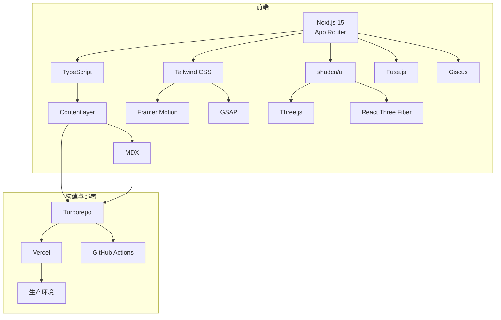

# 技术选型文档

## 核心技术栈

### 1. 前端框架

| 技术 | 版本 | 选型理由 |
|------|------|----------|
| Next.js | 15 (App Router) | - **性能优化** - 内置静态生成和服务端渲染 - **路由系统** - 基于文件系统的路由 - **React 18** - 支持最新的 React 特性 - **App Router** - 更简洁的路由结构和布局系统 - **Vercel 集成** - 无缝部署体验 |
| TypeScript | 5.x | - **类型安全** - 减少运行时错误 - **代码提示** - 提高开发效率 - **重构支持** - 更安全的代码重构 - **文档生成** - 自动生成类型文档 |

### 2. UI 框架与样式

| 技术 | 版本 | 选型理由 |
|------|------|----------|
| Tailwind CSS | 4.x | - **实用优先** - 原子化 CSS 类 - **响应式设计** - 内置响应式工具类 - **自定义主题** - 支持自定义颜色和字体 - **性能优化** - 自动移除未使用的 CSS - **开发速度** - 快速构建 UI 组件 |
| shadcn/ui | 最新版 | - **组件库** - 高质量的 UI 组件 - **可定制** - 完全可定制的组件 - **TypeScript 支持** - 类型安全的组件 - **Tailwind 集成** - 与 Tailwind 无缝集成 - **主题支持** - 支持暗色模式 |

### 3. 内容管理

| 技术 | 版本 | 选型理由 |
|------|------|----------|
| Contentlayer | 最新版 | - **MDX 支持** - 原生支持 MDX 内容 - **类型生成** - 自动生成内容类型 - **内容转换** - 灵活的内容转换管道 - **缓存优化** - 提高构建性能 - **Next.js 集成** - 与 Next.js 完美集成 |
| MDX | 最新版 | - **Markdown 扩展** - 支持 React 组件 - **代码高亮** - 内置代码语法高亮 - **灵活布局** - 支持自定义布局组件 - **内容复用** - 可复用的内容块 |

## 创意增强技术

### 1. 动画与交互

| 技术 | 版本 | 选型理由 |
|------|------|----------|
| Framer Motion | 11.x | - **声明式动画** - 简洁的动画 API - **物理动画** - 真实的物理效果 - **滚动触发** - 基于滚动的动画 - **SVG 动画** - 支持 SVG 元素动画 - **性能优化** - 高效的动画渲染 |
| GSAP | 3.x | - **高性能** - 超高性能的动画库 - **复杂动画** - 支持复杂的时间线动画 - **滚动效果** - 高级滚动触发效果 - **3D 变换** - 支持 3D 变换和透视效果 |

### 2. 3D 效果

| 技术 | 版本 | 选型理由 |
|------|------|----------|
| Three.js | 0.160+ | - **3D 渲染** - 强大的 3D 渲染能力 - **WebGL** - 硬件加速渲染 - **场景管理** - 完整的场景、相机、灯光系统 - **粒子系统** - 支持粒子效果 - **资源加载** - 支持多种 3D 格式 |
| React Three Fiber | 8.x | - **React 集成** - 将 Three.js 与 React 集成 - **组件化** - 3D 场景的组件化开发 - **声明式 API** - 更简洁的 3D 场景描述 - **性能优化** - 自动批处理和优化 |

### 3. 交互增强

| 技术 | 版本 | 选型理由 |
|------|------|----------|
| Fuse.js | 7.x | - **模糊搜索** - 支持模糊匹配 - **轻量级** - 体积小，性能高 - **可配置** - 灵活的搜索配置 - **实时搜索** - 支持实时搜索功能 |
| Giscus | 最新版 | - **GitHub 集成** - 基于 GitHub Discussions - **无服务器** - 无需后端服务 - **可定制** - 支持自定义主题和样式 - **开源** - 免费使用 |

## 工具与依赖

### 1. 开发工具

| 工具 | 版本 | 用途 |
|------|------|------|
| ESLint | 8.x | 代码质量检查 |
| Prettier | 3.x | 代码格式化 |
| Husky | 8.x | Git 钩子管理 |
| Commitizen | 4.x | 规范 commit 信息 |
| Lint-Staged | 15.x | 暂存文件检查 |

### 2. 构建工具

| 工具 | 版本 | 用途 |
|------|------|------|
| Turborepo | 最新版 | 高性能构建系统 |
| Sharp | 最新版 | 图片优化 |
| Sitemap Generator | 最新版 | 自动生成 sitemap |
| RSS Generator | 最新版 | 生成 RSS feed |

### 3. 部署工具

| 工具 | 版本 | 用途 |
|------|------|------|
| Vercel | 最新版 | 托管和部署平台 |
| GitHub Actions | 最新版 | CI/CD 自动化 |

## 技术架构图

## 技术选型对比

### 1. 前端框架对比

| 框架 | 优势 | 劣势 | 选择理由 |
|------|------|------|----------|
| Next.js | 性能优异，功能丰富，生态成熟 | 学习曲线较陡 | 最全面的 React 框架，内置优化，Vercel 集成 |
| Gatsby | 静态站点生成，性能好 | 构建时间长 | Next.js 提供更灵活的渲染选项 |
| Remix | 服务端渲染，路由系统 | 生态相对小 | Next.js 生态更成熟，功能更全面 |
| React + Vite | 开发速度快 | 需手动配置优化 | Next.js 内置更多生产级功能 |

### 2. 样式方案对比

| 方案 | 优势 | 劣势 | 选择理由 |
|------|------|------|----------|
| Tailwind CSS | 开发速度快，响应式支持好 | 类名较长 | 原子化 CSS 提高开发效率，自动优化 |
| Styled Components | 组件化样式，动态样式 | 运行时开销 | Tailwind 性能更好，开发速度更快 |
| CSS Modules | 局部作用域，传统语法 | 开发效率较低 | Tailwind 提供更现代的开发体验 |
| 原生 CSS | 学习成本低 | 维护困难 | Tailwind 提供更好的可维护性 |

### 3. 内容管理对比

| 方案 | 优势 | 劣势 | 选择理由 |
|------|------|------|----------|
| Contentlayer | MDX 支持，类型生成 | 配置较复杂 | 与 Next.js 集成最好，类型安全 |
| Sanity | 实时编辑，内容丰富 | 复杂度高 | Contentlayer 更轻量，适合个人博客 |
| Prismic | 内容管理，API 驱动 | 成本较高 | Contentlayer 免费且更简单 |
| 直接 MDX | 简单直接 | 缺少类型支持 | Contentlayer 提供类型安全 |

## 性能优化策略

### 1. 构建优化

- **静态生成** - 优先使用静态生成 (SSG)
- **增量静态再生** - 使用 ISR 减少构建时间
- **代码分割** - 自动代码分割
- **树摇** - 移除未使用的代码
- **图片优化** - 使用 Sharp 自动优化图片

### 2. 运行时优化

- **服务端渲染** - 首屏内容服务端渲染
- **客户端缓存** - 合理使用 React 缓存
- **预加载** - 预加载关键资源
- **懒加载** - 图片和组件懒加载
- **字体优化** - 字体预加载和子集化

### 3. 资源优化

- **CSS 优化** - Tailwind 自动移除未使用的 CSS
- **JS 优化** - 最小化和压缩 JavaScript
- **图片格式** - 使用 WebP 和 AVIF 格式
- **CDN 缓存** - 利用 Vercel 的 CDN
- **缓存策略** - 合理的缓存头设置

## 安全考虑

### 1. 前端安全

- **XSS 防护** - 自动转义用户输入
- **CSP** - 内容安全策略
- **HTTPS** - 强制使用 HTTPS
- **依赖安全** - 定期更新依赖包
- **输入验证** - 客户端输入验证

### 2. 部署安全

- **环境变量** - 安全存储敏感信息
- **权限控制** - 最小权限原则
- **CI/CD 安全** - 安全的构建流程
- **依赖扫描** - 自动扫描依赖漏洞

## 技术债务管理

### 1. 代码质量

- **ESLint 规则** - 严格的代码质量规则
- **TypeScript 配置** - 严格的类型检查
- **代码审查** - 定期代码审查
- **文档更新** - 保持文档同步

### 2. 依赖管理

- **依赖锁定** - 使用 package-lock.json
- **依赖更新** - 定期更新依赖
- **废弃依赖** - 及时替换废弃的依赖
- **依赖审计** - 定期审计依赖安全

## 技术选型总结

本项目采用了现代化的前端技术栈，主要考虑以下因素：

1. **性能优先** - 选择了性能优异的 Next.js 和相关工具
2. **开发效率** - 使用 Tailwind CSS 和 shadcn/ui 提高开发速度
3. **类型安全** - 全面使用 TypeScript 确保代码质量
4. **创意表达** - 集成 Framer Motion 和 Three.js 实现创意效果
5. **内容管理** - 使用 Contentlayer 简化内容管理
6. **部署便捷** - 与 Vercel 无缝集成，实现一键部署

通过这套技术栈，我们可以构建一个性能优异、视觉出色、易于维护的个人博客网站。