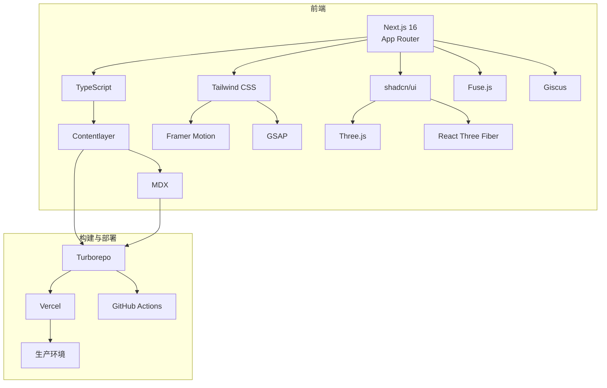

# Next.js MDX 博客项目开发指南

## 项目简介

这是一个基于 Next.js 16 的个人博客/作品集网站，使用 MDX、Tailwind CSS 和 Framer Motion 等现代前端技术构建。网站具有美观的 UI 设计、丰富的动画效果和响应式布局，适合展示个人作品和全栈开发技术能力。

主要功能包括：
- 3D 视觉效果和动画
- 响应式设计，适配各种设备
- 深色模式支持
- 项目展示和详情页
- 关于页面（全栈开发技能展示）
- 平滑的滚动和页面过渡效果

## 项目结构

```
nextjs-mdx-blog/
├── .github/            # GitHub 配置文件
├── .idea/              # IDE 配置文件
├── doc/                # 项目文档
├── public/             # 静态资源
│   ├── images/         # 图片资源
│   ├── next.svg        # Next.js 图标
│   └── vercel.svg      # Vercel 图标
├── src/                # 源代码
│   ├── app/            # Next.js App Router
│   │   ├── about/      # 关于页面
│   │   ├── portfolio/  # 作品集页面
│   │   ├── layout.tsx  # 布局组件
│   │   ├── page.tsx    # 首页
│   │   └── providers.tsx # 全局提供者
│   ├── components/     # 组件
│   │   ├── ui/         # UI 组件
│   │   ├── Container.tsx # 容器组件
│   │   ├── CustomCursor.tsx # 自定义光标
│   │   ├── EasterEgg.tsx # 彩蛋功能
│   │   ├── GlassCard.tsx # 玻璃卡片
│   │   ├── Hero3DBackground.tsx # 3D 背景
│   │   ├── MouseParallax.tsx # 鼠标视差
│   │   ├── Navigation.tsx # 导航栏
│   │   ├── PageTransition.tsx # 页面过渡
│   │   ├── ScrollAnimation.tsx # 滚动动画
│   │   ├── ThemeSwitch.tsx # 主题切换
│   │   └── ThreeDCarousel.tsx # 3D 轮播图
│   └── lib/            # 工具库
│       ├── constants.ts # 常量
│       └── utils.ts    # 工具函数
├── .eslintrc.json      # ESLint 配置
├── .gitignore          # Git 忽略文件
├── README.md           # 项目说明
├── components.json     # 组件配置
├── next.config.js      # Next.js 配置
├── package.json        # 项目依赖
├── postcss.config.js   # PostCSS 配置
├── prettier.config.js  # Prettier 配置
├── tailwind.config.js  # Tailwind CSS 配置
└── tsconfig.json       # TypeScript 配置
```

## 技术栈

### 核心技术栈

| 技术 | 版本 | 用途 | 选型理由 |
|------|------|------|----------|
| Next.js | ^16.1.3 | 框架核心，提供 SSR、App Router 等功能 | 性能优异，功能丰富，生态成熟，Vercel 集成 |
| React | ^19.2.3 | UI 库 | 最流行的 UI 库，生态成熟，组件化开发 |
| TypeScript | - | 类型系统 | 类型安全，减少运行时错误，提高开发效率 |
| Tailwind CSS | 3.3.3 | 样式框架 | 原子化 CSS 类，响应式设计，开发速度快 |
| shadcn/ui | 最新版 | UI 组件库 | 高质量的 UI 组件，可定制，TypeScript 支持 |
| Contentlayer | 最新版 | MDX 内容管理 | 原生支持 MDX 内容，自动生成内容类型 |
| MDX | 最新版 | 支持 Markdown + JSX | Markdown 扩展，支持 React 组件，代码高亮 |

### 创意增强技术

| 技术 | 版本 | 用途 | 选型理由 |
|------|------|------|----------|
| Framer Motion | ^12.27.1 | 动画库 | 声明式动画 API，物理动画，滚动触发 |
| GSAP | 3.x | 高级动画库 | 高性能，复杂动画，滚动效果，3D 变换 |
| Three.js | 0.160+ | 3D 渲染库 | 强大的 3D 渲染能力，WebGL 支持，场景管理 |
| React Three Fiber | 8.x | Three.js 的 React 封装 | 将 Three.js 与 React 集成，组件化开发 |
| Fuse.js | 7.x | 模糊搜索库 | 轻量级，支持模糊匹配，实时搜索 |
| Giscus | 最新版 | 评论系统 | 基于 GitHub Discussions，无服务器，可定制 |

### 工具与依赖

| 工具 | 版本 | 用途 | 选型理由 |
|------|------|------|----------|
| ESLint | ^9.39.2 | 代码质量检查 | 保持代码质量，遵循最佳实践 |
| Prettier | ^3.0.3 | 代码格式化 | 统一代码风格，提高可读性 |
| Husky | 8.x | Git 钩子管理 | 自动化 Git 工作流，防止错误提交 |
| Commitizen | 4.x | 规范 commit 信息 | 标准化提交信息，便于版本管理 |
| Lint-Staged | 15.x | 暂存文件检查 | 只检查修改的文件，提高效率 |
| Turborepo | 最新版 | 高性能构建系统 | 提高构建速度，优化缓存 |
| Sharp | 最新版 | 图片优化 | 自动优化图片大小和格式 |
| Vercel | 最新版 | 托管和部署平台 | 与 Next.js 无缝集成，全球 CDN |
| GitHub Actions | 最新版 | CI/CD 自动化 | 自动化构建和部署流程 |

## 技术架构

### 架构图



## 性能优化策略

### 1. 构建优化

- **静态生成** - 优先使用静态生成 (SSG)
- **增量静态再生** - 使用 ISR 减少构建时间
- **代码分割** - 利用 Next.js 的自动代码分割
- **树摇** - 移除未使用的代码
- **图片优化** - 使用 Sharp 自动优化图片

### 2. 运行时优化

- **服务端渲染** - 首屏内容服务端渲染
- **客户端缓存** - 合理使用 React 缓存
- **预加载** - 预加载关键资源
- **懒加载** - 图片和组件懒加载
- **字体优化** - 字体预加载和子集化

### 3. 资源优化

- **CSS 优化** - Tailwind 自动移除未使用的 CSS
- **JS 优化** - 最小化和压缩 JavaScript
- **图片格式** - 使用 WebP 和 AVIF 格式
- **CDN 缓存** - 利用 Vercel 的 CDN
- **缓存策略** - 合理的缓存头设置

## 安全考虑

### 1. 前端安全

- **XSS 防护** - 自动转义用户输入
- **CSP** - 内容安全策略
- **HTTPS** - 强制使用 HTTPS
- **依赖安全** - 定期更新依赖包
- **输入验证** - 客户端输入验证

### 2. 部署安全

- **环境变量** - 安全存储敏感信息
- **权限控制** - 最小权限原则
- **CI/CD 安全** - 安全的构建流程
- **依赖扫描** - 自动扫描依赖漏洞

## 开发环境搭建

### 1. 克隆项目

```bash
git clone https://github.com/your-username/nextjs-mdx-blog.git
cd nextjs-mdx-blog
```

### 2. 安装依赖

```bash
npm install
```

### 3. 启动开发服务器

```bash
npm run dev
```

访问 `http://localhost:3000` 查看项目。

## 核心功能开发

### 1. 首页开发

首页是网站的入口，包含英雄区、精选项目和 3D 轮播图。

#### 1.1 英雄区

英雄区使用了 `Hero3DBackground` 组件创建 3D 背景效果，`MouseParallax` 组件实现鼠标视差效果，`ScrollAnimation` 组件实现滚动动画。

```tsx
// src/app/page.tsx 部分代码
<section className="py-40 text-center relative overflow-hidden">
  <Hero3DBackground />
  <div className="w-full max-w-6xl mx-auto relative z-10">
    {/* 3D Text Animation */}
    <ScrollAnimation className="mb-12">
      <div className="flex flex-col md:flex-row items-center justify-center gap-8">
        <div className="flex-shrink-0">
          <div className="w-80 h-80 rounded-full bg-white p-8 shadow-lg flex items-center justify-center">
              
            </div>
        </div>
        <div className="text-center md:text-left max-w-2xl">
          <h1 className="font-bold tracking-tight mb-6">
            <span className="text-4xl md:text-5xl lg:text-6xl">你好，我是</span>
            <span className="mx-2 text-6xl md:text-7xl lg:text-9xl text-transparent bg-clip-text bg-gradient-to-r from-blue-600 to-purple-600">RONGX</span>
          </h1>
          <p className="text-2xl md:text-3xl text-gray-700 dark:text-gray-300 mb-8">
            全栈开发工程师 | Java | Vue3 
          </p>
          <p className="text-lg text-gray-600 dark:text-gray-400 mb-8">
            专注于Java后端和Vue3前端开发，致力于构建高质量的全栈应用。
          </p>
        </div>
      </div>
    </ScrollAnimation>
    
    {/* CTA Buttons */}
    <ScrollAnimation className="flex flex-wrap justify-center md:pl-[50px] gap-6" delay={0.2}>
      <Button asChild className="bg-gradient-to-r from-blue-600 to-purple-600 hover:from-blue-700 hover:to-purple-700 text-white text-lg px-10 py-6 rounded-xl shadow-lg hover:shadow-xl transition-all duration-300">
        <Link href="/about">了解更多 →</Link>
      </Button>
      <Button asChild variant="outline" className="text-lg px-10 py-6 rounded-xl border-2 border-gray-300 dark:border-gray-600 hover:border-blue-600 dark:hover:border-blue-400 hover:bg-white/5 dark:hover:bg-gray-800/50 transition-all duration-300">
        <Link href="/portfolio">查看项目</Link>
      </Button>
      <div className="relative group">
        <Button asChild variant="secondary" className="text-lg px-10 py-6 rounded-xl bg-white/20 dark:bg-gray-800/20 backdrop-blur-sm hover:bg-white/30 dark:hover:bg-gray-800/30 transition-all duration-300">
          <a href="/1.pdf" download className="flex items-center gap-2">
            <Download size={20} />
            下载简历
          </a>
        </Button>
        
        {/* Preview Button */}
        <Button 
          variant="ghost" 
          size="icon" 
          className="absolute -top-2 -right-2 bg-blue-600 text-white hover:bg-blue-700 opacity-0 group-hover:opacity-100 transition-opacity duration-300"
        >
          <a href="/1.pdf" target="_blank" rel="noopener noreferrer">
            <Eye size={16} />
          </a>
        </Button>
      </div>
    </ScrollAnimation>
  </div>
</section>
```

#### 1.2 精选项目

使用 `GlassCard` 组件展示精选项目，配合 `ScrollAnimation` 实现滚动时的动画效果。

```tsx
// src/app/page.tsx 部分代码
<div className="grid grid-cols-1 md:grid-cols-2 gap-8">
  <ScrollAnimation delay={0.2}>
    <GlassCard className="p-6">
      <h3 className="text-xl font-semibold mb-3">福师畅聊 - 全栈开发</h3>
      <p className="text-gray-600 dark:text-gray-300 mb-4">
        基于 Spring Boot、Netty、Redis 开发的即时通讯应用，负责全栈开发工作。
      </p>
      <div className="flex flex-wrap gap-2 mb-4">
        <span className="px-3 py-1 bg-blue-100/70 text-blue-800 dark:bg-blue-900/70 dark:text-blue-200 rounded-full text-sm">Spring Boot</span>
        <span className="px-3 py-1 bg-green-100/70 text-green-800 dark:bg-green-900/70 dark:text-green-200 rounded-full text-sm">Netty</span>
        <span className="px-3 py-1 bg-yellow-100/70 text-yellow-800 dark:bg-yellow-900/70 dark:text-yellow-200 rounded-full text-sm">Redis</span>
        <span className="px-3 py-1 bg-purple-100/70 text-purple-800 dark:bg-purple-900/70 dark:text-purple-200 rounded-full text-sm">Vue3</span>
      </div>
      <Button asChild variant="ghost" className="text-blue-600 dark:text-blue-400">
        <a href="/portfolio/福师畅聊" className="flex items-center gap-1">
          查看详情
          <ExternalLink size={14} />
        </a>
      </Button>
    </GlassCard>
  </ScrollAnimation>
  <ScrollAnimation delay={0.4}>
    <GlassCard className="p-6">
      <h3 className="text-xl font-semibold mb-3">师大云学 - 全栈开发</h3>
      <p className="text-gray-600 dark:text-gray-300 mb-4">
        基于 Spring Cloud Alibaba 开发的在线教育平台，负责全栈开发工作。
      </p>
      <div className="flex flex-wrap gap-2 mb-4">
        <span className="px-3 py-1 bg-blue-100/70 text-blue-800 dark:bg-blue-900/70 dark:text-blue-200 rounded-full text-sm">Spring Cloud</span>
        <span className="px-3 py-1 bg-green-100/70 text-green-800 dark:bg-green-900/70 dark:text-green-200 rounded-full text-sm">MySQL</span>
        <span className="px-3 py-1 bg-yellow-100/70 text-yellow-800 dark:bg-yellow-900/70 dark:text-yellow-200 rounded-full text-sm">RabbitMQ</span>
        <span className="px-3 py-1 bg-purple-100/70 text-purple-800 dark:bg-purple-900/70 dark:text-purple-200 rounded-full text-sm">Vue3</span>
      </div>
      <Button asChild variant="ghost" className="text-blue-600 dark:text-blue-400">
        <a href="/portfolio/师大云学" className="flex items-center gap-1">
          查看详情
          <ExternalLink size={14} />
        </a>
      </Button>
    </GlassCard>
  </ScrollAnimation>
</div>
```

#### 1.3 3D 轮播图

使用 `ThreeDCarousel` 组件实现 3D 效果的项目轮播图。

```tsx
// src/app/page.tsx 部分代码
<section className="py-20 border-t border-gray-200 dark:border-gray-700">
  <ScrollAnimation>
    <h2 className="text-3xl font-semibold tracking-tight mb-6 text-center">
      项目展示
    </h2>
  </ScrollAnimation>
  <ScrollAnimation>
    <div className="max-w-4xl mx-auto">
      <ThreeDCarousel />
    </div>
  </ScrollAnimation>
</section>
```

### 2. 关于页面开发

关于页面用于展示个人信息和技能。

```tsx
// src/app/about/page.tsx
import { ScrollAnimation } from '@/components/ScrollAnimation'

export default function About() {
  return (
    <div className="py-20">
      <ScrollAnimation>
        <h1 className="text-4xl font-bold mb-12 text-center">关于我</h1>
      </ScrollAnimation>
      {/* 个人信息和技能展示 */}
    </div>
  )
}
```

### 3. 作品集页面开发

作品集页面包含项目列表和详情页。

#### 3.1 作品集列表

```tsx
// src/app/portfolio/page.tsx
import { ScrollAnimation } from '@/components/ScrollAnimation'
import { GlassCard } from '@/components/GlassCard'

export default function Portfolio() {
  return (
    <div className="py-20">
      <ScrollAnimation>
        <h1 className="text-4xl font-bold mb-12 text-center">作品集</h1>
      </ScrollAnimation>
      {/* 项目列表 */}
    </div>
  )
}
```

#### 3.2 作品集详情

使用动态路由 `[id]/page.tsx` 实现项目详情页。

```tsx
// src/app/portfolio/[id]/page.tsx
import { ScrollAnimation } from '@/components/ScrollAnimation'

interface Params {
  id: string
}

export default function ProjectDetail({ params }: { params: Params }) {
  const { id } = params
  return (
    <div className="py-20">
      <ScrollAnimation>
        <h1 className="text-4xl font-bold mb-12 text-center">{id}</h1>
      </ScrollAnimation>
      {/* 项目详情 */}
    </div>
  )
}
```

### 4. 导航栏开发

导航栏包含网站链接和主题切换按钮，支持当前页面高亮显示。

```tsx
// src/components/Navigation.tsx
'use client'

import Link from 'next/link'
import { Download } from 'lucide-react'
import { Button } from '@/components/ui/button'
import { usePathname } from 'next/navigation'

export function Navigation() {
  // 获取当前路径，用于判断哪个导航链接是活动状态
  const pathname = usePathname()

  return (
    <>
      {/* 桌面端导航栏 */}
      <nav className="hidden md:flex items-center gap-4 text-lg">
        {/* 首页链接 */}
        <Link 
          href="/" 
          className={`px-4 py-3 rounded-md transition-all duration-300 ${pathname === '/' ? 'text-blue-600 font-semibold' : 'hover:bg-accent hover:text-accent-foreground'}`}
          style={pathname === '/' ? { borderBottom: '3px solid #1e40af' } : {}}
        >
          首页
        </Link>
        {/* 关于链接 */}
        <Link 
          href="/about" 
          className={`px-4 py-3 rounded-md transition-all duration-300 ${pathname === '/about' ? 'text-blue-600 font-semibold' : 'hover:bg-accent hover:text-accent-foreground'}`}
          style={pathname === '/about' ? { borderBottom: '3px solid #1e40af' } : {}}
        >
          关于
        </Link>
        {/* 项目链接 */}
        <Link 
          href="/portfolio" 
          className={`px-4 py-3 rounded-md transition-all duration-300 ${pathname === '/portfolio' ? 'text-blue-600 font-semibold' : 'hover:bg-accent hover:text-accent-foreground'}`}
          style={pathname === '/portfolio' ? { borderBottom: '3px solid #1e40af' } : {}}
        >
          项目
        </Link>
        {/* 博客链接 - 在新标签页打开 */}
        <a 
          href="https://blog.csdn.net" 
          target="_blank" 
          rel="noopener noreferrer" 
          className="px-4 py-3 rounded-md hover:bg-accent hover:text-accent-foreground transition-colors"
        >
          博客
        </a>
        {/* 简历下载链接 */}
        <a 
          href="/1.pdf" 
          download 
          className="px-4 py-3 rounded-md hover:bg-accent hover:text-accent-foreground transition-colors flex items-center gap-2"
        >
          <Download size={24} />
          简历
        </a>
      </nav>
    </>
  )
}
```

### 5. 主题切换功能

使用 `next-themes` 实现深色模式和浅色模式的切换。

```tsx
// src/components/ThemeSwitch.tsx
'use client'

import { useTheme } from 'next-themes'
import { Button } from '@/components/ui/button'
import { Moon, Sun } from 'lucide-react'

export function ThemeSwitch() {
  const { theme, setTheme } = useTheme()

  return (
    <Button
      variant="ghost"
      size="icon"
      onClick={() => setTheme(theme === 'dark' ? 'light' : 'dark')}
    >
      {theme === 'dark' ? <Sun size={20} /> : <Moon size={20} />}
    </Button>
  )
}
```

### 6. 动画效果实现

#### 6.1 滚动动画

使用 Framer Motion 实现滚动时的动画效果。

```tsx
// src/components/ScrollAnimation.tsx
'use client'

import { motion } from 'framer-motion'
import { ReactNode } from 'react'

interface ScrollAnimationProps {
  children: ReactNode
  className?: string
  delay?: number
}

export function ScrollAnimation({ children, className, delay = 0 }: ScrollAnimationProps) {
  return (
    <motion.div
      className={className}
      // 初始状态：透明且向下偏移50px
      initial={{ opacity: 0, y: 50 }}
      // 进入视口时的状态：不透明且回到原始位置
      whileInView={{ opacity: 1, y: 0 }}
      // 动画配置：持续0.8秒，指定延迟，使用easeOut缓动函数
      transition={{
        duration: 0.8,
        delay: delay,
        ease: "easeOut"
      }}
      // 视口配置：只触发一次动画，视口边缘扩展-100px
      viewport={{
        once: true,
        margin: "-100px"
      }}
    >
      {children}
    </motion.div>
  )
}
```

#### 6.2 鼠标视差效果

实现鼠标移动时的视差效果。

```tsx
// src/components/MouseParallax.tsx
'use client'

import { useState, useEffect } from 'react'

interface MouseParallaxProps {
  children: React.ReactNode
  intensity?: number
  className?: string
}

export function MouseParallax({ children, intensity = 10, className }: MouseParallaxProps) {
  const [position, setPosition] = useState({ x: 0, y: 0 })

  useEffect(() => {
    const handleMouseMove = (e: MouseEvent) => {
      const x = (e.clientX - window.innerWidth / 2) / (window.innerWidth / 2)
      const y = (e.clientY - window.innerHeight / 2) / (window.innerHeight / 2)
      setPosition({ x, y })
    }

    window.addEventListener('mousemove', handleMouseMove)
    return () => window.removeEventListener('mousemove', handleMouseMove)
  }, [])

  return (
    <div
      className={className}
      style={{
        transform: `translate(${position.x * intensity}px, ${position.y * intensity}px)`,
        transition: 'transform 0.1s ease-out'
      }}
    >
      {children}
    </div>
  )
}
```

## 部署与优化

### 1. 构建项目

```bash
npm run build
```

### 2. 部署到 Vercel

1. 登录 Vercel 账号
2. 导入项目仓库
3. 配置构建选项（默认即可）
4. 部署项目

### 3. 优化建议

1. **图片优化**：使用 Next.js 的 `Image` 组件优化图片加载
2. **代码分割**：利用 Next.js 的自动代码分割功能
3. **缓存策略**：配置合理的缓存策略
4. **SEO 优化**：添加 meta 标签和 sitemap
5. **性能监控**：使用 Vercel Analytics 监控性能

## 总结与扩展

本项目是一个使用现代前端技术栈构建的个人博客/作品集网站，具有以下特点：

1. **现代化技术**：使用 Next.js 16、React 19、Tailwind CSS 等最新技术
2. **丰富的动画**：实现了 3D 背景、鼠标视差、滚动动画等效果
3. **响应式设计**：适配各种屏幕尺寸
4. **深色模式**：支持主题切换
5. **良好的用户体验**：平滑的过渡效果和交互

### 可能的扩展方向

1. **添加博客功能**：使用 MDX 实现博客文章
2. **集成 CMS**：使用 Sanity 或 Contentful 等 CMS 管理内容
3. **添加评论系统**：集成 Disqus 或其他评论系统
4. **实现多语言支持**：添加国际化功能
5. **优化 SEO**：进一步优化网站的搜索引擎排名

## 开发命令

| 命令 | 描述 |
|------|------|
| `npm run dev` | 启动开发服务器 |
| `npm run build` | 构建生产版本 |
| `npm start` | 启动生产服务器 |
| `npm run lint` | 运行 ESLint 检查 |

---

通过本指南，你应该能够理解项目的结构和开发流程，并能够基于此项目进行扩展和定制。祝你开发愉快！