# #16

#13布置的任务都没有wanc

反思一下 一个是贪玩 一个是懒 还有一个原因是学习方式 单看视频容易困

然后是一个进度宝贝

java ai +编程 完  挑着看的

廖雪峰教程 完  速看 很多过时

javaweb ai+[笔记](https://heuqqdmbyk.feishu.cn/wiki/P0lNwydClihtMukqFsMcpdvQnsh)  见到13.aop

小林[coding ](https://xiaolincoding.com/interview/jvm.html#jvm%E7%9A%84%E5%86%85%E5%AD%98%E6%A8%A1%E5%9E%8B%E4%BB%8B%E7%BB%8D%E4%B8%80%E4%B8%8B) 看到4.并发

java [guide](https://javaguide.cn/java/basis/java-basic-questions-01.html#java-se-vs-java-ee) 还没开始

若依框架 [笔记](https://ksg50j5gph.feishu.cn/docx/LBpldchP4oGT9JxfaaQcT8hfnGd) 环境都没搭建好

其次是更具目前的学习状况和 能力 以及实际工作环境要求 所以准备再次更改短期目标

100天计划时间不变 但是要加入30天的软件测试学习 [给自己唐笑了]

学习看笔记写笔记 写项目 视频无聊的时候挑着看 that`s all 

# 78.软件测试

软件测试是保障软件质量的关键环节，其全流程通常涵盖从项目启动到测试结束的多个阶段。以下是软件测试全流程的详细解析：

### **一、测试前期准备阶段**

#### **1. 需求分析与评审**

- **目标**：明确软件功能、性能、界面等需求，识别潜在问题。

- 内容

  ：

  - 参与需求评审会议，与产品经理、开发团队共同分析需求文档（如 PRD）。
  - 从测试视角提出疑问，例如：需求是否清晰、是否存在矛盾或遗漏（如 “用户权限逻辑是否明确”）。
  - 输出《需求分析报告》，记录需重点测试的功能点和风险点。

#### **2. 测试计划制定**

- **目标**：规划测试范围、资源、时间和策略，确保测试有序进行。

- 内容

  ：

  - **测试范围**：确定覆盖的功能模块（如登录、支付）、非功能需求（如性能、兼容性）。
  - **人员分工**：分配测试人员负责不同模块（如 A 负责功能测试，B 负责接口测试）。
  - **时间节点**：制定里程碑（如 “第 1 周完成冒烟测试，第 2-3 周开展系统测试”）。
  - **工具选择**：确定测试工具（如 Postman 用于接口测试，Jmeter 用于性能测试）。
  - 输出《测试计划文档》，需经团队评审确认。

#### **3. 测试用例设计**

- **目标**：根据需求设计全面、高效的测试用例，覆盖正常流程、异常场景和边界条件。

- 方法

  ：

  - **功能测试**：采用等价类划分、边界值分析、错误推测法（如测试 “年龄输入” 时，覆盖 0、18、120 等边界值）。
  - **非功能测试**：设计性能测试用例（如 “模拟 1000 用户同时登录，监测响应时间”）、兼容性测试用例（如 “在 Chrome、Firefox、Edge 浏览器上验证界面显示”）。

- **输出**：《测试用例文档》，包含用例编号、步骤、预期结果等，需通过评审确保覆盖率。

### **二、测试执行阶段**

#### **1. 冒烟测试（Smoke Test）**

- **目标**：验证软件基本功能是否可运行，筛选出严重阻塞问题。
- **执行时机**：开发提交首个可运行版本（如 Alpha 版本）后。
- **特点**：仅测试核心流程（如电商平台的 “浏览商品→加入购物车→下单”），不深入细节。
- **结果**：若冒烟测试不通过，退回开发修复，暂不进入正式测试。

#### **2. 单元测试（Unit Test）**

- **目标**：测试软件最小单元（如函数、类）的逻辑正确性。
- **执行方**：开发人员为主，部分团队由测试人员协助。
- **工具**：Java 使用 JUnit，Python 使用 unittest，JavaScript 使用 Jest。
- **关注点**：代码逻辑分支（如 if-else、循环）、参数校验、异常处理。

#### **3. 集成测试（Integration Test）**

- **目标**：验证模块间交互是否正常，重点测试接口和数据传递。

- 类型

  ：

  - **自顶向下集成**：从顶层模块开始，逐步集成下层模块（如先测试 “订单模块” 与 “用户模块” 的交互）。
  - **自底向上集成**：从底层模块开始，逐步向上集成（如先测试 “支付接口”，再测试 “订单 + 支付” 流程）。

- **工具**：Postman、SoapUI 用于接口测试，通过断言验证返回数据是否符合预期。

#### **4. 系统测试（System Test）**

- **目标**：将软件作为整体，测试是否满足需求规格（功能、性能、兼容性等）。

- 测试类型

  ：

  - **功能测试**：按用例覆盖所有需求点（如 “验证修改密码功能是否支持特殊字符”）。
  - **性能测试**：使用 Jmeter 模拟高并发，检测响应时间、吞吐量、内存泄漏（如 “目标：登录接口响应时间≤2 秒”）。
  - **兼容性测试**：在不同设备、浏览器、操作系统上验证（如 “测试 APP 在 iOS 17 和 Android 14 上的适配性”）。
  - **安全测试**：检测 SQL 注入、XSS 攻击、权限漏洞（如使用 OWASP ZAP 扫描）。

- **执行方式**：测试人员根据《测试用例文档》逐一执行，记录缺陷至缺陷管理工具（如 Jira、禅道）。

#### **5. 回归测试（Regression Test）**

- **目标**：验证修复的缺陷是否正确，同时确保修改未引入新问题。

- 执行时机

  ：

  - 开发修复缺陷并重新提测后。
  - 每次版本更新后（如迭代发布前）。

- 策略

  ：

  - **完全回归**：重新执行所有用例（适用于大规模代码变更）。
  - **选择性回归**：仅执行与变更相关的用例及受影响模块（提高效率）。

### **三、测试后期阶段**

#### **1. 缺陷管理与跟踪**

- 流程

  ：

  1. **发现缺陷**：测试人员使用工具记录缺陷，包含截图、复现步骤、环境信息。
  2. **缺陷评审**：开发、测试、产品经理共同确认缺陷是否有效（避免误报）。
  3. **修复与验证**：开发修复后，测试人员执行回归测试，确认缺陷关闭或重新打开（若未解决）。

- **工具**：Jira、禅道、TestLink，支持缺陷状态流转（如 “新建→开发中→待验证→已关闭”）。

#### **2. 测试报告总结**

- **目标**：汇总测试结果，评估软件质量，为发布提供依据。

- 内容

  ：

  - **测试范围与执行情况**：统计用例总数、通过 / 失败数、通过率（如 “共执行 500 条用例，通过率 98%”）。
  - **缺陷分析**：按严重程度（致命、严重、一般、建议）分类，统计分布趋势（如 “严重缺陷集中在支付模块”）。
  - **质量结论**：判断软件是否达到发布标准（如 “遗留 3 个一般缺陷，不影响主流程，建议发布”）。

- **输出**：《测试总结报告》，需经团队评审并归档。

#### **3. 验收测试（Acceptance Test）**

- **目标**：确认软件满足用户实际需求，通常由客户或产品经理主导。

- 类型

  ：

  - **用户验收测试（UAT）**：用户在真实环境中测试（如 “客户验证订单导出功能是否符合业务流程”）。

  - Alpha/Beta 测试

    ：

    - Alpha 测试：在公司内部模拟用户环境测试（版本正式发布前）。
    - Beta 测试：向部分外部用户开放，收集真实反馈（如 “某 APP 上线前邀请 1000 名用户参与 Beta 测试”）。

### **四、测试流程的关键原则**

1. **尽早介入**：测试应从需求阶段开始，而非等待代码完成后，尽早发现问题可降低修复成本。
2. **全面覆盖**：兼顾功能、非功能需求，避免遗漏隐性需求（如 “系统需支持 7×24 小时稳定运行”）。
3. **持续迭代**：敏捷开发模式下，测试需与开发同步迭代（如每 2 周完成一轮测试），确保快速反馈。
4. **工具辅助**：利用自动化测试工具（如 Selenium、Appium）提升重复测试效率，聚焦复杂场景。

### **总结**

软件测试全流程贯穿需求分析、计划、设计、执行、缺陷管理到验收的完整周期，其核心是通过系统性的方法确保软件质量。不同团队可根据项目规模（如小型项目可合并集成测试与系统测试）、开发模型（瀑布模型 vs 敏捷开发）灵活调整流程，但需始终围绕 “发现问题、解决问题、验证质量” 的目标展开。


# 79、黑马AI测试速成课笔记

## #1

"D:\BaiduNetdiskDownload\随堂资料\随堂资料\AI测试小白速成班_w.pdf"

# 80、手工ai测试基础

### 测试基础

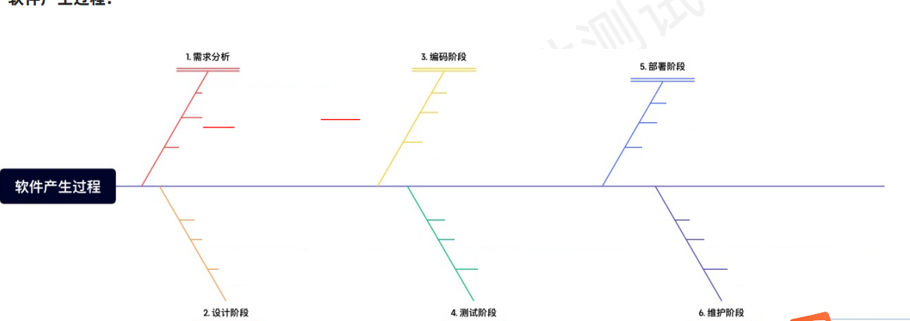

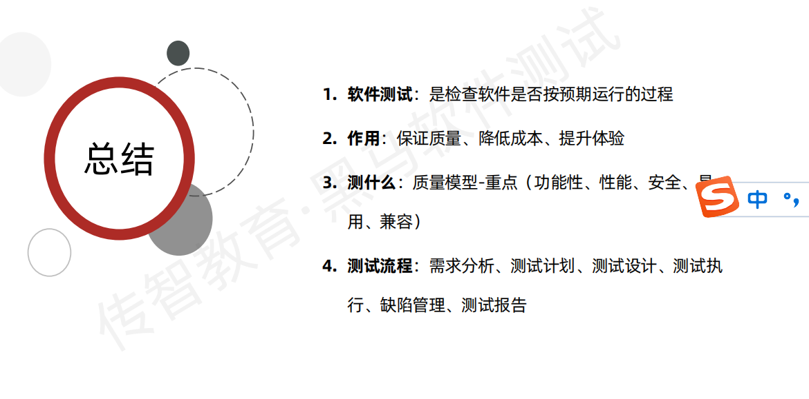

### **一、软件测试基础核心知识点（面试高频）**

#### **1. 软件测试的定义与目的**

- **定义**：通过人工或工具执行程序，验证软件是否满足需求、是否存在缺陷，确保软件质量。

- 目的

  ：

  - 发现缺陷，降低上线风险；
  - 验证软件符合功能、性能、安全等需求；
  - 提供质量反馈，辅助决策（如是否发布）。

- **面试高频问法**：“你认为软件测试的核心价值是什么？”

#### **2. 测试分类（面试必问）**

##### **按测试阶段分类**

- **单元测试**：测试最小单元（函数 / 类），关注逻辑正确性，开发主导（工具：JUnit、PyTest）。
- **集成测试**：测试模块间交互，关注接口和数据传递（工具：Postman、SoapUI）。
- **系统测试**：测试完整系统，覆盖功能、性能、兼容性等（工具：Selenium、Jmeter）。
- **验收测试**：用户或客户验证是否满足实际需求（如 UAT、Alpha/Beta 测试）。

##### **按测试方法分类**

- **黑盒测试**：不关注代码，仅测试功能（用例设计方法：等价类、边界值、场景法）。
- **白盒测试**：关注代码逻辑，测试分支、路径覆盖（方法：语句覆盖、判定覆盖、路径覆盖）。
- **灰盒测试**：结合黑盒和白盒，关注接口和部分代码逻辑（如接口测试）。

##### **按测试类型分类**

- **功能测试**：验证功能是否符合需求（如登录、支付流程）。
- **性能测试**：测试系统响应时间、吞吐量、稳定性（工具：Jmeter、LoadRunner）。
- **安全测试**：检测漏洞（如 SQL 注入、XSS），工具：OWASP ZAP、AppScan。
- **兼容性测试**：验证不同设备、浏览器、系统的适配性。

**面试高频问法**：“集成测试和系统测试的区别是什么？”“黑盒测试和白盒测试的适用场景？”

#### **3. 测试用例设计（核心技能）**

- **定义**：为验证某个功能点设计的一组测试输入、执行条件和预期结果。

- **要素**：用例编号、模块、测试步骤、输入数据、预期结果、优先级。

- 设计方法

  ：

  - **等价类划分**：将输入数据分为有效和无效等价类（如年龄输入：有效类 1-120，无效类 <0 或> 120）。
  - **边界值分析**：测试边界条件（如文件上传大小限制 50MB，测 49.9MB、50MB、50.1MB）。
  - **错误推测法**：基于经验推测可能的错误（如必填项未填、重复提交）。
  - **因果图**：分析输入与输出的因果关系，适用于多条件组合场景。

- **面试高频问法**：“如何设计一个登录功能的测试用例？”“用例设计中如何避免冗余？”

#### **4. 缺陷管理（面试重点）**

- **缺陷定义**：软件中不符合需求、存在错误或影响用户体验的问题。

- 缺陷生命周期

  ：

  - **新建**：测试人员发现并记录缺陷。
  - **确认**：开发评审确认是否为有效缺陷。
  - **指派**：分配给对应开发人员修复。
  - **修复**：开发完成修复，标记为 “待验证”。
  - **验证**：测试人员重新测试，确认已解决则 “关闭”，未解决则 “重新打开”。
  - **延期 / 拒绝**：特殊情况下暂不处理或非缺陷（需评审确认）。

- 缺陷属性

  ：

  - **严重程度**：致命（如崩溃）、严重（如功能不可用）、一般（如界面错位）、建议（如优化体验）。
  - **优先级**：高（立即修复）、中（版本内修复）、低（后续迭代）。

- **面试高频问法**：“如何描述一个清晰的缺陷？”“严重程度和优先级的区别？”“开发拒绝修复缺陷时如何处理？”

#### **5. 测试流程与原则**

- **基本流程**：需求分析→测试计划→用例设计→测试执行（冒烟→单元→集成→系统→回归）→缺陷管理→测试报告→验收测试。

- 关键原则

  ：

  - 尽早测试：需求阶段介入，降低修复成本。
  - 全面覆盖：功能、非功能需求均需测试。
  - 可追溯性：用例与需求一一对应，缺陷可追溯至需求。

- **面试高频问法**：“测试流程中哪个阶段最重要？为什么？”“敏捷开发中测试如何开展？”

#### **6. 常用测试工具（按类型分类）**

- **功能测试**：Selenium（Web 自动化）、Appium（移动端自动化）、TestNG（测试框架）。
- **接口测试**：Postman、SoapUI、Apifox（设计 + 测试 + Mock）。
- **性能测试**：Jmeter、LoadRunner、Gatling。
- **缺陷管理**：Jira、禅道、TAPD。
- **面试高频问法**：“介绍你常用的测试工具及使用场景。”“为什么选择 Selenium 进行自动化测试？”

### **二、软件测试面试经典八股问题及解析**

#### **1. 基础概念类**

- **问题 1**：软件测试和软件调试的区别？
  **解析**：
  - 测试是发现缺陷，由独立测试人员执行；
  - 调试是定位和修复缺陷，由开发人员执行。
- **问题 2**：什么是回归测试？为什么需要做？
  **解析**：验证修复后的代码是否引入新问题，确保原有功能正常。避免 “修一个 bug，引发十个新 bug”。
- **问题 3**：Alpha 测试和 Beta 测试的区别？
  **解析**：
  - Alpha 测试在公司内部模拟用户环境；
  - Beta 测试向外部真实用户开放，收集实际反馈。

#### **2. 用例设计类**

- 问题

  ：设计一个 “文件上传功能” 的测试用例（支持格式：jpg、png，大小≤20MB）。

  参考答案

  ：

  - **有效场景**：上传 10MB 的 jpg 文件，预期成功；
  - **无效场景**：上传 25MB 的 jpg（大小超限）、上传 txt 文件（格式不支持）、不选文件直接点击上传（必填项校验）。

#### **3. 缺陷处理类**

- 问题

  ：如果你发现一个缺陷，开发认为不是问题，如何处理？

  参考答案

  ：

  1. 重新复现缺陷，确认环境和步骤是否正确；
  2. 提供详细证据（截图、日志、复现步骤），与开发共同分析；
  3. 若仍有争议，邀请产品经理或团队评审，以需求文档为依据决策。

#### **4. 工具应用类**

- 问题

  ：如何用 Jmeter 进行接口性能测试？

  参考答案

  ：

  1. 创建线程组，设置虚拟用户数和循环次数；
  2. 添加 HTTP 请求 sampler，输入接口 URL、方法、参数；
  3. 添加监听器（如聚合报告、响应时间图），分析结果；
  4. 关注指标：平均响应时间、吞吐量、错误率。

### **三、软件测试八股文学习资源推荐**

- [csdn](https://blog.csdn.net/mxb_1220/category_11716150.html)

### **四、面试准备建议**

1. **分模块突破**：先掌握基础概念（如测试分类、缺陷管理），再攻克用例设计和工具应用。

2. **结合项目经验**：回答问题时结合实际项目（如 “在某项目中，我用边界值法设计了 XX 功能的用例，发现了 XX 缺陷”）。

3. 模拟面试

   ：用 “STAR 法则”（场景 - 任务 - 行动 - 结果）描述测试经历，例如：

   - S（场景）：在电商项目中负责支付模块测试；
   - T（任务）：需验证支付宝、微信支付等多渠道支付；
   - A（行动）：设计等价类用例，覆盖正常支付、余额不足、网络中断等场景；
   - R（结果）：发现 3 个严重缺陷（如重复扣款），确保上线零故障。

4. **关注行业动态**：近年面试趋势偏向 “测试开发”，可适当学习 Python/Java 编程、自动化测试框架（如 Pytest），提升竞争力。

通过以上知识点梳理和资源学习，可系统应对软件测试基础面试题。建议多刷题、多总结，尤其注意将理论与实际项目结合，避免 “死记硬背八股文”，展现真实的测试思维和解决问题的能力。

# 81、ai 工具应用

角色 + 任务 + 背景 +要求

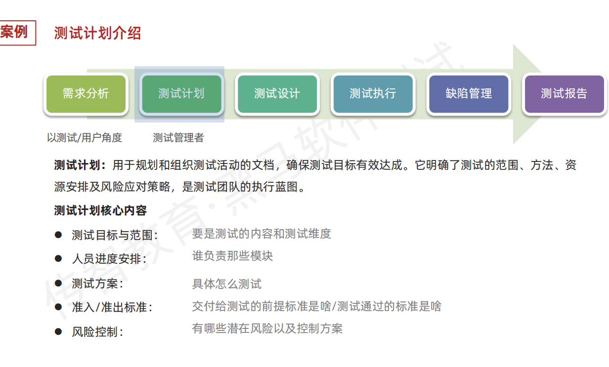

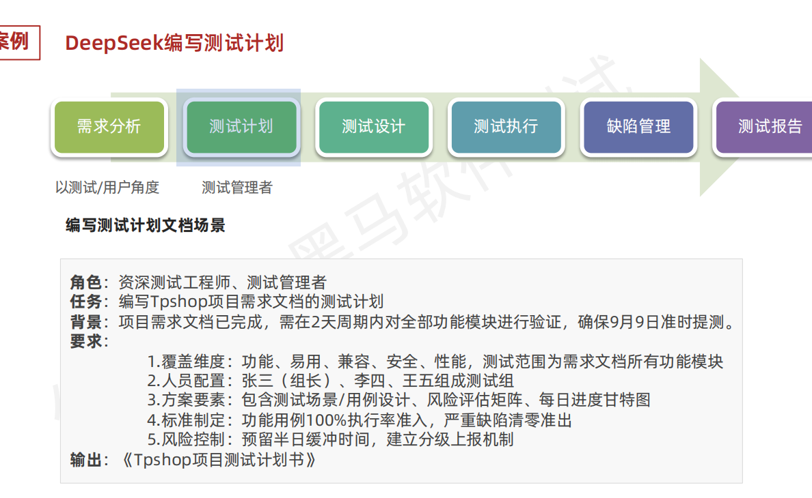

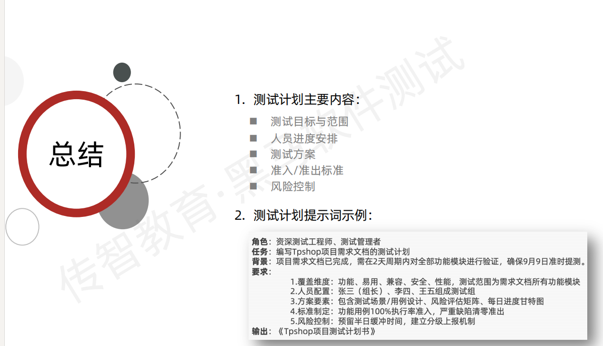

### 一、核心原则（3 句话记牢）

1. **明确场景 + 具体需求**：让 AI 知道你在测什么（功能 / 性能 / 兼容性）、需要什么输出（用例 / 报告 / 脚本）

1. **分阶段提问**：按测试流程拆分需求（需求分析→用例设计→缺陷处理→自动化）

1. **保留人工校验**：AI 输出仅作参考，必须结合业务逻辑和测试经验二次验证

### 二、6 大高频场景提示词模板

#### 1. 需求分析→快速拆解测试点

**prompt**："我现在要测一个【电商 APP 的搜索功能】，需求是：支持关键词联想、筛选条件（价格 / 销量 / 评价）、历史搜索记录。请帮我列出 10 个核心测试点，覆盖正常流程和异常场景。"

#### 2. 用例设计→生成基础框架（附优化方向）

**prompt**："用【等价类划分 + 边界值分析】设计【用户注册功能】的测试用例，输入条件：手机号（11 位中国大陆号码）、验证码（6 位数字）、密码（8-20 位，含字母 + 数字）。输出格式：编号 + 测试步骤 + 预期结果"→ 优化：补充 "增加极端场景（如密码 20 位整 / 特殊字符）"

#### 3. 缺陷报告→结构化描述（开发友好版）

**prompt**："我在【PC 端 Chrome 浏览器】测试【登录功能】时，输入正确账号密码点击登录，页面无响应且控制台报错 'Network Error'。请帮我按标准模板生成缺陷报告，包含：复现步骤 / 环境 / 截图指引 / 严重程度"

#### 4. 自动化脚本→快速生成 Python/Selenium 框架

**prompt**："用 Python+Selenium 写一个【Web 端搜索功能】的自动化测试脚本，步骤：打开网页→输入关键词 ' 测试 '→点击搜索→验证结果包含 ' 测试 '。要求：添加异常处理和断言"

#### 5. 性能测试→模拟压测场景（Jmeter 辅助）

**prompt**："设计【秒杀系统】的性能测试方案，目标：模拟 500 用户同时抢购，检测响应时间和吞吐量。请给出 Jmeter 配置建议（线程组 / 断言 / 监控指标）"

#### 6. 兼容性测试→设备矩阵生成

**prompt**："我需要测试【移动端 APP】的兼容性，支持系统：iOS 16/17，Android 13/14；设备型号：iPhone 14/15，小米 13/14，华为 Mate 60。请生成兼容性测试矩阵表（设备 + 系统 + 分辨率 + 必测功能）"

### 三、3 个提效技巧（新手必学）

1. **带示例提问**："之前用类似方法测登录功能时，你给的用例包含了 ' 密码错误次数限制 '，现在测支付功能，也请加入类似的安全校验场景"

1. **限定输出格式**："请用表格形式输出，每个测试点标注优先级（高 / 中 / 低）"

1. **追问细化**："刚才的用例缺少弱网场景，能否补充 3 个相关测试点？"

### 四、避坑指南（新手常犯）

× 不要说 "帮我测这个功能"（太笼统，AI 无法执行）√ 要说 "帮我设计这个功能的测试用例，重点关注输入校验"

× 不要直接复制 AI 输出提交（可能遗漏业务特殊逻辑）√ 务必检查：用例是否覆盖需求文档、缺陷描述是否清晰复现

### 五、工具推荐（免费好用）

- 对话式：ChatGPT（复杂逻辑）、Claude（长文本输出）

- 垂直工具：TestGPT（专注测试用例生成）、PromptPerfect（优化提示词）

**实践建议**：从最小功能开始（如登录 / 搜索），先用 AI 生成基础内容，再手动补充业务场景，每周积累 10 个以上自定义提示词模板，1 个月内即可显著提升测试效率！


# 82、AI测试设计

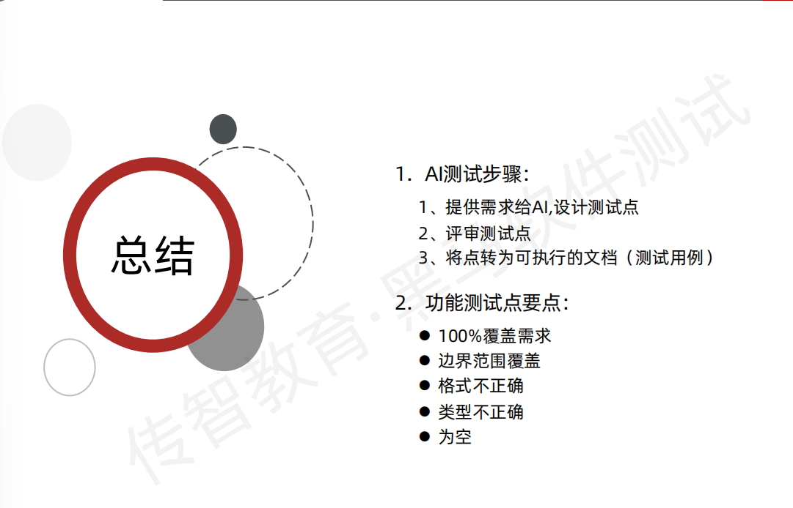

# 83、缺陷管理

[禅道](https://zentao.demo.qucheng.cc/index.php?m=qa&f=index)

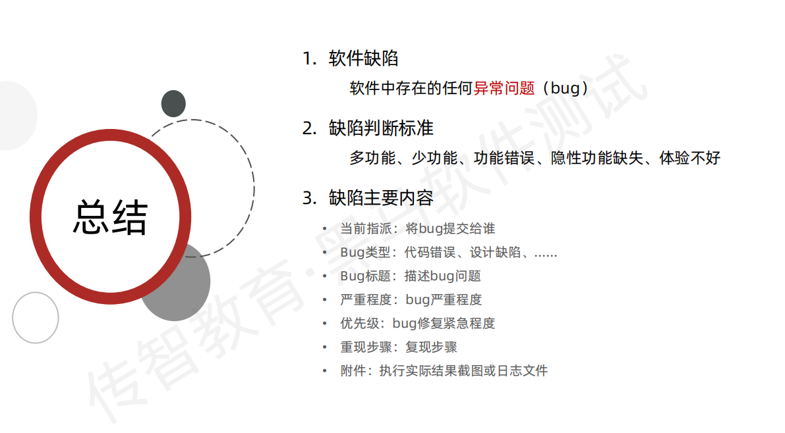

### 一、缺陷管理核心知识（新手必懂）

#### 1. 缺陷是什么？3 个核心判断标准

- **不符合需求**：需求规定 "登录支持邮箱 / 手机两种方式"，实际只有手机号可登录（功能缺失）
- **违背用户预期**：点击 "删除" 按钮无二次确认直接删除数据（体验缺陷）
- **存在技术风险**：代码中未处理空指针异常（潜在崩溃隐患）

#### 2. 缺陷生命周期（7 个关键状态）


**新手易错点**：
× 直接提交模糊状态缺陷（如 "页面有问题"）
√ 务必先确认复现步骤稳定，再提交明确状态缺陷

#### 3. 缺陷关键属性（开发最关心的 3 个要素）

| 属性         | 定义                                                   | 示例（登录功能缺陷）                                         |
| ------------ | ------------------------------------------------------ | ------------------------------------------------------------ |
| **严重程度** | 缺陷对系统的影响程度                                   | 严重：点击登录无响应（功能不可用） 一般：密码输入框边框颜色错误 |
| **优先级**   | 缺陷需要修复的紧急程度                                 | 高：支付流程卡顿（影响核心业务） 低：帮助文档错别字          |
| **复现步骤** | 清晰到开发可一键重现的操作步骤（带环境 + 数据 + 截图） | "1. 用 Chrome 120 打开页面 2. 输入账号 '186xxxx'... 3. 附件：控制台报错截图 " |

#### 4. 缺陷管理流程 3 大黄金法则

1. **及时记录**：发现后 10 分钟内提交，避免遗忘细节（推荐用 "缺陷模板" 快速录入）
2. **闭环跟踪**：每个缺陷必须从 "新建" 走到 "关闭"，每周更新状态报表
3. **数据驱动**：统计缺陷密度（模块缺陷数 / 代码行数），定位问题高发区

### 二、AI 辅助缺陷管理的 5 大实战场景（附 prompt 模板）

#### 1. 缺陷报告生成（告别格式混乱）

**痛点**：新手写缺陷常漏环境信息 / 复现步骤不清晰，开发看不懂
**AI prompt**：
" 我在【安卓 14 / 小米 14】测试【订单提交功能】时，出现【点击提交按钮后页面白屏】。
已知信息：
\- 操作步骤：选择商品→点击结算→确认地址→提交
\- 异常现象：提交后无 loading 动画，直接白屏，后台日志报 '500 Internal Error'
\- 附件：操作视频（已上传）
请按标准模板生成缺陷报告，包含：标题 / 严重程度 / 复现步骤 / 预期 vs 实际结果 / 修复建议 "

**输出示例**：

> 标题：【高优先级】安卓端订单提交白屏（小米 14/Android 14）
> 严重程度：严重（核心功能不可用）
> 复现步骤：
>
> 1. 进入商品详情页，点击 "加入购物车"
> 2. 前往购物车页面，勾选商品点击 "去结算"
> 3. 确认收货地址无误，点击 "提交订单"
>    预期结果：跳转支付页面，显示订单详情
>    实际结果：页面白屏，控制台报错 500（附件：操作视频.mp4）
>    修复建议：检查订单提交接口返回值解析逻辑

#### 2. 缺陷分类优化（自动标注严重程度 / 优先级）

**痛点**：分不清 "界面错位" 是 "一般" 还是 "建议"，依赖资深测试判断效率低
**AI prompt**：
" 以下是 3 个缺陷描述，请帮我标注严重程度（致命 / 严重 / 一般 / 建议）和优先级（高 / 中 / 低），并说明判断依据：

1. 注册时未输入邮箱点击提交，页面无任何提示
2. 后台管理系统导出的 Excel 文件格式错乱，部分单元格数据丢失
3. 帮助中心页面 ' 联系我们 ' 按钮图标偏移 2px"

**AI 输出参考**：

| 缺陷描述       | 严重程度 | 优先级 | 判断依据                       |
| -------------- | -------- | ------ | ------------------------------ |
| 注册邮箱无校验 | 一般     | 中     | 影响输入体验，但不阻断注册流程 |
| Excel 数据丢失 | 严重     | 高     | 导致业务数据错误，影响核心功能 |
| 图标偏移 2px   | 建议     | 低     | 仅视觉问题，不影响功能使用     |

#### 3. 缺陷复现步骤优化（从 "模糊描述" 到 "开发可执行"）

**痛点**："搜索没结果" 这种描述让开发无从下手
**AI prompt**：
" 我提交的缺陷【搜索功能无结果】被开发反馈复现步骤不清晰，请帮我优化。
补充信息：
\- 搜索关键词：' 测试书籍'
\- 环境：iOS 17/iPhone 15
\- 账号：普通用户（已登录）
\- 其他：筛选条件默认 ' 综合排序 '，未选择分类 "

**优化后步骤**：

1. 打开 APP，进入首页搜索栏
2. 输入关键词 "测试书籍"（不含空格）
3. 确认筛选条件为：分类 = 全部，排序 = 综合
4. 点击键盘 "搜索" 按钮
5. 预期：显示相关书籍列表
6. 实际：搜索结果页显示 "无匹配内容"（截图：搜索结果空白页）

#### 4. 缺陷趋势分析（周报自动生成）

**痛点**：手动统计缺陷数据耗时，且看不出规律
**AI prompt**：
" 这是本周缺陷数据，请生成趋势分析报告（含模块分布 / 严重程度占比 / 修复率）：
功能模块：登录（8 个）、支付（15 个）、订单（12 个）、个人中心（5 个）
严重程度：致命 1 个，严重 9 个，一般 20 个，建议 10 个
修复状态：已修复 25 个，待修复 10 个，拒绝 5 个 "

**AI 输出重点**：

- 模块分布：支付模块缺陷占比 37.5%（最高），建议重点复盘接口逻辑
- 严重程度：严重 + 致命缺陷占 25%，需优先修复阻塞主流程问题
- 修复效率：修复率 62.5%，剩余待修复缺陷中 70% 集中在订单模块

#### 5. 缺陷预测与风险提示（进阶应用）

**AI prompt**：
" 根据历史数据，当缺陷修复时间超过 3 天，延期发布概率提升 40%。现在有 3 个待修复缺陷：

1. 支付接口超时（严重，预计修复时间 4 天）
2. 订单详情页加载慢（一般，预计修复时间 2 天）
3. 优惠券显示异常（建议，预计修复时间 1 天）

请给出风险排序和处理建议 "

**AI 建议**：

1. 最高风险：支付接口超时（严重 + 超期），建议协调开发优先处理，同步准备备选方案
2. 中等风险：订单详情页加载慢（虽一般但耗时较长），可安排开发并行修复
3. 低风险：优惠券显示异常（建议级），可放到下一迭代处理

### 三、AI 辅助缺陷管理避坑指南（新手必看）

1. **不做 "甩手掌柜"**：
   × 直接复制 AI 生成的缺陷报告提交（可能漏填关键环境信息）
   √ 必须手动检查：复现步骤是否每一步可操作、附件是否正确上传
2. **警惕 "过度分类"**：
   × 让 AI 处理 "字体颜色不统一" 这种极低级缺陷（浪费算力）
   √ 优先用 AI 处理复杂缺陷（如跨模块交互问题、性能相关缺陷）
3. **保留人工决策**：
   当 AI 建议与业务实际冲突时（如 AI 标 "低优先级" 但业务方要求紧急修复），以需求方意见为准

### 四、推荐工具组合（效率翻倍）

| 场景     | 传统工具     | AI 辅助工具               | 配合方式                             |
| -------- | ------------ | ------------------------- | ------------------------------------ |
| 缺陷录入 | 禅道 / Jira  | TestGPT（自动生成模板）   | 先用 AI 生成初稿，再在工具中补全细节 |
| 缺陷分类 | 人工标注     | CLAUDE（多缺陷批量分析）  | 每周批量导入缺陷列表，生成分类报表   |
| 趋势分析 | Excel/Python | ChatGPT（数据可视化建议） | 让 AI 生成分析结论，手动绘制图表     |

**新手实践步骤**：

1. 从明天第一个缺陷开始，用 AI 生成报告初稿（节省 50% 录入时间）
2. 每周五花 30 分钟，让 AI 分析本周缺陷数据，输出 3 个改进建议
3. 遇到开发争议的缺陷，用 AI 生成 "技术视角分析" 辅助沟通

通过将 AI 融入缺陷管理全流程，新手可快速建立规范的缺陷处理流程，同时把精力聚焦在 "判断缺陷影响"" 推动修复 " 等核心能力提升上，3 个月内缺陷处理效率至少提升 40%！

以上内容结合了缺陷管理核心逻辑与 AI 工具的具体用法，新手可直接套用 prompt 模板处理日常工作。需要进一步了解某个环节（如缺陷管理工具实操），可以随时告诉我～


# 84、测试报告

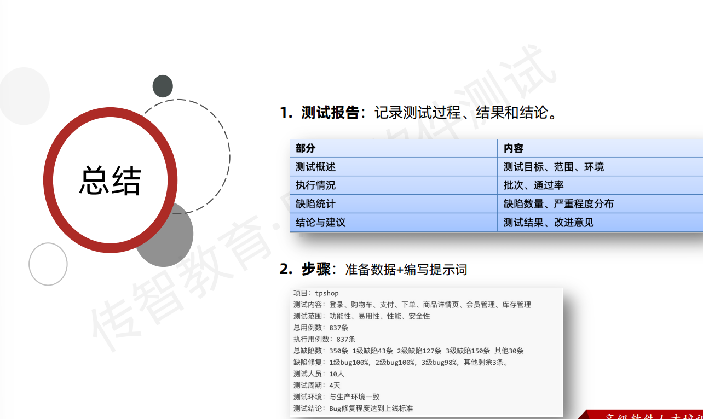


### 测试报告全解析：从撰写逻辑到 AI 辅助应用

#### **一、测试报告是什么？**

**定义**：
测试报告是软件测试阶段的核心产出物，用于总结测试过程、结果及质量评估，是团队决策、项目验收和后续维护的重要依据。
**核心目标**：

- 向利益相关者（管理层、开发、客户等）传递测试结果
- 量化软件质量，识别潜在风险
- 为版本发布、缺陷修复提供数据支撑

#### **二、测试报告的核心内容（面试高频考点）**

1. **测试概述**
   - **项目背景**：被测系统名称、版本、测试周期
   - **测试范围**：覆盖的功能模块、非功能测试点（性能、安全等）
   - **测试策略**：黑盒 / 白盒测试、自动化 / 手动测试占比
2. **测试结果汇总**
   - **用例执行情况**：
     ✅ 总用例数 | ✅ 已执行数 | ✅ 通过率（如：95%）
   - **缺陷统计**：
     按严重程度（致命 / 高 / 中 / 低）、类型（功能 / 兼容性 / UI 等）分类统计数量
   - **对比基准**：与前一版本或需求基线的质量差异
3. **缺陷分析**
   - **Top 缺陷趋势**：高频出现的问题（如：登录模块缺陷占比 30%）
   - **遗留缺陷风险**：未修复缺陷的影响评估（如：低优先级缺陷对上线的影响）
   - **缺陷收敛曲线**：展示测试周期内缺陷发现与解决的趋势
4. **质量结论**
   - **通过 / 不通过标准**：
     例：“致命缺陷归零，高优先级缺陷修复率≥95%，同意发布”
   - **风险提示**：未覆盖的测试点或依赖环境的限制
5. **改进建议**
   - 对测试过程的优化（如：增加自动化覆盖）
   - 对开发流程的反馈（如：需求模糊导致的缺陷）

#### **三、测试报告的结构与格式**

**标准模板参考**：

- **IEEE 829 标准**：包含 22 个强制章节（如测试日志、问题报告）

- 企业常用结构

  ：

  markdown

  

  ```markdown
  [测试报告] - XX系统V1.0  
  1. 概述  
     1.1 测试目标  
     1.2 测试环境（硬件/软件/网络）  
  2. 测试执行统计  
     2.1 用例执行矩阵（表格）  
     2.2 缺陷分布饼图  
  3. 重点问题分析  
     3.1 典型缺陷案例（附截图/复现步骤）  
  4. 结论与建议  
  附录：原始数据附件  
  ```

**呈现技巧**：

- 用**图表**替代纯文字（如柱状图展示缺陷趋势）
- 对管理层用**摘要版**（含核心结论和风险），对技术团队附**详细数据**

#### **四、测试报告的作用（面试常问）**

1. 决策支持

   ：

   - 管理层判断是否上线（如：根据缺陷密度决定是否延迟发布）

2. 知识沉淀

   ：

   - 为后续版本测试提供历史数据参考（如：某模块易出缺陷，需重点测试）

3. 责任追溯

   ：

   - 记录测试范围与结果，规避后期质量争议

#### **五、如何撰写高质量测试报告？（避坑指南）**

1. 数据客观

   ：

   - 避免主观描述（如 “界面很难看”），改用具体指标（如 “按钮颜色与设计稿偏差 RGB (5,5,5)”）

2. 结论明确

   ：

   - 避免模糊表述（如 “可能存在风险”），需量化风险（如 “支付模块成功率 92%，低于预期 99%”）

3. 受众导向

   ：

   - 给客户看：侧重用户影响（如 “注册流程失败率导致 10% 用户流失”）
   - 给开发看：侧重技术细节（如 “API 响应超时，堆栈日志见附件”）

#### **六、AI 如何辅助生成测试报告？**

1. 自动汇总数据

   ：

   - 工具：Jenkins + Allure + GPT-4

   - 示例指令：

     > "分析 Allure 报告中的缺陷数据，生成按模块分类的 Top3 缺陷总结，用表格展示"

2. 智能图表生成

   ：

   - 工具：Python + Matplotlib + ChatGPT

   - 指令：

     > "根据缺陷数量随时间变化的数据（CSV 附件），生成趋势图并分析拐点原因"

3. 风险预测

   ：

   - 利用历史报告训练 AI 模型，预测当前版本潜在风险（如：类似历史项目中，某功能缺陷率超 20%）

4. 多语言转换

   ：

   - 对跨国团队，用 AI 将报告自动翻译成英文 / 日文，保留技术术语准确性

#### **七、面试经典问题与应答示例**

**问题 1**：测试报告中最重要的三个指标是什么？
**应答**：

1. **用例通过率**：直接反映功能覆盖质量；
2. **致命缺陷数**：决定版本是否可发布的核心标准；
3. **缺陷收敛速度**：衡量开发团队修复效率与测试进度匹配度。

**问题 2**：如何向非技术人员解释测试报告？
**应答**：
用类比法简化数据，例如：

- “测试通过率 95%” → “就像考试答对了 95% 的题目，但还有 5% 的题需要重做”
- “内存泄漏缺陷” → “像水龙头没关紧，用久了会导致系统‘积水’卡顿”

#### **八、工具推荐**

- **传统工具**：TestRail（报告管理）、Jira（缺陷关联报告）

- AI 辅助工具

  ：

  - ChatGPT Plugins（自动生成报告摘要）
  - Tableau + GPT-4（动态图表 + 智能分析）
  - 国产工具：飞桨 AI Studio（自定义报告生成模型）

**总结**：测试报告是软件质量的 “体检报告”，核心在于用数据讲清 “测了什么、结果如何、下一步怎么做”。结合 AI 工具可大幅提升数据处理效率，但需注意人工校验逻辑准确性，避免依赖机器导致的误判。


### 示例

```markdown

以下是一份 **电商平台用户模块测试报告** 的范例，采用通用格式，包含核心内容和数据示例：


# **电商平台用户模块测试报告**  
**项目名称**：XX电商APP V3.2.0  
**测试周期**：2025年05月20日-05月30日  
**测试团队**：QA团队  
**报告日期**：2025年06月01日  


## **一、测试概述**  
### 1.1 测试目标  
- 验证用户模块核心功能（注册、登录、个人信息修改、密码找回）的正确性、稳定性及兼容性。  
- 检测性能指标（如登录响应时间）是否符合需求（目标：≤2秒）。  
- 识别安全漏洞（如密码加密、防暴力破解）。  

### 1.2 测试范围  
| 功能模块       | 具体测试点                                                                 |
|----------------|--------------------------------------------------------------------------|
| **注册**       | 手机号/邮箱注册、验证码校验、密码强度验证、重复注册提示                 |
| **登录**       | 手机号/邮箱登录、第三方登录（微信/支付宝）、错误密码重试限制           |
| **个人信息**   | 昵称/头像/收货地址修改、信息保存校验                                     |
| **密码找回**   | 手机号/邮箱找回流程、验证码有效期验证                                   |
| **兼容性**     | iOS 17（iPhone 14/15）、Android 14（小米13/华为Mate 60）、Web端（Chrome/Safari） |

### 1.3 测试环境  
- **硬件**：iPhone 15（iOS 17.0）、小米13（Android 14）、戴尔XPS（Chrome 120）  
- **网络**：4G/Wi-Fi（模拟弱网场景：2G网络限速）  
- **工具**：Appium（自动化）、Jmeter（性能）、OWASP ZAP（安全扫描）  


## **二、测试结果汇总**  
### 2.1 用例执行情况  
| 类型       | 总用例数 | 已执行数 | 通过数 | 通过率 | 未通过数 | 备注                     |
|------------|----------|----------|--------|--------|----------|--------------------------|
| 功能测试   | 80       | 80       | 76     | 95%    | 4        | 含3个界面问题，1个逻辑缺陷 |
| 性能测试   | 20       | 20       | 18     | 90%    | 2        | 高并发下登录响应超时     |
| 兼容性测试 | 30       | 30       | 28     | 93%    | 2        | Android端头像加载异常    |

### 2.2 缺陷统计  
#### 2.2.1 按严重程度分类  
  
- **致命缺陷**：0个  
- **严重缺陷**：2个（占5%）→ 均为登录功能逻辑缺陷  
- **一般缺陷**：18个（占45%）→ 主要为界面适配问题  
- **建议缺陷**：20个（占50%）→ 如注册页提示文字优化  

#### 2.2.2 按模块分布  
| 模块       | 缺陷数 | 占比   | 典型问题描述                                                                 |
|------------|--------|--------|------------------------------------------------------------------------------|
| 登录       | 10     | 25%    | 微信登录回调后页面卡死、错误密码输入10次未触发锁定                       |
| 注册       | 8      | 20%    | 邮箱格式错误时提示语不明确、重复注册无Toast提示                          |
| 个人信息   | 12     | 30%    | Android端头像裁剪区域显示不全、收货地址保存后自动清空                   |
| 密码找回   | 5      | 12.5%  | 邮箱找回流程中验证码发送延迟超5分钟                                        |
| 兼容性     | 5      | 12.5%  | Web端Safari浏览器昵称输入框光标错位、iOS 17第三方登录按钮适配异常       |


## **三、重点缺陷分析**  
### 3.1 典型缺陷案例  
#### 案例1：登录功能高并发响应超时（严重缺陷）  
- **复现步骤**：  
  1. Jmeter模拟500用户同时登录；  
  2. 持续压测30分钟，监测响应时间。  
- **预期结果**：90%请求响应时间≤2秒  
- **实际结果**：第20分钟起，响应时间骤升至5-8秒，错误率达15%  
- **原因**：用户认证接口未做限流，数据库连接池配置不足  

#### 案例2：Android端头像加载异常（一般缺陷）  
- **复现环境**：小米13（Android 14）、4G网络  
- **问题描述**：上传PNG格式头像后，个人主页显示为黑屏，日志报"Bitmap解码失败"  
- **根因**：图片压缩算法与部分Android机型GPU兼容性问题  


### 3.2 缺陷收敛趋势  
  
- **关键节点**：  
  - 5月25日：系统测试初期，单日发现缺陷峰值12个；  
  - 5月28日：开发修复后，回归测试缺陷数降至2个/天；  
  - 5月30日：遗留4个一般缺陷，均不影响主流程。  


## **四、质量结论与建议**  
### 4.1 质量结论  
- **通过标准**：  
  ✅ 致命缺陷清零，严重缺陷修复率100%；  
  ✅ 核心功能（注册/登录）通过率100%；  
  ✅ 性能指标在正常网络下达标（高并发场景需后续优化）。  
- **风险提示**：  
  - 弱网环境下头像加载成功率85%（目标≥95%），建议优化图片缓存策略；  
  - Web端兼容性问题主要影响小众浏览器（使用占比＜5%），可后续迭代修复。  

**结论**：用户模块满足上线基本要求，建议发布，但需在版本说明中注明已知兼容性问题。  

### 4.2 改进建议  
1. **开发侧**：  
   - 对用户认证接口增加令牌桶限流，优化数据库连接池参数；  
   - 统一图片处理组件，适配主流Android机型GPU架构。  
2. **测试侧**：  
   - 补充弱网场景自动化用例，覆盖更多边缘网络环境；  
   - 建立兼容性测试设备池，定期更新主流机型列表。  


## **五、附录**  
1. 原始测试用例文档（附件：UserModule_TestCases.xlsx）  
2. 缺陷详情列表（Jira导出：UserModule_Bugs_Report.csv）  
3. 性能测试报告（附件：Login_Performance_Report.pdf）  


**备注**：本报告数据均为模拟示例，实际项目中需根据真实测试结果填写。可结合AI工具（如ChatGPT）自动生成图表描述或趋势分析，提升报告效率。
```


# 85、AI自动化测试

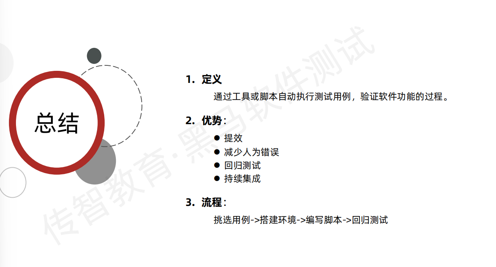

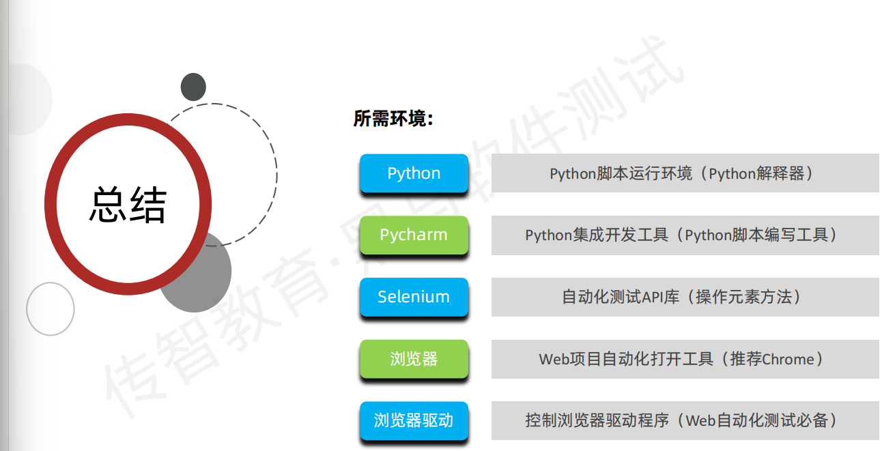

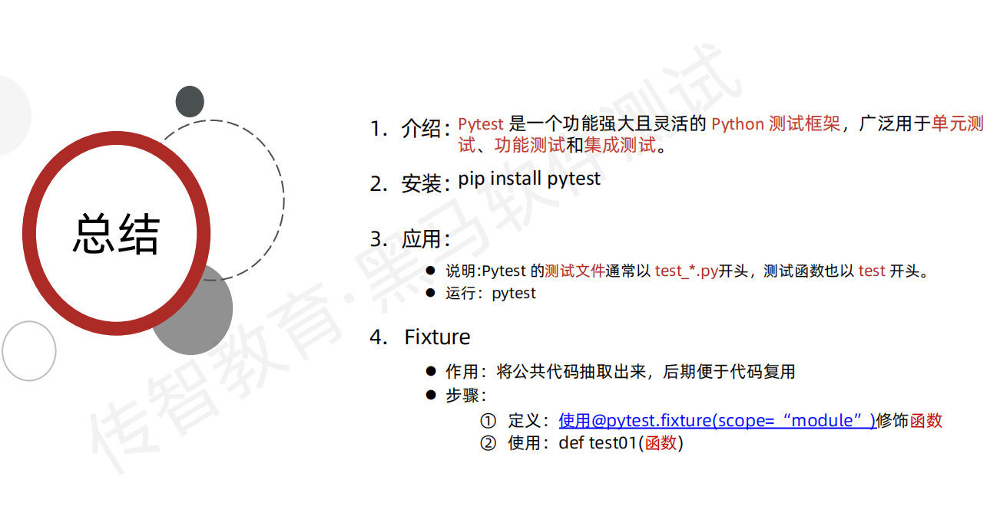

```markdown

### **自动化测试全面解析**  
#### **一、什么是自动化测试？**  
**定义**：通过编写脚本或使用工具，自动执行测试用例并验证结果，替代人工重复操作的测试方法。  
**核心目标**：  
- 提升测试效率（尤其适合重复执行的场景）；  
- 减少人为误差，提高结果准确性；  
- 支持高频次测试（如CI/CD流水线）。  
**与手动测试的区别**：  
| **维度**         | **手动测试**                | **自动化测试**                |  
|------------------|-----------------------------|-------------------------------|  
| **执行主体**     | 测试人员手动操作            | 脚本或工具自动运行            |  
| **效率**         | 低（重复用例耗时）          | 高（一次编写，多次执行）      |  
| **覆盖场景**     | 适合探索性、复杂逻辑测试    | 适合稳定、高频、数据量大的场景|  
| **维护成本**     | 无                          | 需定期维护脚本                |  


#### **二、自动化测试的分类**  
##### **1. 按测试阶段划分**  
- **单元测试**：测试单个函数/模块（如Java的JUnit、Python的Unittest）。  
- **集成测试**：测试模块间交互（如接口联调，工具：Postman、SoapUI）。  
- **系统测试**：测试完整系统功能（如UI自动化，工具：Selenium、Appium）。  
- **验收测试（UI自动化）**：模拟用户操作验证功能（如Web端点击、输入，工具：Cypress、Playwright）。  

##### **2. 按技术层面划分**  
- **API自动化**：测试接口功能、性能、安全（工具：Postman、RestAssured）。  
- **UI自动化**：测试界面交互逻辑（工具：Selenium+Java/Python、Appium（移动端））。  
- **性能自动化**：模拟高并发场景（工具：JMeter、LoadRunner）。  
- **持续集成（CI）自动化**：代码提交后自动触发测试（工具：Jenkins、GitLab CI）。  


#### **三、自动化测试流程**  
1. **规划阶段**  
   - 确定自动化范围（选择高频、稳定的用例，如登录、支付流程）。  
   - 选择工具和框架（如Python + Selenium + pytest）。  
2. **设计阶段**  
   - 分析需求，设计测试数据和断言逻辑。  
   - 设计脚本架构（如Page Object模式解耦页面元素和业务逻辑）。  
3. **开发阶段**  
   - 编写测试脚本（需具备编程能力，如Python/Java/JavaScript）。  
   - 调试脚本，处理动态元素（如XPath/CSS定位、显式等待）。  
4. **执行阶段**  
   - 批量运行脚本，生成测试报告（工具：Allure、HTMLTestRunner）。  
   - 自动对比预期结果与实际结果。  
5. **维护阶段**  
   - 脚本定期更新（如页面改版后修复定位器）。  
   - 优化脚本性能（如并行执行、缓存数据）。  


#### **四、主流自动化测试工具**  
| **领域**       | **工具**                | **特点**                                  |  
|----------------|-------------------------|-------------------------------------------|  
| **UI自动化**   | Selenium                | 跨浏览器支持，需结合编程语言（Java/Python）|  
|                | Cypress/Playwright     | 内置断言，支持端到端测试，API友好         |  
| **API自动化**  | Postman                 | 图形化界面，支持接口测试和Mock            |  
|                | RestAssured             | 基于Java，适合编写复杂接口测试脚本        |  
| **移动端自动化**| Appium                  | 同时支持iOS和Android，基于Selenium协议     |  
| **测试框架**   | JUnit/TestNG（Java）    | 单元测试框架，支持注解和断言              |  
|                | pytest/unittest（Python）| 简洁灵活，支持参数化和插件扩展            |  
| **持续集成**   | Jenkins/GitLab CI       | 自动触发测试，集成代码仓库和报告工具      |  


#### **五、自动化测试的优缺点**  
**优点**：  
- **效率高**：一次编写脚本，可重复执行数百次，节省人力成本。  
- **稳定性强**：避免人工操作疲劳导致的错误。  
- **覆盖全面**：支持大基数数据测试和多环境并行测试。  

**缺点**：  
- **前期投入大**：需学习编程和工具，脚本开发耗时。  
- **维护成本高**：页面元素变更（如ID/Class修改）需修改脚本。  
- **无法替代人工**：不适合探索性测试、复杂逻辑或UI视觉校验。  


#### **六、自动化测试最佳实践**  
1. **用例选择策略**  
   - 优先自动化**高频使用的功能**（如登录、搜索）和**易出错的场景**（如边界值、异常输入）。  
   - 避免自动化**不稳定的用例**（如依赖第三方接口且易变更的场景）。  

2. **分层测试（测试金字塔）**  
   - **底层（单元测试）**：占比60%+，测试单个组件，执行快、成本低。  
   - **中间层（集成测试）**：占比30%，测试模块间交互（如API）。  
   - **顶层（UI自动化）**：占比10%，测试端到端流程，维护成本高。  

3. **框架设计原则**  
   - **Page Object模式**：分离页面元素定位和业务逻辑，提高脚本可维护性。  
   - **数据驱动**：通过Excel/JSON文件管理测试数据，避免硬编码。  
   - **关键字驱动**：封装通用操作（如“点击按钮”“输入文本”），降低脚本复杂度。  

4. **集成CI/CD**  
   - 将自动化脚本接入持续集成工具（如Jenkins），代码提交后自动运行测试。  
   - 结合Docker实现环境隔离，避免“环境不一致”导致的测试失败。  

5. **动态元素处理**  
   - 使用**相对定位**（如XPath的contains()函数）应对动态ID。  
   - 添加**显式等待**（WebDriverWait）避免脚本因页面加载慢而失败。  


#### **七、AI在自动化测试中的应用**  
1. **自动生成测试脚本**  
   - AI工具（如Testim.io、Applitools）通过录制操作或自然语言描述生成脚本。  
   - 示例：输入“测试用户注册流程”，AI自动生成包含手机号注册、验证码校验的脚本。  

2. **智能维护脚本**  
   - AI分析页面元素变更，自动更新脚本中的定位器（如从CSS切换为XPath）。  
   - 工具：Mabl（基于AI的端到端测试平台）。  

3. **测试数据生成**  
   - AI根据业务规则生成有效/无效测试数据（如模拟合规手机号、异常邮箱格式）。  
   - 工具：Mockaroo（结合AI生成逼真测试数据）。  

4. **缺陷预测与分析**  
   - 通过机器学习分析历史测试数据，预测高风险模块或易失败用例。  
   - 工具：Testim.io的AI Insights模块。  


#### **八、面试高频问题**  
1. **自动化测试适合什么场景？不适合什么场景？**  
   - 适合：重复执行、数据量大、需要多环境验证的场景。  
   - 不适合：探索性测试、UI视觉校验、逻辑复杂且易变更的功能。  

2. **如何处理自动化脚本中的动态元素？**  
   - 答：使用相对定位（如XPath的文本匹配）、动态属性拼接、显式等待（WebDriverWait）。  

3. **Page Object模式的优点是什么？**  
   - 答：解耦页面元素和业务逻辑，减少代码重复，方便维护和团队协作。  

4. **你常用的自动化测试框架是如何设计的？**  
   - 示例：基于Python + pytest + Selenium，采用Page Object模式，数据存储在YAML文件，报告用Allure生成。  


#### **九、学习建议**  
1. **基础先行**：先掌握编程（Python/Java任选其一）和测试理论。  
2. **工具实战**：从Selenium+Python开始，完成一个简单Web项目的UI自动化（如电商网站登录流程）。  
3. **参与开源项目**：在GitHub上找开源项目（如WordPress）练习自动化测试脚本编写。  
4. **关注前沿**：学习AI测试工具（如Testim.io）和CI/CD集成（Jenkins+Docker）。  

**总结**：自动化测试是提升测试效率的核心手段，但需结合项目需求合理选择范围，避免为了“自动化而自动化”。新手可从简单功能的API自动化入手，逐步过渡到复杂的UI自动化和性能测试。
```


# 86、pytest

~~~markdown

### **pytest 全面解析：从入门到实战**  


#### **一、pytest 是什么？**  
**定义**：pytest 是 Python 生态中最流行的测试框架之一，以**简洁灵活**和**强大的插件体系**著称。它支持从单元测试到集成测试的全场景，兼容 unittest 用例，同时提供更高效的语法和工具链，是自动化测试的“瑞士军刀”。  


#### **二、pytest 核心优势（对比 unittest）**  
| **特性**               | **pytest**                          | **unittest**                      |  
|-------------------------|-------------------------------------|-----------------------------------|  
| **用例编写**            | 函数/类均可，无需继承 `TestCase`    | 必须继承 `TestCase` 类            |  
| **断言方式**            | 直接用 `assert` 关键字              | 依赖 `self.assert*` 方法          |  
| **Fixtures 机制**       | 灵活的依赖注入，支持参数化、作用域  | 仅支持 `setUp/tearDown` 生命周期  |  
| **插件生态**            | 超 1000+ 插件（如报告、并行执行）   | 扩展能力有限                      |  
| **测试发现**            | 自动识别 `test_*.py` 或 `*_test.py`| 需手动组织 `TestSuite`            |  


#### **三、pytest 核心功能与实战示例**  


##### **1. 基础用法：编写测试用例**  
pytest 的测试用例可以是函数或类中的方法，命名需以 `test_` 开头（类名以 `Test` 开头）。  

**示例 1：简单测试函数**  
```python  
# test_demo.py  
def test_add():  
    assert 1 + 2 == 3  

def test_string():  
    assert "hello" == "hello"  
```  

**运行命令**：  
```bash  
pytest test_demo.py  # 运行单个文件  
pytest               # 自动查找所有测试文件  
```  

**输出**：  
```  
============================= test session starts ==============================  
collected 2 items  

test_demo.py ..                                                    [100%]  

============================== 2 passed in 0.12s ===============================  
```  


##### **2. 断言增强：更友好的错误提示**  
pytest 对 `assert` 语句做了增强，当断言失败时会自动展示详细上下文（如变量值、表达式差异），无需手动打印调试。  

**示例 2：断言失败提示**  
```python  
def test_dict():  
    data = {"a": 1, "b": 2}  
    assert data["a"] == 2  # 断言失败  
```  

**运行结果**：  
```  
test_demo.py:4: AssertionError  
>       assert data["a"] == 2  
E       assert 1 == 2  
E        +  where 1 = data["a"]  
```  


##### **3. Fixtures：灵活的依赖管理**  
Fixtures 是 pytest 的核心机制，用于**管理测试用例的前置条件和后置清理**（替代 unittest 的 `setUp/tearDown`），支持模块化、参数化和作用域控制（如 `function`/`class`/`module`/`session`）。  

**示例 3：基础 Fixture**  
```python  
import pytest  

@pytest.fixture  
def user_data():  
    # 前置操作（如初始化数据）  
    user = {"name": "test", "age": 20}  
    yield user  # 返回数据（yield 后为后置操作）  
    # 后置操作（如清理数据）  
    print("\n清理用户数据")  

def test_user_age(user_data):  # 用例通过参数依赖 fixture  
    assert user_data["age"] == 20  

# 运行后输出：  
# test_demo.py::test_user_age PASSED  
# 清理用户数据  
```  


##### **4. 参数化测试：多组数据验证**  
通过 `@pytest.mark.parametrize` 装饰器，可对测试用例输入多组数据，避免重复编写用例。  

**示例 4：参数化测试**  
```python  
import pytest  

@pytest.mark.parametrize(  
    "input, expected",  # 参数名  
    [  
        (1 + 2, 3),     # 第1组数据  
        (3 * 4, 12),    # 第2组数据  
        (5 - 3, 2),     # 第3组数据  
    ]  
)  
def test_calculation(input, expected):  
    assert input == expected  

# 运行后输出：  
# test_demo.py::test_calculation[1+2-3] PASSED  
# test_demo.py::test_calculation[3*4-12] PASSED  
# test_demo.py::test_calculation[5-3-2] PASSED  
```  


##### **5. 标记（Mark）：分类与筛选测试**  
通过 `@pytest.mark` 给用例打标签（如 `@pytest.mark.slow` 标记慢用例），支持运行时筛选（如只运行 `slow` 标签的用例）。  

**示例 5：标记与筛选**  
```python  
import pytest  

@pytest.mark.slow  # 标记为“慢用例”  
def test_large_data():  
    # 模拟大数据量测试（耗时较长）  
    assert sum(range(10000)) == 49995000  

@pytest.mark.api  # 标记为“接口测试”  
def test_login_api():  
    assert "token" in {"token": "abc123"}  

# 运行命令（仅执行 slow 标签）：  
pytest -m slow  
```  


##### **6. 插件扩展：提升测试效率**  
pytest 的插件生态丰富，常用插件包括：  

| **插件**             | **功能**                              | **示例命令**                  |  
|-----------------------|---------------------------------------|-------------------------------|  
| `pytest-html`         | 生成 HTML 测试报告                    | `pytest --html=report.html`   |  
| `pytest-xdist`        | 并行执行测试（利用多核 CPU）          | `pytest -n 4`（4 线程）       |  
| `pytest-mock`         | 模拟依赖（替代 `unittest.mock`）      | 在测试中直接使用 `mocker` 对象|  
| `pytest-cov`          | 统计测试覆盖率                        | `pytest --cov=my_project`     |  


#### **四、pytest 测试发现规则**  
pytest 会自动发现以下测试用例（无需手动配置）：  

1. **文件**：命名为 `test_*.py` 或 `*_test.py` 的文件。  
2. **函数**：文件中以 `test_` 开头的函数。  
3. **类**：以 `Test` 开头的类（类名首字母大写），且类中以 `test_` 开头的方法（类不能有 `__init__` 方法）。  


#### **五、pytest 工作流程（最佳实践）**  
1. **环境准备**：安装 pytest（`pip install pytest`）。  
2. **用例设计**：根据需求编写测试函数/类，合理使用 fixtures 和参数化。  
3. **依赖管理**：通过 fixtures 封装公共逻辑（如数据库连接、API 客户端初始化）。  
4. **执行与调试**：  
   - 运行指定用例：`pytest test_module.py::TestClass::test_method`。  
   - 调试模式：`pytest -v`（详细输出）、`pytest -x`（失败后立即停止）。  
5. **报告与集成**：结合插件生成报告（如 HTML），集成 CI/CD（如 Jenkins、GitHub Actions）。  


#### **六、常见问题与解决**  
1. **用例未被发现**：检查文件名、函数名是否符合 `test_*` 规则，类名是否以 `Test` 开头。  
2. **Fixtures 作用域错误**：根据需求设置作用域（如 `@pytest.fixture(scope="module")` 表示模块级）。  
3. **断言失败信息不详细**：确保使用原生 `assert`，pytest 会自动解析表达式差异。  


#### **七、面试高频问题**  
1. **pytest 和 unittest 的区别？**  
   - 答：pytest 更简洁（无需继承类）、断言更灵活（直接用 `assert`）、支持 fixtures 依赖注入、插件生态丰富。  

2. **Fixtures 和 setUp/tearDown 的区别？**  
   - 答：Fixtures 支持作用域（如模块级、会话级）和参数化，可灵活组合；setUp/tearDown 仅支持函数/类级生命周期，复用性差。  

3. **如何用 pytest 实现参数化测试？**  
   - 答：使用 `@pytest.mark.parametrize` 装饰器，指定参数名和多组测试数据。  


#### **八、学习资源推荐**  
- **官方文档**：[docs.pytest.org](https://docs.pytest.org/)（必看，包含详细示例）。  
- **实战项目**：在 GitHub 搜索 `pytest-example`，参考开源项目的测试用例写法。  
- **插件列表**：[pytest-plugins](https://pypi.org/search/?q=pytest-)（按需选择扩展功能）。  


**总结**：pytest 是 Python 测试的“全能框架”，通过简洁的语法、灵活的 fixtures 和丰富的插件，能大幅提升测试效率。新手建议从编写简单函数用例开始，逐步掌握 fixtures 和参数化，最后结合插件实现报告生成和持续集成。
~~~

# 87.allure

```markdown
Allure 详解：优雅的测试报告生成工具
一、什么是 Allure？
Allure 是一款 开源的测试报告生成框架，专为自动化测试设计，用于将测试结果转化为 交互式、可视化且信息丰富的报告。它支持多种测试框架（如 Pytest、JUnit、TestNG 等），能直观展示测试执行结果、失败案例详情、日志追踪、附件（截图、日志文件等），并提供趋势分析，帮助团队快速定位问题，提升测试效率。
二、核心功能与特点
美观直观的报告界面
以图表形式展示测试统计数据（通过率、失败率、跳过率等）。
分层展示测试用例结构（按套件、类、方法分组），支持搜索和过滤。
失败用例高亮显示，包含详细堆栈跟踪、日志输出和附件（如截图、请求响应数据）。
多框架兼容
支持主流测试框架，通过插件或适配器集成（如 allure-pytest、allure-junit）。
可与 CI/CD 工具（Jenkins、GitLab CI/CD 等）无缝集成，生成持续集成报告。
丰富的元数据标注
支持为测试用例添加 标签（Tag）、故事（Story）、史诗（Epic）、优先级 等元数据，便于分类和过滤。
可自定义测试用例的描述、步骤细节，使报告更具可读性。
历史趋势对比
保存多轮测试结果，支持跨版本对比，直观展示质量趋势（如通过率波动、新增缺陷等）。
灵活的扩展能力
支持自定义报告样式、添加环境信息（如测试环境配置、构建版本号）。
可通过编程方式（API）生成报告，适配复杂测试场景。
三、如何使用 Allure？
以下以 Pytest + Allure 为例，演示完整流程。
1. 环境准备
安装 Allure 命令行工具
Windows/macOS/Linux：
从 Allure 官网 下载对应系统的安装包，解压后将 bin 目录添加到环境变量。
验证安装：
bash
allure --version  # 输出版本号即安装成功

安装 Python 依赖
bash
pip install pytest allure-pytest  # Pytest 与 Allure 插件

2. 编写带 Allure 标注的测试用例
在 Pytest 测试文件中，使用 Allure 提供的装饰器添加元数据：
python
import pytest
from allure import step, title, tag, attachment, severity, severity_level

@tag("smoke")  # 标签
@severity(severity_level.CRITICAL)  # 优先级
@title("登录功能测试")  # 用例标题
def test_login(driver):
    with step("打开登录页面"):  # 测试步骤
        driver.get("https://example.com/login")
    
    with step("输入用户名和密码"):
        driver.find_element_by_id("username").send_keys("user")
        driver.find_element_by_id("password").send_keys("pass")
    
    with step("点击登录按钮"):
        driver.find_element_by_id("login-btn").click()
    
    # 添加附件（如截图）
    attachment(driver.get_screenshot_as_png(), name="登录结果截图", attachment_type="png")
    
    assert "dashboard" in driver.current_url, "登录失败"
3. 生成 Allure 报告
第一步：运行测试并生成原始数据
bash
pytest test_login.py --alluredir=./allure-results  # 生成 JSON 格式的测试结果数据

第二步：基于原始数据生成报告
bash
allure generate ./allure-results -o ./allure-report --clean  # 生成报告到 allure-report 目录

第三步：启动报告服务器（本地查看）
bash
allure open ./allure-report  # 自动打开浏览器查看报告

4. 报告结构与交互
生成的报告包含以下核心模块：
概览页：显示测试执行摘要（总数、通过 / 失败 / 跳过数、执行时间、趋势图）。
测试用例页：按标签、故事、优先级等维度分组展示用例，支持搜索和过滤。
用例详情页：
步骤详情：每个 step 会按顺序展示，失败步骤高亮。
附件：图片、日志文件等可直接预览或下载。
元数据：标签、优先级、环境信息等。
历史对比：若保存多轮结果，可对比不同版本的测试数据。
四、高级用法
自定义环境信息
在报告中添加测试环境配置（如浏览器版本、服务器地址）：
python
# 在 conftest.py 中配置
import allure

allure.environment(
    browser="Chrome",
    browser_version="114.0",
    environment="QA",
    build="v2.1.0"
)

集成到 CI/CD
在 Jenkins 中配置流水线，自动生成报告：
groovy
pipeline {
    agent any
    stages {
        stage("运行测试") {
            steps {
                sh "pytest --alluredir=allure-results"
            }
        }
        stage("生成 Allure 报告") {
            steps {
                sh "allure generate allure-results -o allure-report --clean"
            }
            post {
                always {
                    allure includeProperties: true, jdk: '', results: [[path: 'allure-report']]
                }
            }
        }
    }
}

自定义报告样式
通过修改 Allure 的默认样式模板（CSS/JS），或使用社区主题（如 allure-material-design）。
五、为什么选择 Allure？
对比传统报告工具（如 pytest-html）：
界面更美观，交互性更强，支持动态过滤和搜索。
内置分层结构、步骤详情、附件支持，信息更丰富。
历史趋势对比功能便于长期质量监控。
团队协作友好：清晰的报告有助于开发、测试、产品经理快速对齐问题，减少沟通成本。
六、总结
Allure 是自动化测试中提升报告质量的首选工具，其 可视化能力 和 深度分析功能 能显著提高缺陷定位效率。通过简单的插件集成和元数据标注，即可生成专业级测试报告，尤其适合需要频繁交付的敏捷团队和 DevOps 流程。
实践建议：结合 Pytest 的参数化测试和 Allure 的标签体系，可进一步提升测试用例的组织和报告可读性。
```

