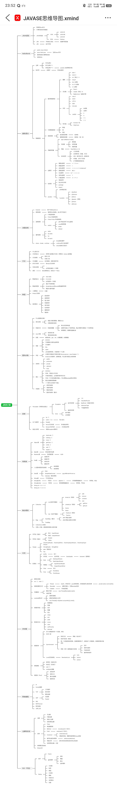

# #19

## 一、软件测试

熟悉网站

[禅道](https://zentao.demo.qucheng.cc/index.php?m=my&f=index)

[atlassion](https://home.atlassian.com/goals)

密码的 到现在都没搞懂 软件测试要干啥 

写用例？

场景？ 

还是啥也不会

## 二、Javase回顾

[狂神说视频](https://www.bilibili.com/video/BV1MJ411v7tJ/?spm_id_from=333.1391.0.0)

[思维导图](https://i0.hdslb.com/bfs/new_dyn/e00b63d4f7da7a7a67abe2790e35cfee523951671.jpg@270w_0-0-270-360a_1s.avif)

牛客刷题  java700[题](https://www.nowcoder.com/exam/test/88560069/detail?examPageSource=Intelligent&judgmentIntercept=0&pid=61973908&testCallback=https%3A%2F%2Fwww.nowcoder.com%2Fexam%2Fintelligent%3FquestionJobId%3D10%26subTabName%3Dintelligent_page&testclass=%E8%BD%AF%E4%BB%B6%E5%BC%80%E5%8F%91)

# Java SE 核心知识体系（思维导图版）

### **一、Java 语言基础**

| **分类**       | **核心内容**                                                 | **面试 / 实战要点**                               |
| -------------- | ------------------------------------------------------------ | ------------------------------------------------- |
| **历史与平台** | Java 诞生（1995），JDK/JRE/JVM 关系；SE/ME/EE（EE 现称 Jakarta EE） | 区分 JDK/JRE/JVM，理解平台定位                    |
| **开发环境**   | 环境变量配置（JAVA_HOME、Path），IDE（IDEA/Eclipse），javac/java 命令 | 手动编译运行流程（javac Hello.java → java Hello） |

### **二、HelloWorld 与语法规范**

- **程序结构**：`public class HelloJava` 与文件名一致，`main` 方法为入口（`public static void main(String[] args)`）。
- **编码规范**：UTF-8 编码，类名 Pascal 命名法，变量 camelCase 命名法。

### **三、基础语法**

#### **1. 注释与标识符**

- 注释：单行 `//`、多行 `/* */`、文档注释 `/** */`（生成 javadoc）。
- 标识符：字母 /`$`/`_` 开头，大小写敏感；避免与关键字（`final`/`static` 等）冲突。

#### **2. 数据类型**

- 基本类型

  ：

  - 数值：`byte(1B)`、`short(2B)`、`int(4B)`、`long(8B)`；`float(4B)`、`double(8B)`。
  - 字符：`char(2B，Unicode 编码)`；布尔：`boolean(1B，true/false)`。

- **引用类型**：数组、类、接口；类型转换（自动提升 `byte→int`，强制转换 `(int)1.2` 可能丢失精度）。

#### **3. 变量与常量**

- 变量：成员变量（类级，默认值）、局部变量（方法级，必须初始化）。
- 常量：`final` 修饰，命名全大写（`MAX_COUNT=10`）。

#### **4. 运算符**

- 算术（`+/-/*/%`）、赋值（`=/:=+`）、逻辑（`&&/||/!`）、位运算（`&/|/^/<<`）、三元运算符（`condition ? a : b`）。

### **四、流程控制**

- **选择结构**：`if`/`if-else`/`switch`（JDK7+ 支持 String，`case` 需常量，`break` 跳出）。
- **循环结构**：`while`（先判断）、`do-while`（至少执行一次）、`for`（初始化→条件→更新）、`foreach`（遍历集合 / 数组）。
- **跳转语句**：`break`（跳出循环）、`continue`（跳过本次循环）、`return`（结束方法）。

### **五、方法与递归**

- **方法定义**：修饰符 + 返回值 + 方法名 + 参数（`public int add(int a, int b)`）。
- **重载**：同名方法，参数列表不同（与返回值无关）；**递归**：自身调用，需终止条件（如阶乘计算）。

### **六、数组与排序**

- **数组操作**：`new int[5]` 初始化，`Arrays` 工具类（`sort`/`toString`/`copyOf`）。
- **排序算法**：冒泡（相邻交换）、快速（分治）、选择（找最值）等，重点理解时间复杂度。

### **七、面向对象核心（OOP）**

#### **1. 类与对象**

- 类：模板（属性 + 方法）；对象：实例，通过 `new` 创建；构造方法（与类名同，初始化对象）。

#### **2. 封装、继承、多态**

- **封装**：`private` 修饰属性，`get/set` 访问；**继承**：`extends`，单继承，`super` 调用父类；**多态**：父类引用指向子类（`Animal a = new Dog()`），需方法重写。

#### **3. 修饰符与接口**

- 访问修饰符：`public`/`protected`/`default`/`private`；
- 抽象：`abstract` 类（含抽象方法，需子类实现）；`interface`（多实现，JDK8 后支持默认方法）。

#### **4. 内部类**

- 成员内部类、局部内部类、静态内部类、**匿名内部类**（高频，如事件监听 `new Runnable() { ... }`）。

### **八、异常处理**

- **体系**：`Throwable` → `Error`（JVM 错误，不可捕）、`Exception`（可捕，分运行时 / 编译时异常）。
- **处理**：`try-catch-finally`（`finally` 必执行，释放资源）；`throws` 声明、`throw` 抛出；自定义异常（继承 `Exception`）。

### **九、常用类库**

#### **1. 基础类**

- `Object`：`equals`（默认比地址，需重写）、`hashCode`、`toString`；
- `Math`/`Random`：数学运算、随机数生成；`File`：文件 / 目录操作（创建、删除）。

#### **2. 包装类与字符串**

- 包装类：`Integer`/`Double` 等，自动装箱（`int→Integer`）、拆箱；
- 字符串：`String`（不可变，`+` 拼接）、`StringBuilder`（可变，线程不安全，高效）、`StringBuffer`（线程安全，低效）。

#### **3. 日期处理**

- 旧 API：`Date`、`SimpleDateFormat`（线程不安全）；
- 新 API（JDK8+）：`LocalDate`/`LocalTime`（线程安全，推荐）。

### **十、集合框架**

| **接口** | **实现类**           | **特点**                   |
| -------- | -------------------- | -------------------------- |
| **List** | `ArrayList`（数组）  | 查询快，增删慢             |
|          | `LinkedList`（链表） | 增删快，查询慢             |
| **Set**  | `HashSet`（哈希表）  | 无序、去重，基于 `HashMap` |
|          | `TreeSet`（红黑树）  | 有序、去重                 |
| **Map**  | `HashMap`（哈希表）  | 无序，允许 `null` 键值     |
|          | `TreeMap`（红黑树）  | 有序（按键排序）           |

- **线程安全**：`CopyOnWriteArrayList`、`ConcurrentHashMap`（替代 `HashTable`）。

### **十一、IO 流**

#### **1. 流分类**

- **字节流**：`InputStream`/`OutputStream`（如 `FileInputStream`）；
- **字符流**：`Reader`/`Writer`（如 `FileReader`）；
- **装饰流**：`Buffered`（缓冲，提升效率）、`Data`（读写基本类型）、`Object`（序列化，需 `Serializable`）。

#### **2. 核心操作**

- 文件复制（字节流 + 缓冲）；对象序列化（`ObjectOutputStream`）与反序列化。

### **十二、多线程**

#### **1. 线程基础**

- 创建：继承 `Thread`、实现 `Runnable`、Lambda（`() -> System.out.println()`）；
- 状态：新建→就绪→运行→阻塞→死亡；常用方法：`start()`（启动）、`run()`（执行体）、`sleep()`（休眠）。

#### **2. 同步与通信**

- **同步**：`synchronized`（锁对象 / 方法）、`ReentrantLock`（更灵活）；
- **通信**：`wait()`/`notify()`（配合 `synchronized`）、`Lock` + `Condition`；
- **线程池**：`ExecutorService`（如 `FixedThreadPool`），避免线程频繁创建。

### **十三、网络编程**

- **协议**：TCP（面向连接，可靠，`ServerSocket`/`Socket`）、UDP（无连接，快速，`DatagramSocket`）；
- **应用**：Socket 通信、文件上传下载、URL 资源访问。

### **十四、注解与反射**

- **注解**：`@Override`/`@Deprecated`，自定义注解（`@interface`）；
- **反射**：运行时获取类信息（`Class`）、调用方法（`Method.invoke()`）、访问属性（突破权限限制），是框架核心（如 Spring）。

### **十五、GUI（可选）**

- **AWT**：重量级组件（`Frame`/`Button`），依赖系统；
- **Swing**：轻量级（`JFrame`/`JButton`），事件监听（`ActionListener`）；
- **JavaFX**：现代 GUI 框架（JDK8+ 推荐，替代 Swing）。

**学习建议**：

1. **抓核心**：面向对象（封装 / 继承 / 多态）、集合、多线程、IO 是重点；

2. **练代码**：每个知识点配套 Demo（如写一个线程安全的集合）；

3. **结合框架**：反射、注解是 Spring 等框架的底层，学完可延伸学习；

4. **查漏补缺**：通过 LeetCode 练算法（数组、排序），通过实际项目练 IO、网络编程。

   

需要加强的点：注解 和 反射 ， 网络编程

java web [回顾](https://heuqqdmbyk.feishu.cn/wiki/FxTdw2K9mieDgAkhSqucg59Cn8f)

[Javaguide](https://javaguide.cn/java/basis/java-basic-questions-02.html#%E9%9D%A2%E5%90%91%E5%AF%B9%E8%B1%A1%E5%92%8C%E9%9D%A2%E5%90%91%E8%BF%87%E7%A8%8B%E7%9A%84%E5%8C%BA%E5%88%AB)

小林coding

廖雪峰教程