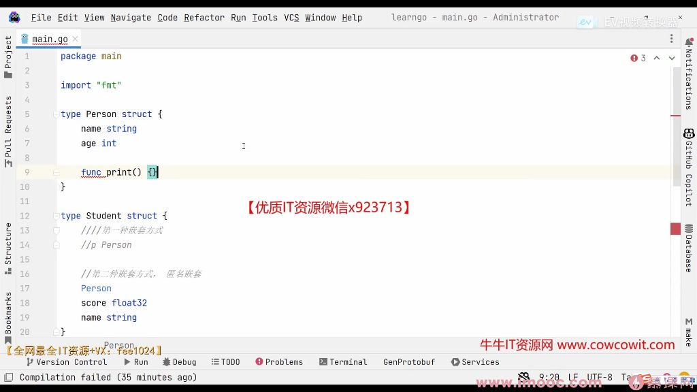
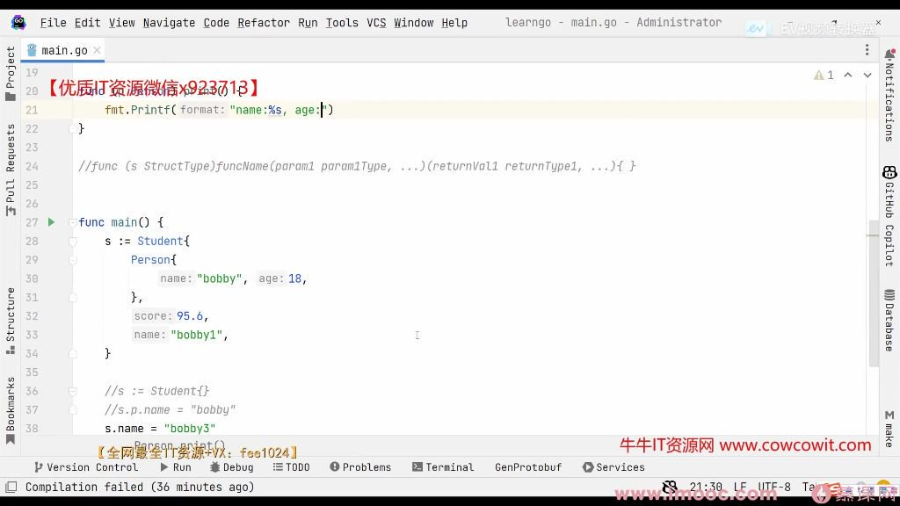
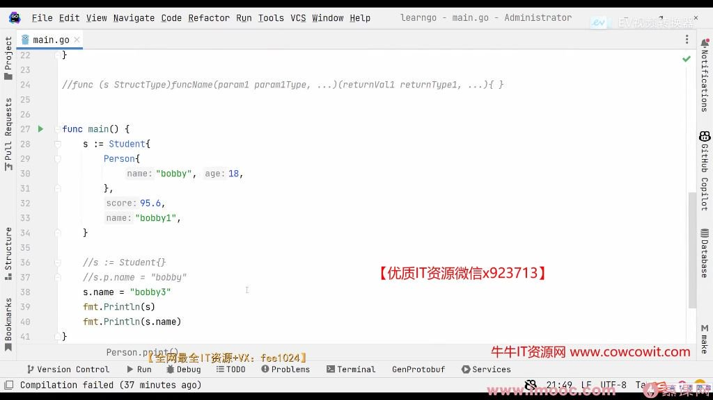
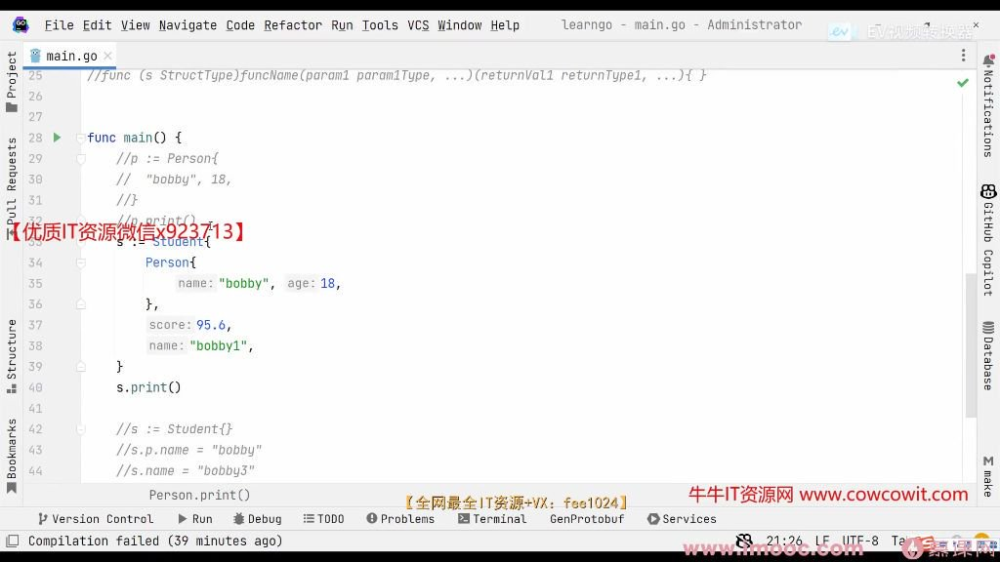
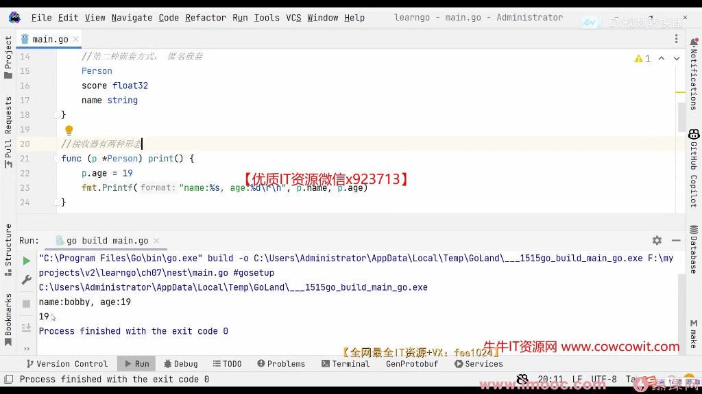
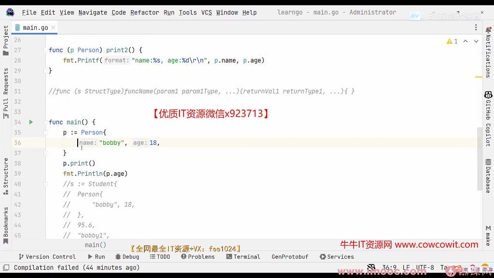

- 摘要

  该视频主要讲述了在Go语言中如何定义类型别名以及自定义类型，以及类型转换和类型判断的相关内容。首先，通过使用type关键字，可以定义类型别名，提高代码的可读性和可维护性。其次，介绍了自定义类型的定义方法，通过type关键字进行定义，可以定义自己的属性和方法，提高代码的灵活性和可重用性。最后，视频还介绍了类型别名和自定义类型的区别，它们本质上是不同的。此外，该视频还讲述了类型转换和类型判断的用法，通过使用别名、扩展方法和switch语句等方式，可以更加灵活地处理不同类型的值。总之，这个视频详细介绍了Go语言中的类型相关内容，帮助我们提高代码的可读性、可维护性和灵活性。

- 分段总结

  折叠

  00:01结构体概述

  1.结构体是Go语言中非常重要的概念，类似于其他语言中的class，但更加轻量级。 2.结构体可以包含一组相关的字段，用于表示现实世界中的实体或对象。

  00:27type关键字介绍

  1.type关键字在Go语言中有多种用途，包括定义结构体、接口和类型别名。 2.type关键字用于给现有类型定义一个新的名称，类似于给变量或函数起别名。

  01:17类型别名

  1.类型别名使用type关键字定义，等于一个现有类型，为该类型重新命名。 2.类型别名提高了代码的可读性和可维护性，使代码更易于理解。 3.类型别名在编译时会被替换为原始类型，对机器和电脑更加友好。

  05:32类型定义

  1.类型定义与类型别名类似，但不同的是它基于已有类型但添加了新的特性或方法。 2.类型定义使用type关键字定义，但没有等号，表示这是一个新的自定义类型。 3.类型定义可以扩展原有类型的能力，通过定义方法为自定义类型添加功能。

  11:55类型判断

  1.类型判断用于确定接口或变量的具体类型，常用于接口和结构体中。 2.type关键字在类型判断中用于比较变量的类型，类似于其他语言中的instanceof关键字。 3.类型判断提高了代码的灵活性和可扩展性，使程序能够根据不同类型的变量执行不同的操作。

- 重点

  本视频暂不支持提取重点 

#### 一、type关键字 00:02

##### 1. type关键字的用法 00:39

###### 1）定义结构体 00:50

- 类比class: 结构体可类比其他语言的class，但比class更加轻量级
- 用途: 用于组织多个字段的数据结构，是Go语言中重要的复合类型

###### 2）定义接口 01:02

- 用途: 定义方法集合，用于实现多态行为
- 特点: 接口类型将在后续章节详细讲解

###### 3）定义类型别名 01:11

- 作为别名 

  01:54

  - ![img](https://bdcm01.baidupcs.com/file/p-bf82857eb3b8355b8df9a81bc0e3eb8a-40-2025042100-1?bkt=en-3de6f374fcad9f514a94920d227b7f50&fid=282335-250528-&time=1756214097&sign=FDTAXUVGEQlBHSKfWqij-GBWOGYTBgG0KqHy7wNbwoLTVMyJyK6xE-K1CVAtWNsX%2BbgkV%2BTAGCFFnfHws%3D&to=93&size=10&sta_dx=10&sta_cs=0&sta_ft=&sta_ct=7&sta_mt=7&fm2=MH%2CBaoding%2CAnywhere%2C%2C%E7%A6%8F%E5%BB%BA%2Ccmnet&ctime=0&mtime=0&dt3=0&resv0=-1&resv1=0&resv2=rlim&resv3=5&resv4=10&vuk=0&iv=2&vl=0&htype=&randtype=&newver=1&newfm=1&secfm=1&flow_ver=3&pkey=en-8a4e702b3bf4316f8e1ce0bb00b549a91715a7e97e873e424b91e6b52c1d2b0f424c309521410683f2cc99af4b95d98899e7c4ccfbefde47305a5e1275657320&expires=8h&r=970387228&vbdid=-&fin=p-bf82857eb3b8355b8df9a81bc0e3eb8a-40-2025042100-1&fn=p-bf82857eb3b8355b8df9a81bc0e3eb8a-40-2025042100-1&rtype=1&dp-logid=8975998211834913136&dp-callid=0.1&hps=1&tsl=0&csl=0&fsl=-1&csign=dmayhhcqdS1jXSxjkf6DN1P7N8o%3D&so=0&ut=1&uter=-1&serv=-1&uc=3306618675&ti=718800a01e5121caae339351eea0af8ef6cbe24055419ee9&hflag=30&from_type=&adg=n&reqlabel=250528_n_e216f4915c0670ff5c66254cab087ccb_0_65e64f12d02189817bbddbf3effd3c99&chkv=5&bid=250528&by=themis)

  - 语法: 使用type 新类型名 = 原类型格式

  - 本质: 编译时会被直接替换为原类型

  - 示例:

  - 用途

    :

    - 提高代码可读性（如byte是uint8的别名）
    - 方便理解代码意图（如rune表示字符而非普通整数）

- 作为类型定义 

  05:35

  - ![img](https://bdcm01.baidupcs.com/file/p-bf82857eb3b8355b8df9a81bc0e3eb8a-40-2025042100-2?bkt=en-3de6f374fcad9f514a94920d227b7f50&fid=282335-250528-&time=1756214097&sign=FDTAXUVGEQlBHSKfWqij-GBWOGYTBgG0KqHy7wNbwoLTVMyJyK6xE-XgVSGeLtFy7W6sjXnK4XIdUsf0A%3D&to=93&size=10&sta_dx=10&sta_cs=0&sta_ft=&sta_ct=7&sta_mt=7&fm2=MH%2CBaoding%2CAnywhere%2C%2C%E7%A6%8F%E5%BB%BA%2Ccmnet&ctime=0&mtime=0&dt3=0&resv0=-1&resv1=0&resv2=rlim&resv3=5&resv4=10&vuk=0&iv=2&vl=0&htype=&randtype=&newver=1&newfm=1&secfm=1&flow_ver=3&pkey=en-8dc5d1eef20ef2f4574a714cbcdba220bfecf70f8fae2709d47b0e45eaa5de19ac49d73d9b3ecdaa696b2d05f3fda008bda37f039b8692cc305a5e1275657320&expires=8h&r=473659664&vbdid=-&fin=p-bf82857eb3b8355b8df9a81bc0e3eb8a-40-2025042100-2&fn=p-bf82857eb3b8355b8df9a81bc0e3eb8a-40-2025042100-2&rtype=1&dp-logid=8975998211834913136&dp-callid=0.1&hps=1&tsl=0&csl=0&fsl=-1&csign=dmayhhcqdS1jXSxjkf6DN1P7N8o%3D&so=0&ut=1&uter=-1&serv=-1&uc=3306618675&ti=12146e4ffd7df3c94e5e41521d9dd888f6cbe24055419ee9&hflag=30&from_type=&adg=n&reqlabel=250528_n_e216f4915c0670ff5c66254cab087ccb_0_65e64f12d02189817bbddbf3effd3c99&chkv=5&bid=250528&by=themis)

  - 语法: 使用type 新类型名 原类型格式（无等号）

  - 特点

    :

    - 创建全新类型，与原类型不同
    - 需要类型转换才能与原类型运算
    - 可以添加方法扩展功能

  - 示例:

  - 方法扩展:

###### 4）类型判断 12:03

- ![img](https://bdcm01.baidupcs.com/file/p-bf82857eb3b8355b8df9a81bc0e3eb8a-40-2025042100-3?bkt=en-3de6f374fcad9f514a94920d227b7f50&fid=282335-250528-&time=1756214097&sign=FDTAXUVGEQlBHSKfWqij-GBWOGYTBgG0KqHy7wNbwoLTVMyJyK6xE-cA5seCJG%2BnlP7Z77NerYL8I2pGg%3D&to=93&size=10&sta_dx=10&sta_cs=0&sta_ft=&sta_ct=7&sta_mt=7&fm2=MH%2CBaoding%2CAnywhere%2C%2C%E7%A6%8F%E5%BB%BA%2Ccmnet&ctime=0&mtime=0&dt3=0&resv0=-1&resv1=0&resv2=rlim&resv3=5&resv4=10&vuk=0&iv=2&vl=0&htype=&randtype=&newver=1&newfm=1&secfm=1&flow_ver=3&pkey=en-0bac7d0640dbb2f320ea0a8b557f2e16116b9dc2f30b30759b60b78a9d1dd8d6ca4ed033d78ef0de51ea7cbc94cfd2fa9bdc33c46903d9e5305a5e1275657320&expires=8h&r=772514113&vbdid=-&fin=p-bf82857eb3b8355b8df9a81bc0e3eb8a-40-2025042100-3&fn=p-bf82857eb3b8355b8df9a81bc0e3eb8a-40-2025042100-3&rtype=1&dp-logid=8975998211834913136&dp-callid=0.1&hps=1&tsl=0&csl=0&fsl=-1&csign=dmayhhcqdS1jXSxjkf6DN1P7N8o%3D&so=0&ut=1&uter=-1&serv=-1&uc=3306618675&ti=12146e4ffd7df3c9949061e60c62bb00f6cbe24055419ee9&hflag=30&from_type=&adg=n&reqlabel=250528_n_e216f4915c0670ff5c66254cab087ccb_0_65e64f12d02189817bbddbf3effd3c99&chkv=5&bid=250528&by=themis)
- switch用法:
- 类型断言:
- 注意: 类型判断主要用于处理接口类型的动态类型识别

#### 二、知识小结

| 知识点         | 核心内容                                                     | 考试重点/易混淆点                                            | 难度系数 |
| -------------- | ------------------------------------------------------------ | ------------------------------------------------------------ | -------- |
| Go语言结构体   | 类比其他语言的class但更轻量级，需通过type关键字定义          | 与C语言结构体的区别、与class的异同                           | ⭐⭐       |
| type关键字用途 | 1. 定义结构体2. 定义接口3. 类型别名（如type MyInt = int）4. 自定义类型（如type MyInt int） | 类型别名与自定义类型的本质区别（编译后替换 vs 新类型）       | ⭐⭐⭐      |
| 类型别名       | 为已有类型赋予新名称（如type All = interface{}），提升代码可读性 | 别名与原类型完全等价（可直接运算）                           | ⭐⭐       |
| 自定义类型     | 基于已有类型创建新类型（如type MyInt int），类型不同需强制转换 | 可扩展方法（如func (m MyInt) String() string），而原类型不可扩展 | ⭐⭐⭐⭐     |
| 类型断言与判断 | switch v := a.(type)判断接口实际类型，s := a.(string)强制断言 | 接口类型需用.(type)，非接口类型需显式转换                    | ⭐⭐⭐      |
| 方法绑定       | Go中方法定义在类型外部（如func (m MyInt) Method()），与类语法差异 | 方法接收者（值/指针）影响修改行为                            | ⭐⭐⭐⭐     |

- 摘要

  该视频主要讲述了Go语言中的结构体。结构体可以包含不同类型的数据，并实现面向对象的特性。通过结构体可以方便地定义新类型，并使用结构体和接口实现面向对象的特性，使代码更清晰、易读、易维护。此外，视频还介绍了结构体的初始化方式，包括指定字段和 p 二方式，以及 slice 的初始化方式，如定义并使用 append 函数、省略号自动推断初始化的值等。最后，视频还提到了结构体的嵌套初始化。

- 分段总结

  折叠

  05:18结构体定义与初始化

  1.结构体类似于其他语言中的class，但参考了C语言的结构体，具有简洁性。 2.结构体可以定义新的类型，包含不同字段，如name(string)、age(int)、dress(string)、height(float)。 3.结构体初始化可以通过花括号逐个赋值，也可以直接指明字段名称进行赋值。 4.结构体类型名称可以大写或小写，初始化时灵活指定赋值字段。

  10:11结构体切片的定义与初始化

  1.结构体切片允许存放多个结构体，通过append函数添加结构体。 2.初始化结构体切片时，可以直接添加已初始化的结构体，也可以使用花括号直接赋值。 3.在花括号内，可以逐个赋值或使用字段名称指定赋值，支持省略字段。 4.结构体切片的初始化可以嵌套进行，提高代码灵活性。

- 重点

  本视频暂不支持提取重点

#### 一、结构体 00:01

##### 1. 定义结构体 01:54

- ![img](https://bdcm01.baidupcs.com/file/p-0a24c010178367979e005efd01f34bc1-40-2025042100-1?bkt=en-3de6f374fcad9f514a94920d227b7f50&fid=282335-250528-&time=1756215247&sign=FDTAXUVGEQlBHSKfWqij-GBWOGYTBgG0KqHy7wNbwoLTVMyJyK6xE-QPdDVKB9myNAmG5EezCHZE6Rci0%3D&to=93&size=10&sta_dx=10&sta_cs=0&sta_ft=&sta_ct=7&sta_mt=7&fm2=MH%2CBaoding%2CAnywhere%2C%2C%E7%A6%8F%E5%BB%BA%2Ccmnet&ctime=0&mtime=0&dt3=0&resv0=-1&resv1=0&resv2=rlim&resv3=5&resv4=10&vuk=0&iv=2&vl=0&htype=&randtype=&newver=1&newfm=1&secfm=1&flow_ver=3&pkey=en-77bb96a69fb2dd744c87aa675f95f7ccc8a2d5b8a45a6060aa9f217da27963c2e3b972f3f707546df7fca359b4acd09defba6b0dffd18877305a5e1275657320&expires=8h&r=679791599&vbdid=-&fin=p-0a24c010178367979e005efd01f34bc1-40-2025042100-1&fn=p-0a24c010178367979e005efd01f34bc1-40-2025042100-1&rtype=1&dp-logid=8976306927308167690&dp-callid=0.1&hps=1&tsl=0&csl=0&fsl=-1&csign=dmayhhcqdS1jXSxjkf6DN1P7N8o%3D&so=0&ut=1&uter=-1&serv=-1&uc=3306618675&ti=eae2efe893f98aaca3b9ff4a91798660c4d86b59f7a28fa9&hflag=30&from_type=&adg=n&reqlabel=250528_n_e216f4915c0670ff5c66254cab087ccb_0_65e64f12d02189817bbddbf3effd3c99&chkv=5&bid=250528&by=themis)

- 概念: 结构体是Go语言中用于封装不同类型数据的复合类型，类似于其他语言中的class但更简洁。

- 特点

  :

  - 借鉴了C语言结构体的简洁性
  - 加入了面向对象的部分特性
  - 通过结构体+接口可实现面向对象功能

- 优势: 相比使用二维切片存储不同类型数据，结构体提供了更优雅的解决方案。

##### 2. 定义结构体的示例 05:45

- ![img](https://bdcm01.baidupcs.com/file/p-0a24c010178367979e005efd01f34bc1-40-2025042100-2?bkt=en-3de6f374fcad9f514a94920d227b7f50&fid=282335-250528-&time=1756215247&sign=FDTAXUVGEQlBHSKfWqij-GBWOGYTBgG0KqHy7wNbwoLTVMyJyK6xE-rCAEDONA3oCN6wa8jtStx1X25u4%3D&to=93&size=10&sta_dx=10&sta_cs=0&sta_ft=&sta_ct=7&sta_mt=7&fm2=MH%2CBaoding%2CAnywhere%2C%2C%E7%A6%8F%E5%BB%BA%2Ccmnet&ctime=0&mtime=0&dt3=0&resv0=-1&resv1=0&resv2=rlim&resv3=5&resv4=10&vuk=0&iv=2&vl=0&htype=&randtype=&newver=1&newfm=1&secfm=1&flow_ver=3&pkey=en-8cce5bef96ab2a551cbbfa93e5369acba59dc49df9deca93b7db1c743fd625600d04e840e0bb38d57f5ae929304af0e79a8a7d582dcb2e74305a5e1275657320&expires=8h&r=146146185&vbdid=-&fin=p-0a24c010178367979e005efd01f34bc1-40-2025042100-2&fn=p-0a24c010178367979e005efd01f34bc1-40-2025042100-2&rtype=1&dp-logid=8976306927308167690&dp-callid=0.1&hps=1&tsl=0&csl=0&fsl=-1&csign=dmayhhcqdS1jXSxjkf6DN1P7N8o%3D&so=0&ut=1&uter=-1&serv=-1&uc=3306618675&ti=e83ff6a1394898305c92c18ca9f96abac4d86b59f7a28fa9&hflag=30&from_type=&adg=n&reqlabel=250528_n_e216f4915c0670ff5c66254cab087ccb_0_65e64f12d02189817bbddbf3effd3c99&chkv=5&bid=250528&by=themis)

- 语法:

- 字段定义: 每个字段独占一行，不需要逗号或分号分隔。

- ![img](https://bdcm01.baidupcs.com/file/p-0a24c010178367979e005efd01f34bc1-40-2025042100-3?bkt=en-3de6f374fcad9f514a94920d227b7f50&fid=282335-250528-&time=1756215247&sign=FDTAXUVGEQlBHSKfWqij-GBWOGYTBgG0KqHy7wNbwoLTVMyJyK6xE-qfDgrM1ILjfuAE4%2ByvMw0kNg%2BpU%3D&to=93&size=10&sta_dx=10&sta_cs=0&sta_ft=&sta_ct=7&sta_mt=7&fm2=MH%2CBaoding%2CAnywhere%2C%2C%E7%A6%8F%E5%BB%BA%2Ccmnet&ctime=0&mtime=0&dt3=0&resv0=-1&resv1=0&resv2=rlim&resv3=5&resv4=10&vuk=0&iv=2&vl=0&htype=&randtype=&newver=1&newfm=1&secfm=1&flow_ver=3&pkey=en-f4d5a40ce7fcf3d4090e8204750d2299001181e88b26dc80c2293423f919fae7b5db945c4f190f9463bb8a2613cad5cc841ba020dcbb6917305a5e1275657320&expires=8h&r=560335012&vbdid=-&fin=p-0a24c010178367979e005efd01f34bc1-40-2025042100-3&fn=p-0a24c010178367979e005efd01f34bc1-40-2025042100-3&rtype=1&dp-logid=8976306927308167690&dp-callid=0.1&hps=1&tsl=0&csl=0&fsl=-1&csign=dmayhhcqdS1jXSxjkf6DN1P7N8o%3D&so=0&ut=1&uter=-1&serv=-1&uc=3306618675&ti=5eee304bbb22b9c2b6e12d2bd14114ddeea84cb5b28211353639323619ab123a&hflag=30&from_type=&adg=n&reqlabel=250528_n_e216f4915c0670ff5c66254cab087ccb_0_65e64f12d02189817bbddbf3effd3c99&chkv=5&bid=250528&by=themis)

- 初始化方式1

  :

  - 特点: 必须按顺序提供所有字段值

- 初始化方式2

  :

  - 特点

    :

    - 可指定部分字段初始化
    - 字段顺序可任意
    - 每个字段后需加逗号
    - ![img](https://bdcm01.baidupcs.com/file/p-0a24c010178367979e005efd01f34bc1-40-2025042100-4?bkt=en-3de6f374fcad9f514a94920d227b7f50&fid=282335-250528-&time=1756215247&sign=FDTAXUVGEQlBHSKfWqij-GBWOGYTBgG0KqHy7wNbwoLTVMyJyK6xE-w3AtBynm4mM9F1eavmt9bfvydYs%3D&to=93&size=10&sta_dx=10&sta_cs=0&sta_ft=&sta_ct=7&sta_mt=7&fm2=MH%2CBaoding%2CAnywhere%2C%2C%E7%A6%8F%E5%BB%BA%2Ccmnet&ctime=0&mtime=0&dt3=0&resv0=-1&resv1=0&resv2=rlim&resv3=5&resv4=10&vuk=0&iv=2&vl=0&htype=&randtype=&newver=1&newfm=1&secfm=1&flow_ver=3&pkey=en-81e323932c473074575d5ae24430ca56b86374f1b60dbee7216ae12f56c7bb50373b64d09c230557e1392f4529c640d103c42406cc04767c305a5e1275657320&expires=8h&r=105394227&vbdid=-&fin=p-0a24c010178367979e005efd01f34bc1-40-2025042100-4&fn=p-0a24c010178367979e005efd01f34bc1-40-2025042100-4&rtype=1&dp-logid=8976306927308167690&dp-callid=0.1&hps=1&tsl=0&csl=0&fsl=-1&csign=dmayhhcqdS1jXSxjkf6DN1P7N8o%3D&so=0&ut=1&uter=-1&serv=-1&uc=3306618675&ti=718800a01e5121ca67a4b8c3cb26e049c4d86b59f7a28fa9&hflag=30&from_type=&adg=n&reqlabel=250528_n_e216f4915c0670ff5c66254cab087ccb_0_65e64f12d02189817bbddbf3effd3c99&chkv=5&bid=250528&by=themis)

- 切片初始化方法

  :

  - 特点: 支持混合使用完整和部分初始化

- 注意事项

  :

  - 字段名大小写决定访问权限(包外可见性)
  - 部分初始化时未指定字段取零值
  - 初始化列表最后一项必须加逗号

#### 二、知识小结

| 知识点             | 核心内容                                                     | 考试重点/易混淆点                              | 难度系数 |
| ------------------ | ------------------------------------------------------------ | ---------------------------------------------- | -------- |
| 结构体定义         | Go语言结构体类似其他语言的class，但更接近C语言结构体，支持多类型字段组合（如string、int、float） | 字段定义无需分隔符（逗号/分号）                | ⭐⭐       |
| 结构体初始化       | 两种方式：1. 顺序赋值：p1 := Person{"Bobby", 18, "慕课网", 1.80}2. 字段显式赋值：p2 := Person{name: "Bobby2", age: 19} | 顺序赋值必须全字段匹配，显式赋值可省略部分字段 | ⭐⭐⭐      |
| 结构体与切片结合   | 结构体切片支持嵌套初始化：persons := []Person{{"Bobby3", 20}, {name: "Bobby4", age: 19}} | 混合使用顺序和显式赋值时需注意语法一致性       | ⭐⭐⭐⭐     |
| 结构体替代方案对比 | 1. 二维切片：需统一类型，需手动类型转换2. 空接口(interface{})：需类型断言，代码冗余 | 结构体优势：类型安全、代码可读性高             | ⭐⭐⭐      |
| 面向对象特性实现   | 通过结构体+接口模拟面向对象（如封装、多态），但Go无传统class概念 | 结构体是Go实现OOP的核心载体                    | ⭐⭐⭐⭐     |

- 摘要

  该视频主要讲述了结构体的定义、赋值和取值方法，特别是匿名结构体的使用。首先，介绍了结构体初始化的键值对方式和省略方式，并演示了如何赋值和取值。然后，重点介绍了匿名结构体的概念，即没有名称、一次性使用的结构体，适用于临时处理和封装数据。通过实例演示了如何定义和实例化匿名结构体，并展示了其方便性和封装性。最后，强调了匿名结构体在代码中的作用和重要性。

- 分段总结

  折叠

  00:01结构体初始化方式

  1.结构体初始化可以采用键值对方式，类似于map定义，也可以采用省略方式赋值。 2.定义结构体后，可以直接对结构体进行赋值，使用点号操作符。 3.取值也很简单，使用点号操作符。

  01:41匿名结构体定义

  1.匿名结构体没有名称，通常用于临时定义，类似于匿名函数。 2.匿名结构体在使用时也是一次性的，常用于函数内部处理。 3.定义匿名结构体时需要将其赋值给一个变量名，以便使用。

  02:37匿名结构体示例

  1.通过示例说明如何定义匿名结构体，并将其应用于处理字符串信息。 2.匿名结构体可以用于抽取和规整信息，提高代码的封装性和可读性。

- 重点

  本视频暂不支持提取重点

#### 一、初始化结构体 00:00

##### 1. 初始化结构体的方法 00:16

- ![img](https://bdcm01.baidupcs.com/file/p-9ef118598e556c334ce60ff541fea323-40-2025042100-1?bkt=en-3de6f374fcad9f514a94920d227b7f50&fid=282335-250528-&time=1756215801&sign=FDTAXUVGEQlBHSKfWqij-GBWOGYTBgG0KqHy7wNbwoLTVMyJyK6xE-4pai4n9yl7NBFcIweqcAb%2BGzrDg%3D&to=93&size=10&sta_dx=10&sta_cs=0&sta_ft=&sta_ct=7&sta_mt=7&fm2=MH%2CBaoding%2CAnywhere%2C%2C%E7%A6%8F%E5%BB%BA%2Ccmnet&ctime=0&mtime=0&dt3=0&resv0=-1&resv1=0&resv2=rlim&resv3=5&resv4=10&vuk=0&iv=2&vl=0&htype=&randtype=&newver=1&newfm=1&secfm=1&flow_ver=3&pkey=en-5117d0e8ea512385c7423f194d61ea28e7c18915cdf6824a9f6e7bf28ad783f58defa684153caa0be184734fc60c84ccf7847160a3d902bd305a5e1275657320&expires=8h&r=123659368&vbdid=-&fin=p-9ef118598e556c334ce60ff541fea323-40-2025042100-1&fn=p-9ef118598e556c334ce60ff541fea323-40-2025042100-1&rtype=1&dp-logid=8976455630626033437&dp-callid=0.1&hps=1&tsl=0&csl=0&fsl=-1&csign=dmayhhcqdS1jXSxjkf6DN1P7N8o%3D&so=0&ut=1&uter=-1&serv=-1&uc=3306618675&ti=5eee304bbb22b9c2fcf9761cd9df8ec9a3bd502a492f1ca380d4af97bfb69cf0&hflag=30&from_type=&adg=n&reqlabel=250528_n_e216f4915c0670ff5c66254cab087ccb_0_65e64f12d02189817bbddbf3effd3c99&chkv=5&bid=250528&by=themis)
- 键值对方式：与map定义相似，如p1 := Person{name: "bobby1", age: 18, address:"慕课网", height: 1.80}
- 省略键名方式：可直接按字段顺序赋值，如Person{"bobby1",18,"慕课网",1.80}
- 部分赋值：可以只对部分字段赋值，未赋值字段保持零值，如Person{name: "bobby3"}
- 批量初始化：可通过切片批量初始化，如persons2 := []Person{{name: "bobby1"...}, {age:19}}
- ![img](https://bdcm01.baidupcs.com/file/p-9ef118598e556c334ce60ff541fea323-40-2025042100-2?bkt=en-3de6f374fcad9f514a94920d227b7f50&fid=282335-250528-&time=1756215801&sign=FDTAXUVGEQlBHSKfWqij-GBWOGYTBgG0KqHy7wNbwoLTVMyJyK6xE-QTFutHte6NKHUgDatAdewvpgzvM%3D&to=93&size=10&sta_dx=10&sta_cs=0&sta_ft=&sta_ct=7&sta_mt=7&fm2=MH%2CBaoding%2CAnywhere%2C%2C%E7%A6%8F%E5%BB%BA%2Ccmnet&ctime=0&mtime=0&dt3=0&resv0=-1&resv1=0&resv2=rlim&resv3=5&resv4=10&vuk=0&iv=2&vl=0&htype=&randtype=&newver=1&newfm=1&secfm=1&flow_ver=3&pkey=en-5814e16fdf976f9553696d8e8583403b294f6127915223f055064586bbf945e0ec12590566d7a3dcc832122eca4a607a34613f026a1fc2f5305a5e1275657320&expires=8h&r=843891648&vbdid=-&fin=p-9ef118598e556c334ce60ff541fea323-40-2025042100-2&fn=p-9ef118598e556c334ce60ff541fea323-40-2025042100-2&rtype=1&dp-logid=8976455630626033437&dp-callid=0.1&hps=1&tsl=0&csl=0&fsl=-1&csign=dmayhhcqdS1jXSxjkf6DN1P7N8o%3D&so=0&ut=1&uter=-1&serv=-1&uc=3306618675&ti=5eee304bbb22b9c2b6e12d2bd14114dda3bd502a492f1ca380d4af97bfb69cf0&hflag=30&from_type=&adg=n&reqlabel=250528_n_e216f4915c0670ff5c66254cab087ccb_0_65e64f12d02189817bbddbf3effd3c99&chkv=5&bid=250528&by=themis)
- 先声明后赋值：先定义变量var p Person，再通过点号单独赋值，如p.age = 20
- 零值特性：未赋值的字段会自动初始化为对应类型的零值（string为空字符串，float为0等）

##### 2. 取值 00:54

- ![img](https://bdcm01.baidupcs.com/file/p-9ef118598e556c334ce60ff541fea323-40-2025042100-3?bkt=en-3de6f374fcad9f514a94920d227b7f50&fid=282335-250528-&time=1756215801&sign=FDTAXUVGEQlBHSKfWqij-GBWOGYTBgG0KqHy7wNbwoLTVMyJyK6xE-m5RFRPslLr4GPkIygHTPSWQDFCM%3D&to=93&size=10&sta_dx=10&sta_cs=0&sta_ft=&sta_ct=7&sta_mt=7&fm2=MH%2CBaoding%2CAnywhere%2C%2C%E7%A6%8F%E5%BB%BA%2Ccmnet&ctime=0&mtime=0&dt3=0&resv0=-1&resv1=0&resv2=rlim&resv3=5&resv4=10&vuk=0&iv=2&vl=0&htype=&randtype=&newver=1&newfm=1&secfm=1&flow_ver=3&pkey=en-adaeaa127fb905b23dfc2f3e21c40687527dc3d0c2dcd628ac6faf4759e5486f69ccfebde26162ff27e089be1e6ccedad0c5883b2dca7411305a5e1275657320&expires=8h&r=973745976&vbdid=-&fin=p-9ef118598e556c334ce60ff541fea323-40-2025042100-3&fn=p-9ef118598e556c334ce60ff541fea323-40-2025042100-3&rtype=1&dp-logid=8976455630626033437&dp-callid=0.1&hps=1&tsl=0&csl=0&fsl=-1&csign=dmayhhcqdS1jXSxjkf6DN1P7N8o%3D&so=0&ut=1&uter=-1&serv=-1&uc=3306618675&ti=5eee304bbb22b9c2b94d4c3788c069c5a3bd502a492f1ca380d4af97bfb69cf0&hflag=30&from_type=&adg=n&reqlabel=250528_n_e216f4915c0670ff5c66254cab087ccb_0_65e64f12d02189817bbddbf3effd3c99&chkv=5&bid=250528&by=themis)
- 点号操作：通过变量名.字段名访问，如fmt.Println(p.name)
- 默认值表现：未赋值的string字段输出为空字符串，数值类型输出为0
- 灵活特性：赋值和取值操作相互独立，可以随时修改特定字段的值
- ![img](https://bdcm01.baidupcs.com/file/p-9ef118598e556c334ce60ff541fea323-40-2025042100-4?bkt=en-3de6f374fcad9f514a94920d227b7f50&fid=282335-250528-&time=1756215801&sign=FDTAXUVGEQlBHSKfWqij-GBWOGYTBgG0KqHy7wNbwoLTVMyJyK6xE-MFZRoRzMw3psb%2BWDM1oLH6KHFqw%3D&to=93&size=10&sta_dx=10&sta_cs=0&sta_ft=&sta_ct=7&sta_mt=7&fm2=MH%2CBaoding%2CAnywhere%2C%2C%E7%A6%8F%E5%BB%BA%2Ccmnet&ctime=0&mtime=0&dt3=0&resv0=-1&resv1=0&resv2=rlim&resv3=5&resv4=10&vuk=0&iv=2&vl=0&htype=&randtype=&newver=1&newfm=1&secfm=1&flow_ver=3&pkey=en-6e14df0ddac0edcece2f15192a85e06133fde933335089e86a891bb4c2f5c12e1e38de80edb9d98d0ec901b67feca2d464dcbb51f58f8963305a5e1275657320&expires=8h&r=984619043&vbdid=-&fin=p-9ef118598e556c334ce60ff541fea323-40-2025042100-4&fn=p-9ef118598e556c334ce60ff541fea323-40-2025042100-4&rtype=1&dp-logid=8976455630626033437&dp-callid=0.1&hps=1&tsl=0&csl=0&fsl=-1&csign=dmayhhcqdS1jXSxjkf6DN1P7N8o%3D&so=0&ut=1&uter=-1&serv=-1&uc=3306618675&ti=718800a01e5121ca67a4b8c3cb26e0495bf86f3ba4f49e6f&hflag=30&from_type=&adg=n&reqlabel=250528_n_e216f4915c0670ff5c66254cab087ccb_0_65e64f12d02189817bbddbf3effd3c99&chkv=5&bid=250528&by=themis)
- 类型安全：编译器会提示未使用的变量（如p2），帮助检查代码完整性
- 动态扩展：可通过append动态向结构体切片添加元素，如persons = append(persons, p1)

#### 二、匿名结构体 01:46

##### 1. 定义与特点 02:45

- ![img](https://bdcm01.baidupcs.com/file/p-9ef118598e556c334ce60ff541fea323-40-2025042100-5?bkt=en-3de6f374fcad9f514a94920d227b7f50&fid=282335-250528-&time=1756215801&sign=FDTAXUVGEQlBHSKfWqij-GBWOGYTBgG0KqHy7wNbwoLTVMyJyK6xE-rj3IvN2SREXww%2BR8f2pWGP9VoBs%3D&to=93&size=10&sta_dx=10&sta_cs=0&sta_ft=&sta_ct=7&sta_mt=7&fm2=MH%2CBaoding%2CAnywhere%2C%2C%E7%A6%8F%E5%BB%BA%2Ccmnet&ctime=0&mtime=0&dt3=0&resv0=-1&resv1=0&resv2=rlim&resv3=5&resv4=10&vuk=0&iv=2&vl=0&htype=&randtype=&newver=1&newfm=1&secfm=1&flow_ver=3&pkey=en-0d59d52d8a53822670bbd5d575cc55e3a9cfef8697cacfeb2fc22c61d579f9aab3f9560478aae20e0b53b735e768de9f155caecf5146c87d305a5e1275657320&expires=8h&r=657865839&vbdid=-&fin=p-9ef118598e556c334ce60ff541fea323-40-2025042100-5&fn=p-9ef118598e556c334ce60ff541fea323-40-2025042100-5&rtype=1&dp-logid=8976455630626033437&dp-callid=0.1&hps=1&tsl=0&csl=0&fsl=-1&csign=dmayhhcqdS1jXSxjkf6DN1P7N8o%3D&so=0&ut=1&uter=-1&serv=-1&uc=3306618675&ti=718800a01e5121ca44342240fa99746fb357550d13d2ec11305a5e1275657320&hflag=30&from_type=&adg=n&reqlabel=250528_n_e216f4915c0670ff5c66254cab087ccb_0_65e64f12d02189817bbddbf3effd3c99&chkv=5&bid=250528&by=themis)
- 临时性定义: 匿名结构体是没有名称的结构体，主要用于临时定义而非全局使用
- 一次性使用: 与匿名函数类似，匿名结构体也是一次性使用的
- 变量绑定: 定义时必须绑定到变量名，否则无法使用（类似匿名函数的使用方式）

##### 2. 应用场景

- ![img](https://bdcm01.baidupcs.com/file/p-9ef118598e556c334ce60ff541fea323-40-2025042100-6?bkt=en-3de6f374fcad9f514a94920d227b7f50&fid=282335-250528-&time=1756215801&sign=FDTAXUVGEQlBHSKfWqij-GBWOGYTBgG0KqHy7wNbwoLTVMyJyK6xE-%2BzaBJNEw%2B4jf85lIPo1so5ID2G4%3D&to=93&size=10&sta_dx=10&sta_cs=0&sta_ft=&sta_ct=7&sta_mt=7&fm2=MH%2CBaoding%2CAnywhere%2C%2C%E7%A6%8F%E5%BB%BA%2Ccmnet&ctime=0&mtime=0&dt3=0&resv0=-1&resv1=0&resv2=rlim&resv3=5&resv4=10&vuk=0&iv=2&vl=0&htype=&randtype=&newver=1&newfm=1&secfm=1&flow_ver=3&pkey=en-9c5db861f4e4a5888bc77a0a0f40f44c14edcac0a858d509e4b70253a46bd52f6c9683de6c0536aeab371224667c5a775f256c8f08a12ace305a5e1275657320&expires=8h&r=101071746&vbdid=-&fin=p-9ef118598e556c334ce60ff541fea323-40-2025042100-6&fn=p-9ef118598e556c334ce60ff541fea323-40-2025042100-6&rtype=1&dp-logid=8976455630626033437&dp-callid=0.1&hps=1&tsl=0&csl=0&fsl=-1&csign=dmayhhcqdS1jXSxjkf6DN1P7N8o%3D&so=0&ut=1&uter=-1&serv=-1&uc=3306618675&ti=718800a01e5121ca56afef5411c6cb25b357550d13d2ec11305a5e1275657320&hflag=30&from_type=&adg=n&reqlabel=250528_n_e216f4915c0670ff5c66254cab087ccb_0_65e64f12d02189817bbddbf3effd3c99&chkv=5&bid=250528&by=themis)
- 局部数据处理: 当需要将字符串等数据临时转换为结构化数据时使用
- 封装性优势: 只在函数内部使用，提高代码封装性，避免全局污染
- 实例化同步: 定义时直接实例化，使用两个花括号分别表示结构体定义和初始化

##### 3. 具体示例

- ![img](https://bdcm01.baidupcs.com/file/p-9ef118598e556c334ce60ff541fea323-40-2025042100-7?bkt=en-3de6f374fcad9f514a94920d227b7f50&fid=282335-250528-&time=1756215801&sign=FDTAXUVGEQlBHSKfWqij-GBWOGYTBgG0KqHy7wNbwoLTVMyJyK6xE-uv142k3OXoHUedVC4UAgEmFChI8%3D&to=93&size=10&sta_dx=10&sta_cs=0&sta_ft=&sta_ct=7&sta_mt=7&fm2=MH%2CBaoding%2CAnywhere%2C%2C%E7%A6%8F%E5%BB%BA%2Ccmnet&ctime=0&mtime=0&dt3=0&resv0=-1&resv1=0&resv2=rlim&resv3=5&resv4=10&vuk=0&iv=2&vl=0&htype=&randtype=&newver=1&newfm=1&secfm=1&flow_ver=3&pkey=en-39f171d810f79b02d66cab80749de3b4af18d20d85081423efee91ba9501598c20289168e2b80f5975a6963862d2777812f8ee7d9c0506c6305a5e1275657320&expires=8h&r=109356814&vbdid=-&fin=p-9ef118598e556c334ce60ff541fea323-40-2025042100-7&fn=p-9ef118598e556c334ce60ff541fea323-40-2025042100-7&rtype=1&dp-logid=8976455630626033437&dp-callid=0.1&hps=1&tsl=0&csl=0&fsl=-1&csign=dmayhhcqdS1jXSxjkf6DN1P7N8o%3D&so=0&ut=1&uter=-1&serv=-1&uc=3306618675&ti=718800a01e5121caae339351eea0af8e5bf86f3ba4f49e6f&hflag=30&from_type=&adg=n&reqlabel=250528_n_e216f4915c0670ff5c66254cab087ccb_0_65e64f12d02189817bbddbf3effd3c99&chkv=5&bid=250528&by=themis)
- 字段定义:
- 初始化赋值:
- 访问方式: 通过变量名直接访问字段，如address.city

##### 4. 使用要点

- ![img](https://bdcm01.baidupcs.com/file/p-9ef118598e556c334ce60ff541fea323-40-2025042100-8?bkt=en-3de6f374fcad9f514a94920d227b7f50&fid=282335-250528-&time=1756215802&sign=FDTAXUVGEQlBHSKfWqij-GBWOGYTBgG0KqHy7wNbwoLTVMyJyK6xE-yHo15U4ZnP0o8okeHGcyTd1swbM%3D&to=93&size=10&sta_dx=10&sta_cs=0&sta_ft=&sta_ct=7&sta_mt=7&fm2=MH%2CBaoding%2CAnywhere%2C%2C%E7%A6%8F%E5%BB%BA%2Ccmnet&ctime=0&mtime=0&dt3=0&resv0=-1&resv1=0&resv2=rlim&resv3=5&resv4=10&vuk=0&iv=2&vl=0&htype=&randtype=&newver=1&newfm=1&secfm=1&flow_ver=3&pkey=en-038d8a118f91b2c94b1d510d23580c1d151ce41d3fb2791f6dfffa902d0b6325cb67590b0048681e0ae814ceb90034ff68fb20eae78739f2305a5e1275657320&expires=8h&r=491243844&vbdid=-&fin=p-9ef118598e556c334ce60ff541fea323-40-2025042100-8&fn=p-9ef118598e556c334ce60ff541fea323-40-2025042100-8&rtype=1&dp-logid=8976455630626033437&dp-callid=0.1&hps=1&tsl=0&csl=0&fsl=-1&csign=dmayhhcqdS1jXSxjkf6DN1P7N8o%3D&so=0&ut=1&uter=-1&serv=-1&uc=3306618675&ti=12146e4ffd7df3c94e5e41521d9dd8885bf86f3ba4f49e6f&hflag=30&from_type=&adg=n&reqlabel=250528_n_e216f4915c0670ff5c66254cab087ccb_0_65e64f12d02189817bbddbf3effd3c99&chkv=5&bid=250528&by=themis)
- 代码可读性: 明确表示该结构体为一次性使用，便于他人理解代码意图
- 类型限制: 虽然匿名但仍有完整类型定义，可享受结构体的所有特性
- 作用域控制: 有效限制结构体作用范围，避免不必要的全局暴露

#### 三、知识小结

| 知识点             | 核心内容                                                     | 考试重点/易混淆点           | 难度系数 |
| ------------------ | ------------------------------------------------------------ | --------------------------- | -------- |
| 结构体初始化       | 键值对方式、省略赋值、先定义后赋值（p.age = 20）             | 键值对与Map定义的相似性     | ⭐⭐       |
| 结构体取值         | 使用点号（p.name），默认值规则（空字符串/0）                 | 未赋值字段的默认值差异      | ⭐        |
| 匿名结构体         | 临时一次性使用（无类型名），需绑定变量并实例化（var address = struct{...}{...}） | 双花括号语法（定义+实例化） | ⭐⭐⭐      |
| 匿名结构体应用场景 | 函数内部数据规整（如地址分割为省/市/街道）                   | 与全局结构体的封装性对比    | ⭐⭐       |
| 结构体嵌套         | 预告下节课内容（未展开）                                     | 嵌套vs匿名结构体的使用选择  | ⭐⭐⭐      |

- 摘要

  该视频主要讲述了结构体之间的嵌套，特别是匿名结构体嵌套。首先介绍了结构体嵌套的概念，即一个结构体中可以嵌套另一个结构体。接着，通过示例详细讲解了两种结构体嵌套的方式：一种是具名嵌套，需要在嵌套的结构体前加上类型名称；另一种是匿名嵌套，不需要给嵌套的结构体命名，直接嵌套即可。视频还强调了匿名嵌套的优势，即访问嵌套结构体中的字段时无需再通过桥接变量，使代码更加简洁。

- 分段总结

  折叠

  00:01结构体嵌套概述

  1.结构体可以嵌套，即在一个结构体中定义另一个结构体。 2.结构体嵌套可以避免重复定义字段，简化代码。

  00:41结构体嵌套示例

  1.定义一个person结构体，包含name和age字段。 2.定义一个student结构体，继承person字段，并添加score字段。 3.展示两种结构体嵌套方式：命名嵌套和匿名嵌套。

  01:52命名嵌套

  1.命名嵌套使用结构体名称或别名来表示嵌套关系。 2.示例代码展示如何赋值和取值，包括初始化赋值。 3.命名嵌套在访问和设置值时需要通过嵌套的结构体名称。

  04:54匿名嵌套

  1.匿名嵌套不使用命名结构体，直接嵌入字段。 2.示例代码展示如何赋值和取值，包括初始化赋值。 3.匿名嵌套在访问值时不需要通过嵌套的结构体名称。

  08:00结构体嵌套的灵活性

  1.结构体嵌套可以更加灵活，可以在内部定义嵌套结构体。 2.示例代码展示如何在person结构体中定义嵌套结构体。 3.通常会将嵌套结构体提取为单独的结构体以保持代码清晰。

- 重点

  本视频暂不支持提取重点

#### 一、匿名结构体嵌套 00:00

##### 1. 举例讲解结构体嵌套

###### 1）举例 00:16

- ![img](https://bdcm01.baidupcs.com/file/p-1e65632d9aa8ea37b0bf9dd52c428d97-40-2025042100-1?bkt=en-3de6f374fcad9f514a94920d227b7f50&fid=282335-250528-&time=1756216067&sign=FDTAXUVGEQlBHSKfWqij-GBWOGYTBgG0KqHy7wNbwoLTVMyJyK6xE-X5aykvJGLI8X1EiWPlDhGw7sngo%3D&to=93&size=10&sta_dx=10&sta_cs=0&sta_ft=&sta_ct=7&sta_mt=7&fm2=MH%2CBaoding%2CAnywhere%2C%2C%E7%A6%8F%E5%BB%BA%2Ccmnet&ctime=0&mtime=0&dt3=0&resv0=-1&resv1=0&resv2=rlim&resv3=5&resv4=10&vuk=0&iv=2&vl=0&htype=&randtype=&newver=1&newfm=1&secfm=1&flow_ver=3&pkey=en-daea55fcec17fd0170bf8e1eb21d30cd71817e0e18c06373df67861d016d00c61ec11687d2c4da7c61df6fda4a183830f4b89f2d5d8c179c305a5e1275657320&expires=8h&r=140717930&vbdid=-&fin=p-1e65632d9aa8ea37b0bf9dd52c428d97-40-2025042100-1&fn=p-1e65632d9aa8ea37b0bf9dd52c428d97-40-2025042100-1&rtype=1&dp-logid=8976527132504200731&dp-callid=0.1&hps=1&tsl=0&csl=0&fsl=-1&csign=dmayhhcqdS1jXSxjkf6DN1P7N8o%3D&so=0&ut=1&uter=-1&serv=-1&uc=3306618675&ti=3612dd02eb4608abbfcd971e5877805e5c89b2fa979add90&hflag=30&from_type=&adg=n&reqlabel=250528_n_e216f4915c0670ff5c66254cab087ccb_0_65e64f12d02189817bbddbf3effd3c99&chkv=5&bid=250528&by=themis)
- 应用场景：当需要扩展已有结构体字段时使用，如Student继承Person的name和age字段，同时新增score字段
- 字段复用：通过嵌套可以避免重复定义Person已有的字段（name和age），只需在Student中新增特有字段（score）

###### 2）第一种结构体嵌套方式 01:54

- ![img](https://bdcm01.baidupcs.com/file/p-1e65632d9aa8ea37b0bf9dd52c428d97-40-2025042100-2?bkt=en-3de6f374fcad9f514a94920d227b7f50&fid=282335-250528-&time=1756216067&sign=FDTAXUVGEQlBHSKfWqij-GBWOGYTBgG0KqHy7wNbwoLTVMyJyK6xE-HzvFN5z%2Bds04yM44pXrKGMOIPaM%3D&to=93&size=10&sta_dx=10&sta_cs=0&sta_ft=&sta_ct=7&sta_mt=7&fm2=MH%2CBaoding%2CAnywhere%2C%2C%E7%A6%8F%E5%BB%BA%2Ccmnet&ctime=0&mtime=0&dt3=0&resv0=-1&resv1=0&resv2=rlim&resv3=5&resv4=10&vuk=0&iv=2&vl=0&htype=&randtype=&newver=1&newfm=1&secfm=1&flow_ver=3&pkey=en-b12b4f24f74497e9036269f25e418f67e898dc785f09c97e7113f92769ceee4c2e7458e4161e4fdea54cf77e31af19e51122d4368cc542fc305a5e1275657320&expires=8h&r=109996456&vbdid=-&fin=p-1e65632d9aa8ea37b0bf9dd52c428d97-40-2025042100-2&fn=p-1e65632d9aa8ea37b0bf9dd52c428d97-40-2025042100-2&rtype=1&dp-logid=8976527132504200731&dp-callid=0.1&hps=1&tsl=0&csl=0&fsl=-1&csign=dmayhhcqdS1jXSxjkf6DN1P7N8o%3D&so=0&ut=1&uter=-1&serv=-1&uc=3306618675&ti=718800a01e5121ca56afef5411c6cb25d4f57330cec98b96305a5e1275657320&hflag=30&from_type=&adg=n&reqlabel=250528_n_e216f4915c0670ff5c66254cab087ccb_0_65e64f12d02189817bbddbf3effd3c99&chkv=5&bid=250528&by=themis)

- 实现方式：在Student中声明具名字段p Person，形成层级访问路径

- 访问特点

  ：

  - 赋值时需要完整路径：s := Student{p: Person{name:"bobby", age:18}, score:95.6}
  - 访问时需要中间字段：s.p.name或s.p.age

- 局限性：每次访问都需要通过中间字段p，使用不够便捷

###### 3）第二种结构体嵌套方式 04:50

- ![img](https://bdcm01.baidupcs.com/file/p-1e65632d9aa8ea37b0bf9dd52c428d97-40-2025042100-3?bkt=en-3de6f374fcad9f514a94920d227b7f50&fid=282335-250528-&time=1756216067&sign=FDTAXUVGEQlBHSKfWqij-GBWOGYTBgG0KqHy7wNbwoLTVMyJyK6xE-azOvos30q0myFuS39UrlkKU0qNk%3D&to=93&size=10&sta_dx=10&sta_cs=0&sta_ft=&sta_ct=7&sta_mt=7&fm2=MH%2CBaoding%2CAnywhere%2C%2C%E7%A6%8F%E5%BB%BA%2Ccmnet&ctime=0&mtime=0&dt3=0&resv0=-1&resv1=0&resv2=rlim&resv3=5&resv4=10&vuk=0&iv=2&vl=0&htype=&randtype=&newver=1&newfm=1&secfm=1&flow_ver=3&pkey=en-9e722af423a037c99c36ff637f4d1870c0dfdefb4feaac19fb54feb01e8a4fc1c50c7ca25c899e71a971cf7896abd5da24ccb4d1032ca4fd305a5e1275657320&expires=8h&r=394250311&vbdid=-&fin=p-1e65632d9aa8ea37b0bf9dd52c428d97-40-2025042100-3&fn=p-1e65632d9aa8ea37b0bf9dd52c428d97-40-2025042100-3&rtype=1&dp-logid=8976527132504200731&dp-callid=0.1&hps=1&tsl=0&csl=0&fsl=-1&csign=dmayhhcqdS1jXSxjkf6DN1P7N8o%3D&so=0&ut=1&uter=-1&serv=-1&uc=3306618675&ti=3612dd02eb4608aba4eeb7dd13cdd2d35c89b2fa979add90&hflag=30&from_type=&adg=n&reqlabel=250528_n_e216f4915c0670ff5c66254cab087ccb_0_65e64f12d02189817bbddbf3effd3c99&chkv=5&bid=250528&by=themis)

- 实现方式：直接嵌入类型而不指定字段名Person，实现语法糖效果

- 访问特点

  ：

  - 赋值仍需完整结构：s := Student{Person: Person{name:"bobby"}, score:95.6}
  - 访问时可省略中间字段：直接使用s.name代替s.Person.name

- 特殊规则

  ：

  - 字段冲突时外层优先：当Student和Person都有name字段时，s.name访问的是Student的字段
  - 修改操作只影响外层：s.name="bobby3"只会修改Student的name字段，不影响内层Person

##### 2. 课程总结 08:56

- ![img](https://bdcm01.baidupcs.com/file/p-1e65632d9aa8ea37b0bf9dd52c428d97-40-2025042100-4?bkt=en-3de6f374fcad9f514a94920d227b7f50&fid=282335-250528-&time=1756216068&sign=FDTAXUVGEQlBHSKfWqij-GBWOGYTBgG0KqHy7wNbwoLTVMyJyK6xE-YGJnWbs8KBc3QODyduxU4whH7JM%3D&to=93&size=10&sta_dx=10&sta_cs=0&sta_ft=&sta_ct=7&sta_mt=7&fm2=MH%2CBaoding%2CAnywhere%2C%2C%E7%A6%8F%E5%BB%BA%2Ccmnet&ctime=0&mtime=0&dt3=0&resv0=-1&resv1=0&resv2=rlim&resv3=5&resv4=10&vuk=0&iv=2&vl=0&htype=&randtype=&newver=1&newfm=1&secfm=1&flow_ver=3&pkey=en-ed0b10ec213ffcc307b4e6d69f475a66c62b954916cb6a6153e0fe4eee0ce04916effff0a13a9ffd563b8a32db3e6057a08c0b344cc14f24305a5e1275657320&expires=8h&r=480579690&vbdid=-&fin=p-1e65632d9aa8ea37b0bf9dd52c428d97-40-2025042100-4&fn=p-1e65632d9aa8ea37b0bf9dd52c428d97-40-2025042100-4&rtype=1&dp-logid=8976527132504200731&dp-callid=0.1&hps=1&tsl=0&csl=0&fsl=-1&csign=dmayhhcqdS1jXSxjkf6DN1P7N8o%3D&so=0&ut=1&uter=-1&serv=-1&uc=3306618675&ti=718800a01e5121caae339351eea0af8e2b5c7731d2739486&hflag=30&from_type=&adg=n&reqlabel=250528_n_e216f4915c0670ff5c66254cab087ccb_0_65e64f12d02189817bbddbf3effd3c99&chkv=5&bid=250528&by=themis)

- 选择建议

  ：

  - 命名嵌套（第一种）更显式但繁琐
  - 匿名嵌套（第二种）更简洁但需注意字段覆盖

- 最佳实践

  ：

  - 复杂嵌套建议将子结构体单独定义
  - 避免在匿名嵌套中出现过多字段冲突

- 注意事项：匿名嵌套不是真正的字段合并，初始化时仍需完整结构体赋值

#### 二、知识小结

| 知识点     | 核心内容                                     | 考试重点/易混淆点                                  | 难度系数 |
| ---------- | -------------------------------------------- | -------------------------------------------------- | -------- |
| 结构体嵌套 | 通过嵌入其他结构体实现字段复用，避免重复定义 | 嵌套后字段访问路径差异（显式命名嵌套 vs 匿名嵌套） | ⭐⭐       |
| 匿名嵌套   | 无字段名的嵌套方式，可直接访问子结构体字段   | 优先级规则：外层字段覆盖内层同名字段               | ⭐⭐⭐      |
| 初始化差异 | 匿名嵌套仍需完整初始化子结构体               | 匿名嵌套仅简化访问路径，非等效字段合并             | ⭐⭐       |
| 多层嵌套   | 支持结构体内部定义嵌套结构体（如address）    | 实际开发中建议拆分为独立结构体                     | ⭐        |

- 摘要

  该视频主要讲述了如何为结构体绑定方法，并详细解释了方法和函数的区别。首先，定义了方法的关键字为“funk”，并指出方法绑定在具体结构体上，以增强代码的封装性和使用的便捷性。接着，展示了如何定义结构体方法，包括接收者、方法名和返回值。视频还强调了方法与函数的区别，并展示了方法的使用方式。最后，介绍了接收者的两种形态：值传递和引用传递。

- 分段总结

  折叠

  00:01结构体方法绑定概述

  1.结构体可以绑定不同的方法，这些方法通常绑定在具体结构体上，便于使用和代码封装。 2.方法定义的关键字是func，与函数定义类似但有所区别。 3.方法定义包括接收者（receiver）、函数名称和返回值。

  01:49结构体方法定义示例

  1.定义一个打印方法print，绑定在person结构体上。 2.方法调用时传入结构体实例，通过结构体实例调用方法。 3.方法内部访问结构体字段，实现特定功能。

  05:16接收器两种形态

  1.接收器有两种形态：值传递和引用传递（指针）。 2.值传递：类似于函数参数传递，传递的是值的副本，修改后不会影响原值。 3.引用传递（指针）：传递的是指针，修改后会影响原值，常用于大型结构体或需要修改结构体值的情况。

  09:17值类型和指针类型的兼容性

  1.值类型可以调用指针接收器的方法。 2.指针类型可以调用值类型的方法。 3.类型不同但方法名相同会导致编译错误。

- 重点

  本视频暂不支持提取重点

#### 一、结构体绑定方法 00:02

- 
- 语法格式: 使用func (接收者) 方法名(参数)(返回值)定义，与普通函数区别在于方法名前有接收者声明
- 封装优势: 将方法绑定在特定结构体上，既方便调用又增强代码封装性
- 示例结构体:

```
type Person struct {
    name string
    age int
}
```

##### 1. 方法与函数 00:53

###### 1）方法定义示例 01:44

- 
- 接收者声明: 第一组括号内指定接收者类型和变量名，如(p Person)
- 方法体访问: 在方法内部直接通过接收者变量访问结构体字段
- 打印方法示例:

```
func (p Person) print() {
    fmt.Printf("name:%s, age:%d", p.name, p.age)
}
```

###### 2）方法调用示例 02:34

- 
- 调用方式: 通过结构体实例加点号调用，如p.print()
- 与函数区别: 普通函数需要显式传递结构体参数，而方法隐式通过接收者传递
- 嵌套结构体调用: 当Student匿名嵌套Person时，Student实例可直接调用Person的方法

##### 2. 接收器 05:16

- 
- 本质机制: 方法调用实质是将接收者作为第一个参数传递给函数
- 值传递特性: 默认采用值传递方式，会创建结构体的完整副本
- 性能影响: 对于大型结构体，值传递会产生较大内存开销

##### 3. 指针接收器 06:52

- 

- 语法形式: 在接收者类型前加*，如(p *Person)

- 修改原值: 可以修改接收者指向的结构体字段值

- 性能优势: 避免大数据拷贝，只需传递指针(8字节)

- 语法糖特性: Go自动解引用，可直接通过指针访问字段如p.name

- 推荐场景

  :

  - 需要修改接收者字段时
  - 结构体较大时(超过1MB)
  - 一致性考虑(统一使用指针接收器)

##### 4. 值接收器 09:53

- 

- 不可变性: 无法修改原结构体的字段值

- 调用兼容性: 值类型和指针类型都可调用值接收器方法

- 命名限制: 不能定义同名但接收器类型不同的方法

- 适用场景

  :

  - 不需要修改原结构体时
  - 需要确保方法不会意外修改数据时
  - 结构体较小时(小于1KB)

#### 二、知识小结

| 知识点                 | 核心内容                                                     | 考试重点/易混淆点                              | 难度系数 |
| ---------------------- | ------------------------------------------------------------ | ---------------------------------------------- | -------- |
| 结构体方法绑定         | 通过func (receiver) methodName() returnType语法为结构体绑定方法 | 接收者声明位置（函数名前括号）与普通函数的区别 | ⭐⭐       |
| 值接收器 vs 指针接收器 | 值传递不修改原结构体，指针传递可修改且节省大对象拷贝开销     | 值类型可调用指针方法，反之亦然（语法糖优化）   | ⭐⭐⭐      |
| 方法封装特性           | 方法定义在结构体外部，保持结构体定义简洁                     | 与Java/C++等OOP语言内部定义方法的差异          | ⭐⭐       |
| 指针优化特性           | Go自动解引用结构体指针（p.Name可直接访问不需(*p).Name）      | 其他语言通常需要显式解引用                     | ⭐⭐⭐      |
| 方法命名冲突           | 不允许为同一方法名同时定义值和指针接收器                     | 与调用时的双向兼容性形成对比                   | ⭐⭐⭐⭐     |
| 嵌套结构体方法继承     | 嵌套结构体自动获得被嵌套体的方法（如Student继承Person.Print()） | 方法作用域仍限于被嵌套体字段                   | ⭐⭐⭐      |

# 八股

以下是关于 Go 结构体的 20 道八股文题，涵盖基础概念、底层原理、特性差异及实践要点，难度由浅入深，适合面试准备：

### 1. 结构体的基本定义格式是什么？如何声明和初始化一个结构体实例？

**答案**：
定义格式：

go

```go
type 结构体名 struct {
    字段名1 类型1
    字段名2 类型2
    // ...
}
```

声明与初始化：

- 声明：`var s 结构体名`（零值初始化，所有字段为对应类型零值）。
- 字面量初始化：`s := 结构体名{字段1: 值1, 字段2: 值2}`（未指定字段为零值）。
- 指针初始化：`s := &结构体名{字段1: 值1}`（返回结构体指针）。

### 2. 结构体字段的可见性规则是什么？如何控制结构体字段在跨包时的访问权限？

**答案**：

- 规则：结构体字段名首字母大写时为 “导出字段”（跨包可访问）；首字母小写时为 “包内私有字段”（仅当前包可访问）。
- 控制方式：通过字段名大小写控制权限。例如，`type User struct { Name string; age int }`中，`Name`可跨包访问，`age`仅包内可见。

### 3. 结构体与结构体指针作为函数参数时，传递方式有何区别？对性能有什么影响？

**答案**：

- 传递方式：
  - 结构体作为参数：值传递，函数接收结构体副本，修改副本不影响原结构体。
  - 结构体指针作为参数：值传递指针副本（仍指向原结构体），修改会影响原结构体。
- 性能影响：
  - 大结构体（含多个字段）传递时，值传递会复制整个结构体，内存开销大；指针传递仅复制 8 字节（64 位系统），性能更优。

### 4. 什么是结构体的 “嵌入字段”（embedded field）？嵌入字段与普通字段在访问时有何区别？

**答案**：

- 嵌入字段：结构体中声明时省略字段名，仅指定类型（如`type A struct { B }`，`B`为嵌入字段），实现类似 “继承” 的代码复用。
- 访问区别：
  - 嵌入字段的字段可直接通过外层结构体访问（如`a.Field`，其中`Field`是`B`的字段）。
  - 若外层结构体与嵌入字段有同名字段，外层字段会覆盖嵌入字段（就近原则）。

### 5. 结构体能否实现接口？如何判断一个结构体是否实现了某个接口？

**答案**：

- 能。结构体通过实现接口的所有方法（方法签名一致）来实现接口，无需显式声明 “继承” 关系。
- 判断方式：
  - 编译期自动检查，若结构体未实现接口所有方法，使用时会编译报错。
  - 显式验证：通过`var _ 接口名 = 结构体实例`触发编译检查（如`var _ io.Reader = File{}`）。

### 6. 结构体的 “零值” 是什么？所有字段的零值是否一定为 “空” 或 “零”？

**答案**：

- 结构体的零值是所有字段均为对应类型零值的实例（如`User{Name: "", Age: 0}`）。
- 不一定。字段的零值取决于其类型：例如，`bool`字段零值为`false`，指针字段零值为`nil`，切片字段零值为`nil`（非空切片）。

### 7. 结构体能否作为 map 的键？为什么？需要满足什么条件？

**答案**：

- 能，但需满足 “可比较性”（即结构体所有字段的类型均为可比较类型）。
- 原因：map 的键需要支持`==`比较，结构体若包含不可比较类型（如切片、map、函数），则整个结构体不可比较，不能作为 map 键。
- 条件：结构体所有字段的类型均为可比较类型（如基本类型、指针、数组等）。

### 8. 结构体与 JSON 序列化 / 反序列化时，字段名如何映射？如何自定义 JSON 字段名？

**答案**：

- 默认映射：JSON 序列化时，结构体的导出字段（首字母大写）会被转换为小写字母开头的 JSON 字段（如`Name`→`name`）。

- 自定义映射：通过字段标签（tag）指定，格式为

  ```
  json:"自定义名称"
  ```

  。例如：

  go

  ```go
  type User struct {
      Name string `json:"username"`
      Age  int    `json:"user_age"`
  }
  ```

  序列化后字段名为

  ```
  username
  ```

  和

  ```
  user_age
  ```

  。

## 9. 什么是 “结构体标签”（struct tag）？除了 JSON，还有哪些常见场景使用标签？

**答案**：

- 结构体标签是字段后用反引号包裹的元数据（如`json:"name"`），用于给反射机制提供额外信息，不影响结构体本身功能。
- 常见场景：
  - 数据库 ORM 映射（如`gorm:"column:user_name"`）。
  - 表单验证（如`validate:"required"`）。
  - XML 序列化（如`xml:"user"`）。

### 10. 结构体的方法集（method set）是什么？值类型接收者和指针类型接收者对方法集有何影响？

**答案**：

- 方法集是结构体所有关联方法的集合，决定了结构体能否实现某接口（接口方法需全在方法集中）。
- 影响：
  - 值类型接收者：方法集包含该方法，值类型实例和指针类型实例均可调用。
  - 指针类型接收者：方法集仅包含该方法的指针版本，仅指针类型实例可调用（值类型实例调用会编译报错）。

### 11. 结构体嵌套时，若内外层结构体有同名方法，调用时如何区分？

**答案**：

- 直接调用时，外层结构体的方法会覆盖内层嵌入结构体的同名方法（就近原则）。

- 若需调用内层方法，需显式指定嵌入结构体名，例如：

  go

  ```go
  type A struct{}
  func (A) Foo() { fmt.Println("A.Foo") }
  
  type B struct { A }
  func (B) Foo() { fmt.Println("B.Foo") }
  
  func main() {
      b := B{}
      b.Foo()      // 输出 "B.Foo"（外层方法）
      b.A.Foo()    // 输出 "A.Foo"（显式调用内层方法）
  }
  ```

### 12. 结构体能否递归嵌套（如`type Node struct { next *Node }`）？为什么？

**答案**：

- 能，但必须通过指针嵌套。
- 原因：非指针嵌套会导致结构体大小无限递归（`Node`包含`Node`，大小不可计算），编译报错；指针大小固定（8 字节），递归指针嵌套是合法的（如链表节点、树节点）。

### 13. 如何比较两个结构体是否相等？哪些情况下结构体无法比较？

**答案**：

- 比较方式：使用`==`运算符，需所有字段均相等（字段类型需支持`==`）。
- 无法比较的情况：
  - 结构体包含不可比较类型字段（如切片、map、函数）。
  - 结构体为指针类型且指向不同实例（即使内容相同，指针地址不同则`==`为`false`）。

### 14. 结构体的内存布局有什么特点？编译器会对结构体字段做哪些优化？

**答案**：

- 内存布局：结构体字段在内存中连续排列，按声明顺序分配空间（但可能因对齐产生间隙）。
- 编译器优化：
  - 字段重排（按类型大小排序）以减少内存对齐产生的间隙（如将`int64`和`int32`调换顺序，减少 4 字节间隙）。
  - 零大小字段（如`struct{}`）不占用内存，多个零大小字段共享同一地址。

### 15. 什么是 “空结构体”（`struct{}`）？它有什么特殊用途？

**答案**：

- 空结构体是不含任何字段的结构体，大小为 0，不占用内存。
- 用途：
  - 作为通道元素类型（`chan struct{}`），仅用于传递信号（无数据），节省内存。
  - 作为 map 的 value 类型（`map[T]struct{}`），表示 “集合”（仅关注键是否存在），节省内存。

### 16. 结构体与数组的区别是什么？两者在内存分配和访问上有何不同？

**答案**：

- 区别：
  - 结构体：字段类型可不同，字段通过名称访问，长度固定（编译期确定）。
  - 数组：元素类型必须相同，元素通过索引访问，长度固定（编译期确定）。
- 内存与访问：
  - 结构体：字段连续排列，通过基地址 + 字段偏移量访问（编译期计算偏移量）。
  - 数组：元素连续排列，通过基地址 + 索引 × 元素大小访问。

### 17. 结构体指针与接口类型之间的转换需要注意什么？

**答案**：

- 结构体指针实现接口时，接口变量存储的是指针类型和指针值。
- 转换注意：
  - 结构体指针可直接赋值给接口变量（若实现接口方法）。
  - 接口变量转换为结构体指针时，需通过类型断言（`v, ok := iface.(*StructType)`），避免类型不匹配导致 panic。

### 18. 如何深拷贝一个结构体？浅拷贝会有什么问题？

**答案**：

- 浅拷贝：通过赋值（`s2 := s1`）或指针传递实现，仅复制结构体本身，若包含引用类型字段（如切片、map），原结构体与拷贝体共享底层数据，修改会相互影响。

- 深拷贝：需手动复制所有字段，对引用类型字段需递归复制底层数据。例如：

  go

  ```go
  type Data struct {
      Num  int
      List []int
  }
  
  func deepCopy(d Data) Data {
      newList := make([]int, len(d.List))
      copy(newList, d.List)
      return Data{Num: d.Num, List: newList}
  }
  ```

### 19. 结构体的字段能否为函数类型？如何通过结构体实现 “行为封装”？

**答案**：

- 能。结构体字段可以是函数类型（如`type Handler struct { Func func(int) }`）。

- 行为封装：通过结构体的方法或函数类型字段封装逻辑，例如：

  go

  ```go
  type Calculator struct {
      add func(int, int) int
  }
  
  func NewCalculator() Calculator {
      return Calculator{
          add: func(a, b int) int { return a + b },
      }
  }
  
  // 外部通过结构体方法调用内部逻辑
  func (c Calculator) Add(a, b int) int {
      return c.add(a, b)
  }
  ```

### 20. 泛型结构体与普通结构体的区别是什么？如何定义一个泛型结构体？

**答案**：

- 区别：泛型结构体支持类型参数，可适配多种数据类型；普通结构体的字段类型固定。

- 定义示例（支持任意类型的键值对）：

  go

  

  运行

  

  ```go
  type Pair[K, V any] struct {
      Key   K
      Value V
  }
  
  // 使用：p := Pair[int, string]{Key: 1, Value: "one"}
  ```
  
  

  

  

  

这些题目覆盖了结构体的核心特性、底层机制及实践技巧，重点关注 Go 语言中结构体与接口、方法、内存管理的结合使用，符合大厂面试对基础原理和工程实践的考察要求。

以下是 20 道关于 Go 结构体的场景题，结合实际开发需求，涵盖结构体的设计、使用技巧和最佳实践：


### 1. **场景**：设计一个用户信息结构体`User`，包含姓名（不可修改）、年龄、邮箱（必填），并确保邮箱格式合法。

**答案**：

go

```go
import (
	"errors"
	"regexp"
)

// User 用户信息结构体
type User struct {
	Name  string // 姓名（首字母大写可导出，通过不提供Set方法保证不可修改）
	age   int    // 年龄（包内私有，通过方法控制访问）
	Email string `validate:"required,email"` // 邮箱（必填）
}

// 邮箱格式验证正则
var emailRegex = regexp.MustCompile(`^[a-zA-Z0-9._%+-]+@[a-zA-Z0-9.-]+\.[a-zA-Z]{2,}$`)

// NewUser 创建用户（工厂函数，确保初始化合法性）
func NewUser(name string, age int, email string) (*User, error) {
	if name == "" {
		return nil, errors.New("姓名不能为空")
	}
	if age < 0 || age > 150 {
		return nil, errors.New("年龄不合法")
	}
	if !emailRegex.MatchString(email) {
		return nil, errors.New("邮箱格式不合法")
	}
	return &User{
		Name:  name,
		age:   age,
		Email: email,
	}, nil
}

// Age 获取年龄（提供只读访问）
func (u *User) Age() int {
	return u.age
}

// SetAge 修改年龄（控制修改逻辑）
func (u *User) SetAge(age int) error {
	if age < 0 || age > 150 {
		return errors.New("年龄不合法")
	}
	u.age = age
	return nil
}
```

### 2. **场景**：定义一个`Rectangle`结构体，实现计算面积和周长的方法，以及与另一个矩形比较大小的功能。

**答案**：

go运行

```go
// Rectangle 矩形结构体
type Rectangle struct {
	Width  float64
	Height float64
}

// Area 计算面积
func (r Rectangle) Area() float64 {
	return r.Width * r.Height
}

// Perimeter 计算周长
func (r Rectangle) Perimeter() float64 {
	return 2 * (r.Width + r.Height)
}

// IsLargerThan 比较面积是否大于另一个矩形
func (r Rectangle) IsLargerThan(other Rectangle) bool {
	return r.Area() > other.Area()
}
```

### 3. **场景**：设计一个`Config`结构体，通过结构体标签指定配置项的默认值和描述，实现从环境变量加载配置的功能。

**答案**：

go

运行

```go
import (
	"os"
	"reflect"
	"strconv"
)

// Config 应用配置结构体
type Config struct {
	Port     int    `default:"8080" desc:"服务端口号"`
	LogLevel string `default:"info" desc:"日志级别：debug/info/warn/error"`
	Timeout  int    `default:"30" desc:"请求超时时间（秒）"`
}

// LoadFromEnv 从环境变量加载配置（环境变量名格式：APP_PORT）
func (c *Config) LoadFromEnv() error {
	val := reflect.ValueOf(c).Elem()
	typ := val.Type()

	for i := 0; i < typ.NumField(); i++ {
		field := typ.Field(i)
		fieldVal := val.Field(i)

		// 读取环境变量（如Port对应APP_PORT）
		envKey := "APP_" + field.Name
		envVal := os.Getenv(envKey)

		if envVal == "" {
			// 环境变量未设置，使用默认值
			defaultVal := field.Tag.Get("default")
			envVal = defaultVal
		}

		// 根据字段类型解析值
		switch field.Type.Kind() {
		case reflect.Int:
			num, err := strconv.Atoi(envVal)
			if err != nil {
				return err
			}
			fieldVal.SetInt(int64(num))
		case reflect.String:
			fieldVal.SetString(envVal)
		}
	}
	return nil
}
```

### 4. **场景**：实现一个`LinkedList`结构体（链表），包含节点结构体`Node`，实现添加元素、删除元素和遍历功能。

**答案**：

go

```go
// Node 链表节点
type Node struct {
	Value int
	Next  *Node
}

// LinkedList 链表结构体
type LinkedList struct {
	Head *Node
	Size int
}

// Add 向链表尾部添加元素
func (l *LinkedList) Add(val int) {
	newNode := &Node{Value: val}
	if l.Head == nil {
		l.Head = newNode
	} else {
		current := l.Head
		for current.Next != nil {
			current = current.Next
		}
		current.Next = newNode
	}
	l.Size++
}

// Remove 删除指定索引的元素（索引从0开始）
func (l *LinkedList) Remove(index int) bool {
	if index < 0 || index >= l.Size {
		return false
	}

	if index == 0 {
		l.Head = l.Head.Next
	} else {
		prev := l.Head
		for i := 0; i < index-1; i++ {
			prev = prev.Next
		}
		prev.Next = prev.Next.Next
	}
	l.Size--
	return true
}

// Traverse 遍历链表并执行回调函数
func (l *LinkedList) Traverse(fn func(int)) {
	current := l.Head
	for current != nil {
		fn(current.Value)
		current = current.Next
	}
}
```

### 5. **场景**：定义一个`Person`结构体和`Employee`结构体，通过嵌入字段实现`Employee`复用`Person`的字段和方法。

**答案**：

go

```go
// Person 个人信息结构体
type Person struct {
	Name string
	Age  int
}

// Greet 个人问候方法
func (p Person) Greet() string {
	return "Hello, I'm " + p.Name
}

// Employee 员工结构体（嵌入Person复用其字段和方法）
type Employee struct {
	Person   // 嵌入字段
	ID       int
	Position string
}

// Work 员工工作方法
func (e Employee) Work() string {
	return e.Name + " is working as " + e.Position
}

// 使用示例：
// emp := Employee{
//     Person: Person{Name: "Alice", Age: 30},
//     ID: 1001,
//     Position: "Engineer",
// }
// fmt.Println(emp.Greet()) // 复用Person的Greet方法
// fmt.Println(emp.Work())  // 调用Employee自己的方法
```

### 6. **场景**：设计一个`Point`结构体（二维坐标），实现计算两点之间距离的方法，以及判断点是否在指定矩形内的功能。

**答案**：

go

```go
import "math"

// Point 二维坐标点
type Point struct {
	X, Y float64
}

// DistanceTo 计算与另一点的距离
func (p Point) DistanceTo(other Point) float64 {
	dx := p.X - other.X
	dy := p.Y - other.Y
	return math.Sqrt(dx*dx + dy*dy)
}

// Rectangle 矩形（用左上角和右下角点定义）
type Rectangle struct {
	Min, Max Point
}

// IsInside 判断点是否在矩形内
func (r Rectangle) IsInside(p Point) bool {
	return p.X >= r.Min.X && p.X <= r.Max.X &&
		p.Y >= r.Min.Y && p.Y <= r.Max.Y
}
```

### 7. **场景**：实现一个`Cache`结构体，使用 map 存储键值对，包含设置缓存、获取缓存和删除缓存的方法，并支持过期时间。

**答案**：

go

```go
import (
	"time"
)

// CacheItem 缓存项（包含值和过期时间）
type CacheItem struct {
	Value   interface{}
	Expires time.Time
}

// Cache 缓存结构体
type Cache struct {
	items map[string]CacheItem
}

// NewCache 创建缓存实例
func NewCache() *Cache {
	return &Cache{
		items: make(map[string]CacheItem),
	}
}

// Set 设置缓存（expire为过期时间，0表示永不过期）
func (c *Cache) Set(key string, value interface{}, expire time.Duration) {
	var expires time.Time
	if expire > 0 {
		expires = time.Now().Add(expire)
	}
	c.items[key] = CacheItem{
		Value:   value,
		Expires: expires,
	}
}

// Get 获取缓存（返回值和是否有效）
func (c *Cache) Get(key string) (interface{}, bool) {
	item, ok := c.items[key]
	if !ok {
		return nil, false
	}
	// 检查是否过期
	if !item.Expires.IsZero() && time.Now().After(item.Expires) {
		delete(c.items, key) // 删除过期项
		return nil, false
	}
	return item.Value, true
}

// Delete 删除缓存
func (c *Cache) Delete(key string) {
	delete(c.items, key)
}
```

### 8. **场景**：定义一个`Order`结构体（订单），包含订单号、商品列表、总金额等字段，实现计算总金额和 JSON 序列化的功能（自定义字段名）。

**答案**：

go

```go
import "encoding/json"

// Product 商品结构体
type Product struct {
	ID    string  `json:"id"`
	Name  string  `json:"name"`
	Price float64 `json:"price"`
	Count int     `json:"count"`
}

// Order 订单结构体
type Order struct {
	OrderNo   string    `json:"order_no"`   // 订单号
	Products  []Product `json:"products"`   // 商品列表
	TotalAmt  float64   `json:"total_amt"`  // 总金额（不序列化未计算的零值）
	CreatedAt string    `json:"created_at"` // 创建时间
}

// CalculateTotal 计算订单总金额
func (o *Order) CalculateTotal() {
	var total float64
	for _, p := range o.Products {
		total += p.Price * float64(p.Count)
	}
	o.TotalAmt = total
}

// ToJSON 转换为JSON字符串
func (o *Order) ToJSON() (string, error) {
	data, err := json.Marshal(o)
	if err != nil {
		return "", err
	}
	return string(data), nil
}
```

### 9. **场景**：设计一个`Logger`结构体，通过结构体字段注入不同的输出方式（如控制台、文件），实现灵活的日志记录。

**答案**：

go

```go
import (
	"fmt"
	"os"
	"time"
)

// Outputter 日志输出接口（定义输出行为）
type Outputter interface {
	Write(message string) error
}

// ConsoleOutput 控制台输出
type ConsoleOutput struct{}

func (c ConsoleOutput) Write(message string) error {
	_, err := fmt.Println(message)
	return err
}

// FileOutput 文件输出
type FileOutput struct {
	FilePath string
}

func (f FileOutput) Write(message string) error {
	file, err := os.OpenFile(f.FilePath, os.O_APPEND|os.O_CREATE|os.O_WRONLY, 0644)
	if err != nil {
		return err
	}
	defer file.Close()
	_, err = file.WriteString(message + "\n")
	return err
}

// Logger 日志结构体（通过Outputter字段注入输出方式）
type Logger struct {
	Outputter Outputter // 输出器（接口字段，支持多种输出方式）
	Level     string    // 日志级别
}

// Log 记录日志
func (l *Logger) Log(message string) error {
	now := time.Now().Format("2006-01-02 15:04:05")
	logMsg := fmt.Sprintf("[%s] [%s] %s", now, l.Level, message)
	return l.Outputter.Write(logMsg)
}

// 使用示例：
// consoleLogger := Logger{Outputter: ConsoleOutput{}, Level: "INFO"}
// consoleLogger.Log("这是一条控制台日志")
// 
// fileLogger := Logger{Outputter: FileOutput{FilePath: "app.log"}, Level: "ERROR"}
// fileLogger.Log("这是一条文件日志")
```

### 10. **场景**：实现一个`Stack`结构体（栈），包含压栈、出栈、查看栈顶元素的方法，确保线程安全。

**答案**：

go

```go
import "sync"

// Stack 栈结构体
type Stack struct {
	mu    sync.Mutex // 互斥锁保证线程安全
	items []interface{}
}

// Push 压栈
func (s *Stack) Push(item interface{}) {
	s.mu.Lock()
	defer s.mu.Unlock()
	s.items = append(s.items, item)
}

// Pop 出栈（返回栈顶元素和是否成功）
func (s *Stack) Pop() (interface{}, bool) {
	s.mu.Lock()
	defer s.mu.Unlock()
	if len(s.items) == 0 {
		return nil, false
	}
	// 取最后一个元素
	item := s.items[len(s.items)-1]
	s.items = s.items[:len(s.items)-1]
	return item, true
}

// Peek 查看栈顶元素（不弹出）
func (s *Stack) Peek() (interface{}, bool) {
	s.mu.Lock()
	defer s.mu.Unlock()
	if len(s.items) == 0 {
		return nil, false
	}
	return s.items[len(s.items)-1], true
}
```

### 11. **场景**：定义一个`Circle`结构体和`Square`结构体，都实现`Shape`接口（包含`Area()`方法），然后设计一个函数计算多个形状的总面积。

**答案**：

go

```go
import "math"

// Shape 形状接口（定义面积计算方法）
type Shape interface {
	Area() float64
}

// Circle 圆形
type Circle struct {
	Radius float64
}

func (c Circle) Area() float64 {
	return math.Pi * c.Radius * c.Radius
}

// Square 正方形
type Square struct {
	Side float64
}

func (s Square) Area() float64 {
	return s.Side * s.Side
}

// TotalArea 计算多个形状的总面积
func TotalArea(shapes ...Shape) float64 {
	var total float64
	for _, shape := range shapes {
		total += shape.Area()
	}
	return total
}

// 使用示例：
// c := Circle{Radius: 2}
// s := Square{Side: 3}
// fmt.Println(TotalArea(c, s)) // 输出：π*4 + 9 ≈ 21.566...
```

### 12. **场景**：设计一个`Student`结构体，包含姓名、成绩列表，实现计算平均成绩和判断是否及格的方法（60 分及以上为及格）。

**答案**：

go

```go
// Student 学生结构体
type Student struct {
	Name   string
	Scores []int // 成绩列表（0-100）
}

// Average 计算平均成绩
func (s *Student) Average() float64 {
	if len(s.Scores) == 0 {
		return 0
	}
	sum := 0
	for _, score := range s.Scores {
		sum += score
	}
	return float64(sum) / float64(len(s.Scores))
}

// IsPassed 判断是否所有成绩都及格
func (s *Student) IsPassed() bool {
	for _, score := range s.Scores {
		if score < 60 {
			return false
		}
	}
	return len(s.Scores) > 0 // 无成绩视为不及格
}
```

### 13. **场景**：实现一个`ConfigManager`结构体，管理多个环境的配置（开发、测试、生产），支持切换环境和获取当前环境配置。

**答案**：

go

```go
// EnvConfig 环境配置
type EnvConfig struct {
	APIURL string
	DBName string
}

// ConfigManager 配置管理器
type ConfigManager struct {
	currentEnv string            // 当前环境
	envs       map[string]EnvConfig // 所有环境的配置
}

// NewConfigManager 创建配置管理器
func NewConfigManager() *ConfigManager {
	return &ConfigManager{
		currentEnv: "dev", // 默认开发环境
		envs: map[string]EnvConfig{
			"dev": {
				APIURL: "http://dev.api.com",
				DBName: "dev_db",
			},
			"test": {
				APIURL: "http://test.api.com",
				DBName: "test_db",
			},
			"prod": {
				APIURL: "http://prod.api.com",
				DBName: "prod_db",
			},
		},
	}
}

// SetEnv 切换环境
func (c *ConfigManager) SetEnv(env string) bool {
	if _, ok := c.envs[env]; ok {
		c.currentEnv = env
		return true
	}
	return false // 环境不存在
}

// GetCurrentConfig 获取当前环境配置
func (c *ConfigManager) GetCurrentConfig() EnvConfig {
	return c.envs[c.currentEnv]
}
```

### 14. **场景**：定义一个`TimeRange`结构体（时间范围），包含开始时间和结束时间，实现判断时间是否在范围内的方法。

**答案**：

go

```go
import "time"

// TimeRange 时间范围
type TimeRange struct {
	Start time.Time
	End   time.Time
}

// Contains 判断指定时间是否在范围内（包含边界）
func (t *TimeRange) Contains(target time.Time) bool {
	return !target.Before(t.Start) && !target.After(t.End)
}

// Overlaps 判断与另一个时间范围是否重叠
func (t *TimeRange) Overlaps(other TimeRange) bool {
	// 两个范围不重叠的情况：当前结束 < 另一个开始，或当前开始 > 另一个结束
	return !(t.End.Before(other.Start) || t.Start.After(other.End))
}
```

### 15. **场景**：实现一个`Vector`结构体（二维向量），包含 X 和 Y 分量，实现向量加法、减法和点积运算。

**答案**：

go

```go
// Vector 二维向量
type Vector struct {
	X, Y float64
}

// Add 向量加法
func (v Vector) Add(other Vector) Vector {
	return Vector{
		X: v.X + other.X,
		Y: v.Y + other.Y,
	}
}

// Sub 向量减法
func (v Vector) Sub(other Vector) Vector {
	return Vector{
		X: v.X - other.X,
		Y: v.Y - other.Y,
	}
}

// Dot 点积运算
func (v Vector) Dot(other Vector) float64 {
	return v.X*other.X + v.Y*other.Y
}
```

### 16. **场景**：设计一个`Task`结构体（任务），包含任务 ID、名称、状态（待执行 / 执行中 / 已完成），实现任务状态流转的方法（开始、完成）。

**答案**：

go

```go
import "errors"

// TaskStatus 任务状态
type TaskStatus string

const (
	StatusPending  TaskStatus = "pending"  // 待执行
	StatusRunning  TaskStatus = "running"  // 执行中
	StatusFinished TaskStatus = "finished" // 已完成
)

// Task 任务结构体
type Task struct {
	ID     string
	Name   string
	Status TaskStatus
}

// Start 开始任务（只能从待执行状态开始）
func (t *Task) Start() error {
	if t.Status != StatusPending {
		return errors.New("只有待执行的任务可以开始")
	}
	t.Status = StatusRunning
	return nil
}

// Finish 完成任务（只能从执行中状态完成）
func (t *Task) Finish() error {
	if t.Status != StatusRunning {
		return errors.New("只有执行中的任务可以完成")
	}
	t.Status = StatusFinished
	return nil
}
```

### 17. **场景**：实现一个`Matrix`结构体（矩阵），包含二维切片存储数据，实现矩阵转置和矩阵乘法的方法。

**答案**：

go

```go
import "errors"

// Matrix 矩阵结构体
type Matrix [][]int

// Transpose 矩阵转置（行变列）
func (m Matrix) Transpose() Matrix {
	if len(m) == 0 {
		return m
	}
	rows, cols := len(m), len(m[0])
	// 创建转置后的矩阵（cols行，rows列）
	transposed := make(Matrix, cols)
	for i := 0; i < cols; i++ {
		transposed[i] = make([]int, rows)
		for j := 0; j < rows; j++ {
			transposed[i][j] = m[j][i]
		}
	}
	return transposed
}

// Multiply 矩阵乘法（当前矩阵 × 另一个矩阵）
func (m Matrix) Multiply(other Matrix) (Matrix, error) {
	if len(m) == 0 || len(other) == 0 {
		return nil, errors.New("矩阵不能为空")
	}
	mCols, oRows := len(m[0]), len(other)
	if mCols != oRows {
		return nil, errors.New("左矩阵列数必须等于右矩阵行数")
	}

	oCols := len(other[0])
	result := make(Matrix, len(m))
	for i := 0; i < len(m); i++ {
		result[i] = make([]int, oCols)
		for j := 0; j < oCols; j++ {
			sum := 0
			for k := 0; k < mCols; k++ {
				sum += m[i][k] * other[k][j]
			}
			result[i][j] = sum
		}
	}
	return result, nil
}
```

### 18. **场景**：设计一个`UserProfile`结构体，包含嵌套的`Address`结构体（地址信息），实现深拷贝功能。

**答案**：

go

运行

```go
// Address 地址信息
type Address struct {
	Province string
	City     string
	Detail   string
}

// UserProfile 用户档案
type UserProfile struct {
	Username string
	Age      int
	Address  Address // 嵌套结构体
	Hobbies  []string
}

// DeepCopy 深拷贝用户档案（所有字段独立复制）
func (u *UserProfile) DeepCopy() UserProfile {
	// 拷贝切片（深拷贝）
	hobbies := make([]string, len(u.Hobbies))
	copy(hobbies, u.Hobbies)

	return UserProfile{
		Username: u.Username,
		Age:      u.Age,
		Address:  u.Address, // 结构体是值类型，直接拷贝即可（Address无引用类型字段）
		Hobbies:  hobbies,
	}
}
```

### 19. **场景**：实现一个`Counter`结构体，使用结构体方法实现并发安全的计数功能（增加、减少、获取当前值）。

**答案**：

go

```go
import "sync/atomic"

// Counter 计数器结构体（使用原子操作保证并发安全）
type Counter struct {
	value int64 // 原子操作需用int64类型
}

// Incr 增加计数
func (c *Counter) Incr() {
	atomic.AddInt64(&c.value, 1)
}

// Decr 减少计数
func (c *Counter) Decr() {
	atomic.AddInt64(&c.value, -1)
}

// Get 获取当前计数
func (c *Counter) Get() int64 {
	return atomic.LoadInt64(&c.value)
}
```

### 20. **场景**：定义一个泛型结构体`Pair`，存储键值对（键和值可以是任意类型），实现获取键、获取值和判断是否为空的方法。

**答案**：

go

```go
// Pair 泛型键值对结构体
type Pair[K, V any] struct {
	Key   K
	Value V
}

// GetKey 获取键
func (p Pair[K, V]) GetKey() K {
	return p.Key
}

// GetValue 获取值
func (p Pair[K, V]) GetValue() V {
	return p.Value
}

// IsZero 判断是否为零值（键和值均为零值）
func (p Pair[K, V]) IsZero() bool {
	var zeroK K
	var zeroV V
	return p.Key == zeroK && p.Value == zeroV
}

// 使用示例：
// intStrPair := Pair[int, string]{Key: 1, Value: "one"}
// fmt.Println(intStrPair.GetKey()) // 1
// fmt.Println(intStrPair.GetValue()) // "one"
```


## 难点

### tag

在 Go 语言中，`tag`（标签）是结构体字段的一种元数据（metadata），它以特定格式嵌入在结构体定义中，用于为字段提供额外信息。这些信息不会直接影响结构体的内存布局或基础功能，但可以通过反射（reflection）机制被程序读取，从而实现灵活的逻辑控制（如序列化、数据库映射等）。

### 一、tag 的基本定义与语法

tag 是紧跟在结构体字段类型后的字符串，必须用 ** 反引号（`）** 包裹，其内部通常由一组`键值对`组成，格式为： `key:"value" key2:"value2" ...`

示例：

go

```go
type User struct {
    Name string `json:"username" db:"name"`  // 为Name字段定义了两个tag：json和db
    Age  int    `json:"age,omitempty"`      // 为Age字段定义了json tag
}
```

#### 语法规则：

1. **键值对格式**：每个键值对由`key:"value"`组成，`key`是标签的名称（通常为小写，如`json`、`xml`），`value`是标签的值（必须用双引号包裹）。
2. **多键值对分隔**：多个键值对之间用**空格**分隔（不能用逗号）。
3. **特殊字符转义**：如果`value`中包含双引号，需要用`\"`转义，例如：`key:"He said \"hello\""`。
4. **大小写敏感**：`key`是大小写敏感的（如`json`和`JSON`是两个不同的键）。

### 二、tag 的作用与工作原理

tag 本身不会被 Go 编译器直接解析，也不会影响结构体的基础功能（如字段访问）。它的作用是通过**反射机制**被程序读取，从而实现动态逻辑。

#### 核心原理：

Go 的`reflect`包提供了读取结构体字段 tag 的能力。通过`reflect.Type`或`reflect.Value`可以获取结构体字段的元信息，包括 tag。例如：

go

```go
package main

import (
	"fmt"
	"reflect"
)

type User struct {
	Name string `json:"username" db:"name"`
	Age  int    `json:"age,omitempty"`
}

func main() {
	// 获取User类型的反射信息
	t := reflect.TypeOf(User{})
	
	// 获取Name字段的tag
	nameField, _ := t.FieldByName("Name")
	jsonTag := nameField.Tag.Get("json")   // 读取json键对应的value
	dbTag := nameField.Tag.Get("db")       // 读取db键对应的value
	fmt.Println("json tag for Name:", jsonTag)  // 输出：username
	fmt.Println("db tag for Name:", dbTag)      // 输出：name
}
```

### 三、常见使用场景

tag 最广泛的应用是在需要 “动态映射” 的场景中，例如序列化 / 反序列化、数据库 ORM 映射等。

#### 1. JSON 序列化（encoding/json 包）

`encoding/json`包会读取字段的`json`标签，用于控制 JSON 序列化 / 反序列化的行为：

- `json:"name"`：指定字段在 JSON 中使用的键名（如结构体字段`Name`序列化后为`"username": "xxx"`）。
- `json:"-"`：序列化时忽略该字段。
- `json:",omitempty"`：如果字段值为零值（如`""`、`0`、`nil`），序列化时忽略该字段。
- `json:"name,omitempty"`：组合用法，指定键名且忽略零值。

示例：

go

```go
package main

import (
	"encoding/json"
	"fmt"
)

type User struct {
	Name string `json:"username"`   // 序列化后键为username
	Age  int    `json:"age,omitempty"`  // 若Age为0则忽略
	Addr string `json:"-"`          // 始终忽略Addr
}

func main() {
	u := User{Name: "Alice", Age: 0, Addr: "Beijing"}
	data, _ := json.Marshal(u)
	fmt.Println(string(data))  // 输出：{"username":"Alice"}（Age为0被忽略，Addr被忽略）
}
```

#### 2. XML 序列化（encoding/xml 包）

类似 JSON，`encoding/xml`包通过`xml`标签控制 XML 元素的名称、属性等：

go

```go
type Book struct {
	Title  string `xml:"title"`   // 对应<Title>标签
	Author string `xml:"author"`  // 对应<Author>标签
	Price  int    `xml:"price,attr"`  // 作为属性：<Book price="30">
}
```

#### 3. 数据库 ORM 映射（如 gorm）

ORM 框架（如 gorm）通过 tag 指定结构体字段与数据库表字段的映射关系：

go

```go
type User struct {
	ID   int    `gorm:"column:user_id;primaryKey"`  // 映射到表的user_id字段，为主键
	Name string `gorm:"column:username;size:50"`    // 映射到username字段，长度50
	Age  int    `gorm:"column:age"`                 // 映射到age字段
}
```

#### 4. 自定义场景

我们也可以在自己的代码中通过反射读取 tag，实现自定义逻辑。例如，验证字段长度：

go


```go
package main

import (
	"fmt"
	"reflect"
	"strconv"
)

// 自定义tag：validate:"max=10" 表示字段最大长度为10
type Article struct {
	Title string `validate:"max=10"`
}

// 验证结构体字段是否符合validate tag的规则
func validate(a Article) error {
	t := reflect.TypeOf(a)
	field, _ := t.FieldByName("Title")
	// 读取validate tag
	validateTag := field.Tag.Get("validate")  // 得到"max=10"
	
	// 解析tag（简化逻辑）
	maxLen, _ := strconv.Atoi(validateTag[4:])  // 提取10
	if len(a.Title) > maxLen {
		return fmt.Errorf("Title length exceeds %d", maxLen)
	}
	return nil
}

func main() {
	art := Article{Title: "this is a long title"}
	if err := validate(art); err != nil {
		fmt.Println(err)  // 输出：Title length exceeds 10
	}
}
```

### 四、注意事项

1. **格式严格性**：tag 的格式错误会导致反射读取失败（返回空字符串）。例如：
   - 错误：`json:username`（缺少双引号）
   - 错误：`json="username"`（用了等号而非冒号）
   - 错误：`json:"username",db:"name"`（用逗号分隔键值对）
2. **零值处理**：如果字段没有定义 tag，反射读取时会返回空字符串（`""`）。
3. **性能考量**：反射操作（包括读取 tag）比直接访问字段慢，频繁使用可能影响性能，需谨慎在热点路径中使用。
4. **工具验证**：可以使用`go vet`工具检查 tag 格式是否正确（例如`json`标签的格式错误会被检测到）。

### 总结

Go 的 tag 是一种轻量级的元数据机制，通过反射实现灵活的字段信息扩展。它在序列化、ORM 映射等场景中不可或缺，同时也支持自定义逻辑，是 Go 语言灵活性的重要体现。掌握 tag 的使用，需要理解其语法规则、反射读取方式，以及常见库对 tag 的解析逻辑。
