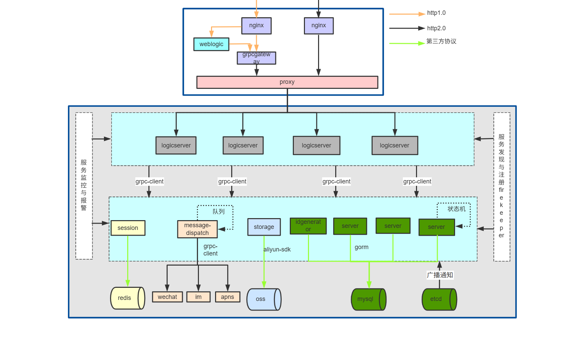

## 思维导图





这是一张**分布式微服务架构**的系统流程图，可从**分层结构、组件职责、通信方式、服务治理**四个维度详细讲解：

### 一、分层结构与核心流程

系统从顶层到底层分为 **“接入层 → 业务逻辑层 → 核心服务层 → 存储与中间件层”**，外部请求按此层级逐步处理：

1. **接入层（最上层蓝色框）**：
   负责接收不同协议的外部请求，并转发到后端业务逻辑。

   - **协议支持**：通过颜色区分请求协议（橙色`http1.0`、黑色`http2.0`、绿色 “第三方协议”）。

   - 反向代理与网关

     ：

     - `nginx`：作为反向代理，实现**负载均衡**（将请求分发到多节点）、静态资源处理、请求转发。
     - `weblogic`：遗留的 Java 应用服务器（若有旧 Java 业务）。
     - `grpcgateway`：**gRPC 网关**，将 HTTP/REST 请求转换为 gRPC 请求，让不支持 gRPC 的客户端（如前端、旧系统）也能调用 gRPC 服务。

   - **统一代理**：所有请求最终通过 `proxy` 层统一转发到业务逻辑层。

2. **业务逻辑层（浅蓝色 “logicserver” 区域）**：
   包含多个 `logicserver` 节点，是**业务逻辑的 “聚合层”**，负责接收代理层请求、组合下层核心服务完成业务逻辑。

   - 多节点部署：`logicserver` 横向扩展（多个实例），提高系统并发能力和可用性。
   - 服务调用：每个 `logicserver` 通过 `grpc-client` 调用下层的 “核心服务层”（如 `session`、`server` 等）。

3. **核心服务层（中间虚线框）**：
   由多个细粒度的微服务组成，处理具体业务能力（如会话、消息、存储、ID 生成等）。

   - `session`：**会话管理服务**，处理用户会话状态（如登录态、临时数据），依赖 `redis` 做缓存加速。
   - `message-dispatch`：**消息分发服务**，带 “队列”（异步处理），负责调用下游的 `wechat`（微信）、`im`（即时通讯）、`apns`（苹果推送）等服务，完成各类消息推送。
   - `storage`：**存储服务**，依赖 `aliyun-sdk` 对接阿里云服务（如对象存储、云数据库等）。
   - `idgenerator`：**ID 生成服务**，生成分布式唯一 ID（如订单号、用户 ID），解决分布式系统中 ID 冲突问题。
   - `server`：**业务服务节点**（多个实例），处理具体业务逻辑，依赖 `gorm`（Go 语言 ORM 框架）操作 `mysql` 数据库，还通过 `etcd` 实现 “广播通知”（分布式状态同步）。

4. **存储与中间件层（最下层）**：
   提供各类基础设施，支撑核心服务的数据存储、协作与扩展。

   - `redis`：内存数据库，为 `session` 提供**高速缓存**（如会话数据、热点数据）。
   - `wechat/im/apns`：第三方服务，由 `message-dispatch` 调用，实现微信消息、即时通讯、苹果推送。
   - `oss`（对象存储）：存储非结构化数据（如图片、视频、文件），由 `storage` 服务对接。
   - `mysql`：关系型数据库，存储**结构化业务数据**（如用户信息、订单记录），通过 `gorm` 简化数据库操作。
   - `etcd`：分布式键值存储，承担**服务发现**（微服务注册与发现）、**配置管理**、**分布式锁**等职责，支撑 `server` 的 “广播通知”（多节点状态同步）。

### 二、服务治理与辅助模块

系统两侧的模块保障微服务的稳定性与可观测性：

- **左侧 “服务监控与报警”**：监控各组件（如 `logicserver`、`server`）的运行状态（CPU、内存、请求量等），异常时触发报警。
- **右侧 “服务发现与注册 filekeeper”**：负责微服务的**注册**（服务启动时向 `etcd` 注册自身地址）与**发现**（客户端通过 `etcd` 找到服务地址），保障微服务间的动态调用。

### 三、通信方式与技术选型

- **外部通信**：支持 `http1.0`/`http2.0`/ 第三方协议，通过 `nginx` 和 `grpcgateway` 适配不同客户端。
- **内部通信**：微服务间主要用 **gRPC**（基于 HTTP/2，支持二进制传输、多路复用，性能高于传统 HTTP），体现为 `grpc-client`、`grpcgateway` 等组件。

### 四、架构特点与优势

- **分层解耦**：各层职责单一（接入、业务逻辑、核心服务、存储），便于维护和扩展。
- **微服务化**：核心服务（如 `session`、`message-dispatch`）细粒度拆分，可独立部署、扩容、迭代。
- **高可用**：多节点部署（`logicserver`、`server`）+ 负载均衡（`nginx`）+ 服务发现（`etcd`），保障系统容灾能力。
- **性能优化**：内部 gRPC 通信（高效二进制）+ 缓存（`redis`）+ 异步队列（`message-dispatch`），提升系统响应速度。

这张图展示了一个成熟的分布式系统架构，覆盖了 “请求接入→业务处理→数据存储→服务治理” 的全流程，是微服务架构在实际场景中的典型应用。


# gRPC 全面详解：原理、特性、实践与生态

gRPC 是 Google 于 2015 年开源的 **高性能、跨语言、基于 HTTP/2 的远程过程调用（RPC）框架**，核心目标是通过标准化的接口定义和高效的通信协议，简化跨服务、跨语言的通信流程，尤其适配微服务架构和分布式系统。本文从底层原理到生产实践，全面拆解 gRPC 的技术细节。

## 一、核心技术基石：从协议到序列化

gRPC 的高性能和易用性，依赖于 **HTTP/2 传输层** 和 **Protocol Buffers 序列化层** 的深度协同，二者共同构成了 gRPC 的技术底座。

### 1. 传输协议：HTTP/2 的深度定制

gRPC 并非简单使用 HTTP/2，而是对其进行了**协议语义的定制**，将 RPC 概念映射到 HTTP/2 的帧结构中，实现 “RPC 语义 + HTTP/2 性能” 的结合。

#### （1）HTTP/2 为何适合 gRPC？

HTTP/2 相比 HTTP/1.1 的核心特性，恰好解决了传统 RPC 的痛点：

- **多路复用**：单个 TCP 连接可并发传输多个 “RPC 流”（每个流对应一个 RPC 调用），通过 “流 ID” 标记帧的归属，彻底解决 HTTP/1.1 的 “队头阻塞” 问题，大幅提升连接利用率。
- **二进制帧传输**：数据以二进制帧（Frame）为单位传输，而非 HTTP/1.1 的文本格式，解析速度提升 30%+，网络传输体积更小。
- **流控机制**：支持基于窗口的流控（Window Size），客户端和服务端可动态调整接收缓冲区大小，避免过载。
- **服务端推送**：天然支持 “一请求多响应”，为 gRPC 的 “流调用” 提供底层支撑。

#### （2）gRPC 对 HTTP/2 的定制映射

gRPC 将 RPC 概念与 HTTP/2 帧结构做了严格映射，确保语义对齐：

| RPC 概念                | HTTP/2 映射实现                                              |
| ----------------------- | ------------------------------------------------------------ |
| 服务调用                | 每个 RPC 调用对应一个 HTTP/2 “流”（Stream），流 ID 唯一标识调用 |
| 请求数据                | 封装为 HTTP/2 的 `DATA` 帧，携带 Protobuf 序列化后的请求体   |
| 响应数据                | 服务端通过同一流的 `DATA` 帧返回响应（流调用则返回多个 `DATA` 帧） |
| 调用元数据              | 封装为 HTTP/2 的 `HEADERS` 帧（如认证信息、超时时间）        |
| 调用状态（成功 / 失败） | 服务端通过 `HEADERS` 帧携带 `grpc-status` 和 `grpc-message` 头字段返回状态 |

### 2. 序列化协议：Protocol Buffers（Protobuf）

Protobuf 是 Google 设计的**强类型、二进制序列化协议**，是 gRPC 的 “数据交换语言”，相比 JSON/XML 有三大核心优势：

#### （1）Protobuf 的核心特性

- **强类型与 IDL 定义**：通过 `.proto` 文件定义数据结构和接口，支持 `message`（数据结构）、`service`（服务接口）、`enum`（枚举）等语法，天然支持跨语言类型约束。

- 高效序列化

  ：

  - 二进制编码：无冗余字段名，仅存储 “字段编号 + 类型 + 值”，相同数据体积比 JSON 小 30%-50%，比 XML 小 70%+。
  - 快速解析：二进制格式无需文本解析（如 JSON 的引号、逗号处理），CPU 开销降低 10 倍以上。

- **向后兼容**：通过 “字段编号” 实现兼容性 —— 新增字段用新编号，旧版本解析时会忽略未知编号字段，无需强制升级所有服务。

#### （2）Protobuf 3 vs Protobuf 2（核心差异）

gRPC 推荐使用 **Protobuf 3**（proto3），相比旧版 proto2 更简洁、跨语言兼容性更强：

| 特性       | Protobuf 2                            | Protobuf 3                                 |
| ---------- | ------------------------------------- | ------------------------------------------ |
| 字段规则   | 支持 `required`/`optional`/`repeated` | 仅保留 `repeated`，默认字段可缺省          |
| 默认值     | 需显式定义                            | 隐式默认值（数字 0、字符串空、bool false） |
| 枚举       | 首值必须为 0                          | 首值必须为 0，支持 `option allow_alias`    |
| JSON 映射  | 不原生支持                            | 原生支持 JSON 序列化 / 反序列化            |
| 跨语言支持 | 部分语言（如 Go 支持有限）            | 全语言支持（Go/Java/Python 等均完善）      |

#### （3）.proto 文件示例（proto3）

protobuf

```protobuf
syntax = "proto3"; // 声明使用 proto3 语法
package user.v1;  // 包名，避免命名冲突（建议带版本号，如 v1）

// 导入其他 proto 文件（可选）
import "google/protobuf/timestamp.proto";

// 数据结构定义：用户信息
message User {
  string id = 1;          // 字段编号：1（不可重复，序列化用）
  string name = 2;        // 字符串类型
  int32 age = 3;          // 32位整数
  repeated string tags = 4; // 重复字段（对应数组）
  google.protobuf.Timestamp create_time = 5; // 导入的标准时间类型
}

// 服务接口定义：用户服务
service UserService {
  // 1. 一元调用：请求-响应
  rpc GetUser(GetUserRequest) returns (GetUserResponse);
  
  // 2. 服务器流调用：一请求多响应
  rpc ListUserStream(ListUserRequest) returns (stream User);
  
  // 3. 客户端流调用：多请求一响应
  rpc BatchCreateUser(stream CreateUserRequest) returns (BatchCreateUserResponse);
  
  // 4. 双向流调用：双向并发流
  rpc Chat(stream ChatRequest) returns (stream ChatResponse);
}

// GetUser 请求体
message GetUserRequest {
  string user_id = 1;
}

// GetUser 响应体
message GetUserResponse {
  User user = 1;
  string message = 2;
}

// 其他请求/响应体省略...
```

## 二、gRPC 核心特性：从调用模式到扩展能力

### 1. 四种服务调用模式（全覆盖 RPC 场景）

gRPC 支持四种调用模式，覆盖从简单请求到复杂流传输的所有场景，且均基于 HTTP/2 流实现：

#### （1）Unary Call（一元调用）

- **定义**：最基础的 “请求 - 响应” 模式，客户端发一个请求，服务端返回一个响应，类似 HTTP 的 GET/POST。

- **适用场景**：简单查询、数据提交（如 “根据 ID 获取用户信息”“创建订单”）。

- 实现示例

  ：

  - 服务端（Go）：实现

     

    ```
    GetUser
    ```

     

    方法，接收

     

    ```
    GetUserRequest
    ```

    ，返回

     

    ```
    GetUserResponse
    ```

    。

    go

    

    运行

    

    

    

    

    ```go
    func (s *userServer) GetUser(ctx context.Context, req *pb.GetUserRequest) (*pb.GetUserResponse, error) {
      // 业务逻辑：根据 user_id 查询数据库
      user := &pb.User{
        Id:         req.UserId,
        Name:       "张三",
        Age:        25,
        CreateTime: timestamppb.Now(),
      }
      return &pb.GetUserResponse{User: user, Message: "success"}, nil
    }
    ```

  - 客户端（Go）：通过生成的 Stub 调用

     

    ```
    GetUser
    ```

    ，同步获取响应。

    go

    

    运行

    

    

    

    

    ```go
    ctx, cancel := context.WithTimeout(context.Background(), 5*time.Second)
    defer cancel()
    resp, err := client.GetUser(ctx, &pb.GetUserRequest{UserId: "123"})
    if err != nil {
      log.Fatalf("调用失败：%v", err)
    }
    fmt.Printf("用户信息：%v", resp.User)
    ```

#### （2）Server Streaming（服务器流调用）

- **定义**：客户端发一个请求，服务端返回**多个连续响应**（通过 “流” 持续推送），客户端读取流直到结束。

- **适用场景**：实时日志推送、监控指标上报、大数据分页返回（如 “获取用户所有订单日志”）。

- 关键标识

  ：

  ```
  .proto
  ```

   

  中响应类型前加

   

  ```
  stream
  ```

  ：

  protobuf

  

  

  

  

  

  ```protobuf
  rpc ListUserStream(ListUserRequest) returns (stream User);
  ```

- 服务端实现

  ：循环调用

   

  ```
  Send
  ```

   

  方法推送响应，最后

   

  ```
  CloseAndRecv
  ```

   

  结束流。

  go

  

  运行

  

  

  

  

  ```go
  func (s *userServer) ListUserStream(req *pb.ListUserRequest, stream pb.UserService_ListUserStreamServer) error {
    // 模拟分页返回用户列表
    users := []*pb.User{/* 模拟数据 */}
    for _, user := range users {
      if err := stream.Send(user); err != nil {
        return err
      }
      time.Sleep(500 * time.Millisecond) // 模拟实时推送间隔
    }
    return nil // 流结束
  }
  ```

#### （3）Client Streaming（客户端流调用）

- **定义**：客户端发**多个连续请求**（通过流推送），服务端接收完所有请求后，返回一个响应。

- **适用场景**：大文件分块上传、批量数据提交（如 “批量创建 1000 个用户”）。

- 关键标识

  ：

  ```
  .proto
  ```

   

  中请求类型前加

   

  ```
  stream
  ```

  ：

  protobuf

  

  

  

  

  

  ```protobuf
  rpc BatchCreateUser(stream CreateUserRequest) returns (BatchCreateUserResponse);
  ```

- 客户端实现

  ：循环调用

   

  ```
  Send
  ```

   

  推送请求，最后

   

  ```
  CloseAndRecv
  ```

   

  获取响应。

  go

  

  运行

  

  

  

  

  ```go
  stream, err := client.BatchCreateUser(ctx)
  if err != nil {
    log.Fatalf("创建流失败：%v", err)
  }
  // 批量发送 3 个请求
  for i := 0; i < 3; i++ {
    req := &pb.CreateUserRequest{/* 模拟数据 */}
    if err := stream.Send(req); err != nil {
      log.Fatalf("发送请求失败：%v", err)
    }
  }
  // 关闭流并获取响应
  resp, err := stream.CloseAndRecv()
  fmt.Printf("批量创建结果：%v", resp)
  ```

#### （4）Bidirectional Streaming（双向流调用）

- **定义**：客户端和服务端可**同时双向发送流数据**，流的发送和接收相互独立，无需等待对方响应。

- **适用场景**：实时聊天、视频通话信令交互、游戏同步（如 “用户 A 和 B 实时聊天”）。

- 关键标识

  ：请求和响应类型前均加

   

  ```
  stream
  ```

  ：

  protobuf

  

  

  

  

  

  ```protobuf
  rpc Chat(stream ChatRequest) returns (stream ChatResponse);
  ```

- **实现特点**：客户端和服务端均需启动 Goroutine（或线程）分别处理 “发送” 和 “接收”，实现并发流交互。

### 2. 代码自动生成：从 IDL 到可执行代码

gRPC 的核心优势之一是 **“一次定义，多语言生成”**，通过 `protoc` 编译器和语言专属插件，自动生成服务端接口和客户端 Stub，开发者无需手动编写序列化、网络通信代码。

#### （1）生成流程

1. 安装工具

   ：

   - 安装 `protoc` 编译器（负责解析 `.proto` 文件）。
   - 安装对应语言的 gRPC 插件（如 Go 需 `protoc-gen-go` 和 `protoc-gen-go-grpc`）。

2. 执行生成命令

   （以 Go 为例）：

   bash

   ```bash
   # --go_out：生成 Protobuf 数据结构代码
   # --go-grpc_out：生成 gRPC 服务端/客户端代码
   # --proto_path：指定 .proto 文件所在目录
   protoc --go_out=. --go_opt=paths=source_relative \
     --go-grpc_out=. --go-grpc_opt=paths=source_relative \
     --proto_path=./proto ./proto/user/v1/user.proto
   ```

3. 生成文件

   ：

   - `user.pb.go`：Protobuf 数据结构的序列化 / 反序列化代码（如 `User`、`GetUserRequest` 的 `Marshal`/`Unmarshal` 方法）。
   - `user_grpc.pb.go`：gRPC 服务端接口（如 `UserServiceServer`）和客户端 Stub（如 `UserServiceClient`）。

#### （2）服务端与客户端的代码依赖

- 服务端：实现生成的 `XXXServer` 接口（如 `UserServiceServer`），编写业务逻辑。
- 客户端：通过生成的 `NewXXXClient` 函数创建客户端（如 `NewUserServiceClient`），调用 Stub 方法发起 RPC。

### 3. 进阶特性：支撑生产环境的核心能力

#### （1）元数据（Metadata）

- **定义**：类似 HTTP 的 Header，用于传递 RPC 调用的 “附加信息”（如认证 Token、请求 ID、超时时间），不包含在 Protobuf 数据结构中。

- **使用场景**：身份认证、链路追踪、灰度发布标记。

- 示例（Go 客户端传递 Token）

  ：

  go

  

  运行

  

  

  

  

  ```go
  // 创建元数据
  md := metadata.New(map[string]string{"token": "user-jwt-token-123"})
  // 将元数据注入上下文
  ctx := metadata.NewOutgoingContext(context.Background(), md)
  // 发起 RPC 调用（元数据会自动传递）
  resp, err := client.GetUser(ctx, &pb.GetUserRequest{UserId: "123"})
  ```

- 服务端获取元数据

  ：

  go

  

  运行

  

  

  

  

  ```go
  func (s *userServer) GetUser(ctx context.Context, req *pb.GetUserRequest) (*pb.GetUserResponse, error) {
    // 从上下文获取元数据
    md, ok := metadata.FromIncomingContext(ctx)
    if !ok {
      return nil, status.Errorf(codes.Unauthenticated, "未获取到元数据")
    }
    // 获取 Token
    tokens := md.Get("token")
    if len(tokens) == 0 {
      return nil, status.Errorf(codes.Unauthenticated, "Token 缺失")
    }
    // 验证 Token...
    return &pb.GetUserResponse{}, nil
  }
  ```

#### （2）拦截器（Interceptor）

- **定义**：类似中间件，在 RPC 调用的 “预处理” 和 “后处理” 阶段插入自定义逻辑，支持统一管控。

- 分类

  ：

  - 按调用方向：服务端拦截器（处理请求）、客户端拦截器（处理发送）。
  - 按调用模式：一元拦截器（处理 Unary 调用）、流拦截器（处理 Stream 调用）。

- **适用场景**：日志打印、性能监控、身份认证、限流熔断。

- 示例（Go 服务端日志拦截器）

  ：

  go

  

  运行

  

  

  

  

  ```go
  // 定义拦截器
  func loggingInterceptor(ctx context.Context, req interface{}, info *grpc.UnaryServerInfo, handler grpc.UnaryHandler) (interface{}, error) {
    start := time.Now()
    // 预处理：打印请求信息
    log.Printf("收到 RPC 请求：%s，请求体：%v", info.FullMethod, req)
    // 调用实际业务逻辑
    resp, err := handler(ctx, req)
    // 后处理：打印响应耗时
    log.Printf("RPC 响应：%s，耗时：%v，错误：%v", info.FullMethod, time.Since(start), err)
    return resp, err
  }
  
  // 注册拦截器
  s := grpc.NewServer(
    grpc.UnaryInterceptor(loggingInterceptor),
  )
  pb.RegisterUserServiceServer(s, &userServer{})
  ```

#### （3）错误处理：标准化状态码

gRPC 定义了 **标准化的错误状态码**（基于 `google.golang.org/grpc/codes`），替代 HTTP 状态码，更贴合 RPC 场景：

| 状态码（Code）     | 含义       | 适用场景                               |
| ------------------ | ---------- | -------------------------------------- |
| `OK`               | 成功       | 调用正常返回                           |
| `Canceled`         | 请求被取消 | 客户端主动取消调用（如上下文超时）     |
| `NotFound`         | 资源未找到 | 查询的用户 / 订单不存在                |
| `Unauthenticated`  | 未认证     | Token 无效、缺失认证信息               |
| `PermissionDenied` | 权限不足   | 普通用户调用管理员接口                 |
| `DeadlineExceeded` | 超时       | 调用超过上下文设置的超时时间           |
| `Unimplemented`    | 方法未实现 | 服务端未实现 `.proto` 中定义的接口方法 |

- 服务端返回错误示例

  ：

  go

  

  运行

  

  

  

  

  ```go
  import "google.golang.org/grpc/status"
  
  func (s *userServer) GetUser(ctx context.Context, req *pb.GetUserRequest) (*pb.GetUserResponse, error) {
    if req.UserId == "" {
      // 构造错误：参数无效
      st := status.New(codes.InvalidArgument, "用户 ID 不能为空")
      // 附加详细错误信息（可选）
      det, _ := st.WithDetails(&pb.ErrorDetail{Code: 1001, Msg: "userId 字段为必填项"})
      return nil, det.Err()
    }
    // ...
  }
  ```

#### （4）TLS 加密与身份认证

gRPC 支持 **TLS 加密传输**，确保数据在网络中不被窃听或篡改，同时支持基于证书的身份认证。

- 服务端配置 TLS

  ：

  go

  

  运行

  

  

  

  

  ```go
  // 加载证书和密钥（服务端证书、私钥）
  creds, err := credentials.NewServerTLSFromFile("server.crt", "server.key")
  if err != nil {
    log.Fatalf("加载证书失败：%v", err)
  }
  // 创建带 TLS 的 gRPC 服务
  s := grpc.NewServer(grpc.Creds(creds))
  ```

- 客户端配置 TLS

  ：

  go

  

  运行

  

  

  

  

  ```go
  // 加载 CA 证书（验证服务端证书）
  creds, err := credentials.NewClientTLSFromFile("ca.crt", "localhost")
  if err != nil {
    log.Fatalf("加载 CA 证书失败：%v", err)
  }
  // 创建带 TLS 的客户端连接
  conn, err := grpc.Dial("localhost:50051", grpc.WithTransportCredentials(creds))
  ```

## 三、gRPC 实践指南：从开发到生产

### 1. 开发流程规范

#### （1）.proto 文件设计规范

- **版本化**：包名带版本号（如 `user.v1`），便于接口迭代（v1→v2 兼容旧版本）。

- **字段编号**：预留编号（如 1-10 用于核心字段，11-20 预留扩展），避免删除字段（标记为 `reserved` 而非删除）。

- 类型选择

  ：

  - 整数用 `int32`/`int64`（避免 `uint`，跨语言兼容性差）。
  - 字符串长度超过 1KB 时，考虑用 `bytes`（二进制数据）。
  - 枚举首值必须为 0，避免默认值异常。

#### （2）服务命名与方法命名

- 服务名：采用 “业务领域 + Service”（如 `UserService`、`OrderService`）。
- 方法名：采用动词 + 名词（如 `GetUser`、`CreateOrder`），统一大小写风格（驼峰式）。

#### （3）超时控制

- 所有 RPC 调用必须设置超时（通过 `context.WithTimeout`），避免请求阻塞导致资源泄漏。
- 超时时间根据业务场景设置（如简单查询 1-3 秒，流调用 30-60 秒）。

### 2. 调试与监控工具

#### （1）调试工具

- **BloomRPC**：可视化 gRPC 客户端，支持加载 `.proto` 文件，手动发起 RPC 调用，查看请求 / 响应详情。

- grpcurl

  ：命令行工具，支持通过命令行调用 gRPC 服务（类似

   

  ```
  curl
  ```

   

  用于 REST）：

  bash

  

  

  

  

  

  ```bash
  # 列出服务端所有服务
  grpcurl -plaintext localhost:50051 list
  # 调用 GetUser 方法
  grpcurl -plaintext -d '{"user_id": "123"}' localhost:50051 user.v1.UserService/GetUser
  ```

- **gRPC UI**：Web 版 gRPC 调试工具，支持可视化流调用。

#### （2）监控与追踪

- **Prometheus + Grafana**：通过 gRPC 官方监控插件（如 `github.com/grpc-ecosystem/go-grpc-prometheus`）收集指标（调用次数、耗时、错误率），Grafana 可视化展示。
- **Jaeger/Zipkin**：分布式追踪工具，通过拦截器注入追踪 ID，串联跨服务的 RPC 调用链路，定位性能瓶颈。

### 3. 生产环境部署考量

#### （1）负载均衡与服务发现

gRPC 客户端默认不支持负载均衡，需结合服务发现组件实现：

- **方案 1**：使用 gRPC 官方负载均衡插件（如 `google.golang.org/grpc/balancer`），结合 Consul/Eureka/Nacos 实现服务发现。

- 方案 2

  ：通过反向代理（如 Nginx 1.13+、Envoy）转发请求，Nginx 配置示例：

  nginx

  

  

  

  

  

  ```nginx
  http {
    upstream grpc_servers {
      server server1:50051;
      server server2:50051;
      server server3:50051;
    }
  
    server {
      listen 50051 http2; # 必须指定 http2
      location / {
        grpc_pass grpc://grpc_servers;
      }
    }
  }
  ```

#### （2）连接池管理

- 客户端避免频繁创建 / 关闭连接，使用连接池复用 TCP 连接（如 Go 中 `grpc.Dial` 创建的 `ClientConn` 是线程安全的，可全局复用）。
- 服务端设置合理的最大连接数和流数，避免过载（通过 `grpc.MaxConcurrentStreams` 配置）。

#### （3）熔断与限流

- 结合熔断器（如 `github.com/afex/hystrix-go`），当服务端错误率超过阈值时，触发熔断，避免级联故障。
- 通过拦截器实现限流（如基于令牌桶算法），限制单客户端的调用频率。

## 四、gRPC 生态与扩展

### 1. 关键扩展框架

#### （1）gRPC-Web

- **问题**：浏览器原生不支持 HTTP/2 的 gRPC 协议（无法解析 Protobuf 和 gRPC 语义）。
- **解决方案**：gRPC-Web 是浏览器端的 gRPC 客户端，通过 “代理层”（如 Envoy、gRPC-Web Proxy）将浏览器的 gRPC-Web 请求转换为标准 gRPC 请求，实现 “浏览器→服务端” 的 gRPC 通信。

#### （2）gRPC-Gateway

- **问题**：部分场景需要同时支持 gRPC 和 REST API（如前端用 REST，后端服务用 gRPC）。
- **解决方案**：gRPC-Gateway 是 Protobuf 插件，可根据 `.proto` 文件自动生成 REST API 网关，将 REST 请求转换为 gRPC 调用，实现 “一套接口，两种协议”。

#### （3）Istio 集成

- Istio 是服务网格框架，内置对 gRPC 的支持：
  - 自动实现负载均衡、熔断、限流、TLS 加密。
  - 通过 Envoy 代理拦截 gRPC 流量，实现灰度发布、流量镜像。

### 2. gRPC vs 其他 RPC/API 方案

| 方案     | 传输协议 | 序列化协议 | 跨语言          | 性能 | 适用场景                               |
| -------- | -------- | ---------- | --------------- | ---- | -------------------------------------- |
| gRPC     | HTTP/2   | Protobuf   | 优              | 高   | 微服务内部通信、跨语言调用、流传输场景 |
| REST API | HTTP/1.1 | JSON       | 优              | 中   | 浏览器访问、公开 API、简单接口         |
| Thrift   | 自定义   | Thrift     | 优              | 高   | 内部服务调用（如 Apache 生态）         |
| Dubbo    | TCP      | Hessian2   | 差（Java 为主） | 高   | Java 微服务生态                        |
| GraphQL  | HTTP/1.1 | JSON       | 优              | 中   | 前端灵活获取数据（减少过度请求）       |

- **结论**：gRPC 在 “跨语言、高性能、流传输” 场景下最优，是微服务内部通信的首选；REST 适合浏览器访问和公开 API；GraphQL 适合前端需要灵活数据查询的场景。

## 五、总结

gRPC 的核心价值是 **“用标准化的方式解决跨服务通信的复杂性”**：

- 底层依赖 HTTP/2 实现高效传输，解决传统 RPC 的连接复用和队头阻塞问题；
- 基于 Protobuf 实现强类型接口定义和高效序列化，确保跨语言兼容性和性能；
- 四种调用模式覆盖所有 RPC 场景，配合拦截器、元数据、TLS 等特性，支撑生产环境需求；
- 丰富的生态工具（gRPC-Web、gRPC-Gateway、Istio）扩展了适用场景，从后端服务到前端访问全覆盖。

对于微服务架构、分布式系统，gRPC 是提升跨服务通信效率和开发体验的最佳选择之一，尤其适合需要跨语言协作、高性能传输或流数据交互的场景。


# 问答

# gRPC 八股文 + 场景题（含答案）

## 一、八股文题（10 道，难度递增）

### 1. 基础题：gRPC 的定义是什么？其核心技术基石有哪些？

**答案**：
gRPC 是 Google 开源的**高性能、跨语言、基于 HTTP/2 的远程过程调用（RPC）框架**，核心是通过标准化接口定义和高效通信协议，简化跨服务、跨语言的通信。
核心技术基石有两个：

- **传输层**：基于 HTTP/2，利用多路复用、二进制帧、流控等特性实现高效传输；
- **序列化层**：基于 Protocol Buffers（Protobuf），实现强类型、轻量、高效的结构化数据序列化。

### 2. 基础题：HTTP/2 为 gRPC 提供了哪些关键特性支撑？

**答案**：
HTTP/2 解决了传统 HTTP/1.1 的痛点，为 gRPC 的高性能提供核心支撑：

1. **多路复用**：单个 TCP 连接可并发传输多个 “RPC 流”（每个流对应一个 RPC 调用），通过流 ID 标记帧归属，避免队头阻塞；
2. **二进制帧传输**：数据以二进制帧为单位传输，比 HTTP/1.1 的文本格式解析更快、体积更小；
3. **流控机制**：基于窗口的流控（Window Size），客户端 / 服务端可动态调整接收缓冲区，避免过载；
4. **服务端推送**：天然支持 “一请求多响应”，为 gRPC 的 “服务器流调用” 提供底层能力。

### 3. 中等题：Protobuf 相比 JSON 有哪些优势？为什么 gRPC 选择 Protobuf 作为序列化协议？

**答案**：
Protobuf 相比 JSON 的核心优势：

1. **体积更小**：二进制编码，仅存储 “字段编号 + 类型 + 值”，无冗余字段名，相同数据比 JSON 小 30%-50%；
2. **解析更快**：二进制格式无需文本解析（如 JSON 的引号、逗号处理），CPU 开销降低 10 倍以上；
3. **强类型约束**：通过 `.proto` 文件定义数据结构，编译期检查类型，避免运行时类型错误；
4. **向后兼容**：基于字段编号实现兼容性，新增字段用新编号，旧版本忽略未知字段，无需强制升级。

gRPC 选择 Protobuf 的原因：适配跨语言、高性能的 RPC 需求 —— 强类型确保跨语言接口一致性，小体积 + 快解析降低网络传输和 CPU 开销，契合 gRPC 对性能的追求。

### 4. 中等题：gRPC 支持哪四种调用模式？分别说明定义和适用场景。

**答案**：
gRPC 基于 HTTP/2 流实现四种调用模式，覆盖所有 RPC 场景：

1. **Unary Call（一元调用）**：客户端发 1 个请求，服务端返 1 个响应；适用简单查询 / 提交（如 “根据 ID 获取用户”）。
2. **Server Streaming（服务器流调用）**：客户端发 1 个请求，服务端返多个连续响应；适用实时日志推送、大数据分页（如 “获取用户所有订单日志”）。
3. **Client Streaming（客户端流调用）**：客户端发多个连续请求，服务端返 1 个响应；适用大文件分块上传、批量提交（如 “批量创建 1000 个用户”）。
4. **Bidirectional Streaming（双向流调用）**：客户端和服务端可同时双向发流数据；适用实时聊天、游戏同步（如 “用户 A/B 实时对话”）。

### 5. 中等偏难题：gRPC 的元数据（Metadata）是什么？有哪些使用场景？如何在代码中传递和获取？

**答案**：
gRPC 的元数据是类似 HTTP Header 的 “附加信息载体”，用于传递 RPC 调用的非业务数据（不包含在 Protobuf 结构体中），以键值对形式存在。

**使用场景**：身份认证（Token）、链路追踪（请求 ID）、灰度发布标记、日志上下文传递。

**代码示例（Go）**：

- 客户端传递元数据：

  go

  ```go
  // 创建元数据（Token+请求ID）
  md := metadata.New(map[string]string{"token": "jwt-123", "request-id": "req-456"})
  // 注入上下文
  ctx := metadata.NewOutgoingContext(context.Background(), md)
  // 发起 RPC 调用（元数据自动传递）
  resp, _ := client.GetUser(ctx, &pb.GetUserRequest{UserId: "123"})
  ```

- 服务端获取元数据：

  go

  ```go
  func (s *userServer) GetUser(ctx context.Context, req *pb.GetUserRequest) (*pb.GetUserResponse, error) {
    // 从上下文提取元数据
    md, ok := metadata.FromIncomingContext(ctx)
    if !ok {
      return nil, status.Errorf(codes.Unauthenticated, "元数据缺失")
    }
    // 获取 Token 和请求 ID
    tokens := md.Get("token")
    reqIDs := md.Get("request-id")
    log.Printf("请求 ID：%s，Token：%s", reqIDs[0], tokens[0])
    // 业务逻辑...
  }
  ```

### 6. 中等偏难题：gRPC 拦截器（Interceptor）的分类有哪些？如何实现一个服务端日志拦截器？

**答案**：
gRPC 拦截器类似中间件，在 RPC 调用的 “预处理 / 后处理” 阶段插入逻辑，分类如下：

- 按调用方向：**服务端拦截器**（处理请求）、**客户端拦截器**（处理发送）；
- 按调用模式：**一元拦截器**（处理 Unary 调用）、**流拦截器**（处理 Stream 调用）。

**服务端日志拦截器实现（Go）**：

go

```go
// 1. 定义拦截器函数（参数需符合 grpc.UnaryServerInterceptor 签名）
func loggingUnaryInterceptor(
  ctx context.Context,
  req interface{},
  info *grpc.UnaryServerInfo,
  handler grpc.UnaryHandler,
) (interface{}, error) {
  // 预处理：打印请求信息
  start := time.Now()
  log.Printf("[RPC 请求] 方法：%s，请求体：%v", info.FullMethod, req)
  
  // 调用实际业务逻辑
  resp, err := handler(ctx, req)
  
  // 后处理：打印响应耗时和错误
  log.Printf("[RPC 响应] 方法：%s，耗时：%v，错误：%v", info.FullMethod, time.Since(start), err)
  return resp, err
}

// 2. 注册拦截器到 gRPC 服务
func main() {
  s := grpc.NewServer(
    grpc.UnaryInterceptor(loggingUnaryInterceptor), // 注册一元拦截器
  )
  pb.RegisterUserServiceServer(s, &userServer{})
  s.Serve(lis)
}
```

### 7. 较难题：gRPC 的错误处理机制是什么？如何自定义错误并传递详细信息？

**答案**：
gRPC 摒弃 HTTP 状态码，定义了**标准化的错误状态码（codes）**，基于 `google.golang.org/grpc/status` 包实现错误构造和传递，核心包含：

- **错误状态码**：如 `OK`（成功）、`NotFound`（资源不存在）、`Unauthenticated`（未认证）、`DeadlineExceeded`（超时）等；
- **错误消息**：描述错误原因；
- **详细信息（Details）**：可选，传递结构化错误数据（如自定义错误码、字段校验失败信息）。

**自定义错误示例（Go）**：

- 服务端构造自定义错误：

  go

  

  运行

  

  

  

  

  ```go
  import (
    "google.golang.org/grpc/codes"
    "google.golang.org/grpc/status"
  )
  
  func (s *userServer) GetUser(ctx context.Context, req *pb.GetUserRequest) (*pb.GetUserResponse, error) {
    // 1. 校验参数
    if req.UserId == "" {
      // 2. 构造基础错误（状态码+消息）
      baseErr := status.New(codes.InvalidArgument, "用户ID不能为空")
      // 3. 附加详细信息（自定义 ErrorDetail 结构体）
      detail := &pb.ErrorDetail{
        Code: 1001,       // 自定义错误码
        Msg:  "userId字段为必填项", // 详细描述
        Field: "user_id", // 错误字段
      }
      // 4. 关联详细信息到错误
      errWithDetail, _ := baseErr.WithDetails(detail)
      return nil, errWithDetail.Err()
    }
    // 业务逻辑...
  }
  ```

- 客户端解析错误：

  go

  

  运行

  

  

  

  

  ```go
  resp, err := client.GetUser(ctx, &pb.GetUserRequest{UserId: ""})
  if err != nil {
    // 解析错误状态
    st, ok := status.FromError(err)
    if !ok {
      log.Fatalf("未知错误：%v", err)
    }
    log.Printf("错误码：%v，错误消息：%v", st.Code(), st.Message())
    
    // 解析详细信息
    for _, detail := range st.Details() {
      if d, ok := detail.(*pb.ErrorDetail); ok {
        log.Printf("自定义错误码：%d，错误字段：%s", d.Code, d.Field)
      }
    }
  }
  ```

### 8. 较难题：gRPC-Web 和 gRPC-Gateway 分别解决什么问题？简述其工作原理。

**答案**：
两者均为 gRPC 的生态扩展，解决 gRPC 的场景局限性：

#### （1）gRPC-Web：解决 “浏览器无法直接访问 gRPC 服务” 的问题

- 痛点：浏览器原生不支持 gRPC 的 HTTP/2 + Protobuf 协议（无法解析 gRPC 语义）；
- 原理：
  1. 浏览器端使用 gRPC-Web 客户端（JS/TS 库），发送符合 gRPC-Web 规范的请求；
  2. 通过 “代理层”（如 Envoy、gRPC-Web Proxy）将 gRPC-Web 请求转换为标准 gRPC 请求，转发给服务端；
  3. 服务端返回的 gRPC 响应经代理转换为 gRPC-Web 响应，回传给浏览器。

#### （2）gRPC-Gateway：解决 “gRPC 服务同时支持 REST API” 的问题

- 痛点：部分场景需同时支持 gRPC（服务间通信）和 REST（前端 / 第三方访问），避免重复开发接口；
- 原理：
  1. 在 `.proto` 文件中通过注解（如 `option (google.api.http) = { get: "/v1/users/{user_id}" }`）定义 REST 映射规则；
  2. 使用 `protoc` 插件 `protoc-gen-grpc-gateway` 生成 REST 网关代码；
  3. 启动网关服务，将 REST 请求（如 GET /v1/users/123）转换为 gRPC 调用，转发给 gRPC 服务，再将响应转换为 JSON 返回。

### 9. 难题：gRPC 的负载均衡如何实现？生产环境中常用的方案有哪些？

**答案**：
gRPC 客户端默认不支持负载均衡（仅随机选择一个后端），需结合 “服务发现 + 负载均衡策略” 实现，生产中常用两种方案：

#### 方案 1：客户端负载均衡（基于 gRPC 官方 Balancer）

- 原理：客户端通过服务发现组件（如 Consul、Nacos、Eureka）获取后端服务列表，本地实现负载均衡策略（如轮询、加权轮询），直接调用后端。

- 实现步骤（Go）：

  1. 集成服务发现客户端（如 Consul SDK），定时拉取服务列表；

  2. 实现 `grpc.Balancer` 接口，自定义负载均衡策略（如轮询）；

  3. 客户端拨号时指定负载均衡器：

     go

     

     运行

     

     

     

     

     ```go
     conn, err := grpc.Dial(
       "consul://localhost:8500/user-service", // 服务发现地址
       grpc.WithDefaultServiceConfig(`{"loadBalancingConfig": [{"round_robin":{}}]}`), // 轮询策略
       grpc.WithTransportCredentials(insecure.NewCredentials()),
     )
     ```

#### 方案 2：反向代理负载均衡（基于 Envoy/Nginx）

- 原理：客户端不直接调用后端，而是调用反向代理（如 Envoy），代理通过服务发现获取后端列表，实现负载均衡后转发请求。

- 优势：无需客户端改造，支持更丰富的治理能力（熔断、限流、TLS 终止）；

- Nginx 配置示例：

  nginx

  

  

  

  

  

  ```nginx
  http {
    upstream grpc_backends {
      server user-service-1:50051 weight=5; # 加权轮询
      server user-service-2:50051 weight=3;
    }
  
    server {
      listen 50051 http2; # 必须指定 http2（gRPC 基于 HTTP/2）
      location / {
        grpc_pass grpc://grpc_backends; # 转发 gRPC 请求
      }
    }
  }
  ```

### 10. 难题：gRPC 的流调用相比传统 HTTP 长轮询，有哪些技术优势？

**答案**：
传统 HTTP 长轮询是 “客户端发起请求→服务端 hold 住连接→有数据时返回→客户端立即重连”，而 gRPC 流调用基于 HTTP/2 双向流，优势如下：

1. **连接利用率更高**：长轮询需频繁建连 / 断连（每次响应后需重连），gRPC 流调用复用单个 TCP 连接，避免三次握手 / 四次挥手开销；
2. **实时性更强**：长轮询存在 “响应后重连” 的间隙延迟，gRPC 流调用可实时推送数据，延迟降低 50%+；
3. **带宽开销更低**：长轮询每次请求需携带完整 HTTP 头部，gRPC 流调用仅首次携带头部，后续数据仅传二进制帧，带宽节省 30%+；
4. **流控更精细**：gRPC 基于 HTTP/2 流控机制，客户端 / 服务端可动态调整接收窗口，避免长轮询中 “服务端盲目推送导致客户端过载” 的问题；
5. **双向通信更灵活**：长轮询仅支持 “客户端请求→服务端响应” 的单向流，gRPC 双向流支持客户端和服务端同时发送数据，适配实时聊天等场景。


## 二、场景题（5 道，贴近生产实践）

### 场景题 1：跨语言调用场景

**问题**：假设你负责的 Go 语言 gRPC 服务（UserService）需要被 Java 语言的订单服务调用，实现 “创建订单时查询用户信息” 的功能，你需要做哪些工作？
**答案**：
核心是 “基于 IDL 实现跨语言代码生成”，步骤如下：

1. **定义统一 IDL**：编写 `.proto` 文件，定义 `UserService` 的 `GetUser` 方法和数据结构（如 `GetUserRequest`/`GetUserResponse`），确保字段类型和编号清晰；

2. 生成多语言代码

   ：

   - Go 端：用 `protoc`+`protoc-gen-go`/`protoc-gen-go-grpc` 生成服务端接口和客户端代码，实现 `GetUser` 业务逻辑；
   - Java 端：用 `protoc`+`protoc-gen-grpc-java` 生成客户端 Stub 代码（需引入 `io.grpc:grpc-netty-shaded` 等依赖）；

3. **服务端启动与暴露**：Go 服务端启动 gRPC 服务，配置 TLS（可选），确保端口可被 Java 服务访问；

4. Java 客户端调用

   ：

   - Java 客户端通过 `ManagedChannel` 创建连接，指定 Go 服务端地址；
   - 通过生成的 `UserServiceStub` 调用 `getUser` 方法，传递 `userId` 参数，获取用户信息；

5. **联调与监控**：使用 BloomRPC 验证服务可用性，集成链路追踪（如 Jaeger），确保跨语言调用链路可追踪。

### 场景题 2：浏览器访问场景

**问题**：前端团队需要通过浏览器调用你的 gRPC 服务（ProductService）的 `ListProducts` 接口（服务器流调用，实时推送商品列表），但浏览器不支持原生 gRPC，如何解决？
**答案**：
采用 “gRPC-Web + Envoy 代理” 方案，架构如下：

1. **改造 .proto 文件**：添加 gRPC-Web 注解（如 `option (grpc.gateway.protoc_gen_grpc_web.options) = { web.enable: true };`）；

2. 生成 gRPC-Web 代码

   ：

   - 用 `protoc-gen-grpc-web` 生成前端 JS/TS 客户端代码；
   - 前端引入 `grpc-web` 库，使用生成的客户端 Stub；

3. 部署 Envoy 代理

   ：

   - 配置 Envoy 作为反向代理，监听前端请求端口（如 8080）；

   - 配置 Envoy 的 gRPC-Web 过滤器，将前端 gRPC-Web 请求转换为标准 gRPC 请求，转发给后端 gRPC 服务（如 50051 端口）；

   - 示例 Envoy 配置核心片段：

     yaml

     

     

     

     

     

     ```yaml
     listeners:
     - address: { socket_address: { address: 0.0.0.0, port_value: 8080 } }
       filter_chains:
       - filters:
         - name: envoy.filters.network.http_connection_manager
           config:
             route_config:
               virtual_hosts:
               - name: product_service
                 domains: ["*"]
                 routes:
                 - match: { prefix: "/product.v1.ProductService" }
                   route: { cluster: product_service_cluster }
             http_filters:
             - name: envoy.filters.http.grpc_web # gRPC-Web 过滤器
             - name: envoy.filters.http.router
     clusters:
     - name: product_service_cluster
       type: STRICT_DNS
       load_assignment:
         cluster_name: product_service_cluster
         endpoints:
         - lb_endpoints:
           - endpoint: { address: { socket_address: { address: product-service, port_value: 50051 } } }
     ```

4. **前端调用**：前端通过生成的 gRPC-Web 客户端，调用 `listProducts` 流方法，监听服务端推送的商品数据；

5. **跨域配置**：在 Envoy 中配置 CORS 策略，允许前端域名访问，避免跨域问题。

### 场景题 3：微服务链路追踪场景

**问题**：公司微服务架构中，A 服务（Go）通过 gRPC 调用 B 服务（Java），B 服务再调用 C 服务（Go），如何实现全链路追踪，定位 A→B→C 调用中的性能瓶颈？
**答案**：
基于 “OpenTelemetry + Jaeger” 实现全链路追踪，步骤如下：

1. 集成 OpenTelemetry SDK

   ：

   - 三个服务均引入对应语言的 OpenTelemetry SDK（Go：`go.opentelemetry.io/otel`；Java：`io.opentelemetry:opentelemetry-sdk`）；
   - 配置 Jaeger exporter，指定 Jaeger 服务器地址；

2. gRPC 拦截器注入追踪上下文

   ：

   - 每个服务的 gRPC 拦截器中，通过 OpenTelemetry 生成 `trace_id` 和 `span_id`；

   - 将 `trace_id`/`span_id` 注入 gRPC 元数据（Metadata），随调用传递；

   - 示例 Go 拦截器核心逻辑：

     go

     

     运行

     

     

     

     

     ```go
     func traceInterceptor(ctx context.Context, req interface{}, info *grpc.UnaryServerInfo, handler grpc.UnaryHandler) (interface{}, error) {
       // 从元数据提取或生成 trace 上下文
       ctx, span := otel.Tracer("user-service").Start(ctx, info.FullMethod)
       defer span.End()
       // 将 trace 信息注入响应元数据（可选）
       return handler(ctx, req)
     }
     ```

3. **启动 Jaeger 服务器**：部署 Jaeger 收集器和 UI，接收各服务的追踪数据；

4. 查看链路追踪

   ：

   - 发起 A 服务调用后，在 Jaeger UI 中通过

      

     ```
     trace_id
     ```

      

     查看全链路：

     - 每个 gRPC 调用对应一个 `span`，包含调用耗时、服务名称、方法名；
     - 若 B→C 调用耗时过长，可定位到 C 服务的 `ListProducts` 方法存在性能瓶颈（如数据库查询慢）；

5. **性能优化**：基于 Jaeger 展示的耗时分布，优化 C 服务的数据库索引或缓存逻辑。

### 场景题 4：gRPC 性能优化场景

**问题**：你的 gRPC 服务（订单服务）在高峰期出现 “调用超时” 和 “CPU 使用率高” 的问题，如何排查和优化？
**答案**：
按 “排查→优化” 两步走：

#### 一、排查问题根源

1. 监控指标收集

   ：

   - 用 Prometheus 收集 gRPC 指标：调用次数、超时率、平均耗时、CPU / 内存使用率；
   - 用 Grafana 可视化：若 “超时率” 与 “CPU 使用率” 正相关，可能是 CPU 瓶颈导致处理慢；

2. 日志分析

   ：

   - 查看服务端日志：是否有 “流控拒绝”“连接耗尽” 等错误；
   - 查看客户端日志：是否有 “DeadlineExceeded” 错误，对应哪些方法（如 `CreateOrder`）；

3. **链路追踪**：通过 Jaeger 查看慢调用的耗时分布，定位瓶颈（如 `CreateOrder` 方法中数据库事务耗时 2s）。

#### 二、针对性优化措施

1. 连接复用优化

   ：

   - 客户端：复用 `ClientConn`（全局单例），避免频繁建连 / 断连；
   - 服务端：配置 `grpc.MaxConcurrentStreams`（如 1000），限制单连接最大流数；

2. 序列化优化

   ：

   - 避免 Protobuf 结构体嵌套过深（如订单结构体嵌套 5 层以上），拆分复杂结构体；
   - 大字段（如订单详情）用 `bytes` 类型，避免文本序列化开销；

3. 业务逻辑优化

   ：

   - 数据库优化：为 `order` 表的 `user_id` 字段添加索引，将事务耗时从 2s 降至 200ms；
   - 缓存优化：用 Redis 缓存高频查询（如 “用户地址信息”），减少数据库访问；

4. 资源配置优化

   ：

   - 服务端：增加 CPU 核数（如从 2C 扩容到 4C），调整 Goroutine 池大小；
   - 超时配置：客户端超时时间从 1s 调整为 3s，服务端超时时间从 2s 调整为 5s；

5. 流控与熔断

   ：

   - 服务端：用拦截器实现基于令牌桶的限流（如每秒 1000 个 `CreateOrder` 调用）；
   - 客户端：集成熔断器（如 Hystrix），当服务端错误率超 50% 时触发熔断，返回降级结果。

### 场景题 5：多协议支持场景

**问题**：你的 gRPC 服务（用户服务）需要同时支持两种调用方式：内部服务用 gRPC 调用，外部第三方用 REST API 调用，如何实现 “一套接口，两种协议”？
**答案**：
采用 “gRPC-Gateway + 原生 gRPC” 方案，实现协议转换，步骤如下：

1. 定义 .proto 文件并添加 REST 注解

   ：

   - 在

      

     ```
     .proto
     ```

      

     中通过

      

     ```
     google.api.http
     ```

      

     注解定义 REST 映射规则，示例：

     protobuf

     

     

     

     

     

     ```protobuf
     import "google/api/annotations.proto";
     
     service UserService {
       // gRPC 方法：GetUser（Unary 调用）
       // REST 映射：GET /v1/users/{user_id}
       rpc GetUser(GetUserRequest) returns (GetUserResponse) {
         option (google.api.http) = {
           get: "/v1/users/{user_id}"
           response_body: "user" // 响应体仅返回 user 字段
         };
       }
     
       // gRPC 方法：CreateUser（Unary 调用）
       // REST 映射：POST /v1/users
       rpc CreateUser(CreateUserRequest) returns (CreateUserResponse) {
         option (google.api.http) = {
           post: "/v1/users"
           body: "user" // 请求体仅取 user 字段
         };
       }
     }
     ```

2. 生成代码

   ：

   - 生成 gRPC 代码：`protoc --go_out=. --go-grpc_out=. user.proto`；
   - 生成 gRPC-Gateway 代码：`protoc --grpc-gateway_out=. --grpc-gateway_opt=paths=source_relative user.proto`；

3. **实现 gRPC 服务端**：编写 `UserService` 的业务逻辑（如 `GetUser` 查数据库，`CreateUser` 写数据库）；

4. 启动 gRPC-Gateway 服务

   ：

   - 编写网关启动代码，将 REST 请求转发给 gRPC 服务：

     go

     

     运行

     

     

     

     

     ```go
     func main() {
       // 1. 启动 gRPC 服务（监听 50051 端口）
       go func() {
         s := grpc.NewServer()
         pb.RegisterUserServiceServer(s, &userServer{})
         s.Serve(lis)
       }()
     
       // 2. 启动 gRPC-Gateway 服务（监听 8080 端口，REST 端口）
       mux := runtime.NewServeMux()
       err := pb.RegisterUserServiceHandlerFromEndpoint(
         context.Background(),
         mux,
         "localhost:50051", // gRPC 服务地址
         []grpc.DialOption{grpc.WithInsecure()},
       )
       http.ListenAndServe(":8080", mux)
     }
     ```

5. 验证两种协议

   ：

   - gRPC 调用：客户端用 `UserServiceClient` 调用 `GetUser`（端口 50051）；
   - REST 调用：第三方用 `curl` 调用 `GET http://localhost:8080/v1/users/123`（端口 8080），返回 JSON 格式响应。

该方案的优势：只需维护一套 `.proto` 和业务逻辑，同时支持 gRPC 和 REST，降低开发和维护成本。