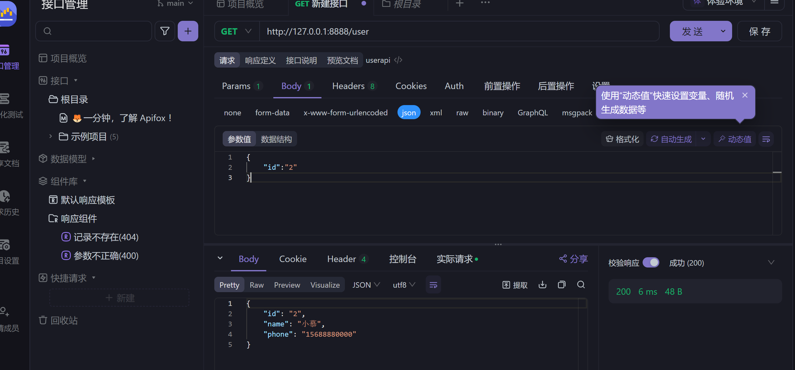

# 坑

  1.不要vim 改变配置 镜像源用临时的

```
sudo docker pull docker.xuanyuan.me/library/docker compose:latest
```

2. sudo docker pull docker.xuanyuan.me/library/nacos-server:1.2.0
3. sudo docker tag registry.cn-hangzhou.aliyuncs.com/nacos-server/nacos-server:1.2.0 nacos/nacos-server:1.2.0
4. 不要docker reload !!!


  3.protoc命令

```
protoc --go-grpc_out=require_unimplemented_servers=false:. --go_out=. ./user.proto
```


 4goctl命令

```
goctl rpc protoc user.proto --go_out=. --go-grpc_out=. --zrpc_out=.

```

```
goctl api go -api user.api -dir. -style gozero
```

```
goctl model mysql ddl --src user.sql --dir "./models/" -c
```


5. .proto文件只写一个参数即可 不用写第二个参数\

   ```
   // Go语言包配置（关键配置）
   // 格式：option go_package = "生成文件的输出路径;Go代码的包名"
   // 1. 第一个参数"./user"：生成的.go文件会被放到当前目录下的user文件夹中
   // 2. 第二个参数"user"：生成的Go代码的包名为user（需与输出路径的文件夹名保持一致，避免导入错误）
   option go_package = "./user";
   ```

6.安装软件 用命令 choch install 000 -y


 7.配置path  验证需要重启goland 以及命令栏


8.etcd命令

```
etcd.exe --data-dir=C:\path\etcd-data
```


9.apifox

```
请求调试用的是body中的json 不是 params
```




10.goctl api rpc

```
修改logic逻辑 修改confi配置
```


11.datagrip

```
https://zhuanlan.zhihu.com/p/517646737
```

12 .配置

```
Name: user.rpc
ListenOn: 127.0.0.1:8080
Etcd:
  Hosts:
  - 127.0.0.1:2379
  Key: user.rpc
Mysql:
  DataSource:root:lrx563647@tcp(127.0.0.1:3306)/mi?charset=utf8mb4
```

13 redis路径

```
C:\ProgramData\chocolatey\lib\redis\tools\redisserver.exe
```

14 百度大模型

```
ALTAKYipvjqeEdTYIbnvB9BnQc
```

```
bda8ea87f6f6405797bbbe5a7f88f98c
```


15 goland误报错误 多测试两次 就可以了


16.注意前后端跨域问题


17.xorm 表名为复的问题
