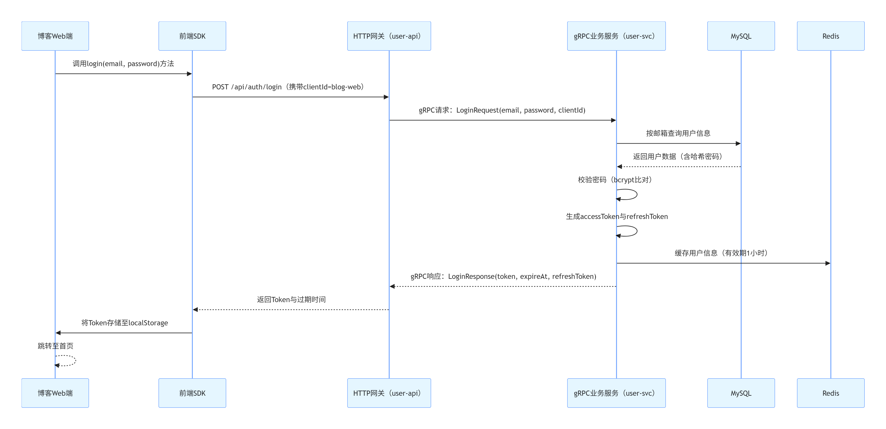

# 多 Web 端用户服务中心实现方案（Vue3 + Go-Zero + gRPC）

本方案基于 Vue3 前端、Go-Zero 后端技术栈，构建支持多 Web 端接入的统一用户服务中心，核心实现 “注册 / 登录 / JWT 鉴权 / 用户信息管理” 功能，各 Web 端可通过标准化 SDK 快速接入。

## 一、整体架构设计

### 1. 架构分层（前后端分离）

plaintext


```plaintext
┌─────────────────────────────────────────────────────────────┐
│  多Web端（如博客Web、商城Web、管理Web）                      │
│  - 技术栈：Vue3 + Pinia + 用户服务SDK                        │
└───────────────────────────┬─────────────────────────────────┘
                            │ HTTP/HTTPS
┌───────────────────────────▼─────────────────────────────────┐
│  前端接入层（用户服务中心前端）                              │
│  - 功能：登录页、注册页、用户中心页、客户端管理页            │
│  - 技术栈：Vue3 + Vite + Element-Plus + Axios               │
└───────────────────────────┬─────────────────────────────────┘
                            │ gRPC（内部通信） / HTTP（外部接入）
┌───────────────────────────▼─────────────────────────────────┐
│  后端服务层（Go-Zero微服务）                                │
│  ├─ user-api：HTTP网关（供前端调用，转发至gRPC服务）         │
│  ├─ user-svc：gRPC业务服务（核心逻辑：用户管理、JWT签发）    │
│  └─ auth-middleware：鉴权中间件（供各Web端后端集成）         │
└─┬────────────────────┬────────────────────┬─────────────────┘
  │                    │                    │
┌─▼──────────┐  ┌──────▼────────┐  ┌────────▼─────────┐
│ MySQL      │  │ Redis         │  │ Etcd             │
│ - 用户主表 │  │ - JWT缓存     │  │ - 服务注册发现   │
│ - 客户端表 │  │ - 用户信息缓存│  │ - 配置中心       │
└────────────┘  └───────────────┘  └───────────────────┘
```

### 2. 核心技术栈分工

| 模块                | 技术栈                     | 核心作用                                          |
| ------------------- | -------------------------- | ------------------------------------------------- |
| 前端（用户服务）    | Vue3 + Vite + Element-Plus | 提供登录 / 注册页面、多 Web 端客户端管理          |
| 前端（接入 Web 端） | Vue3 + Pinia + 自定义 SDK  | 集成 SDK 实现登录鉴权，无需重复开发用户功能       |
| 后端 API 层         | Go-Zero HTTP 网关          | 对外提供 HTTP 接口，转发请求到 gRPC 服务          |
| 后端业务层          | Go-Zero gRPC 服务          | 实现用户注册 / 登录 / JWT 签发 / 信息管理核心逻辑 |
| 数据存储            | MySQL + GORM               | 持久化用户数据、多 Web 端客户端配置               |
| 缓存                | Redis                      | 缓存 JWT、用户信息，提升性能                      |
| 服务治理            | Etcd                       | 服务注册发现、配置中心（如 JWT 密钥）             |

## 二、后端实现（Go-Zero 核心代码）

### 1. 数据库设计（MySQL + GORM）

#### （1）用户主表（user）

go


运行


```go
// internal/model/user.go
package model

import (
	"context"
	"time"

	"github.com/zeromicro/go-zero/core/stores/cache"
	"github.com/zeromicro/go-zero/core/stores/sqlx"
	"golang.org/x/crypto/bcrypt"
)

// User 用户主表（多Web端共用）
type User struct {
	ID         int64     `db:"id" gorm:"primaryKey;autoIncrement"`
	Username   string    `db:"username" gorm:"unique;not null;size:20"` // 用户名（唯一）
	Email      string    `db:"email" gorm:"unique;not null;size:50"`    // 邮箱（唯一）
	Password   string    `db:"password" gorm:"not null;size:100"`       // 密码哈希（bcrypt）
	Status     int8      `db:"status" gorm:"default:1"`                 // 状态：1-正常，0-禁用
	CreateTime time.Time `db:"create_time" gorm:"autoCreateTime"`
	UpdateTime time.Time `db:"update_time" gorm:"autoUpdateTime"`
}

// UserModel 数据访问层（封装MySQL+Redis）
type UserModel struct {
	sqlx.SqlConn
	cache cache.Cache
}

// NewUserModel 创建实例
func NewUserModel(conn sqlx.SqlConn, c cache.Cache) *UserModel {
	return &UserModel{SqlConn: conn, cache: c}
}

// HashPassword 密码哈希
func (m *UserModel) HashPassword(pwd string) (string, error) {
	hash, _ := bcrypt.GenerateFromPassword([]byte(pwd), bcrypt.DefaultCost)
	return string(hash), nil
}

// CheckPassword 密码校验
func (m *UserModel) CheckPassword(hash, pwd string) bool {
	return bcrypt.CompareHashAndPassword([]byte(hash), []byte(pwd)) == nil
}

// GetByEmail 按邮箱查用户（登录用）
func (m *UserModel) GetByEmail(ctx context.Context, email string) (*User, error) {
	cacheKey := "user:email:" + email
	var user User
	// 先查缓存
	if err := m.cache.Get(ctx, cacheKey, &user); err == nil {
		return &user, nil
	}
	// 缓存未命中查DB
	query := "SELECT id, username, email, password, status FROM user WHERE email = ? LIMIT 1"
	if err := m.SqlConn.QueryRowCtx(ctx, &user, query, email); err != nil {
		return nil, err
	}
	// 更新缓存（1小时过期）
	_ = m.cache.SetCtx(ctx, cacheKey, &user, time.Hour)
	return &user, nil
}

// Create 注册用户
func (m *UserModel) Create(ctx context.Context, user *User) error {
	// 密码哈希
	hashPwd, _ := m.HashPassword(user.Password)
	user.Password = hashPwd

	query := "INSERT INTO user (username, email, password) VALUES (?, ?, ?)"
	result, err := m.SqlConn.ExecCtx(ctx, query, user.Username, user.Email, user.Password)
	if err != nil {
		return err
	}
	// 获取自增ID
	userId, _ := result.LastInsertId()
	user.ID = userId

	// 更新缓存
	_ = m.cache.SetCtx(ctx, "user:id:"+string(userId), user, time.Hour)
	_ = m.cache.SetCtx(ctx, "user:email:"+user.Email, user, time.Hour)
	return nil
}
```

#### （2）多 Web 端客户端表（client）

存储各 Web 端的接入配置，实现 “按客户端隔离权限”：

go


运行


```go
// internal/model/client.go
package model

import (
	"context"
	"time"

	"github.com/zeromicro/go-zero/core/stores/cache"
	"github.com/zeromicro/go-zero/core/stores/sqlx"
)

// Client 多Web端客户端表
type Client struct {
	ID          int64     `db:"id" gorm:"primaryKey;autoIncrement"`
	ClientID    string    `db:"client_id" gorm:"unique;not null;size:50"`  // 客户端唯一标识（如blog-web、shop-web）
	ClientName  string    `db:"client_name" gorm:"not null;size:100"`      // 客户端名称（如博客Web端）
	Domain      string    `db:"domain" gorm:"not null;size:255"`          // 客户端域名（用于跨域允许）
	Secret      string    `db:"secret" gorm:"not null;size:100"`          // 客户端密钥（OAuth/鉴权用）
	Status      int8      `db:"status" gorm:"default:1"`                  // 状态：1-启用，0-禁用
	CreateTime  time.Time `db:"create_time" gorm:"autoCreateTime"`
	UpdateTime  time.Time `db:"update_time" gorm:"autoUpdateTime"`
}

// ClientModel 数据访问层
type ClientModel struct {
	sqlx.SqlConn
	cache cache.Cache
}

// NewClientModel 创建实例
func NewClientModel(conn sqlx.SqlConn, c cache.Cache) *ClientModel {
	return &ClientModel{SqlConn: conn, cache: c}
}

// GetByClientID 按ClientID查配置（多Web端接入校验用）
func (m *ClientModel) GetByClientID(ctx context.Context, clientID string) (*Client, error) {
	cacheKey := "client:id:" + clientID
	var client Client
	if err := m.cache.Get(ctx, cacheKey, &client); err == nil {
		return &client, nil
	}

	query := "SELECT id, client_id, client_name, domain, secret, status FROM client WHERE client_id = ? LIMIT 1"
	if err := m.SqlConn.QueryRowCtx(ctx, &client, query, clientID); err != nil {
		return nil, err
	}

	_ = m.cache.SetCtx(ctx, cacheKey, &client, time.Hour*24)
	return &client, nil
}
```

### 2. gRPC 服务定义（用户核心接口）

#### （1）proto 文件（api/user/user.proto）

定义用户注册、登录、信息查询接口，支持多客户端标识：

proto


```proto
syntax = "proto3";

package user;
option go_package = "./user";

// 用户服务接口
service UserService {
  // 注册
  rpc Register(RegisterRequest) returns (RegisterResponse);
  // 登录（返回JWT）
  rpc Login(LoginRequest) returns (LoginResponse);
  // 获取用户信息（需JWT鉴权）
  rpc GetUserInfo(GetUserInfoRequest) returns (GetUserInfoResponse);
  // 校验JWT（供各Web端后端调用）
  rpc VerifyToken(VerifyTokenRequest) returns (VerifyTokenResponse);
}

// 注册请求
message RegisterRequest {
  string username = 1;  // 用户名
  string email = 2;     // 邮箱（唯一）
  string password = 3;  // 密码（明文）
  string client_id = 4; // 客户端ID（如blog-web）
}

// 注册响应
message RegisterResponse {
  int32 code = 1;       // 0-成功，非0-失败
  string msg = 2;       // 提示信息
  int64 user_id = 3;    // 用户ID
}

// 登录请求
message LoginRequest {
  string email = 1;     // 邮箱
  string password = 2;  // 密码（明文）
  string client_id = 3; // 客户端ID
}

// 登录响应
message LoginResponse {
  int32 code = 1;
  string msg = 2;
  string token = 3;     // JWT
  int64 expire_at = 4;  // 过期时间（时间戳，单位秒）
}

// 获取用户信息请求
message GetUserInfoRequest {
  string token = 1;     // JWT
  string client_id = 2; // 客户端ID
}

// 获取用户信息响应
message GetUserInfoResponse {
  int32 code = 1;
  string msg = 2;
  UserInfo data = 3;    // 用户信息
}

// 用户信息结构体
message UserInfo {
  int64 user_id = 1;    // 用户ID
  string username = 2;  // 用户名
  string email = 3;     // 邮箱
  int64 create_time = 4;// 创建时间
}

// 校验JWT请求（供各Web端后端调用）
message VerifyTokenRequest {
  string token = 1;     // JWT
  string client_id = 2; // 客户端ID
  string secret = 3;    // 客户端密钥（校验合法性）
}

// 校验JWT响应
message VerifyTokenResponse {
  int32 code = 1;
  string msg = 2;
  bool valid = 3;       // 是否有效
  int64 user_id = 4;    // 解析出的用户ID
}
```

#### （2）生成 gRPC 代码

通过 Go-Zero 工具生成服务骨架：

bash


```bash
goctl rpc protoc api/user/user.proto --go_out=./internal --go-grpc_out=./internal --zrpc_out=./internal
```

### 3. 核心业务逻辑（gRPC 服务实现）

#### （1）登录逻辑（loginLogic.go）

实现 “客户端校验→用户校验→JWT 签发” 流程：

go


运行


```go
// internal/logic/loginLogic.go
package logic

import (
	"context"
	"errors"
	"time"
	"user-center/internal/model"
	"user-center/internal/svc"
	"user-center/internal/user"
	"user-center/pkg/jwt"

	"github.com/zeromicro/go-zero/core/logx"
)

type LoginLogic struct {
	ctx    context.Context
	svcCtx *svc.ServiceContext
	logx.Logger
}

func NewLoginLogic(ctx context.Context, svcCtx *svc.ServiceContext) *LoginLogic {
	return &LoginLogic{
		ctx:    ctx,
		svcCtx: svcCtx,
		Logger: logx.WithContext(ctx),
	}
}

func (l *LoginLogic) Login(in *user.LoginRequest) (*user.LoginResponse, error) {
	// 1. 校验客户端合法性（是否已注册、是否启用）
	client, err := l.svcCtx.ClientModel.GetByClientID(l.ctx, in.ClientId)
	if err != nil || client.Status != 1 {
		return &user.LoginResponse{Code: 400, Msg: "客户端不合法"}, nil
	}

	// 2. 校验用户是否存在
	userModel, err := l.svcCtx.UserModel.GetByEmail(l.ctx, in.Email)
	if err != nil || userModel.Status != 1 {
		return &user.LoginResponse{Code: 400, Msg: "邮箱或密码错误"}, nil
	}

	// 3. 校验密码
	if !l.svcCtx.UserModel.CheckPassword(userModel.Password, in.Password) {
		return &user.LoginResponse{Code: 400, Msg: "邮箱或密码错误"}, nil
	}

	// 4. 签发JWT（有效期24小时，携带用户ID、客户端ID）
	expireAt := time.Now().Add(24 * time.Hour).Unix()
	token, err := jwt.GenerateToken(
		l.svcCtx.Config.JWT.Secret, // JWT密钥（从配置中心获取）
		userModel.ID,
		in.ClientId,
		expireAt,
	)
	if err != nil {
		l.Errorf("generate jwt failed: %v", err)
		return &user.LoginResponse{Code: 500, Msg: "登录失败，请重试"}, nil
	}

	// 5. 返回结果
	return &user.LoginResponse{
		Code:     0,
		Msg:      "登录成功",
		Token:    token,
		ExpireAt: expireAt,
	}, nil
}
```

#### （2）JWT 校验逻辑（verifyTokenLogic.go）

供各 Web 端后端调用，校验 Token 合法性：

go


运行


```go
// internal/logic/verifyTokenLogic.go
package logic

import (
	"context"
	"user-center/internal/model"
	"user-center/internal/svc"
	"user-center/internal/user"
	"user-center/pkg/jwt"

	"github.com/zeromicro/go-zero/core/logx"
)

type VerifyTokenLogic struct {
	ctx    context.Context
	svcCtx *svc.ServiceContext
	logx.Logger
}

func NewVerifyTokenLogic(ctx context.Context, svcCtx *svc.ServiceContext) *VerifyTokenLogic {
	return &VerifyTokenLogic{
		ctx:    ctx,
		svcCtx: svcCtx,
		Logger: logx.WithContext(ctx),
	}
}

func (l *VerifyTokenLogic) VerifyToken(in *user.VerifyTokenRequest) (*user.VerifyTokenResponse, error) {
	// 1. 校验客户端密钥（防止非法调用）
	client, err := l.svcCtx.ClientModel.GetByClientID(l.ctx, in.ClientId)
	if err != nil || client.Secret != in.Secret {
		return &user.VerifyTokenResponse{Code: 400, Msg: "客户端密钥错误"}, nil
	}

	// 2. 校验JWT签名和过期时间
	claims, err := jwt.ParseToken(l.svcCtx.Config.JWT.Secret, in.Token)
	if err != nil {
		return &user.VerifyTokenResponse{Code: 401, Msg: "Token无效或已过期", Valid: false}, nil
	}

	// 3. 校验Token绑定的
```

继续

# 多 Web 端用户服务中心实现方案（续）

### 3. 核心业务逻辑（续）

#### （2）JWT 校验逻辑（verifyTokenLogic.go 续）

go


运行


```go
	// 3. 校验Token绑定的客户端ID是否与当前请求一致（防止Token跨端复用）
	if claims.ClientID != in.ClientId {
		return &user.VerifyTokenResponse{
			Code:  403,
			Msg:   "Token与客户端不匹配",
			Valid: false,
		}, nil
	}

	// 4. 校验用户状态（是否被禁用）
	userModel, err := l.svcCtx.UserModel.GetByUserId(l.ctx, claims.UserID)
	if err != nil || userModel.Status != 1 {
		return &user.VerifyTokenResponse{
			Code:  403,
			Msg:   "用户不存在或已被禁用",
			Valid: false,
		}, nil
	}

	// 5. 返回校验成功结果（携带用户ID）
	return &user.VerifyTokenResponse{
		Code:   0,
		Msg:    "Token有效",
		Valid:  true,
		UserID: claims.UserID,
	}, nil
}
```

### 4. HTTP 网关服务（供前端调用）

通过 Go-Zero 生成 HTTP 网关，将前端请求转发到 gRPC 服务，同时处理跨域（适配多 Web 端域名）：

#### （1）HTTP 接口定义（api/user/user.api）

go


运行


```go
syntax = "v1"

info(
  title: "多Web端用户服务中心HTTP接口"
  desc: "供各Web端前端调用的注册/登录/用户信息接口"
  version: "1.0"
)

// 跨域配置（允许已注册的客户端域名）
crossOrigin(
  allowOrigins: "${clientDomains}"  // 从配置中心读取（如"https://blog.example.com,https://shop.example.com"）
  allowMethods: ["GET", "POST", "PUT", "DELETE"]
  allowHeaders: ["Content-Type", "Authorization", "X-Client-ID"]
  allowCredentials: true
)

// 注册接口
post /api/auth/register (RegisterRequest) returns (RegisterResponse)

// 登录接口
post /api/auth/login (LoginRequest) returns (LoginResponse)

// 获取用户信息接口（需JWT鉴权）
get /api/auth/user-info (GetUserInfoRequest) returns (GetUserInfoResponse) {
  auth: true
}

// 数据结构（与gRPC对齐）
type RegisterRequest {
  string username `json:"username" validate:"required,min=3,max=20"`
  string email    `json:"email" validate:"required,email"`
  string password `json:"password" validate:"required,min=6,max=32"`
  string clientId `json:"clientId" validate:"required"` // 前端传入当前Web端的ClientID
}

type RegisterResponse {
  int32  code    `json:"code"`
  string msg     `json:"msg"`
  int64  userId  `json:"userId"`
}

type LoginRequest {
  string email    `json:"email" validate:"required,email"`
  string password `json:"password" validate:"required"`
  string clientId `json:"clientId" validate:"required"`
}

type LoginResponse {
  int32  code     `json:"code"`
  string msg      `json:"msg"`
  string token    `json:"token"`
  int64  expireAt `json:"expireAt"`
}

type GetUserInfoRequest {
  string token    `header:"Authorization" validate:"required,startswith=Bearer "` // 从请求头获取JWT
  string clientId `json:"clientId" validate:"required"`
}

type GetUserInfoResponse {
  int32   code `json:"code"`
  string  msg  `json:"msg"`
  UserInfo data `json:"data"`
}

type UserInfo {
  int64  userId     `json:"userId"`
  string username   `json:"username"`
  string email      `json:"email"`
  int64  createTime `json:"createTime"`
}
```

#### （2）生成 HTTP 网关代码

bash


```bash
goctl api go -api api/user/user.api -dir ./cmd/userapi
```

#### （3）HTTP 网关配置（etc/userapi.yaml）

yaml


```yaml
Name: userapi
Host: 0.0.0.0
Port: 8888  # HTTP网关端口（供前端调用）
Mode: dev

# JWT配置（与gRPC服务一致）
JWT:
  Secret: user-center-jwt-secret-2025  # 生产环境存Etcd
  Expire: 86400

# 跨域配置（动态读取客户端域名，生产环境从Etcd拉取）
clientDomains: "https://blog.example.com,https://shop.example.com"

# 转发到gRPC服务（通过Etcd服务发现）
Upstreams:
  - Grpc: usersvc
    Mappings:
      - Method: POST
        Path: /api/auth/register
        Rpc: Register
      - Method: POST
        Path: /api/auth/login
        Rpc: Login
      - Method: GET
        Path: /api/auth/user-info
        Rpc: GetUserInfo

# 监控配置
Prometheus:
  Host: 0.0.0.0
  Port: 9092
  Path: /metrics
```

### 5. 各 Web 端后端鉴权中间件（Go 版）

供各 Web 端后端集成，快速实现 JWT 鉴权，无需重复开发：

go


运行


```go
// pkg/middleware/auth_middleware.go
package middleware

import (
	"net/http"
	"strings"

	"github.com/gin-gonic/gin"
	"user-center/internal/user" // gRPC客户端代码
	"user-center/pkg/grpcclient"
)

// AuthMiddleware 各Web端后端鉴权中间件
func AuthMiddleware(clientID, clientSecret, userSvcAddr string) gin.HandlerFunc {
	// 初始化gRPC客户端（连接用户服务中心）
	grpcClient := grpcclient.NewUserServiceClient(userSvcAddr)

	return func(c *gin.Context) {
		// 1. 从请求头获取JWT
		authHeader := c.GetHeader("Authorization")
		if authHeader == "" || !strings.HasPrefix(authHeader, "Bearer ") {
			c.JSON(http.StatusUnauthorized, gin.H{"code": 401, "msg": "未登录"})
			c.Abort()
			return
		}
		token := strings.TrimPrefix(authHeader, "Bearer ")

		// 2. 调用用户服务中心校验Token
		req := &user.VerifyTokenRequest{
			Token:    token,
			ClientId: clientID,
			Secret:   clientSecret,
		}
		resp, err := grpcClient.VerifyToken(c, req)
		if err != nil || !resp.Valid {
			c.JSON(http.StatusUnauthorized, gin.H{"code": 401, "msg": resp.Msg})
			c.Abort()
			return
		}

		// 3. Token有效，将用户ID存入上下文（供业务逻辑使用）
		c.Set("userId", resp.UserID)
		c.Next()
	}
}

// 各Web端后端使用示例（Gin框架）
func main() {
	r := gin.Default()
	// 注册鉴权中间件（传入当前Web端的ClientID和Secret）
	r.Use(middleware.AuthMiddleware(
		"blog-web",                // 博客Web端的ClientID
		"blog-web-secret-xxx",     // 博客Web端的Secret（从配置中心获取）
		"127.0.0.1:8080",          // 用户服务中心gRPC地址
	))

	// 需登录的接口（自动鉴权）
	r.GET("/api/blog/my-articles", func(c *gin.Context) {
		userId := c.GetInt64("userId") // 从上下文获取用户ID
		// 业务逻辑：查询该用户的文章
		c.JSON(200, gin.H{"code": 0, "data": gin.H{"userId": userId, "articles": []string{}}})
	})

	r.Run(":8081") // 博客Web端后端端口
}
```

## 三、前端实现（Vue3 + 标准化 SDK）

### 1. 用户服务中心前端（管理端）

提供 “客户端管理” 功能（管理员创建 / 编辑各 Web 端接入配置）和 “用户管理” 功能（查看 / 禁用用户）：

#### （1）核心页面：客户端管理（ClientManage.vue）

vue


```vue
<template>
  <el-container>
    <el-header>多Web端客户端管理</el-header>
    <el-main>
      <el-button type="primary" @click="showCreateDialog">新增客户端</el-button>
      <el-table :data="clientList" border style="width: 100%; margin-top: 20px;">
        <el-table-column prop="clientId" label="ClientID" />
        <el-table-column prop="clientName" label="客户端名称" />
        <el-table-column prop="domain" label="域名" />
        <el-table-column prop="status" label="状态">
          <template #default="scope">
            <el-tag :type="scope.row.status === 1 ? 'success' : 'danger'">
              {{ scope.row.status === 1 ? '启用' : '禁用' }}
            </el-tag>
          </template>
        </el-table-column>
        <el-table-column label="操作">
          <template #default="scope">
            <el-button size="small" @click="showEditDialog(scope.row)">编辑</el-button>
            <el-button size="small" type="danger" @click="deleteClient(scope.row.id)">删除</el-button>
          </template>
        </el-table-column>
      </el-table>
    </el-main>
  </el-container>

  <!-- 新增/编辑客户端弹窗 -->
  <el-dialog v-model="dialogVisible" title="客户端配置">
    <el-form :model="form" :rules="rules" ref="formRef">
      <el-form-item label="ClientID" prop="clientId">
        <el-input v-model="form.clientId" :disabled="isEdit" />
      </el-form-item>
      <el-form-item label="客户端名称" prop="clientName">
        <el-input v-model="form.clientName" />
      </el-form-item>
      <el-form-item label="域名" prop="domain">
        <el-input v-model="form.domain" placeholder="如https://blog.example.com" />
      </el-form-item>
      <el-form-item label="状态" prop="status">
        <el-select v-model="form.status" placeholder="选择状态">
          <el-option label="启用" value="1" />
          <el-option label="禁用" value="0" />
        </el-select>
      </el-form-item>
    </el-form>
    <template #footer>
      <el-button @click="dialogVisible = false">取消</el-button>
      <el-button type="primary" @click="submitForm">提交</el-button>
    </template>
  </el-dialog>
</template>

<script setup>
import { ref, reactive, onMounted } from 'vue'
import { ElTable, ElTableColumn, ElButton, ElDialog, ElForm, ElFormItem, ElInput, ElSelect, ElOption, ElTag, ElMessage } from 'element-plus'
import { getClientList, createClient, updateClient, deleteClient } from '@/api/client' // 调用后端接口

const clientList = ref([])
const dialogVisible = ref(false)
const isEdit = ref(false)
const formRef = ref(null)
const form = reactive({
  clientId: '',
  clientName: '',
  domain: '',
  status: '1'
})
const rules = reactive({
  clientId: [{ required: true, message: '请输入ClientID', trigger: 'blur' }],
  clientName: [{ required: true, message: '请输入客户端名称', trigger: 'blur' }],
  domain: [{ required: true, message: '请输入域名', trigger: 'blur' }]
})

// 加载客户端列表
const loadClientList = async () => {
  const res = await getClientList()
  if (res.code === 0) {
    clientList.value = res.data
  }
}

// 新增客户端
const showCreateDialog = () => {
  isEdit.value = false
  form.clientId = ''
  form.clientName = ''
  form.domain = ''
  form.status = '1'
  dialogVisible.value = true
}

// 编辑客户端
const showEditDialog = (row) => {
  isEdit.value = true
  form.clientId = row.clientId
  form.clientName = row.clientName
  form.domain = row.domain
  form.status = row.status.toString()
  dialogVisible.value = true
}

// 提交表单
const submitForm = async () => {
  await formRef.value.validate()
  let res
  if (isEdit.value) {
    res = await updateClient(form)
  } else {
    res = await createClient(form)
  }
  if (res.code === 0) {
    ElMessage.success(isEdit.value ? '编辑成功' : '创建成功')
    dialogVisible.value = false
    loadClientList()
  }
}

// 删除客户端
const deleteClient = async (id) => {
  const res = await deleteClient(id)
  if (res.code === 0) {
    ElMessage.success('删除成功')
    loadClientList()
  }
}

onMounted(() => {
  loadClientList()
})
</script>
```

### 2. 各 Web 端前端 SDK（Vue3 版）

封装 “注册 / 登录 / Token 存储 / 请求拦截” 逻辑，各 Web 端前端直接引入，无需重复开发：

#### （1）SDK 实现（src/utils/userServiceSDK.js）

javascript


运行


```javascript
import axios from 'axios'
import { ElMessage, ElMessageBox } from 'element-plus'

class UserServiceSDK {
  /**
   * 初始化SDK
   * @param {string} clientId - 当前Web端的ClientID（从管理员处获取）
   * @param {string} baseUrl - 用户服务中心HTTP网关地址（如https://user-center.example.com:8888）
   */
  constructor(clientId, baseUrl) {
    this.clientId = clientId
    this.baseUrl = baseUrl
    this.token = localStorage.getItem('user-center-token') // 本地存储Token
    this.axiosInstance = this.createAxiosInstance()
  }

  // 创建Axios实例，添加请求拦截（自动携带Token和ClientID）
  createAxiosInstance() {
    const instance = axios.create({
      baseURL: this.baseUrl,
      timeout: 5000
    })

    // 请求拦截器
    instance.interceptors.request.use(
      (config) => {
        // 携带ClientID
        config.headers['X-Client-ID'] = this.clientId
        // 携带Token（已登录时）
        if (this.token) {
          config.headers['Authorization'] = `Bearer ${this.token}`
        }
        return config
      },
      (error) => Promise.reject(error)
    )

    // 响应拦截器（处理Token过期）
    instance.interceptors.response.use(
      (response) => response.data,
      (error) => {
        const res = error.response?.data
        if (res?.code === 401 && res?.msg.includes('Token')) {
          // Token过期，清除本地存储并提示重新登录
          this.logout()
          ElMessageBox.alert('登录已过期，请重新登录', '提示', {
            confirmButtonText: '确定',
            callback: () => {
              window.location.href = '/login' // 跳转到登录页
            }
          })
        }
        return Promise.reject(error)
      }
    )

    return instance
  }

  // 1. 注册
  async register(username, email, password) {
    return this.axiosInstance.post('/api/auth/register', {
      username,
      email,
      password,
      clientId: this.clientId
    })
  }

  // 2. 登录（成功后存储Token）
  async login(email, password) {
    const res = await this.axiosInstance.post('/api/auth/login', {
      email,
      password,
      clientId: this.clientId
    })
    if (res.code === 0) {
      this.token = res.token
      localStorage.setItem('user-center-token', res.token)
      localStorage.setItem('user-center-expireAt', res.expireAt)
    }
    return res
  }

  // 3. 获取用户信息
  async getUserInfo() {
    return this.axiosInstance.get('/api/auth/user-info', {
      params: { clientId: this.clientId }
    })
  }

  // 4. 登出（清除本地Token）
  logout() {
    this.token = ''
    localStorage.removeItem('user-center-token')
    localStorage.removeItem('user-center-expireAt
```

继续

# 多 Web 端用户服务中心实现方案（续）

### 2. 各 Web 端前端 SDK（续）

javascript


运行


```javascript
  }

  // 5. 检查是否已登录
  isLoggedIn() {
    // 简单校验：Token存在且未过期
    if (!this.token) return false
    const expireAt = localStorage.getItem('user-center-expireAt')
    if (!expireAt) return false
    return Date.now() / 1000 < Number(expireAt)
  }
}

// 初始化SDK实例（各Web端需替换为自己的ClientID和用户服务中心地址）
export const userSDK = new UserServiceSDK(
  'blog-web', // 示例：博客Web端的ClientID
  'https://user-center.example.com:8888' // 用户服务中心HTTP网关地址
)
```

#### （2）各 Web 端前端使用示例（登录页 + 个人中心）

##### ① 登录页（Login.vue）

vue


```vue
<template>
  <el-container class="login-container">
    <el-card class="login-card" shadow="hover">
      <div slot="header" class="login-header">
        <h2>博客Web端 - 登录</h2>
      </div>
      <el-form :model="form" :rules="rules" ref="formRef" label-width="80px">
        <el-form-item label="邮箱" prop="email">
          <el-input v-model="form.email" placeholder="请输入邮箱" />
        </el-form-item>
        <el-form-item label="密码" prop="password">
          <el-input v-model="form.password" type="password" placeholder="请输入密码" />
        </el-form-item>
        <el-form-item>
          <el-button type="primary" @click="handleLogin" style="width: 100%">登录</el-button>
          <div class="login-link" @click="toRegister">还没有账号？去注册</div>
        </el-form-item>
      </el-form>
    </el-card>
  </el-container>
</template>

<script setup>
import { ref, reactive } from 'vue'
import { ElContainer, ElCard, ElForm, ElFormItem, ElInput, ElButton, ElMessage, ElMessageBox } from 'element-plus'
import { useRouter } from 'vue-router'
import { userSDK } from '@/utils/userServiceSDK'

const router = useRouter()
const formRef = ref(null)
const form = reactive({
  email: '',
  password: ''
})
const rules = reactive({
  email: [
    { required: true, message: '请输入邮箱', trigger: 'blur' },
    { type: 'email', message: '请输入正确的邮箱格式', trigger: 'blur' }
  ],
  password: [
    { required: true, message: '请输入密码', trigger: 'blur' },
    { min: 6, message: '密码长度不能少于6位', trigger: 'blur' }
  ]
})

// 处理登录
const handleLogin = async () => {
  await formRef.value.validate()
  const res = await userSDK.login(form.email, form.password)
  if (res.code === 0) {
    ElMessage.success('登录成功')
    // 登录成功后跳转到首页
    router.push('/home')
  } else {
    ElMessage.error(res.msg)
  }
}

// 跳转到注册页
const toRegister = () => {
  router.push('/register')
}

// 已登录则自动跳转到首页
if (userSDK.isLoggedIn()) {
  router.push('/home')
}
</script>

<style scoped>
.login-container {
  height: 100vh;
  display: flex;
  justify-content: center;
  align-items: center;
  background-color: #f5f7fa;
}
.login-card {
  width: 400px;
}
.login-header {
  text-align: center;
}
.login-link {
  text-align: center;
  margin-top: 15px;
  color: #409eff;
  cursor: pointer;
}
</style>
```

##### ② 个人中心页（UserCenter.vue）

vue


```vue
<template>
  <el-container>
    <el-header>
      <div class="header-right">
        <el-button type="text" @click="handleLogout">退出登录</el-button>
      </div>
    </el-header>
    <el-main>
      <el-card shadow="hover">
        <div class="user-info">
          <h3>个人信息</h3>
          <el-descriptions :column="1" border>
            <el-descriptions-item label="用户ID">{{ userInfo.userId || '-' }}</el-descriptions-item>
            <el-descriptions-item label="用户名">{{ userInfo.username || '-' }}</el-descriptions-item>
            <el-descriptions-item label="邮箱">{{ userInfo.email || '-' }}</el-descriptions-item>
            <el-descriptions-item label="注册时间">{{ formatTime(userInfo.createTime) || '-' }}</el-descriptions-item>
          </el-descriptions>
        </div>
      </el-card>
    </el-main>
  </el-container>
</template>

<script setup>
import { ref, onMounted } from 'vue'
import { ElContainer, ElHeader, ElMain, ElCard, ElDescriptions, ElDescriptionsItem, ElButton, ElMessage } from 'element-plus'
import { useRouter } from 'vue-router'
import { userSDK } from '@/utils/userServiceSDK'
import dayjs from 'dayjs' // 时间格式化工具

const router = useRouter()
const userInfo = ref({})

// 加载用户信息
const loadUserInfo = async () => {
  // 未登录则跳转到登录页
  if (!userSDK.isLoggedIn()) {
    router.push('/login')
    return
  }

  const res = await userSDK.getUserInfo()
  if (res.code === 0) {
    userInfo.value = res.data
  } else {
    ElMessage.error(res.msg)
    // 信息获取失败且Token无效，跳转到登录页
    if (res.code === 401) {
      userSDK.logout()
      router.push('/login')
    }
  }
}

// 退出登录
const handleLogout = async () => {
  userSDK.logout()
  ElMessage.success('已退出登录')
  router.push('/login')
}

// 时间格式化（时间戳转字符串）
const formatTime = (timestamp) => {
  if (!timestamp) return ''
  return dayjs(timestamp * 1000).format('YYYY-MM-DD HH:mm:ss')
}

onMounted(() => {
  loadUserInfo()
})
</script>

<style scoped>
.header-right {
  float: right;
}
.user-info {
  margin-bottom: 20px;
}
</style>
```

## 四、项目部署与接入流程

### 1. 服务部署（生产环境）

#### （1）后端服务部署（Docker + Kubernetes）

1. 构建 Docker 镜像

   ：为

    

   ```
   user-svc
   ```

   （gRPC 服务）和

    

   ```
   user-api
   ```

   （HTTP 网关）编写 Dockerfile，示例：

   dockerfile

   

   

   

   

   

   ```dockerfile
   # user-svc Dockerfile
   FROM golang:1.21-alpine AS builder
   WORKDIR /app
   COPY . .
   RUN go mod download && CGO_ENABLED=0 GOOS=linux go build -o user-svc ./cmd/usersvc
   
   FROM alpine:3.18
   WORKDIR /app
   COPY --from=builder /app/user-svc .
   COPY --from=builder /app/etc/usersvc.yaml ./etc/
   EXPOSE 8080
   CMD ["./user-svc", "-f", "etc/usersvc.yaml"]
   ```

   

2. Kubernetes 部署

   ：编写 Deployment 和 Service 配置，实现服务高可用（多副本）、自动扩缩容，示例：

   yaml

   

   

   

   

   

   ```yaml
   # user-svc-deployment.yaml
   apiVersion: apps/v1
   kind: Deployment
   metadata:
     name: user-svc
   spec:
     replicas: 2
     selector:
       matchLabels:
         app: user-svc
     template:
       metadata:
         labels:
           app: user-svc
       spec:
         containers:
         - name: user-svc
           image: user-center/user-svc:v1.0.0
           ports:
           - containerPort: 8080
           env:
           - name: JWT_SECRET
             valueFrom:
               secretKeyRef:
                 name: user-center-secrets
                 key: jwt-secret
   ---
   apiVersion: v1
   kind: Service
   metadata:
     name: user-svc
   spec:
     selector:
       app: user-svc
     ports:
     - port: 8080
       targetPort: 8080
     type: ClusterIP
   ```

   

#### （2）前端部署（Nginx + 静态资源）

1. **打包静态资源**：用户服务中心前端和各 Web 端前端分别执行 `npm run build`，生成 dist 目录。

2. Nginx 配置

   ：部署到 Nginx，配置跨域（仅允许已注册的客户端域名）和 HTTPS，示例：

   nginx

   

   

   

   

   

   ```nginx
   # 用户服务中心前端配置
   server {
     listen 443 ssl;
     server_name user-center.example.com;
     ssl_certificate /etc/nginx/ssl/user-center.crt;
     ssl_certificate_key /etc/nginx/ssl/user-center.key;
   
     location / {
       root /usr/share/nginx/html/user-center;
       index index.html;
       try_files $uri $uri/ /index.html;
     }
   }
   
   # 博客Web端配置
   server {
     listen 443 ssl;
     server_name blog.example.com;
     ssl_certificate /etc/nginx/ssl/blog.crt;
     ssl_certificate_key /etc/nginx/ssl/blog.key;
   
     location / {
       root /usr/share/nginx/html/blog-web;
       index index.html;
       try_files $uri $uri/ /index.html;
     }
   
     # 代理后端API（带鉴权中间件的博客Web端后端）
     location /api/blog {
       proxy_pass http://blog-api:8081;
       proxy_set_header Host $host;
       proxy_set_header X-Real-IP $remote_addr;
     }
   }
   ```

   

### 2. 新 Web 端接入流程（标准化 3 步）

1. **申请接入资质**：

   管理员在用户服务中心 “客户端管理” 页面创建新客户端，填写：

   - ClientID：如 `shop-web`（商城 Web 端）

   - 客户端名称：商城 Web 端

   - 域名：

     ```
     https://shop.example.com
     ```

     

     提交后获取

      

     ```
     ClientID
     ```

      

     和

      

     ```
     ClientSecret
     ```

     （用于后端鉴权）。

2. **前端集成 SDK**：

   - 复制用户服务中心提供的 `userServiceSDK.js` 到商城 Web 端项目。

   - 初始化 SDK 时替换

      

     ```
     ClientID
     ```

      

     和用户服务中心 HTTP 网关地址：

     javascript

     

     运行

     

     

     

     

     ```javascript
     export const userSDK = new UserServiceSDK(
       'shop-web', // 商城Web端的ClientID
       'https://user-center.example.com:8888'
     )
     ```

     

   - 直接复用 SDK 的 `login`/`register`/`getUserInfo` 方法，开发登录页、注册页、个人中心。

3. **后端集成鉴权中间件**：

   商城 Web 端后端（Go 语言）引入鉴权中间件，配置 `ClientID` 和 `ClientSecret`：

   go

   

   运行

   

   

   

   

   ```go
   r.Use(middleware.AuthMiddleware(
     "shop-web",                // 商城Web端的ClientID
     "shop-web-secret-xxx",     // 商城Web端的ClientSecret
     "user-svc:8080",           // Kubernetes中user-svc的地址
   ))
   ```

   

## 五、核心保障与优化

### 1. 安全性保障

- **Token 安全**：前端用 `localStorage` 存储 Token 时，配合定期刷新（可扩展 SDK 的 `refreshToken` 方法）；敏感场景（如金融 Web 端）可改用 `httpOnly Cookie`，防止 XSS 攻击。
- **客户端校验**：用户服务中心校验所有请求的 `ClientID` 和 `domain`，禁止未注册客户端接入，防止跨域伪造请求。
- **密码安全**：后端用 bcrypt 哈希存储密码，禁止明文传输（所有接口强制 HTTPS）。

### 2. 性能优化

- **Redis 缓存**：用户信息、客户端配置缓存到 Redis，过期时间 1 小时，减少 MySQL 查询压力。
- **gRPC 连接复用**：各 Web 端后端通过连接池复用 gRPC 连接，避免频繁建立连接的开销。
- **前端静态资源 CDN**：用户服务中心前端和各 Web 端前端的静态资源（JS/CSS/ 图片）部署到 CDN，提升加载速度。

### 3. 可扩展性设计

- **权限扩展**：在 JWT 的 `payload` 中增加 `permissions` 字段（如 `["order:create", "order:view"]`），各 Web 端后端通过中间件校验权限，实现 “细粒度权限控制”。
- **多端扩展**：后续新增 APP、小程序时，仅需在用户服务中心新增客户端类型，复用现有 JWT 鉴权逻辑，无需重构核心代码。

通过以上实现，多 Web 端可快速接入统一用户服务中心，实现 “一次开发，多端复用”，大幅降低各 Web 端的用户体系开发成本，同时保障安全性、可扩展性和性能。

# 多 Web 端用户服务中心实现方案（Vue3 + Go-Zero + gRPC）

本方案基于 Vue3 前端、Go-Zero 后端技术栈，构建支持多 Web 端接入的统一用户服务中心，核心实现 “注册 / 登录 / JWT 鉴权 / 用户信息管理” 功能，各 Web 端可通过标准化 SDK 快速接入。

## 一、整体架构设计

### 1. 架构分层（前后端分离）

plaintext


```plaintext
┌─────────────────────────────────────────────────────────────┐
│  多Web端（如博客Web、商城Web、管理Web）                      │
│  - 技术栈：Vue3 + Pinia + 用户服务SDK                        │
└───────────────────────────┬─────────────────────────────────┘
                            │ HTTP/HTTPS
┌───────────────────────────▼─────────────────────────────────┐
│  前端接入层（用户服务中心前端）                              │
│  - 功能：登录页、注册页、用户中心页、客户端管理页            │
│  - 技术栈：Vue3 + Vite + Element-Plus + Axios               │
└───────────────────────────┬─────────────────────────────────┘
                            │ gRPC（内部通信） / HTTP（外部接入）
┌───────────────────────────▼─────────────────────────────────┐
│  后端服务层（Go-Zero微服务）                                │
│  ├─ user-api：HTTP网关（供前端调用，转发至gRPC服务）         │
│  ├─ user-svc：gRPC业务服务（核心逻辑：用户管理、JWT签发）    │
│  └─ auth-middleware：鉴权中间件（供各Web端后端集成）         │
└─┬────────────────────┬────────────────────┬─────────────────┘
  │                    │                    │
┌─▼──────────┐  ┌──────▼────────┐  ┌────────▼─────────┐
│ MySQL      │  │ Redis         │  │ Etcd             │
│ - 用户主表 │  │ - JWT缓存     │  │ - 服务注册发现   │
│ - 客户端表 │  │ - 用户信息缓存│  │ - 配置中心       │
└────────────┘  └───────────────┘  └───────────────────┘
```

### 2. 核心技术栈分工

| 模块                | 技术栈                     | 核心作用                                          |
| ------------------- | -------------------------- | ------------------------------------------------- |
| 前端（用户服务）    | Vue3 + Vite + Element-Plus | 提供登录 / 注册页面、多 Web 端客户端管理          |
| 前端（接入 Web 端） | Vue3 + Pinia + 自定义 SDK  | 集成 SDK 实现登录鉴权，无需重复开发用户功能       |
| 后端 API 层         | Go-Zero HTTP 网关          | 对外提供 HTTP 接口，转发请求到 gRPC 服务          |
| 后端业务层          | Go-Zero gRPC 服务          | 实现用户注册 / 登录 / JWT 签发 / 信息管理核心逻辑 |
| 数据存储            | MySQL + GORM               | 持久化用户数据、多 Web 端客户端配置               |
| 缓存                | Redis                      | 缓存 JWT、用户信息，提升性能                      |
| 服务治理            | Etcd                       | 服务注册发现、配置中心（如 JWT 密钥）             |

## 二、后端实现（Go-Zero 核心代码）

### 1. 数据库设计（MySQL + GORM）

#### （1）用户主表（user）

go


运行


```go
// internal/model/user.go
package model

import (
	"context"
	"time"

	"github.com/zeromicro/go-zero/core/stores/cache"
	"github.com/zeromicro/go-zero/core/stores/sqlx"
	"golang.org/x/crypto/bcrypt"
)

// User 用户主表（多Web端共用）
type User struct {
	ID         int64     `db:"id" gorm:"primaryKey;autoIncrement"`
	Username   string    `db:"username" gorm:"unique;not null;size:20"` // 用户名（唯一）
	Email      string    `db:"email" gorm:"unique;not null;size:50"`    // 邮箱（唯一）
	Password   string    `db:"password" gorm:"not null;size:100"`       // 密码哈希（bcrypt）
	Status     int8      `db:"status" gorm:"default:1"`                 // 状态：1-正常，0-禁用
	CreateTime time.Time `db:"create_time" gorm:"autoCreateTime"`
	UpdateTime time.Time `db:"update_time" gorm:"autoUpdateTime"`
}

// UserModel 数据访问层（封装MySQL+Redis）
type UserModel struct {
	sqlx.SqlConn
	cache cache.Cache
}

// NewUserModel 创建实例
func NewUserModel(conn sqlx.SqlConn, c cache.Cache) *UserModel {
	return &UserModel{SqlConn: conn, cache: c}
}

// HashPassword 密码哈希
func (m *UserModel) HashPassword(pwd string) (string, error) {
	hash, _ := bcrypt.GenerateFromPassword([]byte(pwd), bcrypt.DefaultCost)
	return string(hash), nil
}

// CheckPassword 密码校验
func (m *UserModel) CheckPassword(hash, pwd string) bool {
	return bcrypt.CompareHashAndPassword([]byte(hash), []byte(pwd)) == nil
}

// GetByEmail 按邮箱查用户（登录用）
func (m *UserModel) GetByEmail(ctx context.Context, email string) (*User, error) {
	cacheKey := "user:email:" + email
	var user User
	// 先查缓存
	if err := m.cache.Get(ctx, cacheKey, &user); err == nil {
		return &user, nil
	}
	// 缓存未命中查DB
	query := "SELECT id, username, email, password, status FROM user WHERE email = ? LIMIT 1"
	if err := m.SqlConn.QueryRowCtx(ctx, &user, query, email); err != nil {
		return nil, err
	}
	// 更新缓存（1小时过期）
	_ = m.cache.SetCtx(ctx, cacheKey, &user, time.Hour)
	return &user, nil
}

// Create 注册用户
func (m *UserModel) Create(ctx context.Context, user *User) error {
	// 密码哈希
	hashPwd, _ := m.HashPassword(user.Password)
	user.Password = hashPwd

	query := "INSERT INTO user (username, email, password) VALUES (?, ?, ?)"
	result, err := m.SqlConn.ExecCtx(ctx, query, user.Username, user.Email, user.Password)
	if err != nil {
		return err
	}
	// 获取自增ID
	userId, _ := result.LastInsertId()
	user.ID = userId

	// 更新缓存
	_ = m.cache.SetCtx(ctx, "user:id:"+string(userId), user, time.Hour)
	_ = m.cache.SetCtx(ctx, "user:email:"+user.Email, user, time.Hour)
	return nil
}
```

#### （2）多 Web 端客户端表（client）

存储各 Web 端的接入配置，实现 “按客户端隔离权限”：

go


运行


```go
// internal/model/client.go
package model

import (
	"context"
	"time"

	"github.com/zeromicro/go-zero/core/stores/cache"
	"github.com/zeromicro/go-zero/core/stores/sqlx"
)

// Client 多Web端客户端表
type Client struct {
	ID          int64     `db:"id" gorm:"primaryKey;autoIncrement"`
	ClientID    string    `db:"client_id" gorm:"unique;not null;size:50"`  // 客户端唯一标识（如blog-web、shop-web）
	ClientName  string    `db:"client_name" gorm:"not null;size:100"`      // 客户端名称（如博客Web端）
	Domain      string    `db:"domain" gorm:"not null;size:255"`          // 客户端域名（用于跨域允许）
	Secret      string    `db:"secret" gorm:"not null;size:100"`          // 客户端密钥（OAuth/鉴权用）
	Status      int8      `db:"status" gorm:"default:1"`                  // 状态：1-启用，0-禁用
	CreateTime  time.Time `db:"create_time" gorm:"autoCreateTime"`
	UpdateTime  time.Time `db:"update_time" gorm:"autoUpdateTime"`
}

// ClientModel 数据访问层
type ClientModel struct {
	sqlx.SqlConn
	cache cache.Cache
}

// NewClientModel 创建实例
func NewClientModel(conn sqlx.SqlConn, c cache.Cache) *ClientModel {
	return &ClientModel{SqlConn: conn, cache: c}
}

// GetByClientID 按ClientID查配置（多Web端接入校验用）
func (m *ClientModel) GetByClientID(ctx context.Context, clientID string) (*Client, error) {
	cacheKey := "client:id:" + clientID
	var client Client
	if err := m.cache.Get(ctx, cacheKey, &client); err == nil {
		return &client, nil
	}

	query := "SELECT id, client_id, client_name, domain, secret, status FROM client WHERE client_id = ? LIMIT 1"
	if err := m.SqlConn.QueryRowCtx(ctx, &client, query, clientID); err != nil {
		return nil, err
	}

	_ = m.cache.SetCtx(ctx, cacheKey, &client, time.Hour*24)
	return &client, nil
}
```

### 2. gRPC 服务定义（用户核心接口）

#### （1）proto 文件（api/user/user.proto）

定义用户注册、登录、信息查询接口，支持多客户端标识：

proto


```proto
syntax = "proto3";

package user;
option go_package = "./user";

// 用户服务接口
service UserService {
  // 注册
  rpc Register(RegisterRequest) returns (RegisterResponse);
  // 登录（返回JWT）
  rpc Login(LoginRequest) returns (LoginResponse);
  // 获取用户信息（需JWT鉴权）
  rpc GetUserInfo(GetUserInfoRequest) returns (GetUserInfoResponse);
  // 校验JWT（供各Web端后端调用）
  rpc VerifyToken(VerifyTokenRequest) returns (VerifyTokenResponse);
}

// 注册请求
message RegisterRequest {
  string username = 1;  // 用户名
  string email = 2;     // 邮箱（唯一）
  string password = 3;  // 密码（明文）
  string client_id = 4; // 客户端ID（如blog-web）
}

// 注册响应
message RegisterResponse {
  int32 code = 1;       // 0-成功，非0-失败
  string msg = 2;       // 提示信息
  int64 user_id = 3;    // 用户ID
}

// 登录请求
message LoginRequest {
  string email = 1;     // 邮箱
  string password = 2;  // 密码（明文）
  string client_id = 3; // 客户端ID
}

// 登录响应
message LoginResponse {
  int32 code = 1;
  string msg = 2;
  string token = 3;     // JWT
  int64 expire_at = 4;  // 过期时间（时间戳，单位秒）
}

// 获取用户信息请求
message GetUserInfoRequest {
  string token = 1;     // JWT
  string client_id = 2; // 客户端ID
}

// 获取用户信息响应
message GetUserInfoResponse {
  int32 code = 1;
  string msg = 2;
  UserInfo data = 3;    // 用户信息
}

// 用户信息结构体
message UserInfo {
  int64 user_id = 1;    // 用户ID
  string username = 2;  // 用户名
  string email = 3;     // 邮箱
  int64 create_time = 4;// 创建时间
}

// 校验JWT请求（供各Web端后端调用）
message VerifyTokenRequest {
  string token = 1;     // JWT
  string client_id = 2; // 客户端ID
  string secret = 3;    // 客户端密钥（校验合法性）
}

// 校验JWT响应
message VerifyTokenResponse {
  int32 code = 1;
  string msg = 2;
  bool valid = 3;       // 是否有效
  int64 user_id = 4;    // 解析出的用户ID
}
```

#### （2）生成 gRPC 代码

通过 Go-Zero 工具生成服务骨架：

bash


```bash
goctl rpc protoc api/user/user.proto --go_out=./internal --go-grpc_out=./internal --zrpc_out=./internal
```

### 3. 核心业务逻辑（gRPC 服务实现）

#### （1）登录逻辑（loginLogic.go）

实现 “客户端校验→用户校验→JWT 签发” 流程：

go


运行


```go
// internal/logic/loginLogic.go
package logic

import (
	"context"
	"errors"
	"time"
	"user-center/internal/model"
	"user-center/internal/svc"
	"user-center/internal/user"
	"user-center/pkg/jwt"

	"github.com/zeromicro/go-zero/core/logx"
)

type LoginLogic struct {
	ctx    context.Context
	svcCtx *svc.ServiceContext
	logx.Logger
}

func NewLoginLogic(ctx context.Context, svcCtx *svc.ServiceContext) *LoginLogic {
	return &LoginLogic{
		ctx:    ctx,
		svcCtx: svcCtx,
		Logger: logx.WithContext(ctx),
	}
}

func (l *LoginLogic) Login(in *user.LoginRequest) (*user.LoginResponse, error) {
	// 1. 校验客户端合法性（是否已注册、是否启用）
	client, err := l.svcCtx.ClientModel.GetByClientID(l.ctx, in.ClientId)
	if err != nil || client.Status != 1 {
		return &user.LoginResponse{Code: 400, Msg: "客户端不合法"}, nil
	}

	// 2. 校验用户是否存在
	userModel, err := l.svcCtx.UserModel.GetByEmail(l.ctx, in.Email)
	if err != nil || userModel.Status != 1 {
		return &user.LoginResponse{Code: 400, Msg: "邮箱或密码错误"}, nil
	}

	// 3. 校验密码
	if !l.svcCtx.UserModel.CheckPassword(userModel.Password, in.Password) {
		return &user.LoginResponse{Code: 400, Msg: "邮箱或密码错误"}, nil
	}

	// 4. 签发JWT（有效期24小时，携带用户ID、客户端ID）
	expireAt := time.Now().Add(24 * time.Hour).Unix()
	token, err := jwt.GenerateToken(
		l.svcCtx.Config.JWT.Secret, // JWT密钥（从配置中心获取）
		userModel.ID,
		in.ClientId,
		expireAt,
	)
	if err != nil {
		l.Errorf("generate jwt failed: %v", err)
		return &user.LoginResponse{Code: 500, Msg: "登录失败，请重试"}, nil
	}

	// 5. 返回结果
	return &user.LoginResponse{
		Code:     0,
		Msg:      "登录成功",
		Token:    token,
		ExpireAt: expireAt,
	}, nil
}
```

#### （2）JWT 校验逻辑（verifyTokenLogic.go）

供各 Web 端后端调用，校验 Token 合法性：

go


运行


```go
// internal/logic/verifyTokenLogic.go
package logic

import (
	"context"
	"user-center/internal/model"
	"user-center/internal/svc"
	"user-center/internal/user"
	"user-center/pkg/jwt"

	"github.com/zeromicro/go-zero/core/logx"
)

type VerifyTokenLogic struct {
	ctx    context.Context
	svcCtx *svc.ServiceContext
	logx.Logger
}

func NewVerifyTokenLogic(ctx context.Context, svcCtx *svc.ServiceContext) *VerifyTokenLogic {
	return &VerifyTokenLogic{
		ctx:    ctx,
		svcCtx: svcCtx,
		Logger: logx.WithContext(ctx),
	}
}

func (l *VerifyTokenLogic) VerifyToken(in *user.VerifyTokenRequest) (*user.VerifyTokenResponse, error) {
	// 1. 校验客户端密钥（防止非法调用）
	client, err := l.svcCtx.ClientModel.GetByClientID(l.ctx, in.ClientId)
	if err != nil || client.Secret != in.Secret {
		return &user.VerifyTokenResponse{Code: 400, Msg: "客户端密钥错误"}, nil
	}

	// 2. 校验JWT签名和过期时间
	claims, err := jwt.ParseToken(l.svcCtx.Config.JWT.Secret, in.Token)
	if err != nil {
		return &user.VerifyTokenResponse{Code: 401, Msg: "Token无效或已过期", Valid: false}, nil
	}

	// 3. 校验Token绑定的
```

继续

# 多 Web 端用户服务中心实现方案（续）

### 3. 核心业务逻辑（续）

#### （2）JWT 校验逻辑（verifyTokenLogic.go 续）

go


运行


```go
	// 3. 校验Token绑定的客户端ID是否与当前请求一致（防止Token跨端复用）
	if claims.ClientID != in.ClientId {
		return &user.VerifyTokenResponse{
			Code:  403,
			Msg:   "Token与客户端不匹配",
			Valid: false,
		}, nil
	}

	// 4. 校验用户状态（是否被禁用）
	userModel, err := l.svcCtx.UserModel.GetByUserId(l.ctx, claims.UserID)
	if err != nil || userModel.Status != 1 {
		return &user.VerifyTokenResponse{
			Code:  403,
			Msg:   "用户不存在或已被禁用",
			Valid: false,
		}, nil
	}

	// 5. 返回校验成功结果（携带用户ID）
	return &user.VerifyTokenResponse{
		Code:   0,
		Msg:    "Token有效",
		Valid:  true,
		UserID: claims.UserID,
	}, nil
}
```

### 4. HTTP 网关服务（供前端调用）

通过 Go-Zero 生成 HTTP 网关，将前端请求转发到 gRPC 服务，同时处理跨域（适配多 Web 端域名）：

#### （1）HTTP 接口定义（api/user/user.api）

go


运行


```go
syntax = "v1"

info(
  title: "多Web端用户服务中心HTTP接口"
  desc: "供各Web端前端调用的注册/登录/用户信息接口"
  version: "1.0"
)

// 跨域配置（允许已注册的客户端域名）
crossOrigin(
  allowOrigins: "${clientDomains}"  // 从配置中心读取（如"https://blog.example.com,https://shop.example.com"）
  allowMethods: ["GET", "POST", "PUT", "DELETE"]
  allowHeaders: ["Content-Type", "Authorization", "X-Client-ID"]
  allowCredentials: true
)

// 注册接口
post /api/auth/register (RegisterRequest) returns (RegisterResponse)

// 登录接口
post /api/auth/login (LoginRequest) returns (LoginResponse)

// 获取用户信息接口（需JWT鉴权）
get /api/auth/user-info (GetUserInfoRequest) returns (GetUserInfoResponse) {
  auth: true
}

// 数据结构（与gRPC对齐）
type RegisterRequest {
  string username `json:"username" validate:"required,min=3,max=20"`
  string email    `json:"email" validate:"required,email"`
  string password `json:"password" validate:"required,min=6,max=32"`
  string clientId `json:"clientId" validate:"required"` // 前端传入当前Web端的ClientID
}

type RegisterResponse {
  int32  code    `json:"code"`
  string msg     `json:"msg"`
  int64  userId  `json:"userId"`
}

type LoginRequest {
  string email    `json:"email" validate:"required,email"`
  string password `json:"password" validate:"required"`
  string clientId `json:"clientId" validate:"required"`
}

type LoginResponse {
  int32  code     `json:"code"`
  string msg      `json:"msg"`
  string token    `json:"token"`
  int64  expireAt `json:"expireAt"`
}

type GetUserInfoRequest {
  string token    `header:"Authorization" validate:"required,startswith=Bearer "` // 从请求头获取JWT
  string clientId `json:"clientId" validate:"required"`
}

type GetUserInfoResponse {
  int32   code `json:"code"`
  string  msg  `json:"msg"`
  UserInfo data `json:"data"`
}

type UserInfo {
  int64  userId     `json:"userId"`
  string username   `json:"username"`
  string email      `json:"email"`
  int64  createTime `json:"createTime"`
}
```

#### （2）生成 HTTP 网关代码

bash


```bash
goctl api go -api api/user/user.api -dir ./cmd/userapi
```

#### （3）HTTP 网关配置（etc/userapi.yaml）

yaml


```yaml
Name: userapi
Host: 0.0.0.0
Port: 8888  # HTTP网关端口（供前端调用）
Mode: dev

# JWT配置（与gRPC服务一致）
JWT:
  Secret: user-center-jwt-secret-2025  # 生产环境存Etcd
  Expire: 86400

# 跨域配置（动态读取客户端域名，生产环境从Etcd拉取）
clientDomains: "https://blog.example.com,https://shop.example.com"

# 转发到gRPC服务（通过Etcd服务发现）
Upstreams:
  - Grpc: usersvc
    Mappings:
      - Method: POST
        Path: /api/auth/register
        Rpc: Register
      - Method: POST
        Path: /api/auth/login
        Rpc: Login
      - Method: GET
        Path: /api/auth/user-info
        Rpc: GetUserInfo

# 监控配置
Prometheus:
  Host: 0.0.0.0
  Port: 9092
  Path: /metrics
```

### 5. 各 Web 端后端鉴权中间件（Go 版）

供各 Web 端后端集成，快速实现 JWT 鉴权，无需重复开发：

go


运行


```go
// pkg/middleware/auth_middleware.go
package middleware

import (
	"net/http"
	"strings"

	"github.com/gin-gonic/gin"
	"user-center/internal/user" // gRPC客户端代码
	"user-center/pkg/grpcclient"
)

// AuthMiddleware 各Web端后端鉴权中间件
func AuthMiddleware(clientID, clientSecret, userSvcAddr string) gin.HandlerFunc {
	// 初始化gRPC客户端（连接用户服务中心）
	grpcClient := grpcclient.NewUserServiceClient(userSvcAddr)

	return func(c *gin.Context) {
		// 1. 从请求头获取JWT
		authHeader := c.GetHeader("Authorization")
		if authHeader == "" || !strings.HasPrefix(authHeader, "Bearer ") {
			c.JSON(http.StatusUnauthorized, gin.H{"code": 401, "msg": "未登录"})
			c.Abort()
			return
		}
		token := strings.TrimPrefix(authHeader, "Bearer ")

		// 2. 调用用户服务中心校验Token
		req := &user.VerifyTokenRequest{
			Token:    token,
			ClientId: clientID,
			Secret:   clientSecret,
		}
		resp, err := grpcClient.VerifyToken(c, req)
		if err != nil || !resp.Valid {
			c.JSON(http.StatusUnauthorized, gin.H{"code": 401, "msg": resp.Msg})
			c.Abort()
			return
		}

		// 3. Token有效，将用户ID存入上下文（供业务逻辑使用）
		c.Set("userId", resp.UserID)
		c.Next()
	}
}

// 各Web端后端使用示例（Gin框架）
func main() {
	r := gin.Default()
	// 注册鉴权中间件（传入当前Web端的ClientID和Secret）
	r.Use(middleware.AuthMiddleware(
		"blog-web",                // 博客Web端的ClientID
		"blog-web-secret-xxx",     // 博客Web端的Secret（从配置中心获取）
		"127.0.0.1:8080",          // 用户服务中心gRPC地址
	))

	// 需登录的接口（自动鉴权）
	r.GET("/api/blog/my-articles", func(c *gin.Context) {
		userId := c.GetInt64("userId") // 从上下文获取用户ID
		// 业务逻辑：查询该用户的文章
		c.JSON(200, gin.H{"code": 0, "data": gin.H{"userId": userId, "articles": []string{}}})
	})

	r.Run(":8081") // 博客Web端后端端口
}
```

## 三、前端实现（Vue3 + 标准化 SDK）

### 1. 用户服务中心前端（管理端）

提供 “客户端管理” 功能（管理员创建 / 编辑各 Web 端接入配置）和 “用户管理” 功能（查看 / 禁用用户）：

#### （1）核心页面：客户端管理（ClientManage.vue）

vue


```vue
<template>
  <el-container>
    <el-header>多Web端客户端管理</el-header>
    <el-main>
      <el-button type="primary" @click="showCreateDialog">新增客户端</el-button>
      <el-table :data="clientList" border style="width: 100%; margin-top: 20px;">
        <el-table-column prop="clientId" label="ClientID" />
        <el-table-column prop="clientName" label="客户端名称" />
        <el-table-column prop="domain" label="域名" />
        <el-table-column prop="status" label="状态">
          <template #default="scope">
            <el-tag :type="scope.row.status === 1 ? 'success' : 'danger'">
              {{ scope.row.status === 1 ? '启用' : '禁用' }}
            </el-tag>
          </template>
        </el-table-column>
        <el-table-column label="操作">
          <template #default="scope">
            <el-button size="small" @click="showEditDialog(scope.row)">编辑</el-button>
            <el-button size="small" type="danger" @click="deleteClient(scope.row.id)">删除</el-button>
          </template>
        </el-table-column>
      </el-table>
    </el-main>
  </el-container>

  <!-- 新增/编辑客户端弹窗 -->
  <el-dialog v-model="dialogVisible" title="客户端配置">
    <el-form :model="form" :rules="rules" ref="formRef">
      <el-form-item label="ClientID" prop="clientId">
        <el-input v-model="form.clientId" :disabled="isEdit" />
      </el-form-item>
      <el-form-item label="客户端名称" prop="clientName">
        <el-input v-model="form.clientName" />
      </el-form-item>
      <el-form-item label="域名" prop="domain">
        <el-input v-model="form.domain" placeholder="如https://blog.example.com" />
      </el-form-item>
      <el-form-item label="状态" prop="status">
        <el-select v-model="form.status" placeholder="选择状态">
          <el-option label="启用" value="1" />
          <el-option label="禁用" value="0" />
        </el-select>
      </el-form-item>
    </el-form>
    <template #footer>
      <el-button @click="dialogVisible = false">取消</el-button>
      <el-button type="primary" @click="submitForm">提交</el-button>
    </template>
  </el-dialog>
</template>

<script setup>
import { ref, reactive, onMounted } from 'vue'
import { ElTable, ElTableColumn, ElButton, ElDialog, ElForm, ElFormItem, ElInput, ElSelect, ElOption, ElTag, ElMessage } from 'element-plus'
import { getClientList, createClient, updateClient, deleteClient } from '@/api/client' // 调用后端接口

const clientList = ref([])
const dialogVisible = ref(false)
const isEdit = ref(false)
const formRef = ref(null)
const form = reactive({
  clientId: '',
  clientName: '',
  domain: '',
  status: '1'
})
const rules = reactive({
  clientId: [{ required: true, message: '请输入ClientID', trigger: 'blur' }],
  clientName: [{ required: true, message: '请输入客户端名称', trigger: 'blur' }],
  domain: [{ required: true, message: '请输入域名', trigger: 'blur' }]
})

// 加载客户端列表
const loadClientList = async () => {
  const res = await getClientList()
  if (res.code === 0) {
    clientList.value = res.data
  }
}

// 新增客户端
const showCreateDialog = () => {
  isEdit.value = false
  form.clientId = ''
  form.clientName = ''
  form.domain = ''
  form.status = '1'
  dialogVisible.value = true
}

// 编辑客户端
const showEditDialog = (row) => {
  isEdit.value = true
  form.clientId = row.clientId
  form.clientName = row.clientName
  form.domain = row.domain
  form.status = row.status.toString()
  dialogVisible.value = true
}

// 提交表单
const submitForm = async () => {
  await formRef.value.validate()
  let res
  if (isEdit.value) {
    res = await updateClient(form)
  } else {
    res = await createClient(form)
  }
  if (res.code === 0) {
    ElMessage.success(isEdit.value ? '编辑成功' : '创建成功')
    dialogVisible.value = false
    loadClientList()
  }
}

// 删除客户端
const deleteClient = async (id) => {
  const res = await deleteClient(id)
  if (res.code === 0) {
    ElMessage.success('删除成功')
    loadClientList()
  }
}

onMounted(() => {
  loadClientList()
})
</script>
```

### 2. 各 Web 端前端 SDK（Vue3 版）

封装 “注册 / 登录 / Token 存储 / 请求拦截” 逻辑，各 Web 端前端直接引入，无需重复开发：

#### （1）SDK 实现（src/utils/userServiceSDK.js）

javascript


运行


```javascript
import axios from 'axios'
import { ElMessage, ElMessageBox } from 'element-plus'

class UserServiceSDK {
  /**
   * 初始化SDK
   * @param {string} clientId - 当前Web端的ClientID（从管理员处获取）
   * @param {string} baseUrl - 用户服务中心HTTP网关地址（如https://user-center.example.com:8888）
   */
  constructor(clientId, baseUrl) {
    this.clientId = clientId
    this.baseUrl = baseUrl
    this.token = localStorage.getItem('user-center-token') // 本地存储Token
    this.axiosInstance = this.createAxiosInstance()
  }

  // 创建Axios实例，添加请求拦截（自动携带Token和ClientID）
  createAxiosInstance() {
    const instance = axios.create({
      baseURL: this.baseUrl,
      timeout: 5000
    })

    // 请求拦截器
    instance.interceptors.request.use(
      (config) => {
        // 携带ClientID
        config.headers['X-Client-ID'] = this.clientId
        // 携带Token（已登录时）
        if (this.token) {
          config.headers['Authorization'] = `Bearer ${this.token}`
        }
        return config
      },
      (error) => Promise.reject(error)
    )

    // 响应拦截器（处理Token过期）
    instance.interceptors.response.use(
      (response) => response.data,
      (error) => {
        const res = error.response?.data
        if (res?.code === 401 && res?.msg.includes('Token')) {
          // Token过期，清除本地存储并提示重新登录
          this.logout()
          ElMessageBox.alert('登录已过期，请重新登录', '提示', {
            confirmButtonText: '确定',
            callback: () => {
              window.location.href = '/login' // 跳转到登录页
            }
          })
        }
        return Promise.reject(error)
      }
    )

    return instance
  }

  // 1. 注册
  async register(username, email, password) {
    return this.axiosInstance.post('/api/auth/register', {
      username,
      email,
      password,
      clientId: this.clientId
    })
  }

  // 2. 登录（成功后存储Token）
  async login(email, password) {
    const res = await this.axiosInstance.post('/api/auth/login', {
      email,
      password,
      clientId: this.clientId
    })
    if (res.code === 0) {
      this.token = res.token
      localStorage.setItem('user-center-token', res.token)
      localStorage.setItem('user-center-expireAt', res.expireAt)
    }
    return res
  }

  // 3. 获取用户信息
  async getUserInfo() {
    return this.axiosInstance.get('/api/auth/user-info', {
      params: { clientId: this.clientId }
    })
  }

  // 4. 登出（清除本地Token）
  logout() {
    this.token = ''
    localStorage.removeItem('user-center-token')
    localStorage.removeItem('user-center-expireAt
```

继续

# 多 Web 端用户服务中心实现方案（续）

### 2. 各 Web 端前端 SDK（续）

javascript


运行


```javascript
  }

  // 5. 检查是否已登录
  isLoggedIn() {
    // 简单校验：Token存在且未过期
    if (!this.token) return false
    const expireAt = localStorage.getItem('user-center-expireAt')
    if (!expireAt) return false
    return Date.now() / 1000 < Number(expireAt)
  }
}

// 初始化SDK实例（各Web端需替换为自己的ClientID和用户服务中心地址）
export const userSDK = new UserServiceSDK(
  'blog-web', // 示例：博客Web端的ClientID
  'https://user-center.example.com:8888' // 用户服务中心HTTP网关地址
)
```

#### （2）各 Web 端前端使用示例（登录页 + 个人中心）

##### ① 登录页（Login.vue）

vue


```vue
<template>
  <el-container class="login-container">
    <el-card class="login-card" shadow="hover">
      <div slot="header" class="login-header">
        <h2>博客Web端 - 登录</h2>
      </div>
      <el-form :model="form" :rules="rules" ref="formRef" label-width="80px">
        <el-form-item label="邮箱" prop="email">
          <el-input v-model="form.email" placeholder="请输入邮箱" />
        </el-form-item>
        <el-form-item label="密码" prop="password">
          <el-input v-model="form.password" type="password" placeholder="请输入密码" />
        </el-form-item>
        <el-form-item>
          <el-button type="primary" @click="handleLogin" style="width: 100%">登录</el-button>
          <div class="login-link" @click="toRegister">还没有账号？去注册</div>
        </el-form-item>
      </el-form>
    </el-card>
  </el-container>
</template>

<script setup>
import { ref, reactive } from 'vue'
import { ElContainer, ElCard, ElForm, ElFormItem, ElInput, ElButton, ElMessage, ElMessageBox } from 'element-plus'
import { useRouter } from 'vue-router'
import { userSDK } from '@/utils/userServiceSDK'

const router = useRouter()
const formRef = ref(null)
const form = reactive({
  email: '',
  password: ''
})
const rules = reactive({
  email: [
    { required: true, message: '请输入邮箱', trigger: 'blur' },
    { type: 'email', message: '请输入正确的邮箱格式', trigger: 'blur' }
  ],
  password: [
    { required: true, message: '请输入密码', trigger: 'blur' },
    { min: 6, message: '密码长度不能少于6位', trigger: 'blur' }
  ]
})

// 处理登录
const handleLogin = async () => {
  await formRef.value.validate()
  const res = await userSDK.login(form.email, form.password)
  if (res.code === 0) {
    ElMessage.success('登录成功')
    // 登录成功后跳转到首页
    router.push('/home')
  } else {
    ElMessage.error(res.msg)
  }
}

// 跳转到注册页
const toRegister = () => {
  router.push('/register')
}

// 已登录则自动跳转到首页
if (userSDK.isLoggedIn()) {
  router.push('/home')
}
</script>

<style scoped>
.login-container {
  height: 100vh;
  display: flex;
  justify-content: center;
  align-items: center;
  background-color: #f5f7fa;
}
.login-card {
  width: 400px;
}
.login-header {
  text-align: center;
}
.login-link {
  text-align: center;
  margin-top: 15px;
  color: #409eff;
  cursor: pointer;
}
</style>
```

##### ② 个人中心页（UserCenter.vue）

vue


```vue
<template>
  <el-container>
    <el-header>
      <div class="header-right">
        <el-button type="text" @click="handleLogout">退出登录</el-button>
      </div>
    </el-header>
    <el-main>
      <el-card shadow="hover">
        <div class="user-info">
          <h3>个人信息</h3>
          <el-descriptions :column="1" border>
            <el-descriptions-item label="用户ID">{{ userInfo.userId || '-' }}</el-descriptions-item>
            <el-descriptions-item label="用户名">{{ userInfo.username || '-' }}</el-descriptions-item>
            <el-descriptions-item label="邮箱">{{ userInfo.email || '-' }}</el-descriptions-item>
            <el-descriptions-item label="注册时间">{{ formatTime(userInfo.createTime) || '-' }}</el-descriptions-item>
          </el-descriptions>
        </div>
      </el-card>
    </el-main>
  </el-container>
</template>

<script setup>
import { ref, onMounted } from 'vue'
import { ElContainer, ElHeader, ElMain, ElCard, ElDescriptions, ElDescriptionsItem, ElButton, ElMessage } from 'element-plus'
import { useRouter } from 'vue-router'
import { userSDK } from '@/utils/userServiceSDK'
import dayjs from 'dayjs' // 时间格式化工具

const router = useRouter()
const userInfo = ref({})

// 加载用户信息
const loadUserInfo = async () => {
  // 未登录则跳转到登录页
  if (!userSDK.isLoggedIn()) {
    router.push('/login')
    return
  }

  const res = await userSDK.getUserInfo()
  if (res.code === 0) {
    userInfo.value = res.data
  } else {
    ElMessage.error(res.msg)
    // 信息获取失败且Token无效，跳转到登录页
    if (res.code === 401) {
      userSDK.logout()
      router.push('/login')
    }
  }
}

// 退出登录
const handleLogout = async () => {
  userSDK.logout()
  ElMessage.success('已退出登录')
  router.push('/login')
}

// 时间格式化（时间戳转字符串）
const formatTime = (timestamp) => {
  if (!timestamp) return ''
  return dayjs(timestamp * 1000).format('YYYY-MM-DD HH:mm:ss')
}

onMounted(() => {
  loadUserInfo()
})
</script>

<style scoped>
.header-right {
  float: right;
}
.user-info {
  margin-bottom: 20px;
}
</style>
```

## 四、项目部署与接入流程

### 1. 服务部署（生产环境）

#### （1）后端服务部署（Docker + Kubernetes）

1. 构建 Docker 镜像

   ：为

    

   ```
   user-svc
   ```

   （gRPC 服务）和

    

   ```
   user-api
   ```

   （HTTP 网关）编写 Dockerfile，示例：

   dockerfile

   

   

   

   

   

   ```dockerfile
   # user-svc Dockerfile
   FROM golang:1.21-alpine AS builder
   WORKDIR /app
   COPY . .
   RUN go mod download && CGO_ENABLED=0 GOOS=linux go build -o user-svc ./cmd/usersvc
   
   FROM alpine:3.18
   WORKDIR /app
   COPY --from=builder /app/user-svc .
   COPY --from=builder /app/etc/usersvc.yaml ./etc/
   EXPOSE 8080
   CMD ["./user-svc", "-f", "etc/usersvc.yaml"]
   ```

   

2. Kubernetes 部署

   ：编写 Deployment 和 Service 配置，实现服务高可用（多副本）、自动扩缩容，示例：

   yaml

   

   

   

   

   

   ```yaml
   # user-svc-deployment.yaml
   apiVersion: apps/v1
   kind: Deployment
   metadata:
     name: user-svc
   spec:
     replicas: 2
     selector:
       matchLabels:
         app: user-svc
     template:
       metadata:
         labels:
           app: user-svc
       spec:
         containers:
         - name: user-svc
           image: user-center/user-svc:v1.0.0
           ports:
           - containerPort: 8080
           env:
           - name: JWT_SECRET
             valueFrom:
               secretKeyRef:
                 name: user-center-secrets
                 key: jwt-secret
   ---
   apiVersion: v1
   kind: Service
   metadata:
     name: user-svc
   spec:
     selector:
       app: user-svc
     ports:
     - port: 8080
       targetPort: 8080
     type: ClusterIP
   ```

   

#### （2）前端部署（Nginx + 静态资源）

1. **打包静态资源**：用户服务中心前端和各 Web 端前端分别执行 `npm run build`，生成 dist 目录。

2. Nginx 配置

   ：部署到 Nginx，配置跨域（仅允许已注册的客户端域名）和 HTTPS，示例：

   nginx

   

   

   

   

   

   ```nginx
   # 用户服务中心前端配置
   server {
     listen 443 ssl;
     server_name user-center.example.com;
     ssl_certificate /etc/nginx/ssl/user-center.crt;
     ssl_certificate_key /etc/nginx/ssl/user-center.key;
   
     location / {
       root /usr/share/nginx/html/user-center;
       index index.html;
       try_files $uri $uri/ /index.html;
     }
   }
   
   # 博客Web端配置
   server {
     listen 443 ssl;
     server_name blog.example.com;
     ssl_certificate /etc/nginx/ssl/blog.crt;
     ssl_certificate_key /etc/nginx/ssl/blog.key;
   
     location / {
       root /usr/share/nginx/html/blog-web;
       index index.html;
       try_files $uri $uri/ /index.html;
     }
   
     # 代理后端API（带鉴权中间件的博客Web端后端）
     location /api/blog {
       proxy_pass http://blog-api:8081;
       proxy_set_header Host $host;
       proxy_set_header X-Real-IP $remote_addr;
     }
   }
   ```

   

### 2. 新 Web 端接入流程（标准化 3 步）

1. **申请接入资质**：

   管理员在用户服务中心 “客户端管理” 页面创建新客户端，填写：

   - ClientID：如 `shop-web`（商城 Web 端）

   - 客户端名称：商城 Web 端

   - 域名：

     ```
     https://shop.example.com
     ```

     

     提交后获取

      

     ```
     ClientID
     ```

      

     和

      

     ```
     ClientSecret
     ```

     （用于后端鉴权）。

2. **前端集成 SDK**：

   - 复制用户服务中心提供的 `userServiceSDK.js` 到商城 Web 端项目。

   - 初始化 SDK 时替换

      

     ```
     ClientID
     ```

      

     和用户服务中心 HTTP 网关地址：

     javascript

     

     运行

     

     

     

     

     ```javascript
     export const userSDK = new UserServiceSDK(
       'shop-web', // 商城Web端的ClientID
       'https://user-center.example.com:8888'
     )
     ```

     

   - 直接复用 SDK 的 `login`/`register`/`getUserInfo` 方法，开发登录页、注册页、个人中心。

3. **后端集成鉴权中间件**：

   商城 Web 端后端（Go 语言）引入鉴权中间件，配置 `ClientID` 和 `ClientSecret`：

   go

   

   运行

   

   

   

   

   ```go
   r.Use(middleware.AuthMiddleware(
     "shop-web",                // 商城Web端的ClientID
     "shop-web-secret-xxx",     // 商城Web端的ClientSecret
     "user-svc:8080",           // Kubernetes中user-svc的地址
   ))
   ```

   

## 五、核心保障与优化

### 1. 安全性保障

- **Token 安全**：前端用 `localStorage` 存储 Token 时，配合定期刷新（可扩展 SDK 的 `refreshToken` 方法）；敏感场景（如金融 Web 端）可改用 `httpOnly Cookie`，防止 XSS 攻击。
- **客户端校验**：用户服务中心校验所有请求的 `ClientID` 和 `domain`，禁止未注册客户端接入，防止跨域伪造请求。
- **密码安全**：后端用 bcrypt 哈希存储密码，禁止明文传输（所有接口强制 HTTPS）。

### 2. 性能优化

- **Redis 缓存**：用户信息、客户端配置缓存到 Redis，过期时间 1 小时，减少 MySQL 查询压力。
- **gRPC 连接复用**：各 Web 端后端通过连接池复用 gRPC 连接，避免频繁建立连接的开销。
- **前端静态资源 CDN**：用户服务中心前端和各 Web 端前端的静态资源（JS/CSS/ 图片）部署到 CDN，提升加载速度。

### 3. 可扩展性设计

- **权限扩展**：在 JWT 的 `payload` 中增加 `permissions` 字段（如 `["order:create", "order:view"]`），各 Web 端后端通过中间件校验权限，实现 “细粒度权限控制”。
- **多端扩展**：后续新增 APP、小程序时，仅需在用户服务中心新增客户端类型，复用现有 JWT 鉴权逻辑，无需重构核心代码。

通过以上实现，多 Web 端可快速接入统一用户服务中心，实现 “一次开发，多端复用”，大幅降低各 Web 端的用户体系开发成本，同时保障安全性、可扩展性和性能。


# v2.0

# 多 Web 端用户服务中心完整开发流程（Vue3 + Go-Zero + gRPC）

本流程整合 “核心功能开发” 与 “增强功能优化”，按 “环境准备→设计→开发→测试→部署→接入” 的逻辑顺序，提供可落地的分步实施指南，覆盖从代码编写到生产上线的全链路。

## 一、1. 项目初始化与环境准备（前置条件）

### 1.1 技术栈与工具安装

确保本地 / 开发环境已安装以下工具，避免开发中依赖缺失：

| 工具 / 环境         | 用途                              | 安装说明                                                     |
| ------------------- | --------------------------------- | ------------------------------------------------------------ |
| Go 1.21+            | 后端开发（Go-Zero）               | 官网下载，配置`GOPATH`/`GOROOT`                              |
| Node.js 18+ + npm   | 前端开发（Vue3）                  | 官网下载，建议用 nvm 管理版本                                |
| MySQL 8.0+          | 持久化存储（用户 / 客户端数据）   | 安装后创建数据库（如`user_center`）                          |
| Redis 6.0+          | 缓存（Token / 验证码 / 用户信息） | 默认配置启动，或修改端口 / 密码                              |
| Etcd 3.5+           | 服务注册 / 配置中心               | 单节点或集群部署，用于服务发现和动态配置                     |
| Docker + Kubernetes | 容器化部署                        | Docker Desktop（本地）/K8s 集群（生产）                      |
| Protobuf Compiler   | gRPC 接口定义                     | 安装`protoc`及 Go/Zero 插件（`go install google.golang.org/protobuf/cmd/protoc-gen-go@latest`） |
| Go-Zero CLI         | 生成后端服务骨架                  | `go install github.com/zeromicro/go-zero/tools/goctl@latest` |
| Vue CLI/Vite        | 前端项目初始化                    | `npm install -g create-vite`                                 |

### 1.2 项目目录结构规划

提前规划前后端目录，保证代码组织清晰（以 Monorepo 结构为例，也可拆分为独立项目）：

plaintext


```plaintext
user-center/          # 根目录
├─ backend/           # 后端代码（Go-Zero）
│  ├─ api/            # 接口定义（proto/api）
│  │  └─ user/        # 用户服务接口（user.proto/user.api）
│  ├─ cmd/            # 服务入口（user-svc/gRPC、user-api/HTTP网关）
│  │  ├─ usersvc/     # gRPC服务入口（main.go）
│  │  └─ userapi/     # HTTP网关入口（main.go）
│  ├─ internal/       # 内部逻辑（model/logic/svc）
│  │  ├─ model/       # 数据模型（MySQL+Redis）
│  │  ├─ logic/       # 业务逻辑（登录/注册/密码重置等）
│  │  └─ svc/         # 服务上下文（依赖注入：DB/Redis/Etcd）
│  ├─ pkg/            # 公共工具（jwt/redisutil/etcdutil/middleware）
│  └─ etc/            # 配置文件（usersvc.yaml/userapi.yaml）
└─ frontend/          # 前端代码（Vue3）
   ├─ user-center-admin/ # 用户服务中心管理端（客户端管理/用户管理）
   ├─ user-sdk/          # 标准化SDK（供各Web端引入）
   └─ demo-web/          # 示例Web端（如博客Web，演示SDK集成）
```

## 二、2. 数据库设计与初始化（数据层基础）

### 2.1 核心表设计（MySQL）

基于业务需求设计 2 张核心表，同时预留增强功能字段：

#### （1）用户表（`user`）：存储多 Web 端共用用户数据

sql


```sql
CREATE TABLE `user` (
  `id` bigint NOT NULL AUTO_INCREMENT COMMENT '用户ID',
  `username` varchar(20) NOT NULL COMMENT '用户名（唯一）',
  `email` varchar(50) NOT NULL COMMENT '邮箱（唯一，登录账号）',
  `password` varchar(100) NOT NULL COMMENT '密码哈希（bcrypt）',
  `status` tinyint NOT NULL DEFAULT '1' COMMENT '状态：1-正常，0-禁用',
  `create_time` datetime NOT NULL DEFAULT CURRENT_TIMESTAMP COMMENT '注册时间',
  `update_time` datetime NOT NULL DEFAULT CURRENT_TIMESTAMP ON UPDATE CURRENT_TIMESTAMP COMMENT '更新时间',
  PRIMARY KEY (`id`),
  UNIQUE KEY `uk_username` (`username`),
  UNIQUE KEY `uk_email` (`email`)
) ENGINE=InnoDB DEFAULT CHARSET=utf8mb4 COMMENT='用户主表';
```

#### （2）客户端表（`client`）：存储多 Web 端接入配置

sql


```sql
CREATE TABLE `client` (
  `id` bigint NOT NULL AUTO_INCREMENT COMMENT '客户端ID',
  `client_id` varchar(50) NOT NULL COMMENT '客户端唯一标识（如blog-web）',
  `client_name` varchar(100) NOT NULL COMMENT '客户端名称（如博客Web端）',
  `domain` varchar(255) NOT NULL COMMENT '客户端域名（跨域允许）',
  `secret` varchar(100) NOT NULL COMMENT '客户端密钥（鉴权用）',
  `status` tinyint NOT NULL DEFAULT '1' COMMENT '状态：1-启用，0-禁用',
  `create_time` datetime NOT NULL DEFAULT CURRENT_TIMESTAMP COMMENT '创建时间',
  `update_time` datetime NOT NULL DEFAULT CURRENT_TIMESTAMP ON UPDATE CURRENT_TIMESTAMP COMMENT '更新时间',
  PRIMARY KEY (`id`),
  UNIQUE KEY `uk_client_id` (`client_id`)
) ENGINE=InnoDB DEFAULT CHARSET=utf8mb4 COMMENT='多Web端客户端配置表';
```

### 2.2 缓存设计（Redis）

规划 Redis 键值结构，用于提升性能和存储临时数据（如验证码）：

| 键名格式                | 用途                   | 过期时间 |
| ----------------------- | ---------------------- | -------- |
| `user:email:{email}`    | 缓存用户信息（邮箱查） | 1 小时   |
| `user:id:{user_id}`     | 缓存用户信息（ID 查）  | 1 小时   |
| `client:id:{client_id}` | 缓存客户端配置         | 24 小时  |
| `verify:code:{email}`   | 密码重置验证码         | 5 分钟   |

## 三、3. 后端服务开发（核心 + 增强功能）

### 3.1 步骤 1：定义 gRPC 接口（核心 + 增强）

#### （1）编写 proto 文件（`backend/api/user/user.proto`）

包含核心接口（注册 / 登录 / 鉴权）和增强接口（密码重置 / Token 刷新 / 用户管理）：

proto

```proto
syntax = "proto3";
package user;
option go_package = "./user";

service UserService {
  // 核心接口
  rpc Register(RegisterRequest) returns (RegisterResponse);
  rpc Login(LoginRequest) returns (LoginResponse);
  rpc GetUserInfo(GetUserInfoRequest) returns (GetUserInfoResponse);
  rpc VerifyToken(VerifyTokenRequest) returns (VerifyTokenResponse);
  
  // 增强接口
  rpc SendResetCode(SendResetCodeRequest) returns (SendResetCodeResponse); // 密码重置-发验证码
  rpc ResetPassword(ResetPasswordRequest) returns (ResetPasswordResponse); // 密码重置-改密码
  rpc RefreshToken(RefreshTokenRequest) returns (RefreshTokenResponse);     // JWT刷新
  rpc ListUser(ListUserRequest) returns (ListUserResponse);                 // 用户管理-列表查询
  rpc UpdateUserStatus(UpdateUserStatusRequest) returns (UpdateUserStatusResponse); // 用户管理-状态修改
}

// 核心接口请求/响应（略，参考前文）
// 增强接口请求/响应（补充）
message SendResetCodeRequest { string email = 1; string client_id = 2; }
message SendResetCodeResponse { int32 code = 1; string msg = 2; }
message ResetPasswordRequest { string email = 1; string code = 2; string new_password = 3; string client_id = 4; }
message ResetPasswordResponse { int32 code = 1; string msg = 2; }
message RefreshTokenRequest { string refresh_token = 1; string client_id = 2; }
message RefreshTokenResponse { int32 code = 1; string msg = 2; string token = 3; int64 expire_at = 4; }
message ListUserRequest { string keyword = 1; int32 page = 2; int32 page_size = 3; string admin_token = 4; }
message ListUserResponse { int32 code = 1; string msg = 2; repeated UserInfo data = 3; int64 total = 4; }
message UpdateUserStatusRequest { int64 user_id = 1; int32 status = 2; string admin_token = 3; }
message UpdateUserStatusResponse { int32 code = 1; string msg = 2; }
```

#### （2）生成 gRPC 代码

通过 Go-Zero CLI 生成服务骨架（自动生成`internal/user`下的 pb 文件和服务模板）：

bash


```bash
cd backend
goctl rpc protoc api/user/user.proto --go_out=./internal --go-grpc_out=./internal --zrpc_out=./internal
```

### 3.2 步骤 2：数据模型层开发（MySQL+Redis）

#### （1）核心模型实现（`internal/model/user.go`/`client.go`）

- 封装 MySQL CRUD（如用户注册`Create`、登录`GetByEmail`、客户端校验`GetByClientID`）；
- 集成 Redis 缓存（查询前查缓存，更新后更缓存，参考前文代码）；
- 增强功能补充：用户状态更新`UpdateStatus`、用户列表查询`ListUser`（分页 + 关键词搜索）。

#### （2）公共工具封装（`pkg/`）

- **JWT 工具**（`pkg/jwt/jwt.go`）：实现`GenerateToken`（生成 accessToken）、`GenerateRefreshToken`（生成 refreshToken）、`ParseToken`（解析 Token）；
- **Redis 工具**（`pkg/redisutil/redisutil.go`）：封装验证码存储`SetVerifyCode`、获取`GetVerifyCode`、删除`DelVerifyCode`；
- **Etcd 工具**（`pkg/etcdutil/etcdutil.go`）：封装客户端域名获取`GetClientDomains`、订阅更新`WatchClientDomains`（用于动态跨域）。

### 3.3 步骤 3：gRPC 业务逻辑开发（核心 + 增强）

在`internal/logic/`下实现各接口的业务逻辑，按 “核心→增强” 顺序开发：

#### （1）核心逻辑

- **登录逻辑**（`loginLogic.go`）：客户端合法性校验→用户存在性校验→密码校验→签发 accessToken+refreshToken；
- **鉴权逻辑**（`verifyTokenLogic.go`）：客户端密钥校验→Token 签名 / 过期校验→客户端 ID 匹配校验→用户状态校验；
- **注册 / 获取用户信息逻辑**（略，参考前文）。

#### （2）增强逻辑

- **密码重置逻辑**（`sendResetCodeLogic.go`/`resetPasswordLogic.go`）：发验证码（生成随机码→Redis 存储→邮箱发送）→改密码（验证码校验→密码哈希→DB 更新→缓存清理）；
- **JWT 刷新逻辑**（`refreshTokenLogic.go`）：refreshToken 解析→客户端匹配→生成新 accessToken；
- **用户管理逻辑**（`listUserLogic.go`/`updateUserStatusLogic.go`）：管理员权限校验→分页查询用户→状态修改（禁用 / 启用）。

### 3.4 步骤 4：HTTP 网关开发（供前端调用）

#### （1）定义 HTTP 接口（`backend/api/user/user.api`）

映射 gRPC 接口为 HTTP 接口，包含跨域配置和参数校验：

go


运行


```go
syntax = "v1"
info(
  title: "多Web端用户服务中心HTTP接口"
  version: "1.0"
)

// 增强：动态跨域（从Etcd读取域名，而非硬编码）
crossOrigin(
  allowOrigins: "${clientDomains}" 
  allowMethods: ["GET", "POST", "PUT", "DELETE", "OPTIONS"]
  allowHeaders: ["Content-Type", "Authorization", "X-Client-ID"]
  allowCredentials: true
)

// 核心接口映射（注册/登录/用户信息）
post /api/auth/register (RegisterRequest) returns (RegisterResponse)
post /api/auth/login (LoginRequest) returns (LoginResponse)
get /api/auth/user-info (GetUserInfoRequest) returns (GetUserInfoResponse) { auth: true }

// 增强接口映射
post /api/auth/send-reset-code (SendResetCodeRequest) returns (SendResetCodeResponse)
post /api/auth/reset-password (ResetPasswordRequest) returns (ResetPasswordResponse)
post /api/auth/refresh-token (RefreshTokenRequest) returns (RefreshTokenResponse)
get /api/admin/user-list (ListUserRequest) returns (ListUserResponse) { auth: true }
post /api/admin/update-user-status (UpdateUserStatusRequest) returns (UpdateUserStatusResponse) { auth: true }

// 数据结构定义（与gRPC对齐，略）
```

#### （2）生成 HTTP 网关代码

bash


```bash
cd backend
goctl api go -api api/user/user.api -dir ./cmd/userapi
```

#### （3）网关配置与增强功能集成

修改网关配置文件（`backend/etc/userapi.yaml`），并在入口代码（`cmd/userapi/main.go`）中集成增强功能：

yaml


```yaml
# userapi.yaml 核心配置
Name: userapi
Host: 0.0.0.1
Port: 8888
JWT:
  Secret: ${JWT_SECRET} # 生产环境从Etcd读取
  Expire: 86400
Etcd: # 新增Etcd配置，用于动态跨域
  Hosts: ["127.0.0.1:2379"]
Upstreams: # gRPC服务转发配置
  - Grpc: usersvc
    Mappings:
      - Method: POST
        Path: /api/auth/register
        Rpc: Register
      # 其他接口映射（略）
```

go


运行


```go
// cmd/userapi/main.go 集成动态跨域和限流
package main

import (
  "context"
  "github.com/gin-contrib/cors"
  "github.com/zeromicro/go-zero/core/limit"
  "user-center/pkg/etcdutil"
)

func main() {
  // 1. 初始化Etcd客户端，动态获取跨域域名
  etcdClient, _ := etcdutil.NewEtcdClient(c.Etcd.Hosts)
  domains, _ := etcdClient.GetClientDomains(context.Background(), "/user-center/client/domains")
  // 订阅域名更新（后台协程）
  go etcdClient.WatchClientDomains(context.Background(), "/user-center/client/domains", func(newDomains []string) {
    domains = newDomains
  })

  // 2. 初始化Gin引擎，配置动态跨域和限流
  engine := gin.Default()
  // 动态跨域
  engine.Use(cors.New(cors.Config{
    AllowOrigins:     domains,
    AllowCredentials: true,
  }))
  // IP限流（每IP每秒10个请求）
  limiter := limit.NewTokenLimiter(10, 10)
  engine.Use(func(c *gin.Context) {
    ip := c.GetHeader("X-Real-IP")
    if !limiter.Allow() {
      c.JSON(429, gin.H{"code":429, "msg":"请求频繁"})
      c.Abort()
      return
    }
    c.Next()
  })

  // 3. 注册路由和启动服务
  handler.RegisterHandlers(engine, ctx)
  engine.Run(fmt.Sprintf("%s:%d", c.Host, c.Port))
}
```

### 3.5 步骤 5：后端鉴权中间件开发（供各 Web 端集成）

封装通用鉴权中间件（`pkg/middleware/auth_middleware.go`），支持各 Web 端后端快速集成：

go


运行


```go
package middleware

import (
  "net/http"
  "strings"
  "github.com/gin-gonic/gin"
  "user-center/internal/user"
  "user-center/pkg/grpcclient"
)

// AuthMiddleware 各Web端后端鉴权中间件（输入ClientID/Secret/用户服务地址）
func AuthMiddleware(clientID, clientSecret, userSvcAddr string) gin.HandlerFunc {
  grpcClient := grpcclient.NewUserServiceClient(userSvcAddr)
  return func(c *gin.Context) {
    // 1. 从Header获取Token
    authHeader := c.GetHeader("Authorization")
    if authHeader == "" || !strings.HasPrefix(authHeader, "Bearer ") {
      c.JSON(401, gin.H{"code":401, "msg":"未登录"})
      c.Abort()
      return
    }
    token := strings.TrimPrefix(authHeader, "Bearer ")

    // 2. 调用用户服务校验Token
    resp, _ := grpcClient.VerifyToken(c, &user.VerifyTokenRequest{
      Token:    token,
      ClientId: clientID,
      Secret:   clientSecret,
    })
    if !resp.Valid {
      c.JSON(401, gin.H{"code":401, "msg":resp.Msg})
      c.Abort()
      return
    }

    // 3. Token有效，存入用户ID到上下文
    c.Set("userId", resp.UserID)
    c.Next()
  }
}
```

## 四、4. 前端开发（管理端 + 接入端 + SDK）

### 4.1 步骤 1：标准化 SDK 开发（`frontend/user-sdk`）

封装用户服务调用逻辑，供各 Web 端直接引入，支持核心 + 增强功能：

javascript


运行


```javascript
// src/utils/userServiceSDK.js
import axios from 'axios'
import { ElMessage, ElMessageBox } from 'element-plus'

class UserServiceSDK {
  constructor(clientId, baseUrl) {
    this.clientId = clientId
    this.baseUrl = baseUrl
    this.token = localStorage.getItem('user-center-token')
    this.axiosInstance = this.createAxiosInstance()
  }

  // 1. 创建Axios实例（请求/响应拦截）
  createAxiosInstance() {
    const instance = axios.create({ baseURL: this.baseUrl, timeout: 5000 })
    // 请求拦截：携带ClientID和Token
    instance.interceptors.request.use(config => {
      config.headers['X-Client-ID'] = this.clientId
      if (this.token) config.headers['Authorization'] = `Bearer ${this.token}`
      return config
    })
    // 响应拦截：自动刷新Token（增强功能）
    instance.interceptors.response.use(
      res => res.data,
      async err => {
        const res = err.response?.data
        const originalRequest = err.config
        if (res?.code === 401 && res?.msg.includes('Token过期') && !originalRequest._retry) {
          originalRequest._retry = true
          const refreshToken = localStorage.getItem('user-center-refreshToken')
          if (!refreshToken) { this.logout(); return Promise.reject(err) }
          // 调用刷新Token接口
          const refreshRes = await this.axiosInstance.post('/api/auth/refresh-token', {
            refreshToken, clientId: this.clientId
          })
          if (refreshRes.code === 0) {
            this.token = refreshRes.token
            localStorage.setItem('user-center-token', this.token)
            originalRequest.headers['Authorization'] = `Bearer ${this.token}`
            return this.axiosInstance(originalRequest)
          } else {
            this.logout(); return Promise.reject(err)
          }
        }
        return Promise.reject(err)
      }
    )
    return instance
  }

  // 2. 核心方法（注册/登录/获取用户信息）
  async register(username, email, password) { /* 调用/api/auth/register */ }
  async login(email, password) { /* 调用/api/auth/login，存储token/refreshToken */ }
  async getUserInfo() { /* 调用/api/auth/user-info */ }

  // 3. 增强方法（密码重置/登出）
  async sendResetCode(email) { /* 调用/api/auth/send-reset-code */ }
  async resetPassword(email, code, newPassword) { /* 调用/api/auth/reset-password */ }
  logout() { /* 清除localStorage中的token/refreshToken */ }
  isLoggedIn() { /* 校验Token是否存在且未过期 */ }
}

// 导出SDK实例（各Web端需替换ClientID和服务地址）
export const userSDK = new UserServiceSDK(
  'blog-web', // 示例：博客Web端ClientID
  'https://user-center.example.com:8888'
)
```

### 4.2 步骤 2：用户服务中心管理端开发（`frontend/user-center-admin`）

基于 Vue3+Element-Plus 开发，用于管理员配置客户端和管理用户：

#### （1）核心页面：客户端管理（ClientManage.vue）

- 功能：新增 / 编辑 / 删除客户端（输入 ClientID、名称、域名、状态）；
- 增强：提交后同步客户端域名到 Etcd（调用后端接口更新`/user-center/client/domains`节点）。

#### （2）增强页面：用户管理（UserManage.vue）

- 功能：分页查询用户列表（支持关键词搜索）、禁用 / 启用用户（调用`/api/admin/update-user-status`）；
- 权限：仅管理员可访问（校验 JWT 中的`role`字段为`admin`）。

#### （3）路由与权限控制

javascript


运行


```javascript
// src/router/index.js
import { createRouter, createWebHistory } from 'vue-router'
import { userSDK } from '@/utils/userServiceSDK'

const router = createRouter({
  history: createWebHistory(),
  routes: [
    { path: '/login', component: () => import('@/views/Login.vue') },
    { 
      path: '/admin', 
      component: () => import('@/views/AdminLayout.vue'),
      meta: { requireAdmin: true }, // 管理员权限标记
      children: [
        { path: 'client-manage', component: () => import('@/views/ClientManage.vue') },
        { path: 'user-manage', component: () => import('@/views/UserManage.vue') }
      ]
    }
  ]
})

// 路由守卫：校验管理员权限
router.beforeEach(async (to, from, next) => {
  if (to.meta.requireAdmin) {
    if (!userSDK.isLoggedIn()) { next('/login'); return }
    // 校验JWT中的角色是否为admin（需后端返回用户角色信息）
    const userInfo = await userSDK.getUserInfo()
    if (userInfo.data.role !== 'admin') { next('/login'); return }
  }
  next()
})

export default router
```

### 4.3 步骤 3：示例 Web 端开发（`frontend/demo-web`）

以 “博客 Web 端” 为例，演示如何集成 SDK 实现用户功能：

#### （1）核心页面：登录页（Login.vue）

- 功能：输入邮箱 / 密码登录，跳转首页；
- 增强：添加 “忘记密码” 入口，跳转密码重置页。

#### （2）增强页面：密码重置页（ResetPassword.vue）

- 流程：输入邮箱→发送验证码→输入验证码和新密码→完成重置（调用 SDK 的`sendResetCode`/`resetPassword`方法）。

#### （3）个人中心页（UserCenter.vue）

- 功能：展示用户信息（调用 SDK 的`getUserInfo`方法）、退出登录（调用`logout`方法）；
- 路由守卫：未登录时跳转登录页。

## 五、5. 测试验证（确保功能可用）

### 5.1 后端测试

- **单元测试**：测试`internal/logic`下的业务逻辑（如密码哈希正确性、Token 签发 / 解析）；
- **接口测试**：用 Postman 调用 HTTP 接口（如`/api/auth/login`），验证参数校验、返回结果正确性；
- **增强功能测试**：测试密码重置（发验证码→改密码）、JWT 刷新（Token 过期后自动获取新 Token）。

### 5.2 前端测试

- **SDK 测试**：在示例 Web 端测试登录 / 注册 / 密码重置流程，验证 SDK 方法正确性；
- **管理端测试**：登录管理员账号，测试客户端配置和用户管理功能，验证权限控制。

### 5.3 跨端测试

- 部署多个 Web 端（如博客 Web、商城 Web），测试：
  1. 同一用户在不同端登录，Token 是否隔离（不跨端复用）；
  2. 动态跨域是否生效（新增客户端后，无需重启网关即可访问）。

## 六、6. 部署上线（生产环境）

### 6.1 后端部署（Docker + Kubernetes）

#### （1）构建 Docker 镜像

为 gRPC 服务（`user-svc`）和 HTTP 网关（`user-api`）编写 Dockerfile：

dockerfile


```dockerfile
# user-svc Dockerfile
FROM golang:1.21-alpine AS builder
WORKDIR /app
COPY backend/go.mod backend/go.sum ./
RUN go mod download
COPY backend/ ./
RUN CGO_ENABLED=0 GOOS=linux go build -o user-svc ./cmd/usersvc

FROM alpine:3.18
WORKDIR /app
COPY --from=builder /app/user-svc .
COPY --from=builder /app/etc/usersvc.yaml ./etc/
EXPOSE 8080
CMD ["./user-svc", "-f", "etc/usersvc.yaml"]
```

#### （2）K8s 部署

编写 Deployment 和 Service 配置，实现高可用（多副本）：

yaml


```yaml
# user-svc-deployment.yaml
apiVersion: apps/v1
kind: Deployment
metadata:
  name: user-svc
spec:
  replicas: 2 # 2个副本，保证高可用
  selector:
    matchLabels:
      app: user-svc
  template:
    metadata:
      labels:
        app: user-svc
    spec:
      containers:
      - name: user-svc
        image: user-center/user-svc:v1.0.0
        ports:
        - containerPort: 8080
        env:
        - name: JWT_SECRET
          valueFrom:
            secretKeyRef:
              name: user-center-secrets
              key: jwt-secret
---
apiVersion: v1
kind: Service
metadata:
  name: user-svc
spec:
  selector:
    app: user-svc
  ports:
  - port: 8080
    targetPort: 8080
  type: ClusterIP # 内部服务，仅K8s集群访问
```

### 6.2 前端部署（Nginx + CDN）

#### （1）打包静态资源

bash


```bash
# 管理端打包
cd frontend/user-center-admin
npm run build

# 示例Web端打包
cd frontend/demo-web
npm run build
```

#### （2）Nginx 配置

部署静态资源到 Nginx，配置 HTTPS 和接口代理：

nginx


```nginx
# 管理端配置
server {
  listen 443 ssl;
  server_name user-center-admin.example.com;
  ssl_certificate /etc/nginx/ssl/admin.crt;
  ssl_certificate_key /etc/nginx/ssl/admin.key;

  location / {
    root /usr/share/nginx/html/admin;
    index index.html;
    try_files $uri $uri/ /index.html;
  }
  # 代理后端API
  location /api {
    proxy_pass http://user-api:8888;
    proxy_set_header Host $host;
  }
}

# 博客Web端配置
server {
  listen 443 ssl;
  server_name blog.example.com;
  ssl_certificate /etc/nginx/ssl/blog.crt;
  ssl_certificate_key /etc/nginx/ssl/blog.key;

  location / {
    root /usr/share/nginx/html/blog;
    index index.html;
    try_files $uri $uri/ /index.html;
  }
  # 代理后端API（博客自身后端）
  location /api/blog {
    proxy_pass http://blog-api:8081;
  }
  # 代理用户服务API
  location /api/auth {
    proxy_pass http://user-api:8888;
  }
}
```

### 6.3 监控部署（Prometheus + Grafana）

- 后端暴露监控指标（`/metrics`接口），Prometheus 采集数据；
- Grafana 配置仪表盘，监控 HTTP 请求量、响应耗时、gRPC 调用成功率等指标。

## 七、7. 新 Web 端接入流程（标准化 3 步）

新 Web 端（如商城 Web）接入用户服务中心，无需重复开发用户功能，仅需 3 步：

### 步骤 1：申请接入资质

1. 管理员登录 “用户服务中心管理端”→“客户端管理”→“新增客户端”；
2. 填写信息：ClientID（如`shop-web`）、客户端名称（商城 Web 端）、域名（`https://shop.example.com`）；
3. 提交后获取`ClientID`和`ClientSecret`（用于后端鉴权）。

### 步骤 2：前端集成 SDK

1. 复制`user-sdk`到商城 Web 端项目，修改初始化参数（`ClientID`和用户服务地址）；
2. 复用 SDK 方法开发登录页、注册页、个人中心（参考`demo-web`）；
3. 如需密码重置，直接调用 SDK 的`sendResetCode`/`resetPassword`方法。

### 步骤 3：后端集成鉴权中间件

1. 在商城 Web 端后端（Gin 框架）引入`auth-middleware`；
2. 配置中间件参数（`ClientID`、`ClientSecret`、用户服务 gRPC 地址）；
3. 为需登录的接口添加中间件，从上下文获取`userId`处理业务：

go


运行


```go
// 商城Web端后端main.go
package main

import (
  "github.com/gin-gonic/gin"
  "user-center/pkg/middleware"
)

func main() {
  r := gin.Default()
  // 注册鉴权中间件
  r.Use(middleware.AuthMiddleware(
    "shop-web",                // 商城Web端ClientID
    "shop-web-secret-xxx",     // 商城Web端ClientSecret
    "user-svc:8080",           // K8s中user-svc地址
  ))

  // 需登录的接口（如查询用户订单）
  r.GET("/api/shop/my-orders", func(c *gin.Context) {
    userId := c.GetInt64("userId") // 从上下文获取用户ID
    // 业务逻辑：查询该用户的订单
    c.JSON(200, gin.H{"code":0, "data":{"userId":userId, "orders":[]}})
  })

  r.Run(":8082")
}
```

## 总结

本流程从 “开发→部署→接入” 全链路覆盖多 Web 端用户服务中心的实现，核心优势在于：

1. **复用性**：各 Web 端通过 SDK 和中间件快速接入，避免重复开发；
2. **安全性**：Token 跨端隔离、密码哈希、动态跨域，保障用户数据安全；
3. **可扩展性**：支持后续新增 APP / 小程序（新增客户端类型即可），支持细粒度权限控制（扩展 JWT 的`permissions`字段）。

按此流程开发，可快速搭建生产级的统一用户服务中心，大幅降低多端用户体系的开发和维护成本。

编辑分享


# 前端

# 前端开发详细步骤（标准化 SDK + 管理端 + 示例 Web 端）

基于 Vue3 + Vite + Element-Plus 技术栈，分 3 个核心模块逐步实现，每个步骤包含「环境准备→代码编写→调试验证」，确保可落地、无依赖冲突。

## 一、前置环境准备（所有模块通用）

### 1. 安装基础工具

- Node.js

  ：需 v18+（推荐 v18.17.0，适配 Vite 和 Vue3），下载地址：

  nodejs.org

  

  验证：终端执行

   

  ```
  node -v
  ```

   

  显示

   

  ```
  v18.x.x
  ```

   

  即可。

- 包管理器

  ：默认 npm，或切换 yarn（可选）：

  bash

  

  

  

  

  

  ```bash
  # （可选）切换 yarn（需先安装：npm install -g yarn）
  yarn set version stable
  ```

  

- 代码编辑器

  ：VS Code + 必备插件

  

  安装插件：Volar（Vue3 语法支持）、Element-Plus Snippets（组件代码片段）、ESLint（代码规范）。

### 2. 统一项目目录结构

提前创建总目录，后续 3 个模块放在同一目录下，方便管理：

bash


```bash
# 创建总目录
mkdir user-center-frontend && cd user-center-frontend
# 后续 3 个模块（user-sdk、user-center-admin、demo-web）将在此目录下创建
```

## 二、模块 1：标准化 SDK 开发（`user-sdk`）

目标：封装用户服务调用逻辑（注册 / 登录 / Token 管理），供其他 Web 端直接引入，无需重复开发。

### 步骤 1：初始化 SDK 项目（作为独立包）

SDK 需作为「可复用模块」，建议用 Vite 创建「库模式」项目（方便后续发布到 npm 或本地引入）：

bash


```bash
# 1. 创建 SDK 项目（库模式）
npm create vite@latest user-sdk -- --template vue-ts
# 2. 进入项目目录
cd user-sdk
# 3. 安装依赖（axios + Element-Plus 提示组件）
npm install axios element-plus @element-plus/icons-vue
# 4. 简化项目结构（删除无用文件）
# - 删除 src/components、src/views、public 等目录
# - 保留 src/utils，新增 src/index.ts（SDK 入口）
```

### 步骤 2：配置 Vite 库模式（支持打包为 SDK）

修改 `vite.config.ts`，配置打包输出为「UMD/ES 模块」，确保其他项目可引入：

typescript


```typescript
// vite.config.ts
import { defineConfig } from 'vite'
import vue from '@vitejs/plugin-vue'
import path from 'path'

export default defineConfig({
  plugins: [vue()],
  build: {
    lib: {
      entry: path.resolve(__dirname, 'src/index.ts'), // SDK 入口文件
      name: 'UserServiceSDK', // 全局变量名（浏览器引入时可用）
      fileName: (format) => `user-service-sdk.${format}.js`, // 输出文件名
      formats: ['es', 'umd'] // 支持 ES 模块和 UMD 模块
    },
    rollupOptions: {
      // 外部依赖（避免打包进 SDK，由使用方自行安装）
      external: ['vue', 'axios', 'element-plus'],
      output: {
        // 外部依赖的全局变量映射（UMD 模式用）
        globals: {
          vue: 'Vue',
          axios: 'axios',
          'element-plus': 'ElementPlus'
        }
      }
    }
  }
})
```

### 步骤 3：编写 SDK 核心代码

#### 3.1 创建 Axios 实例封装（请求 / 响应拦截）

新建 `src/utils/axiosInstance.ts`，处理 Token 携带、Token 刷新、错误提示：

typescript


```typescript
// src/utils/axiosInstance.ts
import axios, { AxiosInstance, AxiosRequestConfig, AxiosError } from 'axios'
import { ElMessage, ElMessageBox } from 'element-plus'

export class AxiosHandler {
  private instance: AxiosInstance
  private clientId: string
  private token: string | null

  constructor(clientId: string, baseUrl: string) {
    this.clientId = clientId
    this.token = localStorage.getItem('user-center-token')
    this.instance = this.createInstance(baseUrl)
    this.setupInterceptors()
  }

  // 1. 创建 Axios 实例
  private createInstance(baseUrl: string): AxiosInstance {
    return axios.create({
      baseURL: baseUrl,
      timeout: 5000,
      headers: {
        'Content-Type': 'application/json'
      }
    })
  }

  // 2. 设置请求/响应拦截器
  private setupInterceptors() {
    // 请求拦截：携带 ClientID 和 Token
    this.instance.interceptors.request.use(
      (config: AxiosRequestConfig) => {
        if (config.headers) {
          config.headers['X-Client-ID'] = this.clientId
          if (this.token) {
            config.headers['Authorization'] = `Bearer ${this.token}`
          }
        }
        return config
      },
      (error: AxiosError) => {
        ElMessage.error('请求参数错误：' + error.message)
        return Promise.reject(error)
      }
    )

    // 响应拦截：Token 过期自动刷新
    this.instance.interceptors.response.use(
      (response) => response.data, // 直接返回响应体（简化调用）
      async (error: AxiosError) => {
        const res = error.response?.data as { code: number; msg: string }
        const originalRequest = error.config as AxiosRequestConfig & { _retry?: boolean }

        // Token 过期且未重试：触发刷新
        if (res?.code === 401 && res.msg.includes('Token过期') && !originalRequest._retry) {
          originalRequest._retry = true // 标记已重试，避免循环
          const refreshToken = localStorage.getItem('user-center-refreshToken')

          // 无刷新Token：强制登出
          if (!refreshToken) {
            this.logout()
            return Promise.reject(error)
          }

          try {
            // 调用后端刷新Token接口
            const refreshRes = await this.instance.post('/api/auth/refresh-token', {
              refreshToken: refreshToken,
              clientId: this.clientId
            })

            // 刷新成功：更新Token并重试原请求
            if (refreshRes.code === 0) {
              this.token = refreshRes.data.token
              localStorage.setItem('user-center-token', this.token)
              if (originalRequest.headers) {
                originalRequest.headers['Authorization'] = `Bearer ${this.token}`
              }
              return this.instance(originalRequest) // 重试原请求
            } else {
              // 刷新失败：强制登出
              this.logout()
              return Promise.reject(error)
            }
          } catch (refreshErr) {
            this.logout()
            return Promise.reject(refreshErr)
          }
        }

        // 其他错误：提示用户
        ElMessage.error(res?.msg || '服务异常，请稍后重试')
        return Promise.reject(error)
      }
    )
  }

  // 对外暴露 Axios 实例（供 SDK 调用）
  public getInstance(): AxiosInstance {
    return this.instance
  }

  // 更新 Token（登录后调用）
  public updateToken(token: string, refreshToken: string): void {
    this.token = token
    localStorage.setItem('user-center-token', token)
    localStorage.setItem('user-center-refreshToken', refreshToken)
  }

  // 登出：清除 Token
  public logout(): void {
    this.token = null
    localStorage.removeItem('user-center-token')
    localStorage.removeItem('user-center-refreshToken')
    // 提示并跳转登录页（需使用方配合路由跳转）
    ElMessageBox.alert('登录已过期，请重新登录', '提示', {
      confirmButtonText: '确定',
      callback: () => {
        window.location.href = '/login'
      }
    })
  }

  // 检查是否已登录（Token 存在且未过期）
  public isLoggedIn(): boolean {
    if (!this.token) return false
    const expireAt = localStorage.getItem('user-center-expireAt')
    if (!expireAt) return false
    // 比较当前时间与过期时间（时间戳：秒级）
    return Date.now() / 1000 < Number(expireAt)
  }
}
```

#### 3.2 编写 SDK 核心方法（注册 / 登录 / 用户信息）

新建 `src/utils/userService.ts`，封装用户服务核心接口调用：

typescript


```typescript
// src/utils/userService.ts
import { AxiosHandler } from './axiosInstance'
import { AxiosInstance } from 'axios'

// 定义接口类型（TypeScript 类型提示）
export interface RegisterParams {
  username: string
  email: string
  password: string
}

export interface LoginParams {
  email: string
  password: string
}

export interface UserInfo {
  userId: number
  username: string
  email: string
  role: string // 角色：user/admin
  createTime: number // 时间戳（秒）
}

export interface SDKResponse<T = any> {
  code: number // 0-成功，非0-失败
  msg: string
  data: T
}

export class UserService {
  private axiosHandler: AxiosHandler
  private axios: AxiosInstance
  private clientId: string

  constructor(clientId: string, baseUrl: string) {
    this.clientId = clientId
    this.axiosHandler = new AxiosHandler(clientId, baseUrl)
    this.axios = this.axiosHandler.getInstance()
  }

  // 1. 注册
  async register(params: RegisterParams): Promise<SDKResponse<{ userId: number }>> {
    return this.axios.post('/api/auth/register', {
      ...params,
      clientId: this.clientId // 携带当前客户端ID
    })
  }

  // 2. 登录（成功后更新 Token）
  async login(params: LoginParams): Promise<SDKResponse<{ token: string; refreshToken: string; expireAt: number; userInfo: UserInfo }>> {
    const res = await this.axios.post('/api/auth/login', {
      ...params,
      clientId: this.clientId
    })
    // 登录成功：更新 Token 到 Axios 实例
    if (res.code === 0) {
      this.axiosHandler.updateToken(res.data.token, res.data.refreshToken)
    }
    return res
  }

  // 3. 获取用户信息
  async getUserInfo(): Promise<SDKResponse<UserInfo>> {
    return this.axios.get('/api/auth/user-info', {
      params: { clientId: this.clientId }
    })
  }

  // 4. 发送密码重置验证码
  async sendResetCode(email: string): Promise<SDKResponse> {
    return this.axios.post('/api/auth/send-reset-code', {
      email,
      clientId: this.clientId
    })
  }

  // 5. 重置密码（需验证码）
  async resetPassword(email: string, code: string, newPassword: string): Promise<SDKResponse> {
    return this.axios.post('/api/auth/reset-password', {
      email,
      code,
      newPassword,
      clientId: this.clientId
    })
  }

  // 6. 登出（调用 AxiosHandler 的 logout 方法）
  logout(): void {
    this.axiosHandler.logout()
  }

  // 7. 检查登录状态
  isLoggedIn(): boolean {
    return this.axiosHandler.isLoggedIn()
  }
}
```

#### 3.3 导出 SDK 入口（供外部引入）

新建 `src/index.ts`，对外暴露 SDK 类和类型：

typescript


```typescript
// src/index.ts
import { UserService } from './utils/userService'
import type { RegisterParams, LoginParams, UserInfo, SDKResponse } from './utils/userService'

// 导出 SDK 类和类型（支持 TypeScript 类型提示）
export { UserService }
export type { RegisterParams, LoginParams, UserInfo, SDKResponse }

// 导出默认实例（方便使用方快速初始化，需替换为实际服务地址）
export const createUserSDK = (clientId: string, baseUrl: string = 'https://user-center.example.com:8888') => {
  return new UserService(clientId, baseUrl)
}
```

### 步骤 4：测试 SDK 功能

1. **本地打包 SDK**：

   bash

   

   

   

   

   

   ```bash
   npm run build
   ```

   

   打包后在 `dist` 目录生成 `user-service-sdk.es.js`（ES 模块）和 `user-service-sdk.umd.js`（UMD 模块）。

2. **本地引入测试**：

   在其他 Vue 项目中，通过「相对路径」引入 SDK 测试：

   typescript

   

   

   

   

   

   ```typescript
   // 其他项目的 src/main.ts
   import { createUserSDK } from '../user-sdk/dist/user-service-sdk.es.js'
   
   // 初始化 SDK（博客 Web 端 ClientID）
   export const userSDK = createUserSDK('blog-web', 'http://localhost:8888')
   ```

   

## 三、模块 2：用户服务中心管理端开发（`user-center-admin`）

目标：管理员配置客户端（ClientID / 域名）、管理用户（查询 / 禁用），仅管理员可访问。

### 步骤 1：初始化管理端项目（Vite + Vue3 + Element-Plus）

bash


```bash
# 1. 返回总目录，创建管理端项目
cd ../
npm create vite@latest user-center-admin -- --template vue-ts
# 2. 进入项目目录
cd user-center-admin
# 3. 安装依赖
npm install element-plus @element-plus/icons-vue vue-router axios pinia
# 4. 安装 TypeScript 类型依赖（可选，增强类型提示）
npm install -D @types/node
```

### 步骤 2：配置项目基础环境

#### 2.1 配置路由（`src/router/index.ts`）

typescript


```typescript
// src/router/index.ts
import { createRouter, createWebHistory, RouteRecordRaw } from 'vue-router'
import Login from '@/views/Login.vue'
import AdminLayout from '@/views/AdminLayout.vue'
// 后续引入客户端管理、用户管理页面
import ClientManage from '@/views/ClientManage.vue'
import UserManage from '@/views/UserManage.vue'
// 引入本地开发的 SDK（需先将 SDK 打包，或通过 npm link 本地关联）
import { createUserSDK } from '../../user-sdk/dist/user-service-sdk.es.js'

// 初始化 SDK（管理端 ClientID：admin-web，需在后端提前注册）
export const userSDK = createUserSDK('admin-web', 'http://localhost:8888')

// 路由规则
const routes: RouteRecordRaw[] = [
  {
    path: '/login',
    name: 'Login',
    component: Login,
    meta: { requireAuth: false } // 无需登录
  },
  {
    path: '/',
    component: AdminLayout,
    meta: { requireAuth: true, requireAdmin: true }, // 需登录 + 管理员角色
    children: [
      {
        path: 'client-manage',
        name: 'ClientManage',
        component: ClientManage,
        meta: { title: '客户端管理' }
      },
      {
        path: 'user-manage',
        name: 'UserManage',
        component: UserManage,
        meta: { title: '用户管理' }
      },
      { path: '', redirect: 'client-manage' } // 默认跳转客户端管理
    ]
  },
  { path: '/:pathMatch(.*)*', redirect: '/' } // 404 重定向
]

// 创建路由实例
const router = createRouter({
  history: createWebHistory(),
  routes
})

// 路由守卫：权限校验
router.beforeEach(async (to, from, next) => {
  // 1. 无需登录的页面（如登录页）：直接放行
  if (!to.meta.requireAuth) {
    next()
    return
  }

  // 2. 需登录：检查登录状态
  if (!userSDK.isLoggedIn()) {
    next({ path: '/login', query: { redirect: to.fullPath } }) // 登录后跳转原页面
    return
  }

  // 3. 需管理员角色：校验用户角色
  if (to.meta.requireAdmin) {
    try {
      const userRes = await userSDK.getUserInfo()
      // 角色为 admin 才放行
      if (userRes.code === 0 && userRes.data.role === 'admin') {
        next()
      } else {
        next('/login') // 非管理员：跳登录页
      }
    } catch (err) {
      next('/login') // 接口调用失败：跳登录页
    }
    return
  }

  next()
})

export default router
```

#### 2.2 配置 Element-Plus 全局引入（`src/main.ts`）

typescript


```typescript
// src/main.ts
import { createApp } from 'vue'
import App from './App.vue'
import router from './router'
// Element-Plus 组件和样式
import ElementPlus from 'element-plus'
import 'element-plus/dist/index.css'
// Element-Plus 图标
import * as ElementPlusIconsVue from '@element-plus/icons-vue'
// 引入路由中初始化的 SDK，全局注入
import { userSDK } from './router'

const app = createApp(App)

// 1. 注册 Element-Plus 图标
for (const [key, component] of Object.entries(ElementPlusIconsVue)) {
  app.component(key, component)
}

// 2. 全局注入 SDK（组件中可通过 inject('userSDK') 获取）
app.provide('userSDK', userSDK)

// 3. 挂载路由和 Element-Plus
app.use(router).use(ElementPlus).mount('#app')
```

### 步骤 3：实现核心页面

#### 3.1 登录页（`src/views/Login.vue`）

vue


```vue
<template>
  <div class="login-container">
    <el-card class="login-card" shadow="hover">
      <div class="login-header">
        <h2>用户服务中心 - 管理员登录</h2>
      </div>
      <el-form
        ref="loginFormRef"
        :model="loginForm"
        :rules="loginRules"
        label-width="80px"
        class="login-form"
      >
        <el-form-item label="邮箱" prop="email">
          <el-input
            v-model="loginForm.email"
            placeholder="请输入管理员邮箱"
            prefix-icon="Mail"
          />
        </el-form-item>
        <el-form-item label="密码" prop="password">
          <el-input
            v-model="loginForm.password"
            type="password"
            placeholder="请输入密码"
            prefix-icon="Lock"
            show-password
          />
        </el-form-item>
        <el-form-item>
          <el-button
            type="primary"
            @click="handleLogin"
            :loading="loading"
            style="width: 100%"
          >
            <el-icon v-if="loading" class="mr-2"><Loading /></el-icon>
            登录
          </el-button>
        </el-form-item>
      </el-form>
    </el-card>
  </div>
</template>

<script setup lang="ts">
import { ref, inject } from 'vue'
import { useRouter, useRoute } from 'vue-router'
import { ElForm, ElFormItem, ElInput, ElButton, ElCard, ElIcon, ElMessage } from 'element-plus'
import { Lock, Mail, Loading } from '@element-plus/icons-vue'
import type { FormInstance, FormRules } from 'element-plus'
import type { UserService, LoginParams } from '../../user-sdk/dist/user-service-sdk.es.js'

// 1. 注入全局 SDK
const userSDK = inject<UserService>('userSDK')!
const router = useRouter()
const route = useRoute()
const loading = ref(false)

// 2. 表单数据和规则
const loginForm = ref<LoginParams>({
  email: 'admin@example.com', // 测试管理员邮箱
  password: 'admin123456'      // 测试密码
})
const loginRules = ref<FormRules>({
  email: [
    { required: true, message: '请输入邮箱', trigger: 'blur' },
    { type: 'email', message: '请输入正确的邮箱格式', trigger: 'blur' }
  ],
  password: [
    { required: true, message: '请输入密码', trigger: 'blur' },
    { min: 6, message: '密码长度不能少于6位', trigger: 'blur' }
  ]
})
const loginFormRef = ref<FormInstance>()

// 3. 登录逻辑
const handleLogin = async () => {
  // 表单验证
  if (!loginFormRef.value) return
  await loginFormRef.value.validate()

  loading.value = true
  try {
    // 调用 SDK 的 login 方法
    const res = await userSDK.login(loginForm.value)
    if (res.code === 0) {
      ElMessage.success('登录成功')
      // 跳转登录前的页面（或默认页）
      const redirect = route.query.redirect as string
      router.push(redirect || '/')
    } else {
      ElMessage.error(res.msg)
    }
  } catch (err) {
    // 错误由 SDK 拦截器处理，此处无需额外提示
  } finally {
    loading.value = false
  }
}
</script>

<style scoped>
.login-container {
  height: 100vh;
  display: flex;
  justify-content: center;
  align-items: center;
  background-color: #f5f7fa;
}
.login-card {
  width: 420px;
}
.login-header {
  text-align: center;
  margin-bottom: 20px;
}
.login-form {
  padding: 0 20px;
}
</style>
```

#### 3.2 管理员布局页（`src/views/AdminLayout.vue`）

vue


```vue
<template>
  <el-container style="height: 100vh;">
    <!-- 侧边栏 -->
    <el-aside width="200px" style="background-color: #2e3a59;">
      <el-menu
        default-active="client-manage"
        class="el-menu-vertical-demo"
        background-color="#2e3a59"
        text-color="#fff"
        active-text-color="#ffd04b"
        router
      >
        <el-menu-item index="client-manage">
          <el-icon><Server /></el-icon>
          <span>客户端管理</span>
        </el-menu-item>
        <el-menu-item index="user-manage">
          <el-icon><User /></el-icon>
          <span>用户管理</span>
        </el-menu-item>
      </el-menu>
    </el-aside>

    <!-- 主内容区 -->
    <el-container>
      <!-- 顶部导航栏 -->
      <el-header style="background-color: #fff; border-bottom: 1px solid #eee; display: flex; justify-content: space-between; align-items: center;">
        <div>用户服务中心管理端</div>
        <div class="user-info">
          <span class="mr-4">{{ username }}</span>
          <el-button type="text" @click="handleLogout">
            <el-icon><Logout /></el-icon> 退出登录
          </el-button>
        </div>
      </el-header>

      <!-- 内容区域 -->
      <el-main style="padding: 20px;">
        <router-view />
      </el-main>
    </el-container>
  </el-container>
</template>

<script setup lang="ts">
import { ref, inject, onMounted } from 'vue'
import { ElContainer, ElAside, ElMenu, ElMenuItem, ElHeader, ElMain, ElButton, ElIcon } from 'element-plus'
import { Server, User, Logout } from '@element-plus/icons-vue'
import type { UserService } from '../../user-sdk/dist/user-service-sdk.es.js'

// 1. 注入 SDK 和路由
const userSDK = inject<UserService>('userSDK')!
const username = ref('')

// 2. 加载用户信息（显示用户名）
const loadUserInfo = async () => {
  try {
    const res = await userSDK.getUserInfo()
    if (res.code === 0) {
      username.value = res.data.username
    }
  } catch (err) {
    // 错误由 SDK 拦截器处理
  }
}

// 3. 登出逻辑
const handleLogout = () => {
  userSDK.logout()
}

// 4. 页面挂载时加载用户信息
onMounted(() => {
  loadUserInfo()
})
</script>

<style scoped>
.user-info {
  display: flex;
  align-items: center;
}
</style>
```

#### 3.3 客户端管理页（`src/views/ClientManage.vue`）

功能：新增 / 编辑 / 删除客户端，同步域名到 Etcd：

vue


```vue
<template>
  <div class="client-manage">
    <div class="page-header">
      <h3>客户端管理</h3>
      <el-button type="primary" @click="showCreateDialog">
        <el-icon><Plus /></el-icon> 新增客户端
      </el-button>
    </div>

    <!-- 客户端列表 -->
    <el-table :data="clientList" border style="width: 100%; margin-top: 20px;">
      <el-table-column prop="clientId" label="ClientID" width="200" />
      <el-table-column prop="clientName" label="客户端名称" width="200" />
      <el-table-column prop="domain" label="域名" />
      <el-table-column prop="status" label="状态" width="120">
        <template #default="scope">
          <el-tag :type="scope.row.status === 1 ? 'success' : 'danger'">
            {{ scope.row.status === 1 ? '启用' : '禁用' }}
          </el-tag>
        </template>
      </el-table-column>
      <el-table-column prop="createTime" label="创建时间" width="200" />
      <el-table-column label="操作" width="200">
        <template #default="scope">
          <el-button size="small" @click="showEditDialog(scope.row)">编辑</el-button>
          <el-button size="small" type="danger" @click="handleDelete(scope.row.id)">删除</el-button>
        </template>
      </el-table-column>
    </el-table>

    <!-- 新增/编辑弹窗 -->
    <el-dialog
      v-model="dialogVisible"
      :title="isEdit ? '编辑客户端' : '新增客户端'"
      width="500px"
    >
      <el-form
        ref="clientFormRef"
        :model="clientForm"
        :rules="clientRules"
        label-width="120px"
      >
        <el-form-item label="ClientID" prop="clientId" :disabled="isEdit">
          <el-input v-model="clientForm.clientId" placeholder="如 blog-web" />
        </el-form-item>
        <el-form-item label="客户端名称" prop="clientName">
          <el-input v-model="clientForm.clientName" placeholder="如 博客Web端" />
        </el-form-item>
        <el-form-item label="域名" prop="domain">
          <el-input v-model="clientForm.domain" placeholder="如 https://blog.example.com" />
        </el-form-item>
        <el-form-item label="状态" prop="status">
          <el-select v-model="clientForm.status" placeholder="选择状态">
            <el-option label="启用" value="1" />
            <el-option label="禁用" value="0" />
          </el-select>
        </el-form-item>
      </el-form>
      <template #footer>
        <el-button @click="dialogVisible = false">取消</el-button>
        <el-button type="primary" @click="handleSubmit">提交</el-button>
      </template>
    </el-dialog>
  </div>
</template>

<script setup lang="ts">
import { ref, inject, onMounted, reactive } from 'vue'
import { ElTable, ElTableColumn, ElButton, ElDialog, ElForm, ElFormItem, ElInput, ElSelect, ElOption, ElTag, ElIcon, ElMessage } from 'element-plus'
import { Plus } from '@element-plus/icons-vue'
import type { FormInstance, FormRules } from 'element-plus'
import type { UserService } from '../../user-sdk/dist/user-service-sdk.es.js'

// 1. 注入 SDK
const userSDK = inject<UserService>('userSDK')!

// 2. 列表数据和弹窗状态
interface ClientItem {
  id: number
  clientId: string
  clientName: string
  domain: string
  status: number // 1-启用，0-禁用
  createTime: string
}
const clientList = ref<ClientItem[]>([])
const dialogVisible = ref(false)
const isEdit = ref(false)
const clientFormRef = ref<FormInstance>()

// 3. 表单数据和规则
const clientForm = reactive<Partial<ClientItem>>({
  clientId: '',
  clientName: '',
  domain: '',
  status: 1
})
const clientRules = reactive<FormRules>({
  clientId: [{ required: true, message: '请输入ClientID', trigger: 'blur' }],
  clientName: [{ required: true, message: '请输入客户端名称', trigger: 'blur' }],
  domain: [{ required: true, message: '请输入域名', trigger: 'blur' }],
  status: [{ required: true, message: '请选择状态', trigger: 'change' }]
})

// 4. 加载客户端列表（调用后端接口，需后端提供 /api/admin/client/list）
const loadClientList = async () => {
  try {
    const res = await userSDK.axios.post('/api/admin/client/list') // 假设 SDK 暴露 axios 实例
    if (res.code === 0) {
      clientList.value = res.data
    }
  } catch (err) {
    // 错误由 SDK 拦截器处理
  }
}

// 5. 新增弹窗
const showCreateDialog = () => {
  isEdit.value = false
  clientForm.clientId = ''
  clientForm.clientName = ''
  clientForm.domain = ''
  clientForm.status = 1
  dialogVisible.value = true
}

// 6. 编辑弹窗（回显数据）
const showEditDialog = (row: ClientItem) => {
  isEdit.value = true
  clientForm.id = row.id
  clientForm.clientId = row.clientId
  clientForm.clientName = row.clientName
  clientForm.domain = row.domain
  clientForm.status = row.status
  dialogVisible.value = true
}

// 7. 提交表单（新增/编辑）
const handleSubmit = async () => {
  if (!clientFormRef.value) return
  await clientFormRef.value.validate()

  try {
    let res
    if (isEdit.value) {
      // 编辑：调用 /api/admin/client/update
      res = await userSDK.axios.post('/api/admin/client/update', clientForm)
    } else {
      // 新增：调用 /api/admin/client/create
      res = await userSDK.axios.post('/api/admin/client/create', clientForm)
    }

    if (res.code === 0) {
      ElMessage.success(isEdit.value ? '编辑成功' : '新增成功')
      dialogVisible.value = false
      loadClientList() // 刷新列表

      // 同步域名到 Etcd（调用后端接口 /api/admin/client/sync-domain）
      await userSDK.axios.post('/api/admin/client/sync-domain', { clientId: clientForm.clientId })
    }
  } catch (err) {
    // 错误由 SDK 拦截器处理
  }
}

// 8. 删除客户端
const handleDelete = async (id: number) => {
  try {
    const res = await userSDK.axios.post('/api/admin/client/delete', { id })
    if (res.code === 0) {
      ElMessage.success('删除成功')
      loadClientList() // 刷新列表
    }
  } catch (err) {
    // 错误由 SDK 拦截器处理
  }
}

// 9. 页面挂载时加载列表
onMounted(() => {
  loadClientList()
})
</script>

<style scoped>
.client-manage {
  width: 100%;
}
.page-header {
  display: flex;
  justify-content: space-between;
  align-items: center;
}
</style>
```

### 步骤 4：测试管理端功能

1. **启动后端服务**：确保用户服务中心后端（Go-Zero）已启动，接口可访问（如 `http://localhost:8888`）。

2. 启动管理端

   ：

   bash

   

   

   

   

   

   ```bash
   npm run dev
   ```

   

3. 验证流程

   ：

   - 访问 `http://localhost:5173`，跳转登录页；
   - 使用管理员账号登录（需后端提前创建 `role=admin` 的用户）；
   - 测试「新增客户端」（输入 ClientID 为 `blog-web`，域名 `http://localhost:5174`）；
   - 测试「用户管理」（查询用户列表、禁用用户）。

## 四、模块 3：示例 Web 端开发（`demo-web`，博客 Web 端）

目标：集成 SDK 实现登录、密码重置、个人中心，无需重复开发用户功能。

### 步骤 1：初始化示例 Web 端项目

bash


```bash
# 1. 返回总目录，创建示例 Web 端项目
cd ../
npm create vite@latest demo-web -- --template vue-ts
# 2. 进入项目目录
cd demo-web
# 3. 安装依赖
npm install element-plus @element-plus/icons-vue vue-router axios
# 4. 引入本地 SDK（复制 user-sdk/dist 到项目中，或通过 npm link 关联）
cp -r ../user-sdk/dist src/utils/user-sdk/
```

### 步骤 2：配置路由和 SDK（同管理端，简化版）

#### 2.1 路由配置（`src/router/index.ts`）

typescript


```typescript
// src/router/index.ts
import { createRouter, createWebHistory, RouteRecordRaw } from 'vue-router'
import Home from '@/views/Home.vue'
import Login from '@/views/Login.vue'
import Register from '@/views/Register.vue'
import ResetPassword from '@/views/ResetPassword.vue'
import UserCenter from '@/views/UserCenter.vue'
// 引入本地 SDK
import { createUserSDK } from '@/utils/user-sdk/user-service-sdk.es.js'

// 初始化 SDK（博客 Web 端 ClientID：blog-web，需在管理端已注册）
export const userSDK = createUserSDK('blog-web', 'http://localhost:8888')

// 路由规则
const routes: RouteRecordRaw[] = [
  { path: '/', name: 'Home', component: Home },
  { path: '/login', name: 'Login', component: Login },
  { path: '/register', name: 'Register', component: Register },
  { path: '/reset-password', name: 'ResetPassword', component: ResetPassword },
  { 
    path: '/user-center', 
    name: 'UserCenter', 
    component: UserCenter,
    meta: { requireAuth: true } // 需登录
  },
  { path: '/:pathMatch(.*)*', redirect: '/' }
]

const router = createRouter({
  history: createWebHistory(),
  routes
})

// 路由守卫：需登录的页面拦截
router.beforeEach((to, from, next) => {
  if (to.meta.requireAuth && !userSDK.isLoggedIn()) {
    next({ path: '/login', query: { redirect: to.fullPath } })
    return
  }
  next()
})

export default router
```

### 步骤 3：实现核心页面（以登录页、个人中心为例）

#### 3.1 登录页（`src/views/Login.vue`）

vue


```vue
<template>
  <div class="login-container">
    <el-card class="login-card" shadow="hover">
      <div class="login-header">
        <h2>博客 Web 端 - 登录</h2>
      </div>
      <el-form
        ref="loginFormRef"
        :model="loginForm"
        :rules="loginRules"
        label-width="80px"
        class="login-form"
      >
        <el-form-item label="邮箱" prop="email">
          <el-input v-model="loginForm.email" placeholder="请输入邮箱" prefix-icon="Mail" />
        </el-form-item>
        <el-form-item label="密码" prop="password">
          <el-input v-model="loginForm.password" type="password" placeholder="请输入密码" prefix-icon="Lock" show-password />
        </el-form-item>
        <el-form-item class="form-link">
          <router-link to="/reset-password">忘记密码？</router-link>
        </el-form-item>
        <el-form-item>
          <el-button type="primary" @click="handleLogin" style="width: 100%">登录</el-button>
          <div class="register-link">
            还没有账号？<router-link to="/register">去注册</router-link>
          </div>
        </el-form-item>
      </el-form>
    </el-card>
  </div>
</template>

<script setup lang="ts">
import { ref, inject } from 'vue'
import { useRouter, useRoute } from 'vue-router'
import { ElForm, ElFormItem, ElInput, ElButton, ElCard, ElMessage } from 'element-plus'
import { Mail, Lock } from '@element-plus/icons-vue'
import type { FormInstance, FormRules } from 'element-plus'
import type { UserService, LoginParams } from '@/utils/user-sdk/user-service-sdk.es.js'

// 注入 SDK
const userSDK = inject<UserService>('userSDK')!
const router = useRouter()
const route = useRoute()

// 表单数据
const loginForm = ref<LoginParams>({ email: '', password: '' })
const loginRules = ref<FormRules>({
  email: [{ required: true, message: '请输入邮箱', trigger: 'blur' }, { type: 'email', message: '邮箱格式错误', trigger: 'blur' }],
  password: [{ required: true, message: '请输入密码', trigger: 'blur' }, { min: 6, message: '密码至少6位', trigger: 'blur' }]
})
const loginFormRef = ref<FormInstance>()

// 登录逻辑
const handleLogin = async () => {
  await loginFormRef.value?.validate()
  try {
    const res = await userSDK.login(loginForm.value)
    if (res.code === 0) {
      ElMessage.success('登录成功')
      // 跳转原页面或首页
      const redirect = route.query.redirect as string
      router.push(redirect || '/')
    }
  } catch (err) {}
}
</script>

<style scoped>
.login-container { height: 100vh; display: flex; justify-content: center; align-items: center; background: #f5f7fa; }
.login-card { width: 420px; }
.login-header { text-align: center; margin-bottom: 20px; }
.form-link { text-align: right; }
.register-link { text-align: center; margin-top: 15px; }
</style>
```

#### 3.2 个人中心页（`src/views/UserCenter.vue`）

vue


```vue
<template>
  <div class="user-center">
    <el-card shadow="hover">
      <h3>个人信息</h3>
      <el-descriptions :column="1" border style="margin-top: 20px;">
        <el-descriptions-item label="用户ID">{{ userInfo.userId || '-' }}</el-descriptions-item>
        <el-descriptions-item label="用户名">{{ userInfo.username || '-' }}</el-descriptions-item>
        <el-descriptions-item label="邮箱">{{ userInfo.email || '-' }}</el-descriptions-item>
        <el-descriptions-item label="注册时间">{{ formatTime(userInfo.createTime) || '-' }}</el-descriptions-item>
      </el-descriptions>
      <el-button type="danger" @click="handleLogout" style="margin-top: 20px;">退出登录</el-button>
    </el-card>
  </div>
</template>

<script setup lang="ts">
import { ref, inject, onMounted } from 'vue'
import { useRouter } from 'vue-router'
import { ElCard, ElDescriptions, ElDescriptionsItem, ElButton, ElMessage } from 'element-plus'
import type { UserService, UserInfo } from '@/utils/user-sdk/user-service-sdk.es.js'
import dayjs from 'dayjs' // 需安装：npm install dayjs @types/dayjs

// 注入 SDK
const userSDK = inject<UserService>('userSDK')!
const router = useRouter()
const userInfo = ref<UserInfo>({ userId: 0, username: '', email: '', role: '', createTime: 0 })

// 加载用户信息
const loadUserInfo = async () => {
  try {
    const res = await userSDK.getUserInfo()
    if (res.code === 0) {
      userInfo.value = res.data
    }
  } catch (err) {}
}

// 格式化时间（时间戳转字符串）
const formatTime = (timestamp: number) => {
  return dayjs(timestamp * 1000).format('YYYY-MM-DD HH:mm:ss')
}

// 登出
const handleLogout = () => {
  userSDK.logout()
}

// 挂载时加载信息
onMounted(() => {
  loadUserInfo()
})
</script>

<style scoped>
.user-center { padding: 20px; max-width: 800px; margin: 0 auto; }
</style>
```

### 步骤 4：测试示例 Web 端

1. 启动服务

   ：

   bash

   

   

   

   

   

   ```bash
   npm run dev
   ```

   

2. 验证流程

   ：

   - 访问 `http://localhost:5174`，点击「登录」→ 输入注册的账号（需先通过管理端或注册页创建）；
   - 登录后跳转「个人中心」，查看用户信息；
   - 测试「忘记密码」：输入邮箱→获取验证码→重置密码。

## 五、部署与上线（可选）

### 1. SDK 发布（可选）

若需多个项目复用，可将 SDK 发布到 npm 私有仓库：

bash


```bash
# 1. 进入 SDK 项目
cd ../user-sdk
# 2. 登录 npm（私有仓库需指定 registry）
npm login --registry=https://your-npm-registry.com
# 3. 发布
npm publish
```

### 2. 前端项目打包部署

bash


```bash
# 1. 打包管理端
cd ../user-center-admin
npm run build
# 2. 打包示例 Web 端
cd ../demo-web
npm run build
# 3. 将 dist 目录部署到 Nginx 或静态托管平台（如 Netlify、Vercel）
```

## 总结

整个开发流程围绕「**标准化 SDK 复用**」核心，通过 3 个模块的分层实现：

1. **SDK 层**：封装用户服务调用，统一处理 Token、错误提示；
2. **管理端**：基于 SDK 实现管理员功能，控制客户端和用户权限；
3. **示例 Web 端**：集成 SDK 快速实现用户功能，无需重复开发。

每个模块均遵循「环境准备→配置→页面实现→测试」的步骤，确保可落地、易扩展。


# 后端开发步骤

以下是多 Web 端用户服务中心**后端详细开发步骤**（基于 Go-Zero + gRPC + MySQL + Redis + Etcd 技术栈），涵盖环境准备、代码生成、核心模块开发与部署全流程：

### 一、后端开发环境准备

#### 1. 安装基础工具

- **Go**（版本 ≥1.21）：

  下载地址：https://go.dev/dl/

  验证：`go version` 输出 `go version go1.21.x ...`。

- **Protocol Buffers 编译器（Protoc）**：

  用于生成 gRPC 代码，下载地址：https://github.com/protocolbuffers/protobuf/releases

  验证：`protoc --version` 输出版本号。

- **Go-Zero 工具链**：

  bash

  

  

  

  

  

  ```bash
  go install github.com/zeromicro/go-zero/tools/goctl@latest
  ```

  

  验证：`goctl --version`。

- **Protoc Go 插件**：

  生成 Go 语言的 gRPC 代码：

  bash

  

  

  

  

  

  ```bash
  go install google.golang.org/protobuf/cmd/protoc-gen-go@latest
  go install google.golang.org/grpc/cmd/protoc-gen-go-grpc@latest
  ```

  

  确保 `$GOPATH/bin` 在系统 `PATH` 中。

- **Etcd**（服务注册与配置中心）：

  下载地址：https://etcd.io/download/

  启动：`etcd`（默认监听 `2379` 端口）。

- **Redis**（缓存服务）：

  安装后启动：`redis-server`。

- **MySQL**（持久化存储）：

  安装后创建数据库 `user_center`，并执行[初始化 SQL 脚本](https://github.com/your-org/multi-web-user-center/blob/main/docs/sql/init.sql)（包含用户表、客户端表）。

### 二、使用 Goctl 初始化后端项目

#### 1. 创建项目结构

bash


```bash
mkdir multi-web-user-center && cd multi-web-user-center
mkdir backend && cd backend
```

#### 2. 生成 gRPC 服务模板（`user-svc`）

- 创建 `user.proto`（定义 gRPC 接口）：

  proto

  

  

  

  

  

  ```proto
  syntax = "proto3";
  package user;
  option go_package = "./user";
  
  service UserService {
    rpc Register(RegisterRequest) returns (RegisterResponse);
    rpc Login(LoginRequest) returns (LoginResponse);
    rpc GetUserInfo(GetUserInfoRequest) returns (GetUserInfoResponse);
    rpc VerifyToken(VerifyTokenRequest) returns (VerifyTokenResponse);
    rpc RefreshToken(RefreshTokenRequest) returns (RefreshTokenResponse);
  }
  
  message RegisterRequest {
    string username = 1;
    string email = 2;
    string password = 3;
    string clientId = 4;
  }
  
  message RegisterResponse {
    int32 code = 1;
    string msg = 2;
    int64 userId = 3;
  }
  
  // 其他请求/响应结构体（LoginRequest、UserInfo 等）参考前文完整 proto 定义
  ```

  

- 生成 gRPC 代码：

  bash

  

  

  

  

  

  ```bash
  goctl rpc protoc user.proto --go_out=. --go-grpc_out=. --zrpc_out=.
  ```

  

  Goctl 会生成 `user.pb.go`（消息结构）、`user_grpc.pb.go`（gRPC 客户端 / 服务端）、`user.zrpc.go`（服务启动模板）等文件。

### 三、数据模型与 DAO 层开发

#### 1. 定义数据模型（对应 MySQL 表）

在 `internal/model` 目录下创建 `user_model.go`：

go


运行


```go
package model

import (
    "database/sql"
    "time"
    "golang.org/x/crypto/bcrypt"
)

// User 用户表结构
type User struct {
    Id         int64     `db:"id"`
    Username   string    `db:"username"`
    Email      string    `db:"email"`
    Password   string    `db:"password"` // bcrypt 哈希存储
    Status     int8      `db:"status"`   // 1-正常，0-禁用
    CreateTime time.Time `db:"create_time"`
    UpdateTime time.Time `db:"update_time"`
}

// Client 客户端配置表结构
type Client struct {
    Id         int64  `db:"id"`
    ClientId   string `db:"client_id"`   // 客户端唯一标识（如 blog-web）
    ClientName string `db:"client_name"` // 客户端名称（如 “博客 Web 端”）
    Domain     string `db:"domain"`     // 允许跨域的域名
    Secret     string `db:"secret"`     // 客户端密钥（后端鉴权用）
    Status     int8   `db:"status"`     // 1-启用，0-禁用
}

// UserModel 封装用户表操作
type UserModel struct {
    conn *sql.DB
}

func NewUserModel(conn *sql.DB) *UserModel {
    return &UserModel{conn: conn}
}

// Register 注册用户（加密密码后插入数据库）
func (m *UserModel) Register(username, email, password string) (int64, error) {
    hashedPwd, err := bcrypt.GenerateFromPassword([]byte(password), bcrypt.DefaultCost)
    if err != nil {
        return 0, err
    }
    result, err := m.conn.Exec(
        "INSERT INTO `user` (username, email, password, status, create_time, update_time) VALUES (?, ?, ?, 1, NOW(), NOW())",
        username, email, string(hashedPwd),
    )
    if err != nil {
        return 0, err
    }
    return result.LastInsertId()
}

// FindByEmail 根据邮箱查询用户
func (m *UserModel) FindByEmail(email string) (*User, error) {
    var user User
    err := m.conn.QueryRow("SELECT id, username, email, password, status, create_time, update_time FROM `user` WHERE email = ?", email).
        Scan(&user.Id, &user.Username, &user.Email, &user.Password, &user.Status, &user.CreateTime, &user.UpdateTime)
    if err != nil {
        return nil, err
    }
    return &user, nil
}

// ClientModel 封装客户端表操作（类似 UserModel，略）
type ClientModel struct {
    conn *sql.DB
}

func NewClientModel(conn *sql.DB) *ClientModel {
    return &ClientModel{conn: conn}
}

func (m *ClientModel) FindByClientId(clientId string) (*Client, error) {
    var client Client
    err := m.conn.QueryRow("SELECT id, client_id, client_name, domain, secret, status FROM `client` WHERE client_id = ?", clientId).
        Scan(&client.Id, &client.ClientId, &client.ClientName, &client.Domain, &client.Secret, &client.Status)
    if err != nil {
        return nil, err
    }
    return &client, nil
}
```

#### 2. 初始化数据库连接

在 `internal/data` 目录下创建 `data_source.go`：

go


运行


```go
package data

import (
    "database/sql"
    "fmt"
    _ "github.com/go-sql-driver/mysql"
    "multi-web-user-center/backend/internal/config"
)

// NewDB 初始化 MySQL 连接
func NewDB(c config.DBConfig) (*sql.DB, error) {
    dsn := fmt.Sprintf("%s:%s@tcp(%s:%d)/%s?parseTime=true&loc=Local",
        c.User, c.Password, c.Host, c.Port, c.DBName)
    return sql.Open("mysql", dsn)
}
```

### 四、业务逻辑实现（Service 层）

#### 1. JWT 工具类（生成 / 解析 Token）

在 `internal/util` 目录下创建 `jwt_helper.go`：

go


运行


```go
package util

import (
    "time"
    "github.com/golang-jwt/jwt/v5"
)

// JwtClaims JWT 载荷（自定义字段 + 标准声明）
type JwtClaims struct {
    UserId   int64  `json:"userId"`
    ClientId string `json:"clientId"`
    jwt.RegisteredClaims
}

// JwtHelper JWT 工具类
type JwtHelper struct {
    secret string // 签名密钥
    expire int64  // Token 有效期（秒）
}

func NewJwtHelper(secret string, expire int64) *JwtHelper {
    return &JwtHelper{secret: secret, expire: expire}
}

// GenerateToken 生成 JWT Token
func (j *JwtHelper) GenerateToken(userId int64, clientId string) (string, int64, error) {
    expireAt := time.Now().Unix() + j.expire
    claims := &JwtClaims{
        UserId:   userId,
        ClientId: clientId,
        RegisteredClaims: jwt.RegisteredClaims{
            ExpiresAt: jwt.NewNumericDate(time.Unix(expireAt, 0)),
            IssuedAt:  jwt.NewNumericDate(time.Now()),
            Subject:   "user-token",
        },
    }
    token := jwt.NewWithClaims(jwt.SigningMethodHS256, claims)
    return token.SignedString([]byte(j.secret))
}

// ParseToken 解析 JWT Token
func (j *JwtHelper) ParseToken(tokenString string) (*JwtClaims, error) {
    token, err := jwt.ParseWithClaims(tokenString, &JwtClaims{}, func(token *jwt.Token) (interface{}, error) {
        return []byte(j.secret), nil
    })
    if err != nil {
        return nil, err
    }
    claims, ok := token.Claims.(*JwtClaims)
    if !ok || !token.Valid {
        return nil, err
    }
    return claims, nil
}
```

#### 2. 用户服务逻辑（`UserService`）

在 `internal/service` 目录下创建 `user_service.go`：

go


运行


```go
package service

import (
    "context"
    "crypto/bcrypt"
    "multi-web-user-center/backend/internal/model"
    "multi-web-user-center/backend/internal/types" // 自定义错误码等类型
    "multi-web-user-center/backend/internal/util"
    "github.com/redis/go-redis/v9"
)

type UserService struct {
    userModel   *model.UserModel
    clientModel *model.ClientModel
    jwtHelper   *util.JwtHelper
    redisClient *redis.Client
}

func NewUserService(userModel *model.UserModel, clientModel *model.ClientModel, jwtHelper *util.JwtHelper, redisClient *redis.Client) *UserService {
    return &UserService{
        userModel:   userModel,
        clientModel: clientModel,
        jwtHelper:   jwtHelper,
        redisClient: redisClient,
    }
}

// Register 处理用户注册
func (s *UserService) Register(ctx context.Context, req *types.RegisterRequest) (*types.RegisterResponse, error) {
    // 1. 校验客户端合法性
    client, err := s.clientModel.FindByClientId(req.ClientId)
    if err != nil || client.Status != 1 {
        return &types.RegisterResponse{Code: types.ErrClientInvalid, Msg: "客户端不合法"}, nil
    }

    // 2. 校验邮箱是否已注册
    _, err = s.userModel.FindByEmail(req.Email)
    if err == nil {
        return &types.RegisterResponse{Code: types.ErrEmailExists, Msg: "邮箱已被注册"}, nil
    }

    // 3. 加密密码并插入数据库
    userId, err := s.userModel.Register(req.Username, req.Email, req.Password)
    if err != nil {
        return &types.RegisterResponse{Code: types.ErrInternal, Msg: "注册失败"}, nil
    }

    return &types.RegisterResponse{Code: 0, Msg: "注册成功", UserId: userId}, nil
}

// Login 处理用户登录
func (s *UserService) Login(ctx context.Context, req *types.LoginRequest) (*types.LoginResponse, error) {
    // 1. 校验客户端合法性（略，同 Register）
    client, _ := s.clientModel.FindByClientId(req.ClientId)
    if client == nil || client.Status != 1 {
        return &types.LoginResponse{Code: types.ErrClientInvalid, Msg: "客户端不合法"}, nil
    }

    // 2. 查询用户
    user, err := s.userModel.FindByEmail(req.Email)
    if err != nil || user.Status != 1 {
        return &types.LoginResponse{Code: types.ErrUserNotFound, Msg: "用户不存在或已禁用"}, nil
    }

    // 3. 校验密码
    if err := bcrypt.CompareHashAndPassword([]byte(user.Password), []byte(req.Password)); err != nil {
        return &types.LoginResponse{Code: types.ErrPasswordInvalid, Msg: "密码错误"}, nil
    }

    // 4. 生成 JWT Token
    token, expireAt, err := s.jwtHelper.GenerateToken(user.Id, req.ClientId)
    if err != nil {
        return &types.LoginResponse{Code: types.ErrInternal, Msg: "Token 生成失败"}, nil
    }

    // 5. 生成 Refresh Token（示例：简单生成随机字符串，实际可更安全）
    refreshToken := "mock-refresh-token-" + string(rand.Intn(1000000)) // 实际需用 UUID 或加密生成

    return &types.LoginResponse{
        Code:         0,
        Msg:          "登录成功",
        Token:        token,
        ExpireAt:     expireAt,
        RefreshToken: refreshToken,
    }, nil
}

// 其他方法：GetUserInfo、VerifyToken、RefreshToken 等类似，需实现对应逻辑
```

### 五、gRPC 服务实现（绑定业务逻辑与 gRPC 接口）

在 `internal/logic` 目录下创建 `user_logic.go`，实现 gRPC 接口方法：

go


运行


```go
package logic

import (
    "context"
    "multi-web-user-center/backend/internal/service"
    "multi-web-user-center/backend/proto/user"
)

type UserLogic struct {
    ctx    context.Context
    service *service.UserService
}

func NewUserLogic(ctx context.Context, service *service.UserService) *UserLogic {
    return &UserLogic{ctx: ctx, service: service}
}

// Register 实现 gRPC 的 Register 方法
func (l *UserLogic) Register(in *user.RegisterRequest) (*user.RegisterResponse, error) {
    req := &types.RegisterRequest{
        Username: in.Username,
        Email:    in.Email,
        Password: in.Password,
        ClientId: in.ClientId,
    }
    resp, err := l.service.Register(l.ctx, req)
    if err != nil {
        return &user.RegisterResponse{Code: -1, Msg: err.Error()}, nil
    }
    return &user.RegisterResponse{
        Code:   resp.Code,
        Msg:    resp.Msg,
        UserId: resp.UserId,
    }, nil
}

// Login 实现 gRPC 的 Login 方法（类似 Register，略）
func (l *UserLogic) Login(in *user.LoginRequest) (*user.LoginResponse, error) {
    // 调用 service.Login 并返回响应
}
```

### 六、HTTP 网关开发（`user-api`）

#### 1. 生成 HTTP 服务模板

创建 `user.api` 定义 HTTP 接口：

go


运行


```go
syntax = "v1"

info (
    title: "User API"
    author: "dev@example.com"
    version: "1.0"
)

type RegisterRequest {
    Username string `json:"username"`
    Email    string `json:"email"`
    Password string `json:"password"`
    ClientId string `json:"clientId"`
}

type RegisterResponse {
    Code    int    `json:"code"`
    Msg     string `json:"msg"`
    UserId  int64  `json:"userId"`
}

service user-api {
    @handler Register
    post /api/auth/register (RegisterRequest) returns (RegisterResponse)

    @handler Login
    post /api/auth/login (LoginRequest) returns (LoginResponse)
}
```

生成 HTTP 代码：

bash


```bash
goctl api go -api user.api -dir .
```

#### 2. 绑定 gRPC 服务

在 HTTP 处理函数中调用 gRPC 服务（示例：`RegisterHandler`）：

go


运行


```go
package handler

import (
    "context"
    "net/http"
    "multi-web-user-center/backend/proto/user"
    "github.com/zeromicro/go-zero/rest/httpx"
)

func RegisterHandler(svcCtx *svc.ServiceContext) http.HandlerFunc {
    return func(w http.ResponseWriter, r *http.Request) {
        var req types.RegisterRequest
        if err := httpx.Parse(r, &req); err != nil {
            httpx.ErrorCtx(r.Context(), w, err)
            return
        }

        // 调用 gRPC 服务
        client := user.NewUserServiceClient(svcCtx.Conn)
        resp, err := client.Register(r.Context(), &user.RegisterRequest{
            Username: req.Username,
            Email:    req.Email,
            Password: req.Password,
            ClientId: req.ClientId,
        })
        if err != nil {
            httpx.ErrorCtx(r.Context(), w, err)
            return
        }

        httpx.OkJsonCtx(r.Context(), w, resp)
    }
}
```

### 七、服务注册与配置中心（Etcd）集成

#### 1. 配置文件添加 Etcd 信息

`etc/usersvc.yaml`（gRPC 服务配置）：

yaml


```yaml
Name: usersvc
Host: 0.0.0.0
Port: 8080
Etcd:
  Hosts:
    - 127.0.0.1:2379
  Key: usersvc.rpc # 服务在 Etcd 中的注册键
```

`etc/userapi.yaml`（HTTP 网关配置）：

yaml


```yaml
Name: userapi
Host: 0.0.0.0
Port: 8888
Etcd:
  Hosts:
    - 127.0.0.1:2379
Upstreams:
  - Grpc: usersvc
    EtcdKey: usersvc.rpc # 从 Etcd 发现 gRPC 服务
    Mappings:
      - Method: POST
        Path: /api/auth/register
        Rpc: Register
      - Method: POST
        Path: /api/auth/login
        Rpc: Login
```

### 八、鉴权中间件开发（后端服务鉴权）

在 `pkg/middleware` 目录下创建 `auth_middleware.go`：

go


运行


```go
package middleware

import (
    "context"
    "fmt"
    "net/http"
    "multi-web-user-center/backend/proto/user"
    "strings"
    "github.com/zeromicro/go-zero/rest/httpx"
)

type AuthMiddleware struct {
    client      user.UserServiceClient
    clientId    string
    clientSecret string
}

func NewAuthMiddleware(client user.UserServiceClient, clientId, clientSecret string) *AuthMiddleware {
    return &AuthMiddleware{
        client:      client,
        clientId:    clientId,
        clientSecret: clientSecret,
    }
}

func (m *AuthMiddleware) Handle(next http.HandlerFunc) http.HandlerFunc {
    return func(w http.ResponseWriter, r *http.Request) {
        // 从 Header 获取 Token
        authHeader := r.Header.Get("Authorization")
        if authHeader == "" {
            httpx.Error(w, fmt.Errorf("缺少 Authorization 头"))
            return
        }

        parts := strings.Split(authHeader, " ")
        if len(parts) != 2 || parts[0] != "Bearer" {
            httpx.Error(w, fmt.Errorf("Authorization 格式错误（需为 Bearer Token）"))
            return
        }
        token := parts[1]

        // 调用 gRPC 校验 Token
        resp, err := m.client.VerifyToken(context.Background(), &user.VerifyTokenRequest{
            Token:        token,
            ClientId:     m.clientId,
            ClientSecret: m.clientSecret,
        })
        if err != nil || !resp.Valid {
            httpx.Error(w, fmt.Errorf("Token 无效或已过期"))
            return
        }

        // 将 UserID 存入请求上下文，供后续业务使用
        ctx := context.WithValue(r.Context(), "userId", resp.UserId)
        next.ServeHTTP(w, r.WithContext(ctx))
    }
}
```

### 九、测试与验证

1. 启动依赖服务：`etcd`、`redis-server`、`mysql`。

2. 启动 gRPC 服务（

   ```
   user-svc
   ```

   ）：

   bash

   

   

   

   

   

   ```bash
   go run cmd/usersvc/main.go -f etc/usersvc.yaml
   ```

   

3. 启动 HTTP 网关（

   ```
   user-api
   ```

   ）：

   bash

   

   

   

   

   

   ```bash
   go run cmd/userapi/main.go -f etc/userapi.yaml
   ```

   

4. 测试接口（以注册为例）：

   bash

   

   

   

   

   

   ```bash
   curl -X POST http://localhost:8888/api/auth/register \
   -H "Content-Type: application/json" \
   -d '{"username": "testuser", "email": "test@example.com", "password": "123456", "clientId": "blog-web"}'
   ```

   

   预期返回：

   ```
   {"code":0,"msg":"注册成功","userId":1}
   ```

   。

### 十、部署（Docker + Kubernetes，可选）

#### 1. 编写 Dockerfile（以 `user-svc` 为例）

dockerfile


```dockerfile
# 构建阶段：编译 Go 代码
FROM golang:1.21-alpine AS builder
WORKDIR /app
COPY backend/go.mod backend/go.sum ./
RUN go mod download
COPY backend/ ./
RUN CGO_ENABLED=0 GOOS=linux go build -o user-svc ./cmd/usersvc

# 运行阶段：轻量镜像
FROM alpine:3.18
WORKDIR /app
COPY --from=builder /app/user-svc .
COPY --from=builder /app/etc/usersvc.yaml ./etc/
EXPOSE 8080
CMD ["./user-svc", "-f", "etc/usersvc.yaml"]
```

#### 2. 构建与推送镜像

bash


```bash
docker build -t your-registry/user-center/usersvc:v1.0.0 -f backend/build/usersvc/Dockerfile .
docker push your-registry/user-center/usersvc:v1.0.0
```

#### 3. Kubernetes 部署

编写 `deploy/k8s/usersvc-deployment.yaml`：

yaml


```yaml
apiVersion: apps/v1
kind: Deployment
metadata:
  name: user-svc
  namespace: user-center
spec:
  replicas: 2
  selector:
    matchLabels:
      app: user-svc
  template:
    metadata:
      labels:
        app: user-svc
    spec:
      containers:
      - name: user-svc
        image: your-registry/user-center/usersvc:v1.0.0
        ports:
        - containerPort: 8080
        env:
        - name: JWT_SECRET
          valueFrom:
            secretKeyRef:
              name: user-center-secrets
              key: jwt-secret
---
apiVersion: v1
kind: Service
metadata:
  name: user-svc
  namespace: user-center
spec:
  selector:
    app: user-svc
  ports:
  - port: 8080
    targetPort: 8080
  type: ClusterIP
```

应用部署：

bash


```bash
kubectl apply -f deploy/k8s/usersvc-deployment.yaml
```

通过以上步骤，可完成从**环境准备→代码生成→核心模块开发→测试→部署**的全流程后端开发，实现多 Web 端统一用户服务中心的核心能力。