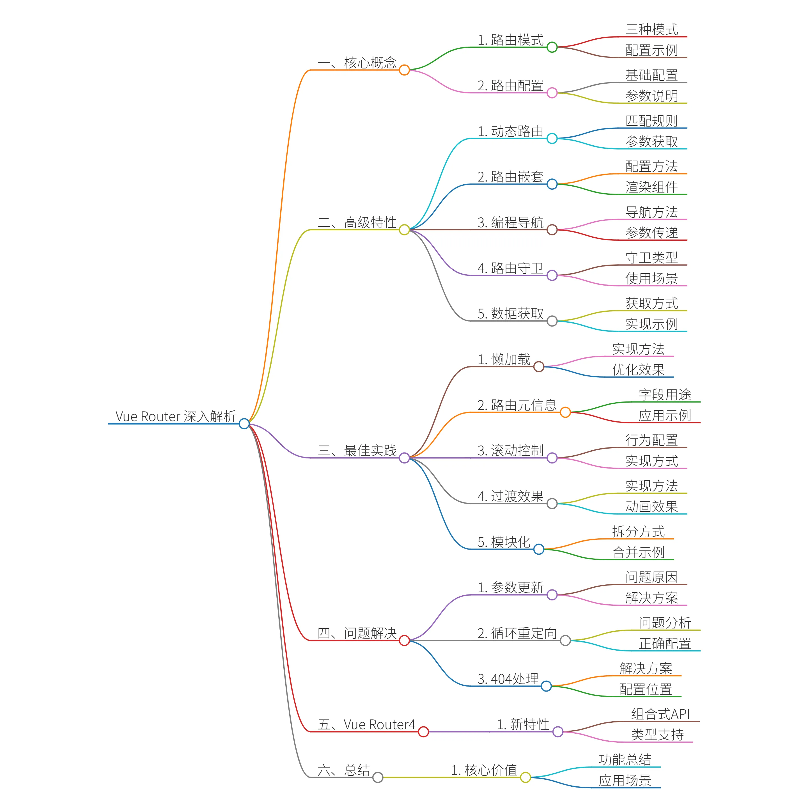
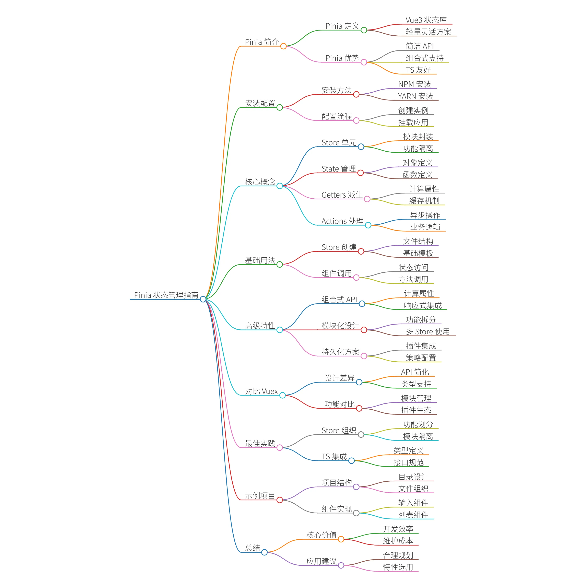
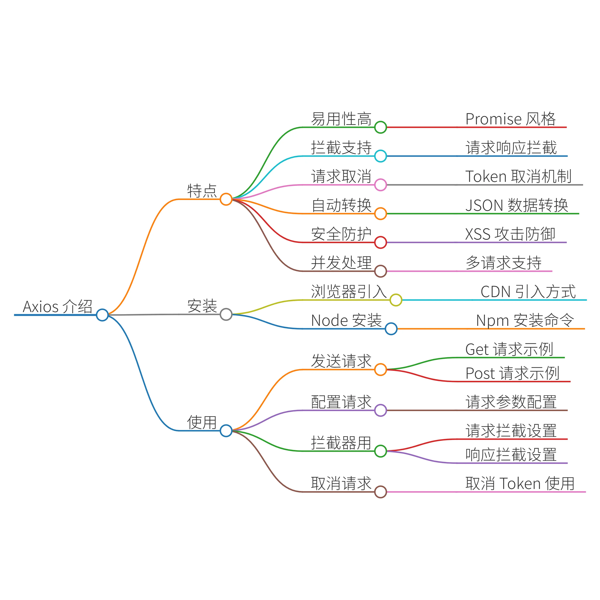

以下是 Vue 3 语法从基础到进阶的完整学习路径，结合代码示例和核心概念解析，帮助你系统掌握 Vue 3 的开发技能：

## **一****、Vue 3 基础语法**

### 1. **创****建 Vue 3 项目**

使用 Vite 快速创建项目（推荐）：

```
npm create vite@latest my-vue3-app -- --template vue
cd my-vue3-app
npm install
npm run dev
```


### 2. **模****板语法**

#### （1）插值表达式

```
<template>  <div>{{ message }}</div>  <!-- 动态显示数据 --></template>
<script setup>import { ref } from 'vue'const message = ref('Hello Vue 3!')</script>
```


#### （2）指令

- `v``-bind`（简写 `:`）：动态绑定属性

- `v``-on`（简写 `@`）：绑定事件

- `v``-model`：双向数据绑定

- `v``-if`/`v``-show`：条件渲染

- `v``-for`：列表渲染

```
<template>
  <div :class="isActive ? 'active' : ''">{{ message }}</div>  <!-- v-bind -->
  <button @click="handleClick">点击</button>                  <!-- v-on -->
  <input v-model="inputValue" />                             <!-- v-model -->
  <div v-if="isVisible">可见内容</div>                        <!-- v-if -->
  <div v-for="item in list" :key="item.id">{{ item.name }}</div>  <!-- v-for -->
</template>
```


### 3. **响****应式数据**

Vue 3 使用 `r``ef` 和 `r``eactive` 定义响应式数据：

```
import { ref, reactive } from 'vue'
// 基本类型用 refconst count = ref(0)
// 对象/数组用 reactiveconst user = reactive({  name: 'Alice',  age: 25})
```


### 4. **事****件处理**

```
<template>  <button @click="increment">点击 +1</button></template>
<script setup>import { ref } from 'vue'const count = ref(0)const increment = () => {  count.value++  // 注意：ref 需要通过 .value 访问}</script>
```


## **二****、Vue 3 进阶语法**

### 1. **组****合式 API (Composition API)**

#### （1）`s``etup()` 函数（选项式 API 的替代）

```
export default {
  setup() {
    const count = ref(0)
    const increment = () => count.value++
    return { count, increment }  // 暴露给模板
  }
}
```


#### （2）`<``script setup>` 语法糖（更简洁的写法）

```
<script setup>
import { ref } from 'vue'
const count = ref(0)
const increment = () => count.value++
</script>
```


### 2. **生****命周期钩子？**

Vue 3 的生命周期钩子需要从 `v``ue` 中导入：

```
import { onMounted, onUpdated, onUnmounted } from 'vue'
onMounted(() => {  console.log('组件挂载完成')})
onUpdated(() => {  console.log('组件更新完成')})
onUnmounted(() => {  console.log('组件卸载')})
```


### 3. **计****算属性和侦听器**

#### （1）计算属性 (`c``omputed`)

```
import { ref, computed } from 'vue'
const count = ref(0)
const doubleCount = computed(() => count.value * 2)  // 自动依赖 count
```


#### （2）侦听器 (`w``atch` 和 `w``atchEffect`)

```
import { ref, watch, watchEffect } from 'vue'
// 监听单个数据watch(count, (newValue, oldValue) => {  console.log(`count 从 ${oldValue} 变为 ${newValue}`)})
// 自动追踪依赖（类似自动 watch）watchEffect(() => {  console.log('count 变化了:', count.value)})
```


### 4. **组****件通信**

#### （1）Props 和 Emits

```
<!-- 父组件 --><template>  <Child :message="msg" @update="handleUpdate" /></template>
<script setup>import Child from './Child.vue'const msg = ref('Hello')const handleUpdate = (newMsg) => {  msg.value = newMsg}</script>
<!-- 子组件 --><script setup>const props = defineProps(['message'])  // 接收 propsconst emit = defineEmits(['update'])    // 定义 emitsconst handleClick = () => {  emit('update', 'New Message')         // 触发事件}</script>
```


#### （2）Provide/Inject（跨层级通信）

```
// 祖先组件import { provide, ref } from 'vue'const theme = ref('dark')provide('theme', theme)  // 提供数据
// 后代组件import { inject } from 'vue'const theme = inject('theme')  // 注入数据
```


### 5. **状****态管理 (Pinia)**

Pinia 是 Vue 3 推荐的状态管理库，比 Vuex 更简洁：

```
// stores/counter.jsimport { defineStore } from 'pinia'export const useCounterStore = defineStore('counter', {  state: () => ({ count: 0 }),  actions: {    increment() {      this.count++    }  }})
// 组件中使用import { useCounterStore } from '@/stores/counter'const counter = useCounterStore()counter.increment()
```


## **三****、Vue 3 高级特性**

### 1. **T****eleport（瞬态传送）**

将组件渲染到 DOM 的任意位置（如弹窗、Toast）：

```
<template>
  <button @click="showModal = true">打开弹窗</button>
  <Teleport to="body">
    <div v-if="showModal" class="modal">
      这是一个弹窗
    </div>
  </Teleport>
</template>
```


### 2. **S****uspense（异步组件加载）**

处理异步组件的加载状态：

```
<template>  <Suspense>    <template #default>      <AsyncComponent />  <!-- 异步组件 -->    </template>    <template #fallback>      <div>加载中...</div>  <!-- 加载中的 fallback -->    </template>  </Suspense></template>
<script setup>const AsyncComponent = defineAsyncComponent(() =>  import('./AsyncComponent.vue'))</script>
```


### 3. **自****定义指令**

创建全局或局部指令：

```
// 全局指令app.directive('focus', {  mounted(el) {    el.focus()  // 自动聚焦  }})
// 局部指令const vHighlight = {  mounted(el, binding) {    el.style.backgroundColor = binding.value  }}
```


### 4. **性****能优化技巧**

- `**v**``**-once**`：只渲染一次，后续不再更新

- `**v**``**-memo**`：缓存部分模板（Vue 3.2+）

- **虚****拟滚动**：优化长列表渲染（如 `v``ue-virtual-scroller`）

## **四****、学习资源推荐**

1. **官****方文档**：[Vue 3 官方指南](https://vuejs.org/)

1. **实****战项目**：

- [Vue 3 + Vite + TypeScript 模板](https://github.com/vuejs/core/tree/main/packages/playground)

- [Vue 3 + Pinia + Element Plus 后台管理系统](https://github.com/jzfai/vue3-admin-plus)

1. **在****线课程**：

- Vue Mastery（英文）

- 慕课网/极客时间（中文）

通过以上内容，你可以从基础到进阶逐步掌握 Vue 3 的核心语法和高级特性。建议结合实际项目练习，加深理解！ 🚀


# Vue 3 全面深入学习路径（从基础到专家级）

以下是更全面详细的 Vue 3 学习路径脑图，包含基础语法、核心概念、高级特性、性能优化和最佳实践：

## Vue 3 知识体系脑图（详细版）

### 一、基础语法

1. **模****板语法**

- 插值：`{``{ }}`、`v``-text`、`v``-html`

- 指令：`v``-bind`（属性绑定）、`v``-on`（事件绑定）、`v``-model`（双向绑定）

- 动态参数：`:``[attr]`、`@``[event]`

- 修饰符：`.``prevent`、`.``stop`、`.``capture`、`.``self`、`.``once`、`.``passive`

1. **响****应式基础**

- `r``ef`：处理基本类型和引用类型

- `r``eactive`：处理对象类型

- `t``oRef`/`t``oRefs`：响应式对象属性转换

- `s``hallowRef`/`s``hallowReactive`：浅层响应式

- `r``eadonly`/`s``hallowReadonly`：只读响应式

1. **计****算属性与侦听器**

- `c``omputed`：基于依赖的缓存计算值

- `w``atch`：侦听特定数据源的变化

- `w``atchEffect`：自动追踪依赖的副作用函数

- `w``atchPostEffect`：DOM更新后执行

- `w``atchSyncEffect`：同步执行

1. **条****件与循环**

- `v``-if`/`v``-else`/`v``-else-if`：条件渲染

- `v``-show`：切换CSS显示

- `v``-for`：列表渲染（含`:``key`重要性）

- `v``-for`与`v``-if`优先级问题

1. **样****式绑定**

- 类绑定：`:``class`（对象、数组语法）

- 样式绑定：`:``style`（对象、数组语法）

- 作用域样式：`s``coped`属性

- CSS模块：`:``module`

### 二、核心概念

1. **组****件基础**

- 单文件组件(SFC)结构

- Props：类型验证、默认值、required

- 自定义事件：`e``mit`机制

- 插槽：默认插槽、具名插槽、作用域插槽

- 动态组件：`<``component :is>`

- 异步组件：`d``efineAsyncComponent`

1. **生****命周期**

- 选项式API生命周期钩子

- 组合式API生命周期钩子：

- `o``nBeforeMount`/`o``nMounted`

- `o``nBeforeUpdate`/`o``nUpdated`

- `o``nBeforeUnmount`/`o``nUnmounted`

- `o``nErrorCaptured`/`o``nRenderTracked`/`o``nRenderTriggered`

1. **组****合式API**

- `s``etup()`函数详解

- `<``script setup>`语法糖

- 响应式工具函数：`i``sRef`、`u``nref`、`t``oRef`等

- 依赖注入：`p``rovide`/`i``nject`

- 模板引用：`r``ef`属性与`$``refs`

1. **自****定义指令**

- 全局指令：`a``pp.directive()`

- 局部指令：组件内directives选项

- 指令钩子函数：`c``reated`、`b``eforeMount`、`m``ounted`等

- 指令参数：`e``l`、`b``inding`、`v``node`、`p``revVnode`

### 三、进阶特性

1. **组****件通信**

- Props/Emits：父子通信

- `v``-model`双向绑定：支持多个`v``-model`

- `$``attrs`/`$``listeners`（Vue3中合并到`$``attrs`）

- 事件总线：使用`m``itt`库

- Vuex/Pinia状态管理

1. **渲****染机制**

- 虚拟DOM原理

- 渲染函数：`h``()`函数

- JSX语法支持

- 函数式组件

- 片段组件（多根节点）

1. **T****ypeScript集成**

- 类型定义：`d``efineComponent`

- Props类型声明

- Emits类型声明

- Ref类型标注

- 组件实例类型

1. **高****级响应式**

- `c``ustomRef`：自定义ref实现

- `e``ffectScope`：副作用作用域

- `m``arkRaw`：标记非响应式对象

- `s``hallowRef`/`s``hallowReactive`应用场景

### 四、高级特性

1. **T****eleport**

- 将组件渲染到DOM任意位置

- 使用场景：模态框、通知、工具提示

- 与`t``o`属性配合使用

1. **S****uspense**

- 异步组件加载状态管理

- `#``default`和`#``fallback`插槽

- 与`d``efineAsyncComponent`配合

1. **服****务端渲染(SSR)**

- Nuxt.js框架

- 客户端激活(hydration)

- 数据预取

- SEO优化

1. **编****译器宏**

- `d``efineProps`/`d``efineEmits`

- `d``efineExpose`：暴露组件属性

- `w``ithDefaults`：Props默认值

### 五、状态管理

1. **P****inia**

- Store定义：`d``efineStore`

- State、Getters、Actions

- 插件系统

- 持久化存储

- 与Vue DevTools集成

1. **V****uex 4**

- 核心概念：State、Getters、Mutations、Actions

- 模块系统

- 组合式API使用

### 六、路由管理

1. **V****ue Router 4**

- 路由配置：动态路由、嵌套路由

- 导航守卫：全局、路由独享、组件内

- 路由懒加载

- 组合式API使用：`u``seRouter`、`u``seRoute`

- 滚动行为控制

### 七、性能优化

1. **编****译优化**

- 静态节点提升

- 补丁标记(Patch Flags)

- 树摇优化(Tree-shaking)

1. **运****行时优化**

- `v``-once`：只渲染一次

- `v``-memo`：缓存模板片段(Vue 3.2+)

- 虚拟滚动：`v``ue-virtual-scroller`

- 懒加载：图片、组件

1. **代****码分割**

- 路由级代码分割

- 组件级代码分割

- Prefetch策略

### 八、测试

1. **单****元测试**

- Vitest测试框架

- Vue Test Utils

- 测试组件：渲染、Props、事件

- 测试组合式函数

1. **端****到端测试**

- Cypress

- Playwright

- 用户流程测试

### 九、工程化

1. **构****建工具**

- Vite：极速开发体验

- Vue CLI：传统构建工具

- Rollup打包配置

1. **代****码规范**

- ESLint：`e``slint-plugin-vue`

- Prettier：代码格式化

- Stylelint：样式规范

1. **部****署**

- 静态资源部署

- SSR部署

- Docker容器化

- CI/CD集成

### 十、最佳实践

1. **组****件设计**

- 单一职责原则

- 组件组合模式

- 无渲染组件

- 高阶组件(HOC)

1. **状****态管理策略**

- 状态提升

- 状态下沉

- 状态模块化

1. **性****能监控**

- Vue DevTools性能分析

- Lighthouse性能检测

- 错误监控：Sentry

1. **安****全实践**

- XSS防护

- CSRF防护

- 输入验证

- 内容安全策略(CSP)

### 十一、生态系统

1. **U****I框架**

- Element Plus

- Vant

- Naive UI

- Quasar

1. **工****具库**

- VueUse：组合式工具集

- Vue I18n：国际化

- Vue DatePicker：日期选择

- Vue ChartJS：图表

1. **动****画库**

- Vue Transition

- GSAP集成

- Anime.js

### 十二、进阶主题

1. **自****定义渲染器**

- 创建Canvas渲染器

- 终端渲染

- WebGL集成

1. **微****前端**

- 基于Web Components

- Module Federation

- Qiankun框架

1. **桌****面应用**

- Electron + Vue

- Tauri + Vue

1. **移****动应用**

- Capacitor + Vue

- NativeScript + Vue

### 学习资源

1. **官****方文档**

- Vue 3官方文档

- Vue Router文档

- Pinia文档

- Vite文档

1. **书****籍**

- 《Vue.js设计与实现》

- 《深入浅出Vue.js》

- 《Vue 3实战》

1. **社****区**

- Vue论坛

- GitHub开源项目

- Stack Overflow

1. **视****频课程**

- Vue Mastery

- Udemy Vue课程

- B站免费教程

这个全面的学习路径涵盖了Vue 3的所有重要方面，从基础语法到高级主题，从核心概念到性能优化，以及相关的生态系统和工具链。建议按照这个路径逐步深入学习，结合实际项目实践来巩固知识。

# Vue Router 深入解析

Vue Router 是 Vue.js 官方的路由管理器，它与 Vue.js 深度集成，为单页面应用(SPA)提供了强大的路由功能。下面我将从核心概念、高级特性到最佳实践，全面深入地讲解 Vue Router。

## 一、核心概念

### 1. 路由模式

Vue Router 提供三种路由模式：

1. **h****ash 模式** (默认)

- URL 形式：` ``http://example.com/#/home`

- 原理：利用 URL 的 hash (#) 部分进行路由

- 特点：兼容性好，不需要服务器端配置

1. **h****istory 模式**

- URL 形式：` ``http://example.com/home`

- 原理：利用 HTML5 History API 实现

- 特点：URL 更简洁，但需要服务器端配置支持

1. **a****bstract 模式**

- 用于非浏览器环境(如 Node.js 服务端渲染)

- 不依赖浏览器 API

```
const router = createRouter({
  history: createWebHistory(), // history 模式
  // history: createWebHashHistory(), // hash 模式
  routes
})
```


### 2. 路由配置

路由配置是 Vue Router 的核心，主要包含：

```
const routes = [
  {
    path: '/home',          // 路径
    name: 'Home',           // 路由名称
    component: Home,        // 组件
    alias: '/index',        // 别名
    redirect: '/welcome',   // 重定向
    props: true,            // 路由参数作为 props 传递
    meta: { requiresAuth: true }, // 路由元信息
    children: [             // 子路由
      {
        path: 'dashboard',
        component: Dashboard
      }
    ]
  }
]
```


## 二、高级特性

### 1. 动态路由匹配

动态路由允许我们匹配参数化的 URL：

```
{
  path: '/user/:id',
  component: User
}
```


在组件中可以通过 `u``seRoute()` 获取参数：

```
import { useRoute } from 'vue-router'
const route = useRoute()
console.log(route.params.id) // 获取动态参数
```


高级动态匹配：

```
{
  path: '/user/:id(\\d+)', // 只匹配数字ID
  component: User
}
```


### 2. 路由嵌套

通过 `c``hildren` 属性实现嵌套路由：

```
{
  path: '/settings',
  component: Settings,
  children: [
    {
      path: 'profile',
      component: ProfileSettings
    },
    {
      path: 'account',
      component: AccountSettings
    }
  ]
}
```


父组件中需要包含 `<``router-view>` 来渲染子路由：

```
<!-- Settings.vue -->
<template>
  <div>
    <h1>Settings</h1>
    <nav>
      <router-link to="/settings/profile">Profile</router-link>
      <router-link to="/settings/account">Account</router-link>
    </nav>
    <router-view></router-view> <!-- 子路由渲染位置 -->
  </div>
</template>
```


### 3. 编程式导航

除了 `<``router-link>` 的声明式导航，Vue Router 还提供了编程式导航：

```
// 字符串路径router.push('/home')
// 带参数的对象形式router.push({ path: '/user', query: { id: '123' } })
// 命名的路由router.push({ name: 'user', params: { id: '123' } })
// 替换当前路由(无历史记录)router.replace({ path: '/home' })
// 前进/后退router.go(1) // 前进一页router.go(-1) // 后退一页
```


### 4. 路由守卫

路由守卫用于控制路由访问权限：

1. **全****局前置守卫**：

```
router.beforeEach((to, from, next) => {
  if (to.meta.requiresAuth && !isLoggedIn()) {
    next('/login')
  } else {
    next()
  }
})
```


1. **全****局解析守卫**：

```
router.beforeResolve((to, from, next) => {
  // 在导航被确认之前执行
  next()
})
```


1. **全****局后置钩子**：

```
router.afterEach((to, from) => {
  // 不需要调用 next()
  logPageView(to.path)
})
```


1. **路****由独享守卫**：

```
{
  path: '/admin',
  component: Admin,
  beforeEnter: (to, from, next) => {
    if (isAdmin()) next()
    else next('/403')
  }
}
```


1. **组****件内守卫**：

```
import { onBeforeRouteLeave, onBeforeRouteUpdate } from 'vue-router'
export default {  setup() {    onBeforeRouteLeave((to, from, next) => {      const answer = window.confirm('确定离开吗？')      if (answer) next()      else next(false)    })        onBeforeRouteUpdate(async (to, from, next) => {      // 当路由参数变化时执行      await fetchData(to.params.id)      next()    })  }}
```


### 5. 数据获取

Vue Router 提供了几种在路由导航时获取数据的方式：

1. **导****航完成前获取**：

```
{
  path: '/user/:id',
  component: User,
  async beforeEnter(to, from, next) {
    to.params.user = await fetchUser(to.params.id)
    next()
  }
}
```


1. **组****件内获取**：

```
import { onBeforeRouteUpdate } from 'vue-router'
export default {  async setup() {    const route = useRoute()    const user = ref(null)        const fetchUser = async (id) => {      user.value = await api.getUser(id)    }        // 初始加载    fetchUser(route.params.id)        // 参数变化时重新加载    onBeforeRouteUpdate(async (to, from, next) => {      fetchUser(to.params.id)      next()    })        return { user }  }}
```


## 三、最佳实践

### 1. 路由懒加载

使用动态导入实现路由懒加载，提升应用性能：

```
const routes = [
  {
    path: '/home',
    component: () => import('../views/Home.vue') // 懒加载
  }
]
```


结合 Webpack 的魔法注释：

```
component: () => import(/* webpackChunkName: "home" */ '../views/Home.vue')
```


### 2. 路由元信息

利用 `m``eta` 字段实现权限控制、页面标题等功能：

```
{
  path: '/admin',
  component: Admin,
  meta: {
    requiresAuth: true,
    title: 'Admin Dashboard'
  }
}
```


全局前置守卫中处理：

```
router.beforeEach((to, from, next) => {
  document.title = to.meta.title || 'Default Title'
  
  if (to.meta.requiresAuth && !isLoggedIn()) {
    next('/login')
  } else {
    next()
  }
})
```


### 3. 滚动行为控制

自定义路由切换时的滚动行为：

```
const router = createRouter({
  history: createWebHistory(),
  routes,
  scrollBehavior(to, from, savedPosition) {
    if (savedPosition) {
      return savedPosition // 返回之前保存的位置
    } else if (to.hash) {
      return { el: to.hash, behavior: 'smooth' } // 锚点滚动
    } else {
      return { top: 0 } // 默认滚动到顶部
    }
  }
})
```


### 4. 路由过渡效果

结合 Vue 的 `<``transition>` 组件实现路由切换动画：

```
<template>  <router-view v-slot="{ Component }">    <transition name="fade" mode="out-in">      <component :is="Component" />    </transition>  </router-view></template>
<style>.fade-enter-active,.fade-leave-active {  transition: opacity 0.3s ease;}
.fade-enter-from,.fade-leave-to {  opacity: 0;}</style>
```


### 5. 路由模块化

对于大型应用，建议将路由配置拆分为多个模块：

```
src/
├── router/
│   ├── index.js          # 主路由配置
│   ├── routes/
│   │   ├── auth.js       # 认证相关路由
│   │   ├── admin.js      # 管理后台路由
│   │   ├── user.js       # 用户相关路由
│   │   └── index.js      # 合并所有路由
```


合并路由示例：

```
// router/routes/index.jsimport authRoutes from './auth'import adminRoutes from './admin'import userRoutes from './user'
export default [  ...authRoutes,  ...adminRoutes,  ...userRoutes]
```


## 四、常见问题与解决方案

### 1. 路由参数变化但组件不更新

**问****题**：当路由参数变化时(如从 `/``user/1` 到 `/``user/2`)，组件不会重新创建。

**解****决方案**：

1. 使用 `w``atch` 监听 `$``route` 变化：

```
import { watch } from 'vue'import { useRoute } from 'vue-router'
export default {  setup() {    const route = useRoute()        watch(      () => route.params.id,      (newId) => {        // 获取新数据        fetchData(newId)      }    )  }}
```


1. 使用 `o``nBeforeRouteUpdate` 守卫：

```
import { onBeforeRouteUpdate } from 'vue-router'
export default {  setup() {    onBeforeRouteUpdate(async (to, from, next) => {      await fetchData(to.params.id)      next()    })  }}
```


### 2. 路由循环重定向

**问****题**：配置了错误的重定向导致无限循环。

**解****决方案**：确保重定向条件明确，避免循环：

```
// 错误示例 - 可能导致循环{  path: '/home',  redirect: '/home' // 错误！}
// 正确示例{  path: '/home',  redirect: '/dashboard'}
```


### 3. 404 页面处理

**解****决方案**：添加通配符路由：

```
{
  path: '/:pathMatch(.*)*', // 匹配所有路径
  component: NotFound
}
```


注意：此路由应放在路由配置的最后。

## 五、Vue Router 4 新特性

Vue Router 4 是为 Vue 3 设计的版本，主要新特性包括：

1. **组****合式 API**：

- `u``seRouter()` 替代 `t``his.$router`

- `u``seRoute()` 替代 `t``his.$route`

1. **新****的组件**：

- `<``router-link>` 增强

- `<``router-view>` 支持 v-slot API

1. **改****进的类型支持**：

- 完整的 TypeScript 支持

1. **新****的导航守卫**：

- `o``nBeforeRouteLeave`

- `o``nBeforeRouteUpdate`

1. **性****能优化**：

- 更小的包体积

- 更高效的匹配算法

## 六、总结

Vue Router 是构建 Vue.js 单页应用的核心工具，掌握它的高级特性可以：

1. 实现复杂的路由结构和导航逻辑

1. 构建权限控制系统

1. 优化应用性能(懒加载、过渡效果)

1. 提升用户体验(滚动行为、过渡动画)

通过模块化组织路由配置、合理使用导航守卫和数据获取策略，可以构建出既强大又易于维护的 Vue 应用路由系统。





Pinia 是 Vue.js 生态系统中一个非常流行的状态管理库，旨在为 Vue 3 应用程序提供高效、灵活且直观的状态管理解决方案。它与 Vuex 类似，但在设计理念和使用方式上有许多创新和改进。本文将深入讲解 Pinia 的各个方面，包括其核心概念、安装与配置、基本用法、高级特性以及最佳实践。

## 目录

1. 

1. 

1. 

1. 

- 

- 

- 

- 

- 

1. 

- 

- 

1. 

- 

- 

- 

- 

1. 

1. 

1. 

1. 

## 什么是 Pinia？

Pinia 是一个专为 Vue 3 设计的状态管理库，旨在提供更轻量、更灵活的状态管理解决方案。它的设计受到了 Vuex 的启发，但通过引入组合式 API 和其他现代化特性，使得状态管理更加直观和易于维护。

## 为什么选择 Pinia？

相比于 Vuex，Pinia 具有以下优势：

1. **更****简洁的 API**：Pinia 的 API 更加简洁，减少了样板代码，提升了开发效率。

1. **组****合式 API 支持**：与 Vue 3 的组合式 API 完全集成，使得状态管理更加灵活和可组合。

1. **更****好的 TypeScript 支持**：内置了对 TypeScript 的良好支持，提供更好的类型推断和自动补全。

1. **无****突变（Mutation）**：Pinia 不再需要显式的 mutations，所有状态变更都在 actions 中进行，简化了状态管理流程。

1. **模****块化和命名空间**：支持模块化 Store，便于管理大型应用的状态。

1. **轻****量级**：Pinia 的体积更小，对应用的性能影响更低。

## 安装与配置

### 安装 Pinia

使用 npm 或 yarn 安装 Pinia：

```
npm install pinia
# 或者
yarn add pinia
```


### 配置 Pinia

在 Vue 3 项目中，需要在入口文件（通常是 `m``ain.js` 或 `m``ain.ts`）中设置 Pinia：

```
// main.jsimport { createApp } from 'vue'import App from './App.vue'import { createPinia } from 'pinia'
const app = createApp(App)
// 创建 Pinia 实例并挂载到 Vue 应用const pinia = createPinia()app.use(pinia)
app.mount('#app')
```


## 核心概念

### Store

Store 是 Pinia 中管理状态的核心单元。每个 Store 通常对应应用中的一个模块或功能，封装了该模块的状态、获取状态的方法（getters）、修改状态的方法（actions）以及同步修改状态的方法（mutations，可选）。

### State

State 是 Store 中存储的应用状态。Pinia 提供了多种定义 state 的方式，包括对象方式和函数方式。

**对****象方式：**

```
import { defineStore } from 'pinia'
export const useCounterStore = defineStore('counter', {  state: {    count: 0  }})
```


**函****数方式：**

```
import { defineStore } from 'pinia'
export const useCounterStore = defineStore('counter', () => {  const count = ref(0)  return { count }})
```


### Getters

Getters 用于派生状态，类似于计算属性。它们基于 state 计算得出，并且可以被缓存。

```
import { defineStore } from 'pinia'
export const useCounterStore = defineStore('counter', {  state: () => ({    count: 0  }),  getters: {    doubleCount(state) {      return state.count * 2    },    isPositive(state) {      return state.count > 0    }  }})
```


在组件中使用 getters：

```
<template>  <div>    Count: {{ count }} | Double Count: {{ doubleCount }} | Is Positive: {{ isPositive }}  </div></template>
<script setup>import { useCounterStore } from '@/stores/counter'
const store = useCounterStore()
// 访问 stateconst count = store.count
// 访问 gettersconst doubleCount = store.doubleCountconst isPositive = store.isPositive</script>
```


### Actions

Actions 用于处理异步操作和复杂的业务逻辑。它们可以提交 mutations 或直接修改 state。

```
import { defineStore } from 'pinia'
export const useCounterStore = defineStore('counter', {  state: () => ({    count: 0  }),  actions: {    increment() {      this.count++    },    decrement() {      this.count--    },    async fetchData() {      // 异步操作      const data = await fetchSomeData()      this.count = data.count    }  }})
```


在组件中调用 actions：

```
<template>  <button @click="increment">Increment</button>  <button @click="decrement">Decrement</button>  <button @click="fetchData">Fetch Data</button></template>
<script setup>import { useCounterStore } from '@/stores/counter'
const store = useCounterStore()
const increment = () => store.increment()const decrement = () => store.decrement()const fetchData = () => store.fetchData()</script>
```


### Mutations

在 Pinia 中，mutations 是可选的。所有的状态变更都可以在 actions 中直接进行，无需显式地定义 mutations。然而，如果你需要更细粒度的控制，仍然可以使用 mutations。

```
import { defineStore } from 'pinia'
export const useCounterStore = defineStore('counter', {  state: () => ({    count: 0  }),  mutations: {    setCount(state, value) {      state.count = value    }  },  actions: {    updateCount(value) {      this.setCount(value)    }  }})
```


## 基本用法

### 创建 Store

创建一个 Store 文件，例如 `s``rc/stores/counter.js`：

```
import { defineStore } from 'pinia'
export const useCounterStore = defineStore('counter', {  state: () => ({    count: 0  }),  getters: {    doubleCount(state) {      return state.count * 2    }  },  actions: {    increment() {      this.count++    },    decrement() {      this.count--    }  }})
```


### 在组件中使用 Store

在 Vue 组件中，可以通过 `u``seStore` 函数访问 Store：

```
<template>  <div>    <p>Count: {{ count }}</p>    <p>Double Count: {{ doubleCount }}</p>    <button @click="increment">Increment</button>    <button @click="decrement">Decrement</button>  </div></template>
<script setup>import { useCounterStore } from '@/stores/counter'
const store = useCounterStore()
const count = store.countconst doubleCount = store.doubleCount
const increment = () => store.increment()const decrement = () => store.decrement()</script>
```


## 高级特性

### 组合式 API

Pinia 完全支持 Vue 3 的组合式 API，使得状态管理更加灵活和可组合。

```
<script setup>import { useCounterStore } from '@/stores/counter'import { computed } from 'vue'
const store = useCounterStore()
const count = computed(() => store.count)const doubleCount = computed(() => store.doubleCount)
const increment = () => store.increment()const decrement = () => store.decrement()</script>
```


### 模块化 Store

Pinia 支持将 Store 拆分为多个模块，便于管理大型应用的状态。

```
// src/stores/user.jsimport { defineStore } from 'pinia'
export const useUserStore = defineStore('user', {  state: () => ({    name: 'John Doe',    age: 30  }),  getters: {    fullName(state) {      return `${state.name} (${state.age})`    }  },  actions: {    updateName(name) {      this.name = name    }  }})
```


```
// src/stores/posts.jsimport { defineStore } from 'pinia'
export const usePostsStore = defineStore('posts', {  state: () => ({    posts: []  }),  actions: {    fetchPosts() {      // 异步获取帖子数据      this.posts = [        { id: 1, title: 'First Post' },        { id: 2, title: 'Second Post' }      ]    }  }})
```


在组件中使用多个 Store：

```
<template>  <div>    <h1>User Info</h1>    <p>Name: {{ user.name }}</p>    <p>Age: {{ user.age }}</p>    <button @click="updateName">Update Name</button>
    <h1>Posts</h1>    <ul>      <li v-for="post in posts" :key="post.id">{{ post.title }}</li>    </ul>    <button @click="fetchPosts">Fetch Posts</button>  </div></template>
<script setup>import { useUserStore } from '@/stores/user'import { usePostsStore } from '@/stores/posts'
const userStore = useUserStore()const postsStore = usePostsStore()
const updateName = () => userStore.updateName('Jane Doe')const fetchPosts = () => postsStore.fetchPosts()</script>
```


### 持久化存储

Pinia 本身不提供持久化存储的功能，但可以结合第三方库（如 `p``inia-plugin-persistedstate`）实现状态的持久化。

首先，安装插件：

```
npm install pinia-plugin-persistedstate
# 或者
yarn add pinia-plugin-persistedstate
```


然后，在 Pinia 实例中配置插件：

```
// main.jsimport { createApp } from 'vue'import App from './App.vue'import { createPinia } from 'pinia'import piniaPluginPersistedstate from 'pinia-plugin-persistedstate'
const app = createApp(App)
const pinia = createPinia()pinia.use(piniaPluginPersistedstate)
app.use(pinia)
app.mount('#app')
```


在 Store 中配置需要持久化的状态：

```
// src/stores/user.jsimport { defineStore } from 'pinia'
export const useUserStore = defineStore('user', {  state: () => ({    name: 'John Doe',    age: 30  }),  getters: {    fullName(state) {      return `${state.name} (${state.age})`    }  },  actions: {    updateName(name) {      this.name = name    }  },  persist: {    enabled: true,    strategies: [      {        key: 'user',        paths: ['name', 'age']      }    ]  }})
```


### 插件与中间件

Pinia 支持通过插件扩展其功能。插件可以在 Store 创建前后执行自定义逻辑。

创建一个简单的插件：

```
// src/plugins/logger.js
export default function loggerPlugin({ store }) {
  console.log(`Store "${store.$id}" has been initialized`)
}
```


在 Pinia 实例中注册插件：

```
// main.jsimport { createApp } from 'vue'import App from './App.vue'import { createPinia } from 'pinia'import loggerPlugin from './plugins/logger'
const app = createApp(App)
const pinia = createPinia()pinia.use(loggerPlugin)
app.use(pinia)
app.mount('#app')
```


## 与 Vuex 的比较

Pinia 和 Vuex 都是 Vue.js 的状态管理库，但它们在设计理念和使用方式上有显著的区别。

| 特性                    | Vuex                                        | Pinia                          |
| ----------------------- | ------------------------------------------- | ------------------------------ |
| **A****PI 设计**        | 基于 mutations 和 actions                   | 基于 actions，mutations 可选   |
| **T****ypeScript 支持** | 较弱                                        | 强大，内置类型推断             |
| **语****法糖**          | 需要使用辅助函数（如 mapState、mapActions） | 组合式 API，无需辅助函数       |
| **模****块化**          | 支持模块化，但命名空间较繁琐                | 支持模块化，语法更简洁         |
| **插****件系统**        | 支持插件                                    | 支持插件，更灵活               |
| **持****久化**          | 需要借助第三方库                            | 需要借助第三方库，但集成更简单 |
| **大****小**            | 较大                                        | 较小，更轻量                   |

总体而言，Pinia 在设计上更加现代化，与 Vue 3 的组合式 API 更加契合，提供了更好的开发体验和更高的灵活性。

## 最佳实践

### 1. 按功能划分 Store

将 Store 按功能模块划分，有助于管理和维护大型应用的状态。

```
// src/stores/auth.jsimport { defineStore } from 'pinia'
export const useAuthStore = defineStore('auth', {  state: () => ({    user: null,    token: null  }),  getters: {    isLoggedIn(state) {      return !!state.token    }  },  actions: {    login(credentials) {      // 登录逻辑    },    logout() {      // 登出逻辑    }  }})
```


### 2. 使用组合式 API

充分利用 Pinia 的组合式 API，使代码更加简洁和可维护。

```
<template>  <div>    <h1>Welcome, {{ user.name }}!</h1>    <button @click="logout">Logout</button>  </div></template>
<script setup>import { useAuthStore } from '@/stores/auth'
const authStore = useAuthStore()
const user = computed(() => authStore.user)
const logout = () => authStore.logout()</script>
```


### 3. 持久化重要状态

对于需要持久化的状态，使用插件进行管理，确保状态在页面刷新后依然存在。

```
// src/stores/settings.jsimport { defineStore } from 'pinia'
export const useSettingsStore = defineStore('settings', {  state: () => ({    theme: 'light',    language: 'en'  }),  persist: {    enabled: true,    strategies: [      {        key: 'settings',        paths: ['theme', 'language']      }    ]  }})
```


### 4. 避免过度使用全局状态

尽量将状态限制在需要的范围内，避免将所有状态都集中在全局 Store 中，这有助于提高应用的可维护性和性能。

### 5. 使用 TypeScript 增强类型安全

充分利用 TypeScript 为 Store 定义类型，提升代码的可维护性和可靠性。

```
// src/stores/todo.tsimport { defineStore } from 'pinia'
interface Todo {  id: number  text: string  completed: boolean}
export const useTodoStore = defineStore('todo', {  state: (): { todos: Todo[] } => ({    todos: []  }),  getters: {    completedTodos(state): Todo[] {      return state.todos.filter(todo => todo.completed)    }  },  actions: {    addTodo(text: string) {      this.todos.push({ id: Date.now(), text, completed: false })    },    toggleTodo(id: number) {      const todo = this.todos.find(todo => todo.id === id)      if (todo) {        todo.completed = !todo.completed      }    }  }})
```


## 示例项目

为了更好地理解 Pinia 的使用，下面通过一个简单的待办事项（Todo）应用示例来演示 Pinia 的基本用法。

### 项目结构

```
src/
├── main.js
├── App.vue
└── stores/
    └── todo.js
```


### 安装依赖

首先，创建一个新的 Vue 3 项目并安装 Pinia：

```
npm create vue@latest my-todo-app
cd my-todo-app
npm install pinia
```


### 配置 Pinia

在 `m``ain.js` 中配置 Pinia：

```
// src/main.jsimport { createApp } from 'vue'import App from './App.vue'import { createPinia } from 'pinia'
const app = createApp(App)
const pinia = createPinia()app.use(pinia)
app.mount('#app')
```


### 创建 Todo Store

在 `s``rc/stores/todo.js` 中创建一个 Todo Store：

```
// src/stores/todo.jsimport { defineStore } from 'pinia'
interface Todo {  id: number  text: string  completed: boolean}
export const useTodoStore = defineStore('todo', {  state: (): { todos: Todo[] } => ({    todos: []  }),  getters: {    completedTodos(state): Todo[] {      return state.todos.filter(todo => todo.completed)    },    pendingTodos(state): Todo[] {      return state.todos.filter(todo => !todo.completed)    }  },  actions: {    addTodo(text: string) {      this.todos.push({ id: Date.now(), text, completed: false })    },    removeTodo(id: number) {      this.todos = this.todos.filter(todo => todo.id !== id)    },    toggleTodo(id: number) {      const todo = this.todos.find(todo => todo.id === id)      if (todo) {        todo.completed = !todo.completed      }    },    clearCompleted() {      this.todos = this.todos.filter(todo => !todo.completed)    }  }})
```


### 使用 Todo Store 在组件中

在 `A``pp.vue` 中使用 Todo Store 来管理待办事项列表：

```
<!-- src/App.vue --><template>  <div class="container">    <h1>Todo List</h1>    <TodoInput @add-todo="addTodo" />    <TodoList       :todos="todos"       :completed-todos="completedTodos"       @remove-todo="removeTodo"      @toggle-todo="toggleTodo"      @clear-completed="clearCompleted"    />  </div></template>
<script setup>import { useTodoStore } from '@/stores/todo'import TodoInput from './components/TodoInput.vue'import TodoList from './components/TodoList.vue'
const store = useTodoStore()
const todos = computed(() => store.todos)const completedTodos = computed(() => store.completedTodos)
const addTodo = (text) => {  store.addTodo(text)}
const removeTodo = (id) => {  store.removeTodo(id)}
const toggleTodo = (id) => {  store.toggleTodo(id)}
const clearCompleted = () => {  store.clearCompleted()}</script>
<style>.container {  max-width: 400px;  margin: 0 auto;  padding: 20px;}</style>
```


### 创建 Todo Input 组件

```
<!-- src/components/TodoInput.vue --><template>  <div class="input-group">    <input       type="text"       v-model="newTodo"       @keyup.enter="handleAddTodo"       placeholder="What needs to be done?"    />    <button @click="handleAddTodo">Add</button>  </div></template>
<script setup>import { ref } from 'vue'import { useTodoStore } from '@/stores/todo'
const newTodo = ref('')const store = useTodoStore()
const handleAddTodo = () => {  if (newTodo.value.trim()) {    store.addTodo(newTodo.value)    newTodo.value = ''  }}</script>
<style scoped>.input-group {  display: flex;  margin-bottom: 10px;}
input {  flex: 1;  padding: 8px;  font-size: 16px;}
button {  padding: 8px 12px;  font-size: 16px;  margin-left: 5px;}</style>
```


### 创建 Todo List 组件

```
<!-- src/components/TodoList.vue --><template>  <div>    <ul>      <TodoItem         v-for="todo in todos"         :key="todo.id"         :todo="todo"         @remove-todo="removeTodo"        @toggle-todo="toggleTodo"      />    </ul>    <div class="footer">      <span>{{ completedTodos.length }} of {{ todos.length }} completed</span>      <button @click="clearCompleted" :disabled="completedTodos.length === 0">Clear Completed</button>    </div>  </div></template>
<script setup>import { computed } from 'vue'import TodoItem from './TodoItem.vue'import { useTodoStore } from '@/stores/todo'
const store = useTodoStore()
const todos = computed(() => store.todos)const completedTodos = computed(() => store.completedTodos)
const removeTodo = (id) => {  store.removeTodo(id)}
const toggleTodo = (id) => {  store.toggleTodo(id)}
const clearCompleted = () => {  store.clearCompleted()}</script>
<style scoped>.footer {  display: flex;  justify-content: space-between;  align-items: center;  margin-top: 10px;}
button {  padding: 5px 10px;  font-size: 14px;}</style>
```


### 创建 Todo Item 组件

```
<!-- src/components/TodoItem.vue --><template>  <li class="todo-item">    <div class="checkbox" @click="toggleTodo">      <span :class="{ completed: todo.completed }"></span>    </div>    <span :class="{ completed: todo.completed }">{{ todo.text }}</span>    <button class="remove-btn" @click="removeTodo">Remove</button>  </li></template>
<script setup>import { defineProps } from 'vue'import { useTodoStore } from '@/stores/todo'
const props = defineProps({  todo: Object})
const store = useTodoStore()
const toggleTodo = () => {  store.toggleTodo(props.todo.id)}
const removeTodo = () => {  store.removeTodo(props.todo.id)}</script>
<style scoped>.todo-item {  display: flex;  align-items: center;  margin-bottom: 8px;}
.checkbox {  width: 20px;  height: 20px;  border: 1px solid #ccc;  border-radius: 3px;  margin-right: 10px;  position: relative;  cursor: pointer;}
.checkbox span {  position: absolute;  width: 100%;  height: 100%;  background-color: #4caf50;  transform: scale(0);  transition: transform 0.2s;}
.checkbox.completed span {  transform: scale(1);}
.todo-item span {  flex: 1;  cursor: pointer;}
.todo-item span.completed {  text-decoration: line-through;  color: #aaa;}
.remove-btn {  background: none;  border: none;  color: #ff5252;  font-size: 16px;  cursor: pointer;}
.remove-btn:hover {  color: #f44336;}</style>
```


### 运行项目

完成上述步骤后，运行项目：

```
npm run dev
```


打开浏览器访问 `h``ttp://localhost:3000`，即可看到一个简单的待办事项应用，利用 Pinia 管理状态。

## 总结

通过上述示例，我们展示了如何使用 Pinia 创建和管理 Vue 3 应用的状态。Pinia 提供了简洁且强大的 API，使得状态管理更加直观和易于维护。其组合式 API 的支持、良好的 TypeScript 集成以及灵活的模块化设计，使其成为现代 Vue 开发中一个非常有吸引力的选择。

在实际项目中，建议根据应用的需求和规模，合理组织 Store，并充分利用 Pinia 提供的各种特性，以提升开发效率和代码质量。





在 Vue.js 中，`p``rops`（Properties 的缩写）是父组件向子组件传递数据的**单****向通信机制**，它允许子组件接收外部（通常是父组件）传递的配置参数，并在组件内部使用这些数据。以下是关于 `p``rops` 的详细讲解：

## 一、`p``rops` 的核心作用

- **单****向数据流**：父组件通过 `p``rops` 向子组件传递数据，子组件**不****能直接修改** `p``rops` 的值（避免数据来源混乱）。

- **组****件解耦**：子组件通过声明 `p``rops` 明确依赖的外部数据，使组件更独立、可复用。

## 二、`p``rops` 的基本用法

### 1. 子组件中声明 `p``rops`

在子组件中，通过 `p``rops` 选项声明需要接收的外部数据：

```
<!-- ChildComponent.vue --><script setup>// 方式1：组合式API（Vue 3）const props = defineProps({  title: String,       // 基础类型：字符串  count: Number,       // 数字  isActive: Boolean,   // 布尔值  items: Array,        // 数组  user: Object,        // 对象  callback: Function   // 函数});
// 方式2：更简洁的类型声明（推荐）const props = defineProps({  title: { type: String, required: true },  // 必填字符串  count: { type: Number, default: 0 },      // 可选数字，默认值0  items: { type: Array, default: () => [] } // 可选数组，默认空数组});</script>
<template>  <div>    <h2>{{ title }}</h2>          <!-- 使用 props -->    <p>Count: {{ count }}</p>    <ul>      <li v-for="item in items" :key="item.id">{{ item.name }}</li>    </ul>  </div></template>
```


```
<!-- Options API 写法（Vue 2 或 Vue 3 兼容模式） -->
<script>
export default {
  props: {
    title: { type: String, required: true },
    count: { type: Number, default: 0 }
  }
}
</script>
```


### 2. 父组件中传递 `p``rops`

父组件通过**属****性绑定**（`v``-bind` 或简写 `:`）向子组件传递数据：

```
<!-- ParentComponent.vue --><template>  <ChildComponent     :title="'用户列表'"          <!-- 传递字符串 -->    :count="userCount"           <!-- 传递响应式变量 -->    :items="userList"            <!-- 传递数组 -->  /></template>
<script setup>import { ref } from 'vue';import ChildComponent from './ChildComponent.vue';
const userCount = ref(10);       // 响应式数据const userList = ref([  { id: 1, name: 'Alice' },  { id: 2, name: 'Bob' }]);</script>
```


## 三、`p``rops` 的类型验证

Vue 支持对 `p``rops` 进行**类****型检查和默认值设置**，确保数据的正确性：

```
const props = defineProps({
  // 基础类型检查
  age: Number,
  // 多种类型允许
  id: [String, Number], 
  // 必填项
  name: { type: String, required: true },
  // 默认值
  score: { type: Number, default: 100 },
  // 自定义验证函数
  status: {
    validator(value) {
      return ['active', 'inactive', 'pending'].includes(value);
    }
  }
});
```


## 四、`p``rops` 的响应式特性

- **父****组件更新 → 子组件自动更新**：当父组件传递的 `p``rops` 数据变化时，子组件会自动重新渲染（因为 `p``rops` 是响应式的）。

- **子****组件不能直接修改** `**p**``**rops**`：如果需要修改，应通过**事****件通信**（`e``mit`）通知父组件更新数据。

```
<!-- 子组件中尝试修改 props（错误示例） --><script setup>const props = defineProps(['count']);props.count++; // ❌ 报错：Cannot assign to read only property 'count'</script>
<!-- 正确做法：通过 emit 通知父组件 --><script setup>const props = defineProps(['count']);const emit = defineEmits(['update:count']);
function increment() {  emit('update:count', props.count + 1); // 通知父组件更新}</script>
```


## 五、`p``rops` 的高级用法

### 1. 单向数据流与 `v``-model` 结合

通过 `v``-model` 实现父子组件的双向绑定（本质是 `p``rops` + `e``mit` 的语法糖）：

```
<!-- 父组件 --><template>  <ChildComponent v-model="message" /> <!-- 等价于 :modelValue="message" @update:modelValue="message = $event" --></template>
<!-- 子组件 --><script setup>const props = defineProps(['modelValue']);const emit = defineEmits(['update:modelValue']);
function updateValue() {  emit('update:modelValue', '新值'); // 触发父组件更新}</script>
```


### 2. 传递动态 `p``rops`

父组件可以动态计算或响应式地传递 `p``rops`：

```
<template>
  <ChildComponent :title="dynamicTitle" /> <!-- dynamicTitle 是计算属性或响应式变量 -->
</template>
```


### 3. 类型检查（TypeScript 支持）

在 TypeScript 中，可以为 `p``rops` 指定更严格的类型：

```
<script setup lang="ts">interface User {  id: number;  name: string;}
const props = defineProps<{  title: string;  users: User[];  // 明确数组元素类型}>();</script>
```


## 六、常见问题与注意事项

1. `**p**``**rops**` **命名规范**：

- HTML 属性不区分大小写，建议使用**小****驼峰**（如 `u``serName`），但在模板中需转换为**短****横线命名**（如 `:``user-name`）。

1. **避****免直接修改** `**p**``**rops**`：

- 如果需要基于 `p``rops` 派生数据，应在子组件内使用**计****算属性**（`c``omputed`）： 

```
<script setup>
const props = defineProps(['count']);
const doubleCount = computed(() => props.count * 2); // 派生数据
</script>
```


1. **默****认值的注意事项**：

- 对象或数组的默认值必须通过**工****厂函数**返回（避免共享引用）： 

```
items: { type: Array, default: () => [] } // ✅ 正确
items: { type: Array, default: [] }       // ❌ 错误（所有组件共享同一个数组）
```


## 七、总结

| 特性                    | 说明                                        |
| ----------------------- | ------------------------------------------- |
| **数****据流向**        | 父 → 子（单向），子不能直接修改 `p``rops`   |
| **类****型验证**        | 支持基础类型、自定义验证函数和默认值        |
| **响****应式**          | 父组件数据变化会自动同步到子组件            |
| **通****信方式**        | 子组件通过 `e``mit` 事件通知父组件更新数据  |
| **T****ypeScript 支持** | 可明确指定 `p``rops` 的类型，增强代码健壮性 |

通过合理使用 `p``rops`，可以构建出清晰、可维护的组件通信体系，是 Vue 组件化开发的核心机制之一。





以下是针对 Vue3 博客项目中使用 Axios 的完整指南，结合最佳实践和实际场景，分为核心步骤和进阶技巧：

### 一、基础配置与使用

#### 1. **安****装与全局配置**

```
npm install axios  # 或 yarn add axios
```


**全****局挂载**（推荐）：

在 `m``ain.js` 中配置全局实例，统一管理请求基地址和超时时间：

```
// main.jsimport { createApp } from 'vue';import App from './App.vue';import axios from 'axios';
const app = createApp(App);axios.defaults.baseURL = ' https://your-blog-api.com ';  // API 基础路径axios.defaults.timeout = 10000;  // 超时时间app.config.globalProperties.$axios = axios;  // 挂载到全局app.mount('#app');
```


#### 2. **组****件内发起请求**

```
<script setup>import { ref, onMounted } from 'vue';
const posts = ref([]);const error = ref(null);
onMounted(async () => {  try {    const response = await this.$axios.get('/posts');  // 获取文章列表    posts.value = response.data;  } catch (err) {    error.value = '加载失败: ' + err.message;  }});</script>
```


### 二、进阶封装技巧

#### 1. **创****建 Axios 实例（推荐）**

在 `s``rc/utils/request.js` 中封装独立实例：

```
import axios from 'axios';
const service = axios.create({  baseURL: import.meta.env.VITE_API_URL,  // 从环境变量读取  timeout: 15000,  headers: { 'Content-Type': 'application/json' }});
// 请求拦截器：自动添加 Tokenservice.interceptors.request.use(config => {  const token = localStorage.getItem('token');  if (token) config.headers.Authorization = `Bearer ${token}`;  return config;});
// 响应拦截器：统一错误处理service.interceptors.response.use(  response => response.data,  // 直接返回核心数据  error => {    if (error.response?.status === 401) {      alert('登录过期，请重新登录');      router.push('/login');    }    return Promise.reject(error);  });
export default service;
```


#### 2. **模****块化 API 管理**

在 `s``rc/api/post.js` 中集中管理接口：

```
import request from '@/utils/request';
export const getPosts = (params) =>   request.get('/posts', { params });  // GET 带参数
export const createPost = (data) =>   request.post('/posts', data);  // POST 创建文章
```


### 三、组件中的高效使用

#### 1. **组****合式函数封装**

```
// src/composables/usePost.jsimport { ref } from 'vue';import { getPosts } from '@/api/post';
export default function usePost() {  const posts = ref([]);  const loading = ref(false);
  const fetchPosts = async () => {    loading.value = true;    try {      posts.value = await getPosts();    } finally {      loading.value = false;    }  };
  return { posts, loading, fetchPosts };}
```


#### 2. **在****组件中调用**

```
<template>  <div v-if="loading">加载中...</div>  <ul v-else>    <li v-for="post in posts" :key="post.id">{{ post.title }}</li>  </ul></template>
<script setup>import usePost from '@/composables/usePost';const { posts, loading, fetchPosts } = usePost();fetchPosts();  // 初始化加载</script>
```


### 四、关键场景处理

#### 1. **文****件上传**

```
const uploadImage = (file) => {
  const formData = new FormData();
  formData.append('image', file);
  return request.post('/upload', formData, {
    headers: { 'Content-Type': 'multipart/form-data' }
  });
};
```


#### 2. **取****消重复请求**

```
import { CancelToken } from 'axios';
let cancel;request.get('/posts', {  cancelToken: new CancelToken(c => cancel = c)});
// 在需要时调用 cancel() 中止请求
```


### 五、调试与优化建议

1. **环****境变量配置**： 使用 `.``env` 文件区分开发/生产环境 API 地址：

```
VITE_API_URL= http://localhost:3000   # 开发环境
```


1. **M****ock 数据方案**： 开发阶段可使用 Mock Service Worker 拦截请求，加速前端开发。

1. **性****能监控**： 在拦截器中添加耗时日志，优化慢请求：

```
service.interceptors.request.use(config => {
  config.metadata = { startTime: Date.now() };
  return config;
});
service.interceptors.response.use(response => {
  console.log(`请求耗时: ${Date.now() - response.config.metadata.startTime}ms`);
  return response;
});
```


### 六、常见问题解决

- **4****04 错误**：检查 `b``aseURL` 是否包含路径前缀（如 `/``api/v1`）。

- **跨****域问题**：后端需配置 CORS，或通过 Vue CLI 代理： 

```
// vite.config.js
export default defineConfig({
  server: {
    proxy: {
      '/api': {
        target: ' http://your-api-server.com ',
        changeOrigin: true
      }
    }
  }
});
```


通过以上实践，可构建高效、易维护的 HTTP 请求层，适应博客项目的文章管理、评论提交、用户认证等复杂场景。

Vue 3 的插槽（Slot）

机制是组件化开发的核心功能之一，允许父组件向子组件注入动态内容，实现更灵活的组件复用和定制。以下从核心概念到高级用法全面解析：

### �� 一、插槽的核心概念与价值

插槽本质是**组****件内部的预留占位符**，父组件可通过它向子组件传递任意模板内容（HTML、组件、数据等）。其核心价值在于：

- **内****容分发**：解耦父组件内容与子组件容器，提升组件的通用性。

- **数****据双向通信**（作用域插槽）：子组件可向父组件传递数据，父组件基于数据定制渲染逻辑。

- **U****I 与逻辑分离**：子组件管理数据逻辑，父组件控制 UI 呈现。

### �� 二、三种插槽类型详解

#### 1. **默****认插槽（Default Slot）**

- **定****义**：子组件中用 `<``slot>` 声明，未命名时隐式命名为 `d``efault`。

- **用****法**： 

```
<!-- 子组件 Child.vue --><template>  <div>    <slot>默认内容（父组件未提供时显示）</slot>  </div></template>
<!-- 父组件 --><Child>  <p>替换默认内容</p>  <!-- 插入到 slot 位置 --></Child>
```


- **特****点**：父组件直接在子组件标签内写入内容，无需 `t``emplate` 包裹。

#### 2. **具****名插槽（Named Slot）**

- **定****义**：子组件中通过 `<``slot name="xxx">` 定义多个插槽。

- **用****法**： 

```
<!-- 子组件 Panel.vue --><template>  <div>    <slot name="header"></slot>    <slot></slot>  <!-- 默认插槽 -->    <slot name="footer"></slot>  </div></template>
<!-- 父组件 --><Panel>  <template #header> <h2>自定义标题</h2> </template>  <p>默认插槽内容</p>  <template #footer> <small>页脚信息</small> </template></Panel>
```


- **语****法糖**：`v``-slot:header` 可简写为 `#``header`。

#### 3. **作****用域插槽（Scoped Slot）**

- **核****心**：子组件向父组件传递数据，父组件基于数据定制内容。

- **用****法**： 

```
<!-- 子组件 List.vue --><template>  <ul>       <li v-for="item in items" :key="item.id">      <slot :item="item" :index="index"></slot>  <!-- 暴露数据 -->    </li>  </ul></template>
<!-- 父组件 --><List :items="articles">  <template #default="{ item }">   <!-- 解构接收数据 -->    <h3>{{ item.title }}</h3>    <p>{{ item.content }}</p>  </template></List>
```


- **场****景**：表格行定制、列表项渲染差异（如管理员显示操作按钮）。

### ⚡ 三、Vue 3 插槽的高级特性

#### 1. **动****态插槽名**

通过动态指令参数切换插槽：

```
<template #[dynamicSlotName]="props"> ... </template>
```


应用场景：选项卡切换、权限动态渲染内容。

#### 2. **组****合式 API 中的插槽操作**

在 `<``script setup>` 中访问插槽：

```
<script setup>import { useSlots, defineSlots } from 'vue';
// 运行时访问const slots = useSlots();console.log(slots.header?.());
// TypeScript 类型声明defineSlots<{  default(props: { msg: string }): any;  header(): any;}>();</script>
```


优势：类型安全、逻辑更灵活。

#### 3. **插****槽的渲染优化**

- **静****态提升（Static Hoisting）**：静态插槽内容被提取到父组件外，避免重复渲染。

- **B****lock Tree 优化**：动态插槽按需更新，减少重渲染范围。

### ��️ 四、最佳实践与性能优化

1. **作****用域插槽数据传递**：

- 子组件暴露数据时，避免传递大型对象或响应式数据（除非必要），减少性能开销。

- 示例：`<``slot :item="nonReactiveData"></slot>`。

1. **默****认内容设计**：

```
<slot name="header">
  <h2>默认标题</h2>  <!-- 父组件未提供时显示 -->
</slot>
```


1. **避****免动态插槽名的滥用**： 动态插槽名可能破坏 Vue 的静态优化，建议在必要时使用。

### �� 五、应用场景示例

#### 场景 1：可复用的表格组件

```
<!-- 子组件 Table.vue --><template>  <table>    <thead>      <tr><slot name="header"></slot></tr>    </thead>    <tbody>      <tr v-for="item in data" :key="item.id">        <slot name="row" :item="item"></slot>      </tr>    </tbody>  </table></template>
<!-- 父组件 --><Table :data="users">  <template #header>    <th>ID</th><th>姓名</th>  </template>  <template #row="{ item }">    <td>{{ item.id }}</td>    <td>{{ item.name }}</td>    <td v-if="item.isAdmin"><button>编辑</button></td>  </template></Table>
```


**优****势**：表头与行内容完全由父组件定制，子组件仅管理数据。

#### 场景 2：异步数据渲染

```
<script setup>
// 子组件异步获取数据
const data = await fetchData();
</script>
<template>
  <slot :data="data"></slot>
</template>
```


父组件通过作用域插槽接收异步数据，实现加载状态与内容分离。

### �� 六、总结

Vue 3 的插槽机制通过 **默****认插槽、具名插槽、作用域插槽** 构建了灵活的内容分发体系，结合动态插槽名、组合式 API 支持及渲染优化，显著提升了组件的复用性与可维护性。关键点在于：

- **作****用域插槽**是子父组件数据通信的桥梁；

- **语****法统一**（`v``-slot` 简写为 `#`）降低学习成本；

- **性****能优化**（静态提升、Block Tree）保障复杂场景流畅性。

> 进一步学习建议：尝试在项目中实现一个支持搜索、分页和自定义列渲染的表格组件，全面应用作用域插槽与动态插槽功能。


`s``hallowRef` 和 `s``hallowReactive` 都是 Vue 3 中用于响应式数据管理的 API，但它们的用途和行为有所不同。以下是它们的核心区别和适用场景：

### **1****.** `**s**``**hallowRef**`

#### **定****义**：

- 创建一个**浅****层的响应式引用**，仅对 `.``value` 的**直****接赋值**进行追踪（即替换整个值），但不会对 `.``value` 内部的嵌套对象进行深度响应式转换。

#### **特****点**：

- **仅****追踪** `**.**``**value**` **的替换**：如果直接修改 `.``value` 的内容（如修改对象的属性），Vue 不会检测到变化。

- **适****用于大型对象或性能敏感场景**：避免对深层嵌套数据做不必要的响应式转换，提升性能。

#### **示****例**：

```
import { shallowRef } from 'vue';
const state = shallowRef({ count: 1 });
// 直接替换整个 .value 会触发响应式更新state.value = { count: 2 }; // ✅ 触发更新
// 修改 .value 内部的属性不会触发更新state.value.count = 3;      // ❌ 不会触发更新
```


#### **适****用场景**：

- 需要响应式管理一个可能很大的对象或数组，但**不****关心其内部属性的变化**（例如，通过替换整个对象来更新状态）。

- 性能优化场景，避免深度响应式的开销。

### **2****.** `**s**``**hallowReactive**`

#### **定****义**：

- 创建一个**浅****层的响应式对象**，仅对对象的**第****一层属性**进行响应式转换，嵌套的对象仍然是普通对象（非响应式）。

#### **特****点**：

- **仅****追踪第一层属性的修改**：如果修改嵌套对象的属性，Vue 不会检测到变化。

- **适****用于部分响应式需求**：当只需要顶层属性响应式，而嵌套数据不需要响应式时。

#### **示****例**：

```
import { shallowReactive } from 'vue';
const state = shallowReactive({  count: 1,  nested: { value: 2 }});
// 修改第一层属性会触发更新state.count = 2; // ✅ 触发更新
// 修改嵌套对象的属性不会触发更新state.nested.value = 3; // ❌ 不会触发更新
```


#### **适****用场景**：

- 对象的顶层属性需要响应式，但嵌套数据是静态的或由其他方式管理（如手动更新）。

- 避免深度响应式的性能开销，同时保留部分响应式能力。

### **核****心区别总结**

| 特性                   | `s``hallowRef`               | `s``hallowReactive`              |
| ---------------------- | ---------------------------- | -------------------------------- |
| **响****应式目标**     | `.``value` 的替换（非内容）  | 对象的第一层属性                 |
| **嵌****套数据响应式** | 否（即使 `.``value` 是对象） | 否（仅第一层）                   |
| **适****用场景**       | 大型对象/数组的替换更新      | 顶层属性响应式，嵌套数据非响应式 |

### **如****何选择？**

- 如果需要**替****换整个值**（如大型对象或数组），用 `s``hallowRef`。

- 如果需要**顶****层属性响应式**，但嵌套数据不需要响应式，用 `s``hallowReactive`。

- 如果需要**完****全响应式**（包括嵌套数据），用 `r``ef` 或 `r``eactive`。

### **补****充：为什么需要浅层 API？**

Vue 的深度响应式（如 `r``ef` 和 `r``eactive`）会对所有嵌套数据做递归代理，这在数据很大时可能带来性能问题。浅层 API 通过限制响应式追踪的深度，可以优化性能，尤其是在以下场景：

- 数据结构庞大且嵌套深。

- 只有部分数据需要响应式（如 UI 状态 vs 业务数据）。

- 避免不必要的依赖追踪（如大型表单或配置对象）。

`r``eadonly` 和 `s``hallowReadonly` 是 Vue 3 中用于创建**只****读响应式数据**的 API，它们的作用是防止数据被意外修改，但两者的响应式追踪深度不同。以下是它们的核心区别和适用场景：

## **1****.** `**r**``**eadonly**`

### **定****义**：

- 创建一个**深****层的只读响应式代理**，无论数据嵌套多深，所有层级的属性都无法被修改。

### **特****点**：

- **完****全禁止修改**：无论是顶层属性还是嵌套对象的属性，任何修改操作（如赋值、删除属性等）都会被阻止。

- **适****用于完全不可变的数据**：如从外部传入的配置、全局状态等，确保数据不会被意外更改。

### **示****例**：

```
import { readonly, ref } from 'vue';
const state = ref({ count: 1, nested: { value: 2 } });const readOnlyState = readonly(state);
// 尝试修改顶层属性（会触发警告，但不会报错）readOnlyState.value = 2; // ❌ 无法修改（在开发模式下会有警告）
// 尝试修改嵌套属性（同样无法修改）readOnlyState.value.nested.value = 3; // ❌ 无法修改
```


### **适****用场景**：

- 需要确保数据完全不可变（如全局配置、从 API 获取的只读数据）。

- 防止组件内部或外部代码意外修改数据。

## **2****.** `**s**``**hallowReadonly**`

### **定****义**：

- 创建一个**浅****层的只读响应式代理**，仅对**第****一层属性**进行只读保护，嵌套的对象仍然是可变的（非只读）。

### **特****点**：

- **仅****保护第一层属性**：修改顶层属性会被阻止，但嵌套对象的属性可以正常修改。

- **适****用于部分只读需求**：当只需要顶层数据不可变，而嵌套数据可以自由修改时。

### **示****例**：

```
import { shallowReadonly, reactive } from 'vue';
const state = reactive({ count: 1, nested: { value: 2 } });const shallowReadOnlyState = shallowReadonly(state);
// 尝试修改顶层属性（无法修改）shallowReadOnlyState.count = 2; // ❌ 无法修改
// 尝试修改嵌套属性（可以修改）shallowReadOnlyState.nested.value = 3; // ✅ 可以修改
```


### **适****用场景**：

- 需要确保顶层数据不可变，但嵌套数据可以自由修改（如 UI 状态管理，其中部分数据需要动态更新）。

- 性能优化：避免对深层嵌套数据做不必要的只读代理。

## **核****心区别总结**

| 特性                   | `r``eadonly`                   | `s``hallowReadonly`                  |
| ---------------------- | ------------------------------ | ------------------------------------ |
| **只****读深度**       | 深层（所有嵌套属性都不可修改） | 浅层（仅第一层属性不可修改）         |
| **嵌****套数据可变性** | 否（完全不可变）               | 是（嵌套对象仍可修改）               |
| **适****用场景**       | 完全不可变的数据（如全局配置） | 顶层只读，嵌套数据可变（如 UI 状态） |

## **如****何选择？**

- 如果需要**完****全禁止修改**（包括嵌套数据），用 `r``eadonly`。

- 如果只需要**顶****层属性不可变**，而嵌套数据可以自由修改，用 `s``hallowReadonly`。

- 如果数据本身不需要响应式，但希望防止修改，可以使用 JavaScript 的 `O``bject.freeze()`（但注意它不会触发 Vue 的响应式系统）。

## **补****充：**`**r**``**eadonly**` **和** `**s**``**hallowReadonly**` **的返回值**

- 它们返回的是**代****理对象**（Proxy），而不是原始数据。

- 如果传入的是普通对象（非响应式），`r``eadonly` 和 `s``hallowReadonly` 仍然会返回一个只读代理，但不会使其变成响应式（因为原始数据本身不是响应式的）。

- 如果传入的是 `r``ef` 或 `r``eactive` 创建的响应式数据，它们会返回对应的只读代理。

### **示****例：传入普通对象**

```
const plainObj = { count: 1 };const readOnlyPlainObj = readonly(plainObj);
readOnlyPlainObj.count = 2; // ❌ 无法修改（但 plainObj 本身不是响应式的）
```


### **示****例：传入** `**r**``**ef**` **或** `**r**``**eactive**`

```
const reactiveObj = reactive({ count: 1 });const readOnlyReactiveObj = readonly(reactiveObj);
readOnlyReactiveObj.count = 2; // ❌ 无法修改（reactiveObj 是响应式的）
```


## **总****结**

- `r``eadonly` → **完****全只读**（深层保护）。

- `s``hallowReadonly` → **浅****层只读**（仅顶层保护）。

- 根据数据是否需要完全不可变或部分不可变选择合适的 API。

`t``oRaw` 和 `m``arkRaw` 是 Vue 3 响应式系统中用于**控****制响应式代理行为**的两个重要 API，它们的作用是**绕****过或标记非响应式数据**。以下是它们的核心区别和适用场景：

## **1****.** `**t**``**oRaw**`

### **定****义**：

- 返回一个**响****应式对象（**`**r**``**eactive**` **或** `**r**``**ef**`**）****的原始非代理对象**，即绕过 Vue 的响应式代理，直接访问原始数据。

### **特****点**：

- **仅****对** `**r**``**eactive**` **或** `**r**``**ef**` **创建的响应式对象有效**，普通对象直接返回自身。

- **不****会影响响应式系统**，只是临时获取原始数据，不会破坏响应式特性。

- **常****用于性能优化**：避免在不需要响应式的场景（如深层遍历、序列化）中触发代理的额外开销。

### **示****例**：

```
import { reactive, toRaw } from 'vue';
const state = reactive({ count: 1 });const rawState = toRaw(state);
console.log(state === rawState); // false（state 是代理，rawState 是原始对象）
// 修改原始对象不会触发响应式更新rawState.count = 2; // ❌ 不会触发视图更新
```


### **适****用场景**：

- **性****能敏感操作**：如深层遍历、JSON 序列化等，避免代理带来的额外开销。

- **临****时绕过响应式**：某些库（如第三方工具）可能无法正确处理 Proxy 对象，此时可以用 `t``oRaw` 获取原始数据。

## **2****.** `**m**``**arkRaw**`

### **定****义**：

- **标****记一个对象，使其永远不会被 Vue 转换为响应式代理**，即使它被传递给 `r``eactive` 或 `r``ef`。

### **特****点**：

- **永****久性标记**：一旦对象被 `m``arkRaw` 标记，它及其嵌套属性都不会被代理。

- **适****用于第三方库或全局状态**：如从外部传入的配置对象、大型不可变数据（如 `m``oment.js` 日期对象）等。

- **与** `**s**``**hallowReactive**`**/**`**s**``**hallowRef**` **结合使用**：可以控制部分数据不响应式。

### **示****例**：

```
import { reactive, markRaw } from 'vue';
const externalData = { value: 1 };const markedData = markRaw(externalData);
const state = reactive({  // markedData 不会被代理，即使 state 是 reactive 的  data: markedData });
// 修改 markedData 不会触发响应式更新state.data.value = 2; // ❌ 不会触发视图更新
```


### **适****用场景**：

- **第****三方库对象**：如 `E``Charts` 实例、`W``ebSocket` 连接等，这些对象通常不需要响应式。

- **全****局共享状态**：如从外部传入的配置对象，避免不必要的代理开销。

- **性****能优化**：避免对大型不可变数据（如缓存、数据库查询结果）做响应式转换。

## **核****心区别总结**

| 特性                   | `t``oRaw`                      | `m``arkRaw`                          |
| ---------------------- | ------------------------------ | ------------------------------------ |
| **作****用**           | 获取响应式对象的原始非代理对象 | 永久标记对象为非响应式               |
| **是****否影响响应式** | 否（仅临时访问原始数据）       | 是（对象及其嵌套属性永远不会被代理） |
| **适****用场景**       | 性能优化、绕过代理             | 第三方库、全局状态、大型不可变数据   |

## **如****何选择？**

- 如果需要**临****时访问原始数据**（如性能优化），用 `t``oRaw`。

- 如果需要**永****久禁止某个对象被代理**（如第三方库、全局状态），用 `m``arkRaw`。

## **结****合使用示例**

```
import { reactive, toRaw, markRaw } from 'vue';
// 1. 标记一个对象为非响应式const externalConfig = markRaw({ apiUrl: ' https://api.example.com ' });
// 2. 创建一个 reactive 对象，但 externalConfig 不会被代理const state = reactive({  config: externalConfig, // 直接使用原始对象  data: { count: 1 }      // 普通对象会被代理});
// 3. 通过 toRaw 获取 state 的原始对象（注意：externalConfig 仍然是原始对象）const rawState = toRaw(state);console.log(rawState.config === externalConfig); // true
```


## **总****结**

- `t``oRaw` → **临****时获取原始数据**，绕过代理（不改变响应式特性）。

- `m``arkRaw` → **永****久标记对象为非响应式**，避免代理（适用于第三方库或全局状态）。

- 两者通常用于**性****能优化**或**特****殊场景下的数据控制**。

在前端项目中，统一管理 API 是提高代码可维护性、复用性和协作效率的关键。以下是常见的 API 管理方案和最佳实践：

## **1****. 基于模块化的 API 分层管理**

### **核****心思想**

将 API 按业务模块拆分，每个模块独立管理自己的接口，避免全局混乱。

### **目****录结构示例**

```
src/
  api/
    user.js       # 用户相关接口
    product.js    # 商品相关接口
    order.js      # 订单相关接口
    index.js      # 统一导出所有API
```


### **代****码示例**

```
**a**``**pi/user.js**
import request from '@/utils/request'; // 封装的请求工具
export const login = (data) => request.post('/user/login', data);export const getUserInfo = (id) => request.get(`/user/${id}`);
```


`**a**``**pi/index.js**`（统一导出）

```
export * from './user';
export * from './product';
export * from './order';
```


### **优****点**

- **模****块化**：按业务拆分，职责清晰。

- **按****需引入**：组件中只需导入需要的 API。

## **2****. 封装统一的请求层**

### **核****心思想**

通过封装 `a``xios` 或 `f``etch`，统一处理请求/响应拦截、错误处理、Token 等逻辑。

### **封****装示例**

```
**u**``**tils/request.js**
import axios from 'axios';
const service = axios.create({  baseURL: import.meta.env.VITE_API_BASE_URL, // 环境变量配置基地址  timeout: 10000,});
// 请求拦截器（如添加 Token）service.interceptors.request.use(  (config) => {    const token = localStorage.getItem('token');    if (token) config.headers.Authorization = `Bearer ${token}`;    return config;  },  (error) => Promise.reject(error));
// 响应拦截器（统一处理错误）service.interceptors.response.use(  (response) => response.data,  (error) => {    if (error.response?.status === 401) {      // 跳转登录页    }    return Promise.reject(error);  });
export default service;
```


### **优****点**

- **避****免重复代码**：所有请求共享拦截逻辑。

- **统****一错误处理**：如 401 跳转登录、404 提示等。

## **3****. 使用 TypeScript 增强类型安全**

### **核****心思想**

为 API 定义类型，避免硬编码 URL 和参数，提升代码健壮性。

### **示****例**

```
**t**``**ypes/user.ts**
export interface User {  id: number;  name: string;}
export interface LoginParams {  username: string;  password: string;}
```


```
**a**``**pi/user.ts**
import request from '@/utils/request';import type { LoginParams, User } from '@/types/user';
export const login = (data: LoginParams) => request.post<User>('/user/login', data);
```


### **优****点**

- **类****型提示**：IDE 自动补全参数和返回值。

- **减****少低级错误**：避免拼写错误或参数类型不匹配。

## **4****. 环境变量管理 API 基地址**

### **核****心思想**

通过环境变量区分开发、测试、生产环境的 API 地址。

### **配****置示例**

```
**.**``**env.development**
VITE_API_BASE_URL= http://dev-api.example.com 
```


```
**.**``**env.production**
VITE_API_BASE_URL= https://api.example.com 
```


**代****码中使用**

```
const service = axios.create({
  baseURL: import.meta.env.VITE_API_BASE_URL, // 自动读取环境变量
});
```


### **优****点**

- **灵****活切换环境**：无需修改代码即可切换 API 地址。

## **5****. API 版本控制**

### **核****心思想**

在 URL 或 Header 中管理 API 版本，便于升级兼容。

### **示****例**

**U****RL 版本控制**

```
// 请求 URL 中包含版本号
request.get('/v1/user/profile');
```


**H****eader 版本控制**

```
service.interceptors.request.use((config) => {
  config.headers['X-API-Version'] = '1.0';
  return config;
});
```


### **优****点**

- **平****滑升级**：新旧版本 API 可以共存。

## **6****. Mock 数据与真实 API 分离**

### **核****心思想**

开发阶段使用 Mock 数据，生产环境切换为真实 API。

### **方****案**

- **工****具**：`v``ite-plugin-mock` + `M``ock.js` 或 `j``son-server`。

- **动****态切换**：通过环境变量控制是否启用 Mock。

**示****例**

```
if (import.meta.env.DEV && import.meta.env.VITE_USE_MOCK === 'true') {
  require('@/mock'); // 开发环境加载 Mock
}
```


### **优****点**

- **前****后端分离开发**：前端无需等待后端接口完成。

## **7****. 使用 GraphQL 替代 REST（可选）**

### **适****用场景**

复杂数据查询、减少请求次数、灵活的前端数据需求。

### **工****具推荐**

- **A****pollo Client**：Vue 的 GraphQL 客户端。

- **H****asura**：快速生成 GraphQL API。

## **总****结：最佳实践组合**

| 场景              | 方案                                         |
| ----------------- | -------------------------------------------- |
| **代****码组织**  | 按模块拆分 API + 统一导出 (`a``pi/index.js`) |
| **请****求管理**  | 封装 `a``xios` + 拦截器 + 环境变量           |
| **类****型安全**  | TypeScript 定义接口和参数类型                |
| **M****ock 数据** | 开发环境用 Mock，生产环境切换真实 API        |
| **版****本控制**  | URL 或 Header 中嵌入版本号                   |
| **高****级场景**  | 需要复杂查询时考虑 GraphQL                   |

通过以上方法，可以实现 API 的**高****可维护性**、**强****类型安全**和**团****队协作友好性**。