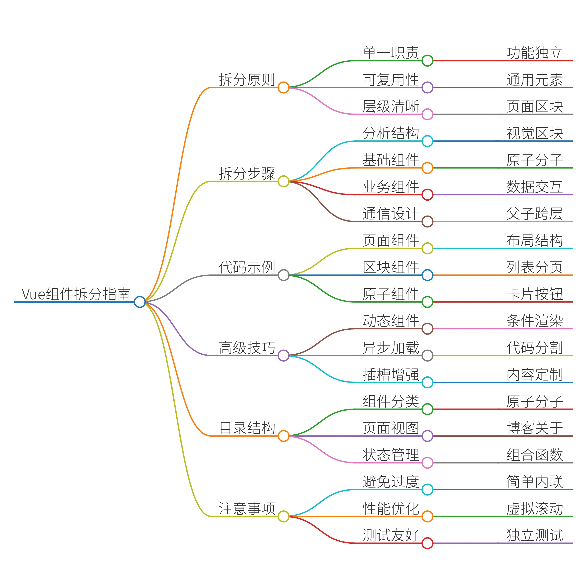

以下是使用 Vue 3 搭建个人博客平台的详细步骤指南，包含前后端分离架构设计：

### 一、技术栈选型

| 类别      | 技术方案                |
| --------- | ----------------------- |
| 前端框架  | Vue 3 + Composition API |
| 路由管理  | Vue Router 4            |
| 状态管理  | Pinia                   |
| UI 组件库 | Element Plus            |
| HTTP 请求 | Axios                   |
| 后端框架  | NestJS (Node.js)        |
| 数据库    | MongoDB                 |
| 认证方案  | JWT                     |

### 二、前端项目搭建

#### 1. 创建项目

```
# 使用 Vite 创建 Vue3 项目
npm create vite@latest blog-frontend -- --template vue
cd blog-frontend
npm install
```


#### 2. 安装核心依赖

```
npm install vue-router@4 pinia axios element-plus
```


#### 3. 项目结构设计

```
src/
├── api/                # API 请求封装
├── assets/             # 静态资源
├── components/         # 公共组件
├── composables/        # 组合式函数
├── router/             # 路由配置
├── stores/             # Pinia 状态管理
├── types/              # TypeScript 类型定义
├── utils/              # 工具函数
└── views/              # 页面组件
    ├── admin/          # 管理后台
    ├── home/           # 首页
    ├── post/           # 文章详情
    └── auth/           # 认证页面
```


#### 4. 核心功能实现示例

**路由配置 (router/index.ts)**

```
import { createRouter, createWebHistory } from 'vue-router'
const routes = [  {    path: '/',    component: () => import('../views/home/Index.vue')  },  {    path: '/post/:id',    component: () => import('../views/post/Detail.vue')  },  {    path: '/admin',    component: () => import('../views/admin/Dashboard.vue'),    meta: { requiresAuth: true }  }]
const router = createRouter({  history: createWebHistory(),  routes})
// 路由守卫示例router.beforeEach((to, from, next) => {  const token = localStorage.getItem('token')  if (to.meta.requiresAuth && !token) {    next('/login')  } else {    next()  }})
export default router
```


**状态管理 (stores/auth.ts)**

```
import { defineStore } from 'pinia'import { login as apiLogin } from '../api/auth'
export const useAuthStore = defineStore('auth', {  state: () => ({    token: localStorage.getItem('token') || '',    user: JSON.parse(localStorage.getItem('user') || 'null')  }),  actions: {    async login(credentials) {      const { data } = await apiLogin(credentials)      this.token = data.token      this.user = data.user      localStorage.setItem('token', data.token)      localStorage.setItem('user', JSON.stringify(data.user))    },    logout() {      this.token = ''      this.user = null      localStorage.clear()    }  }})
```


### 三、后端项目搭建 (NestJS)

#### 1. 创建项目

```
npm i -g @nestjs/cli
nest new blog-backend
cd blog-backend
npm install @nestjs/mongoose mongoose passport-jwt jsonwebtoken
```


#### 2. 核心模块设计

```
src/
├── auth/               # 认证模块
├── posts/              # 文章模块
├── users/              # 用户模块
├── common/             # 公共工具
└── app.module.ts       # 主模块
```


**文章模块示例 (posts/posts.module.ts)**

```
import { Module } from '@nestjs/common'import { MongooseModule } from '@nestjs/mongoose'import { PostsController } from './posts.controller'import { PostsService } from './posts.service'import { Post, PostSchema } from './schemas/post.schema'
@Module({  imports: [    MongooseModule.forFeature([{ name: Post.name, schema: PostSchema }])  ],  controllers: [PostsController],  providers: [PostsService]})export class PostsModule {}
```


**文章 Schema (posts/schemas/post.schema.ts)**

```
import { Prop, Schema, SchemaFactory } from '@nestjs/mongoose'import { Document } from 'mongoose'
@Schema()export class Post extends Document {  @Prop({ required: true })  title: string
  @Prop({ required: true })  content: string
  @Prop()  coverImage?: string
  @Prop({ default: Date.now })  createdAt: Date
  @Prop({ default: Date.now })  updatedAt: Date}
export const PostSchema = SchemaFactory.createForClass(Post)
```


### 四、关键功能实现

#### 1. Markdown 编辑器集成

```
npm install @toast-ui/vue-editor markdown-it
```


**编辑器组件示例**

```
<template>  <div>    <tui-editor      v-model="content"      :options="editorOptions"      height="600px"    />  </div></template>
<script setup>import { ref } from 'vue'import 'tui-editor/dist/tui-editor.css'import 'tui-editor/dist/tui-editor-contents.css'import Editor from '@toast-ui/vue-editor'
const content = ref('')const editorOptions = {  minHeight: '500px',  language: 'zh_CN',  useCommandShortcut: true}</script>
```


#### 2. 文章列表分页

```
<template>  <el-pagination    v-model:current-page="currentPage"    :page-size="pageSize"    :total="total"    @current-change="handlePageChange"  /></template>
<script setup>import { ref, onMounted } from 'vue'import { getPosts } from '@/api/posts'
const currentPage = ref(1)const pageSize = ref(10)const total = ref(0)const posts = ref([])
const fetchPosts = async () => {  const { data } = await getPosts(currentPage.value, pageSize.value)  posts.value = data.items  total.value = data.total}
const handlePageChange = (page) => {  currentPage.value = page  fetchPosts()}
onMounted(fetchPosts)</script>
```


### 五、部署方案

#### 1. 前端部署

```
# 构建生产环境代码npm run build
# 使用 Nginx 部署server {  listen 80;  server_name your-domain.com;
  location / {    root /path/to/dist;    try_files $uri $uri/ /index.html;  }}
```


#### 2. 后端部署 (Docker 示例)

```
# DockerfileFROM node:16-alpine
WORKDIR /appCOPY package*.json ./RUN npm install --productionCOPY . .
EXPOSE 3000CMD ["npm", "start"]
```


### 六、扩展功能建议

1. **SEO 优化**

- 使用 Vue Meta 管理页面元信息

- 服务端渲染 (SSR) 方案：Nuxt.js

1. **性能优化**

- 图片懒加载 (vue-lazyload)

- 路由懒加载

- 组件按需导入

1. **安全措施**

- 输入内容过滤 (DOMPurify)

- CSRF 防护

- 密码强度验证

1. **数据分析**

- 集成 Google Analytics

- 文章访问统计

### 七、开发流程建议

1. 使用 Git 进行版本控制

1. 采用组件化开发模式

1. 编写单元测试 (Vitest)

1. 使用环境变量管理配置

1. 实现 CI/CD 流程 (GitHub Actions)

通过以上步骤，你可以构建一个功能完善、可扩展的个人博客平台。根据实际需求可以继续扩展评论系统、标签分类、搜索功能等模块。


在 Vue3 中实现电脑端（PC）和手机端（Mobile）不同布局的核心思路是 **动态识别设备类型并切换渲染逻辑**，以下是 5 种主流方案及其实现方法：

### 🖥️ 一、CSS 媒体查询（纯前端适配）

通过 CSS 根据屏幕宽度自动应用不同样式，无需修改组件结构。

**实现步骤：**

1. 在组件 ```<style>` 中定义响应式断点：

```
/* 默认样式（PC端） */.container { display: grid; grid-template-columns: 1fr 3fr; }
/* 移动端适配（屏幕宽度 ≤ 768px） */@media (max-width: 768px) {  .container { display: block; } /* 改为单列布局 */}
```


1. 结合 Flexbox/Grid 布局实现弹性排版。

**优点**：零 JS 逻辑，纯 CSS 驱动；**缺点**：仅适合样式微调，无法改变组件结构。

### 📱 二、动态组件切换（条件渲染）

根据设备类型加载不同的 Vue 组件。

**实现步骤：**

1. 创建两套布局组件：```PCLayout.vue` 和 ```MobileLayout.vue`。

1. 在入口文件中动态判断设备类型：

```
<template>  <component :is="layoutComponent" /></template>
<script setup>import { ref, onMounted } from 'vue';import PCLayout from './PCLayout.vue';import MobileLayout from './MobileLayout.vue';
const layoutComponent = ref(null);
onMounted(() => {  const isMobile = window.innerWidth <= 768; // 或使用 navigator.userAgent 检测  layoutComponent.value = isMobile ? MobileLayout : PCLayout;});</script>
```


**适用场景**：PC 与 Mobile 布局差异大（如侧边栏导航 vs 底部导航栏）。

### 🧩 三、响应式 UI 框架 + 断点系统

使用支持响应式的 UI 库（如 Element Plus、Vant）快速搭建多端布局。

**以 TailwindCSS 为例**：

```
<template>
  <!-- PC 端显示 -->
  <div class="hidden md:block"> 
    <PCSidebar />
  </div>
  <!-- 移动端显示 -->
  <div class="md:hidden">
    <MobileBottomNav />
  </div>
</template>
```


**优势**：内置断点系统（```sm`, ```md`, ```lg`），无需手动计算屏幕宽度。

### 📏 四、视口单位适配（Viewport Units）

使用 ```vw/vh` 单位实现元素自适应缩放，搭配 ```postcss-px-to-viewport` 插件自动转换。

**配置示例（vite.config.js）**：

```
import postcssPxToViewport from 'postcss-px-to-viewport';
export default defineConfig({  css: {    postcss: {      plugins: [        postcssPxToViewport({          viewportWidth: 1920, // PC 设计稿宽度          exclude: [/pc-components/], // 排除 PC 专用组件        }),      ],    },  },});
```


### 🔀 五、路由级动态适配（多入口方案）

为 PC 和 Mobile 配置独立的路由文件，根据设备类型加载不同路由结构。

**实现逻辑：**

```
// router/index.js
const isMobile = window.innerWidth <= 768;
const routes = isMobile ? mobileRoutes : pcRoutes; // 导入两套路由配置
```


### ⚖️ 方案对比与选型建议

| 方案             | 适用场景                           | 复杂度 | 维护成本 |
| ---------------- | ---------------------------------- | ------ | -------- |
| **CSS 媒体查询** | 布局差异小（如字体、间距调整）     | ★☆☆☆☆  | 低       |
| **动态组件切换** | 布局结构完全不同（如多栏 vs 单栏） | ★★★☆☆  | 中       |
| **响应式框架**   | 快速开发，统一代码库               | ★★☆☆☆  | 低       |
| **视口单位**     | 精准缩放，设计稿还原度高           | ★★★☆☆  | 中高     |
| **路由级适配**   | 大型项目，PC/Mobile 功能差异大     | ★★★★☆  | 高       |

> 💡 **推荐组合使用**：
>
> - 中小项目：CSS 媒体查询 + 动态组件（如导航栏切换）
>
> - 大型项目：路由分离 + TailwindCSS 断点系统
>
> - 高保真设计稿：视口单位 + 动态组件

### 🛠️ 调试技巧

1. **Chrome 设备模拟器**：模拟不同分辨率，检查布局断裂点。

1. **Vue Devtools**：检查动态组件切换状态。

1. **真机测试**：用手机扫码本地服务（如 Vite 的 ```npm run dev` 生成二维码）验证触摸事件。

通过灵活组合上述方案，可高效实现“一套代码，多端适配”，平衡开发效率与用户体验。

将一个复杂的 SPA（单页应用）拆分成多个组件是 Vue.js 开发的核心实践，它能提高代码的可维护性、复用性和可测试性。以下是系统化的拆分方法和步骤：

### **1. 拆分原则**

#### **(1) 单一职责原则**

- 每个组件只负责一个功能或 UI 部分（如按钮、表单、导航栏）。

- 避免组件承担过多逻辑（如将数据处理和 UI 渲染分离）。

#### **(2) 可复用性**

- 提取通用 UI 元素（如弹窗、加载状态）为独立组件。

- 通过 ```props` 和 ```slots` 实现组件灵活性。

#### **(3) 层级清晰**

- 按功能或页面划分组件层级： 

- **页面级组件**（如 ```HomePage.vue`）：负责整体布局和路由交互。

- **区块级组件**（如 ```ProductList.vue`）：页面内的功能模块。

- **原子级组件**（如 ```Button.vue`）：基础 UI 元素。

### **2. 拆分步骤**

#### **步骤 1：分析页面结构**

- 将页面拆分为**视觉区块**（如头部、侧边栏、主内容区）。

- 示例：博客系统页面可能包含： 

```
BlogPage
├── Header (导航栏)
├── Sidebar (分类/专题菜单)
├── MainContent (文章列表)
└── Footer (版权信息)
```


#### **步骤 2：提取基础 UI 组件**

- 将重复使用的 UI 元素抽离为独立组件： 

- **原子组件**：```Button.vue`、```Input.vue`、```Icon.vue`。

- **分子组件**：```SearchBar.vue`（组合 Input + Button）、```Card.vue`（组合图片+文字）。

#### **步骤 3：拆分业务逻辑组件**

- 按功能模块拆分： 

- **数据展示组件**：```ArticleList.vue`（负责渲染文章列表）。

- **交互组件**：```CommentForm.vue`（处理评论提交）。

- **状态管理组件**：```UserProfile.vue`（管理用户信息）。

#### **步骤 4：组件通信设计**

- **父传子**：通过 ```props` 传递数据。

- **子传父**：通过 ```$emit` 触发事件。

- **跨层级通信**： 

- 使用 ```provide/inject`（适合深层嵌套组件）。

- 使用 Vuex/Pinia（全局状态管理）。

### **3. 代码示例：博客系统组件拆分**

#### **(1) 页面级组件 (**```**BlogPage.vue**`**)**

```
<template>  <el-container>    <Header :user="user" @logout="handleLogout" />    <el-container>      <Sidebar :categories="categories" @select="handleCategorySelect" />      <MainContent :articles="filteredArticles" />    </el-container>    <Footer />  </el-container></template>
<script setup>import Header from './Header.vue'import Sidebar from './Sidebar.vue'import MainContent from './MainContent.vue'import Footer from './Footer.vue'
// 数据逻辑...</script>
```


#### **(2) 区块级组件 (**```**MainContent.vue**`**)**

```
<template>  <div class="main-content">    <ArticleList :articles="articles" />    <Pagination :total="total" @page-change="handlePageChange" />  </div></template>
<script setup>import ArticleList from './ArticleList.vue'import Pagination from './Pagination.vue'
// 数据逻辑...</script>
```


#### **(3) 原子组件 (**```**ArticleCard.vue**`**)**

```
<template>  <div class="article-card">        <h3>{{ article.title }}</h3>    <p>{{ article.summary }}</p>    <Button @click="viewDetails">阅读全文</Button>  </div></template>
<script setup>defineProps(['article'])const emit = defineEmits(['view-details'])const viewDetails = () => emit('view-details', article.id)</script>
```


### **4. 高级拆分技巧**

#### **(1) 动态组件 (**```**<component :is="">**`**)**

- 根据条件渲染不同组件： 

```
<component :is="currentTab === 'list' ? ArticleList : ArticleGrid" />
```


#### **(2) 异步组件 (懒加载)**

- 使用 ```defineAsyncComponent` 拆分代码块，提升首屏加载速度： 

```
const HeavyComponent = defineAsyncComponent(() => import('./HeavyComponent.vue'))
```


#### **(3) 插槽 (**```**slots**`**) 增强灵活性**

- 

  允许父组件自定义子组件内容： 

  ```
  <!-- Card.vue -->
  <div class="card">
    <slot name="header"></slot>
    <slot></slot> <!-- 默认插槽 -->
    <slot name="footer"></slot>
  </div>
  ```

  

  

  

### **5. 拆分后的目录结构示例**

```
src/
├── components/          # 通用组件
│   ├── atomic/          # 原子组件 (Button, Icon)
│   ├── molecular/       # 分子组件 (SearchBar, Card)
│   └── layout/          # 布局组件 (Header, Footer)
├── views/               # 页面级组件
│   ├── BlogPage.vue
│   └── AboutPage.vue
├── composables/         # 组合式函数 (useFetch, useAuth)
└── stores/              # 状态管理 (Pinia/Vuex)
```


### **6. 注意事项**

1. **避免过度拆分**：如果组件仅在一个地方使用且逻辑简单，直接内联可能更清晰。

1. **性能优化**： 

- 对频繁更新的组件使用 ```v-memo`（Vue 3.2+）。

- 大型列表使用虚拟滚动（如 ```vue-virtual-scroller`）。

1. **测试友好**：确保每个组件可独立测试（单元测试或 E2E 测试）。

通过以上方法，你可以将复杂 SPA 拆解为清晰、可维护的组件树，同时保持灵活性和扩展性。


