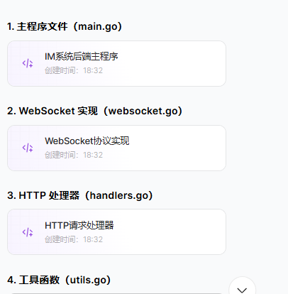

#### 1. 整体架构

该 IM 系统采用经典的客户端 - 服务器架构：

- **前端**：原生 HTML/CSS/JS 实现，负责用户界面和交互
- **后端**：Go 标准库实现，提供 HTTP API 和 WebSocket 服务
- **数据库**：MySQL 存储用户信息和聊天记录

通信流程：

1. 用户通过前端注册 / 登录获取令牌
2. 前端使用令牌建立 WebSocket 连接
3. 实时消息通过 WebSocket 双向传输
4. 历史消息和用户状态通过 HTTP API 获取

#### 2. 后端核心功能解析

##### （1）HTTP API 服务

- **认证模块**：处理注册、登录请求，生成 JWT 令牌
- **数据接口**：提供历史消息查询、在线用户列表等功能
- **权限控制**：通过 JWT 令牌验证用户身份

##### （2）WebSocket 实现

- 手动解析 WebSocket 协议帧（握手、掩码、数据帧处理）
- 客户端连接管理（使用 map 存储在线用户）
- 消息广播机制（支持私聊和群发）

##### （3）数据存储

- 用户表：存储账号信息和在线状态
- 消息表：记录聊天内容，支持双向查询
- 使用标准库`database/sql`操作 MySQL

#### 3. 前端核心功能解析

##### （1）用户界面

- 响应式设计，适配移动端和桌面端
- 分离的登录 / 注册面板和聊天面板
- 在线用户列表和聊天区域布局

##### （2）交互逻辑

- 表单验证和错误提示
- WebSocket 连接管理（自动重连）
- 消息收发和历史记录加载

##### （3）实时通信

- 使用原生 WebSocket API 建立连接
- 消息格式标准化（区分系统消息和普通消息）
- 消息动画和状态反馈

#### 4. 运行说明

##### （1）环境准备

1. 安装 Go 1.19 + 和 MySQL
2. 创建数据库：`CREATE DATABASE im_db CHARACTER SET utf8mb4 COLLATE utf8mb4_unicode_ci;`
3. 修改后端代码中的`dbDSN`（替换用户名和密码）

##### （2）启动步骤

1. 下载依赖：`go mod init im-system && go get github.com/go-sql-driver/mysql`
2. 启动后端：`go run *.go`
3. 将前端`index.html`放入静态文件目录（或直接用浏览器打开）
4. 访问`http://localhost:8080`

#### 5. 技术亮点

- **零框架依赖**：前后端均不依赖框架，使用原生语言特性实现
- **轻量级设计**：核心代码精简，易于理解和扩展
- **安全性考虑**：密码加密存储、XSS 防护、令牌验证
- **用户体验**：消息动画、状态反馈、自动重连

该系统实现了 IM 的核心功能，代码结构清晰，适合作为学习项目理解实时通信原理和 Web 开发基础。实际生产环境中可在此基础上增加更多功能（如文件传输、表情、消息已读状态等）。


# 1

```go
package main

import (
	"database/sql"
	"encoding/json"
	"errors"
	"fmt"
	"log"
	"net/http"
	"regexp"
	"strconv"
	"strings"
	"sync"
	"time"

	_ "github.com/go-sql-driver/mysql"
)

// 全局数据库连接
var db *sql.DB

// 配置信息
const (
	dbDSN          = "root:password@tcp(localhost:3306)/im_db?charset=utf8mb4&parseTime=True"
	jwtSecret      = "im-secret-key" // 实际使用需更换
	serverPort     = ":8080"
	tokenExpiresIn = 24 * time.Hour
)

// 用户模型
type User struct {
	ID       int64  `json:"id"`
	Username string `json:"username"`
	Nickname string `json:"nickname"`
	Online   int    `json:"online"` // 1在线，0离线
}

// 消息模型
type Message struct {
	ID         int64  `json:"id"`
	SenderID   int64  `json:"sender_id"`
	ReceiverID int64  `json:"receiver_id"`
	Content    string `json:"content"`
	Type       int    `json:"type"` // 0普通消息，1系统消息
	Timestamp  int64  `json:"timestamp"`
}

// WebSocket消息结构
type WSMessage struct {
	Type       int    `json:"type"`
	Content    string `json:"content"`
	SenderID   int64  `json:"sender_id"`
	SenderName string `json:"sender_name"`
	ReceiverID int64  `json:"receiver_id"`
	Timestamp  int64  `json:"timestamp"`
}

// JWT声明结构
type Claims struct {
	UserID int64  `json:"user_id"`
	Expiry int64  `json:"expiry"`
}

// 客户端连接
type Client struct {
	conn   *WebSocket
	user   *User
	send   chan []byte
	mu     sync.Mutex
	closed bool
}

// 全局客户端管理
var (
	clients   = make(map[int64]*Client)
	clientsMu sync.Mutex
	broadcast = make(chan []byte)
)

func main() {
	// 初始化数据库
	initDB()

	// 创建必要的数据表
	createTables()

	// 启动消息广播协程
	go handleMessages()

	// 注册路由
	http.HandleFunc("/api/auth/register", registerHandler)
	http.HandleFunc("/api/auth/login", loginHandler)
	http.HandleFunc("/api/auth/me", meHandler)
	http.HandleFunc("/api/messages", messagesHandler)
	http.HandleFunc("/api/online", onlineUsersHandler)
	http.HandleFunc("/api/ws", wsHandler)

	// 启动HTTP服务器
	log.Printf("服务器启动在 %s", serverPort)
	log.Fatal(http.ListenAndServe(serverPort, nil))
}

// 初始化数据库连接
func initDB() {
	var err error
	db, err = sql.Open("mysql", dbDSN)
	if err != nil {
		log.Fatalf("无法连接数据库: %v", err)
	}

	// 测试连接
	if err := db.Ping(); err != nil {
		log.Fatalf("数据库连接失败: %v", err)
	}

	log.Println("数据库连接成功")
}

// 创建数据表
func createTables() {
	// 用户表
	_, err := db.Exec(`
		CREATE TABLE IF NOT EXISTS users (
			id BIGINT PRIMARY KEY AUTO_INCREMENT,
			username VARCHAR(50) NOT NULL UNIQUE,
			password VARCHAR(100) NOT NULL,
			nickname VARCHAR(50) NOT NULL,
			online TINYINT DEFAULT 0,
			created_at DATETIME DEFAULT CURRENT_TIMESTAMP
		) ENGINE=InnoDB DEFAULT CHARSET=utf8mb4
	`)
	if err != nil {
		log.Fatalf("创建用户表失败: %v", err)
	}

	// 消息表
	_, err = db.Exec(`
		CREATE TABLE IF NOT EXISTS messages (
			id BIGINT PRIMARY KEY AUTO_INCREMENT,
			sender_id BIGINT NOT NULL,
			receiver_id BIGINT NOT NULL,
			content TEXT NOT NULL,
			type TINYINT DEFAULT 0,
			created_at DATETIME DEFAULT CURRENT_TIMESTAMP,
			FOREIGN KEY (sender_id) REFERENCES users(id),
			FOREIGN KEY (receiver_id) REFERENCES users(id)
		) ENGINE=InnoDB DEFAULT CHARSET=utf8mb4
	`)
	if err != nil {
		log.Fatalf("创建消息表失败: %v", err)
	}

	log.Println("数据表初始化成功")
}

// 处理消息广播
func handleMessages() {
	for msgData := range broadcast {
		var msg WSMessage
		if err := json.Unmarshal(msgData, &msg); err != nil {
			log.Printf("消息解析失败: %v", err)
			continue
		}

		// 普通消息需要存储
		if msg.Type == 0 {
			_, err := db.Exec(
				"INSERT INTO messages (sender_id, receiver_id, content, type, created_at) VALUES (?, ?, ?, ?, NOW())",
				msg.SenderID, msg.ReceiverID, msg.Content, msg.Type,
			)
			if err != nil {
				log.Printf("消息存储失败: %v", err)
			}
		}

		// 发送消息给目标用户
		clientsMu.Lock()
		if msg.ReceiverID == 0 {
			// 群发消息
			for _, client := range clients {
				sendToClient(client, msgData)
			}
		} else {
			// 私聊消息
			if receiver, ok := clients[msg.ReceiverID]; ok {
				sendToClient(receiver, msgData)
			}
			if sender, ok := clients[msg.SenderID]; ok {
				sendToClient(sender, msgData)
			}
		}
		clientsMu.Unlock()
	}
}

// 发送消息到客户端
func sendToClient(client *Client, data []byte) {
	client.mu.Lock()
	defer client.mu.Unlock()

	if client.closed {
		return
	}

	select {
	case client.send <- data:
	default:
		close(client.send)
		client.closed = true
	}
}

```

## 2

```go
package main

import (
	"bufio"
	"crypto/sha1"
	"encoding/base64"
	"encoding/json"
	"errors"
	"io"
	"log"
	"net"
	"net/http"
	"strings"
	"sync"
	"time"
)

// WebSocket 简易WebSocket实现
type WebSocket struct {
	conn     net.Conn
	reader   *bufio.Reader
	writer   *bufio.Writer
	closed   bool
	closeMu  sync.Mutex
}

// 升级HTTP连接为WebSocket
func upgradeWebSocket(w http.ResponseWriter, r *http.Request) (*WebSocket, error) {
	// 验证请求方法和头信息
	if r.Method != http.MethodGet {
		return nil, errors.New("方法不允许")
	}

	if r.Header.Get("Upgrade") != "websocket" {
		return nil, errors.New("需要Upgrade: websocket头")
	}

	if r.Header.Get("Connection") != "Upgrade" {
		return nil, errors.New("需要Connection: Upgrade头")
	}

	// 验证WebSocket密钥
	key := r.Header.Get("Sec-WebSocket-Key")
	if key == "" {
		return nil, errors.New("缺少Sec-WebSocket-Key头")
	}

	// 生成响应密钥
	magicString := key + "258EAFA5-E914-47DA-95CA-C5AB0DC85B11"
	hash := sha1.Sum([]byte(magicString))
	acceptKey := base64.StdEncoding.EncodeToString(hash[:])

	// 升级连接
	hijacker, ok := w.(http.Hijacker)
	if !ok {
		return nil, errors.New("服务器不支持Hijack")
	}

	conn, rw, err := hijacker.Hijack()
	if err != nil {
		return nil, err
	}

	// 发送WebSocket握手响应
	response := "HTTP/1.1 101 Switching Protocols\r\n" +
		"Upgrade: websocket\r\n" +
		"Connection: Upgrade\r\n" +
		"Sec-WebSocket-Accept: " + acceptKey + "\r\n\r\n"

	if _, err := conn.Write([]byte(response)); err != nil {
		conn.Close()
		return nil, err
	}

	return &WebSocket{
		conn:   conn,
		reader: rw.Reader,
		writer: rw.Writer,
	}, nil
}

// 读取WebSocket消息
func (ws *WebSocket) ReadMessage() ([]byte, error) {
	// 读取帧头
	header := make([]byte, 2)
	if _, err := io.ReadFull(ws.reader, header); err != nil {
		return nil, err
	}

	// 解析帧头
	fin := (header[0] & 0x80) != 0
	opcode := header[0] & 0x0F
	mask := (header[1] & 0x80) != 0
	payloadLen := int(header[1] & 0x7F)

	// 处理不同长度的payload
	switch payloadLen {
	case 126:
		lenBytes := make([]byte, 2)
		if _, err := io.ReadFull(ws.reader, lenBytes); err != nil {
			return nil, err
		}
		payloadLen = int(lenBytes[0])<<8 | int(lenBytes[1])
	case 127:
		return nil, errors.New("不支持过大的消息")
	}

	// 读取掩码
	var maskKey []byte
	if mask {
		maskKey = make([]byte, 4)
		if _, err := io.ReadFull(ws.reader, maskKey); err != nil {
			return nil, err
		}
	}

	// 读取payload
	payload := make([]byte, payloadLen)
	if _, err := io.ReadFull(ws.reader, payload); err != nil {
		return nil, err
	}

	// 应用掩码
	if mask {
		for i := 0; i < payloadLen; i++ {
			payload[i] ^= maskKey[i%4]
		}
	}

	// 处理控制帧
	if opcode == 8 { // 关闭帧
		ws.Close()
		return nil, errors.New("连接已关闭")
	}

	// 只处理单帧文本消息
	if !fin || opcode != 1 {
		return nil, errors.New("只支持单帧文本消息")
	}

	return payload, nil
}

// 发送WebSocket消息
func (ws *WebSocket) WriteMessage(data []byte) error {
	ws.closeMu.Lock()
	defer ws.closeMu.Unlock()

	if ws.closed {
		return errors.New("连接已关闭")
	}

	// 构建帧头
	var header []byte
	header = append(header, 0x81) // FIN=1, opcode=1（文本消息）

	// 处理长度
	payloadLen := len(data)
	switch {
	case payloadLen <= 125:
		header = append(header, byte(payloadLen))
	case payloadLen <= 65535:
		header = append(header, 126)
		header = append(header, byte(payloadLen>>8), byte(payloadLen&0xFF))
	default:
		return errors.New("消息过长")
	}

	// 发送帧头和数据
	if _, err := ws.writer.Write(header); err != nil {
		return err
	}
	if _, err := ws.writer.Write(data); err != nil {
		return err
	}

	return ws.writer.Flush()
}

// 关闭WebSocket连接
func (ws *WebSocket) Close() error {
	ws.closeMu.Lock()
	defer ws.closeMu.Unlock()

	if ws.closed {
		return nil
	}

	ws.closed = true
	closeFrame := []byte{0x88, 0x00} // 关闭帧
	ws.writer.Write(closeFrame)
	ws.writer.Flush()
	return ws.conn.Close()
}

// WebSocket处理器
func wsHandler(w http.ResponseWriter, r *http.Request) {
	// 从查询参数获取令牌
	token := r.URL.Query().Get("token")
	if token == "" {
		http.Error(w, "未提供令牌", http.StatusUnauthorized)
		return
	}

	// 验证令牌
	claims, err := verifyToken(token)
	if err != nil {
		http.Error(w, "无效的令牌", http.StatusUnauthorized)
		return
	}

	// 获取用户信息
	var user User
	err = db.QueryRow(
		"SELECT id, username, nickname FROM users WHERE id = ?",
		claims.UserID,
	).Scan(&user.ID, &user.Username, &user.Nickname)
	if err != nil {
		http.Error(w, "用户不存在", http.StatusUnauthorized)
		return
	}

	// 升级HTTP连接为WebSocket
	ws, err := upgradeWebSocket(w, r)
	if err != nil {
		log.Printf("WebSocket升级失败: %v", err)
		http.Error(w, "WebSocket升级失败", http.StatusInternalServerError)
		return
	}

	// 创建客户端
	client := &Client{
		conn: ws,
		user: &user,
		send: make(chan []byte, 256),
	}

	// 注册客户端
	clientsMu.Lock()
	clients[user.ID] = client
	db.Exec("UPDATE users SET online = 1 WHERE id = ?", user.ID)
	clientsMu.Unlock()

	// 发送上线通知
	notice := WSMessage{
		Type:       1,
		Content:    "已上线",
		SenderID:   user.ID,
		SenderName: user.Nickname,
		ReceiverID: 0,
		Timestamp:  time.Now().Unix(),
	}
	data, _ := json.Marshal(notice)
	broadcast <- data

	// 启动读写协程
	go client.writePump()
	go client.readPump()
}

// 客户端读取消息
func (c *Client) readPump() {
	defer func() {
		c.conn.Close()

		clientsMu.Lock()
		if _, ok := clients[c.user.ID]; ok {
			delete(clients, c.user.ID)
			db.Exec("UPDATE users SET online = 0 WHERE id = ?", c.user.ID)

			// 发送下线通知
			notice := WSMessage{
				Type:       1,
				Content:    "已下线",
				SenderID:   c.user.ID,
				SenderName: c.user.Nickname,
				ReceiverID: 0,
				Timestamp:  time.Now().Unix(),
			}
			data, _ := json.Marshal(notice)
			broadcast <- data
		}
		clientsMu.Unlock()
	}()

	for {
		data, err := c.conn.ReadMessage()
		if err != nil {
			if !strings.Contains(err.Error(), "closed") {
				log.Printf("读取消息错误: %v", err)
			}
			break
		}

		var msg WSMessage
		if err := json.Unmarshal(data, &msg); err != nil {
			log.Printf("解析消息错误: %v", err)
			continue
		}

		// 补充消息信息
		msg.SenderID = c.user.ID
		msg.SenderName = c.user.Nickname
		msg.Timestamp = time.Now().Unix()
		if msg.Type == 0 && msg.Content == "" {
			continue
		}

		data, _ = json.Marshal(msg)
		broadcast <- data
	}
}

// 客户端发送消息
func (c *Client) writePump() {
	defer c.conn.Close()

	for msg := range c.send {
		if err := c.conn.WriteMessage(msg); err != nil {
			log.Printf("发送消息错误: %v", err)
			break
		}
	}
}

```

## 3

```go
package main

import (
	"crypto/hmac"
	"crypto/sha256"
	"encoding/base64"
	"encoding/json"
	"errors"
	"fmt"
	"log"
	"net/http"
	"regexp"
	"strconv"
	"time"
)

// 注册处理器
func registerHandler(w http.ResponseWriter, r *http.Request) {
	if r.Method != http.MethodPost {
		http.Error(w, "方法不允许", http.StatusMethodNotAllowed)
		return
	}

	var req struct {
		Username string `json:"username"`
		Nickname string `json:"nickname"`
		Password string `json:"password"`
	}

	// 解析请求体
	if err := json.NewDecoder(r.Body).Decode(&req); err != nil {
		sendError(w, http.StatusBadRequest, "无效的请求格式")
		return
	}

	// 验证输入
	if req.Username == "" || req.Nickname == "" || req.Password == "" {
		sendError(w, http.StatusBadRequest, "所有字段都不能为空")
		return
	}

	if len(req.Username) < 3 || len(req.Username) > 20 {
		sendError(w, http.StatusBadRequest, "用户名长度必须在3-20之间")
		return
	}

	if len(req.Password) < 6 {
		sendError(w, http.StatusBadRequest, "密码长度不能少于6位")
		return
	}

	// 验证用户名格式
	validUsername := regexp.MustCompile(`^[a-zA-Z0-9_]+$`)
	if !validUsername.MatchString(req.Username) {
		sendError(w, http.StatusBadRequest, "用户名只能包含字母、数字和下划线")
		return
	}

	// 检查用户名是否已存在
	var exists bool
	err := db.QueryRow("SELECT EXISTS(SELECT 1 FROM users WHERE username = ?)", req.Username).Scan(&exists)
	if err != nil {
		log.Printf("查询用户失败: %v", err)
		sendError(w, http.StatusInternalServerError, "服务器错误")
		return
	}

	if exists {
		sendError(w, http.StatusConflict, "用户名已存在")
		return
	}

	// 加密密码
	hashedPassword := hashPassword(req.Password)

	// 创建用户
	result, err := db.Exec(
		"INSERT INTO users (username, password, nickname) VALUES (?, ?, ?)",
		req.Username, hashedPassword, req.Nickname,
	)
	if err != nil {
		log.Printf("创建用户失败: %v", err)
		sendError(w, http.StatusInternalServerError, "注册失败")
		return
	}

	userID, _ := result.LastInsertId()

	// 返回成功响应
	sendResponse(w, http.StatusOK, map[string]interface{}{
		"success": true,
		"message": "注册成功",
		"user_id": userID,
	})
}

// 登录处理器
func loginHandler(w http.ResponseWriter, r *http.Request) {
	if r.Method != http.MethodPost {
		http.Error(w, "方法不允许", http.StatusMethodNotAllowed)
		return
	}

	var req struct {
		Username string `json:"username"`
		Password string `json:"password"`
	}

	// 解析请求体
	if err := json.NewDecoder(r.Body).Decode(&req); err != nil {
		sendError(w, http.StatusBadRequest, "无效的请求格式")
		return
	}

	// 验证输入
	if req.Username == "" || req.Password == "" {
		sendError(w, http.StatusBadRequest, "用户名和密码不能为空")
		return
	}

	// 查询用户
	var user User
	var hashedPassword string
	err := db.QueryRow(
		"SELECT id, username, nickname, password FROM users WHERE username = ?",
		req.Username,
	).Scan(&user.ID, &user.Username, &user.Nickname, &hashedPassword)
	if err != nil {
		if err == sql.ErrNoRows {
			sendError(w, http.StatusUnauthorized, "用户名或密码错误")
		} else {
			log.Printf("查询用户失败: %v", err)
			sendError(w, http.StatusInternalServerError, "服务器错误")
		}
		return
	}

	// 验证密码
	if !checkPassword(req.Password, hashedPassword) {
		sendError(w, http.StatusUnauthorized, "用户名或密码错误")
		return
	}

	// 生成令牌
	token, err := generateToken(user.ID)
	if err != nil {
		log.Printf("生成令牌失败: %v", err)
		sendError(w, http.StatusInternalServerError, "登录失败")
		return
	}

	// 返回成功响应
	sendResponse(w, http.StatusOK, map[string]interface{}{
		"success": true,
		"token":   token,
		"user": map[string]interface{}{
			"id":       user.ID,
			"username": user.Username,
			"nickname": user.Nickname,
		},
	})
}

// 获取当前用户信息
func meHandler(w http.ResponseWriter, r *http.Request) {
	// 验证令牌
	token := getTokenFromHeader(r)
	if token == "" {
		sendError(w, http.StatusUnauthorized, "未提供令牌")
		return
	}

	claims, err := verifyToken(token)
	if err != nil {
		sendError(w, http.StatusUnauthorized, "无效的令牌")
		return
	}

	// 查询用户
	var user User
	err = db.QueryRow(
		"SELECT id, username, nickname, online FROM users WHERE id = ?",
		claims.UserID,
	).Scan(&user.ID, &user.Username, &user.Nickname, &user.Online)
	if err != nil {
		if err == sql.ErrNoRows {
			sendError(w, http.StatusUnauthorized, "用户不存在")
		} else {
			log.Printf("查询用户失败: %v", err)
			sendError(w, http.StatusInternalServerError, "服务器错误")
		}
		return
	}

	// 返回用户信息
	sendResponse(w, http.StatusOK, map[string]interface{}{
		"user": user,
	})
}

// 获取消息历史
func messagesHandler(w http.ResponseWriter, r *http.Request) {
	// 验证令牌
	token := getTokenFromHeader(r)
	if token == "" {
		sendError(w, http.StatusUnauthorized, "未提供令牌")
		return
	}

	claims, err := verifyToken(token)
	if err != nil {
		sendError(w, http.StatusUnauthorized, "无效的令牌")
		return
	}

	// 获取查询参数
	otherIDStr := r.URL.Query().Get("other_id")
	limitStr := r.URL.Query().Get("limit")
	offsetStr := r.URL.Query().Get("offset")

	// 解析参数
	limit := 50
	if limitStr != "" {
		parsed, err := strconv.Atoi(limitStr)
		if err == nil && parsed > 0 && parsed <= 200 {
			limit = parsed
		}
	}

	offset := 0
	if offsetStr != "" {
		parsed, err := strconv.Atoi(offsetStr)
		if err == nil && parsed >= 0 {
			offset = parsed
		}
	}

	// 查询消息
	var messages []Message
	var rows *sql.Rows

	if otherIDStr != "" {
		otherID, err := strconv.ParseInt(otherIDStr, 10, 64)
		if err != nil {
			sendError(w, http.StatusBadRequest, "无效的用户ID")
			return
		}

		// 私聊消息：查询双向消息
		rows, err = db.Query(`
			SELECT id, sender_id, receiver_id, content, type, UNIX_TIMESTAMP(created_at) 
			FROM messages 
			WHERE (sender_id = ? AND receiver_id = ?) OR (sender_id = ? AND receiver_id = ?)
			ORDER BY created_at ASC
			LIMIT ? OFFSET ?
		`, claims.UserID, otherID, otherID, claims.UserID, limit, offset)
	} else {
		// 群发消息
		rows, err = db.Query(`
			SELECT id, sender_id, receiver_id, content, type, UNIX_TIMESTAMP(created_at) 
			FROM messages 
			WHERE receiver_id = 0
			ORDER BY created_at ASC
			LIMIT ? OFFSET ?
		`, limit, offset)
	}

	if err != nil {
		log.Printf("查询消息失败: %v", err)
		sendError(w, http.StatusInternalServerError, "获取消息失败")
		return
	}
	defer rows.Close()

	// 处理查询结果
	for rows.Next() {
		var msg Message
		var timestamp int64
		err := rows.Scan(
			&msg.ID, &msg.SenderID, &msg.ReceiverID, &msg.Content, &msg.Type, &timestamp,
		)
		if err != nil {
			log.Printf("解析消息失败: %v", err)
			continue
		}
		msg.Timestamp = timestamp
		messages = append(messages, msg)
	}

	// 返回消息列表
	sendResponse(w, http.StatusOK, map[string]interface{}{
		"messages": messages,
		"count":    len(messages),
	})
}

// 获取在线用户
func onlineUsersHandler(w http.ResponseWriter, r *http.Request) {
	// 验证令牌
	token := getTokenFromHeader(r)
	if token == "" {
		sendError(w, http.StatusUnauthorized, "未提供令牌")
		return
	}

	_, err := verifyToken(token)
	if err != nil {
		sendError(w, http.StatusUnauthorized, "无效的令牌")
		return
	}

	// 查询在线用户
	rows, err := db.Query(`
		SELECT id, username, nickname, online 
		FROM users 
		WHERE online = 1 
		ORDER BY id ASC
	`)
	if err != nil {
		log.Printf("查询在线用户失败: %v", err)
		sendError(w, http.StatusInternalServerError, "获取在线用户失败")
		return
	}
	defer rows.Close()

	// 处理查询结果
	var users []User
	for rows.Next() {
		var user User
		err := rows.Scan(&user.ID, &user.Username, &user.Nickname, &user.Online)
		if err != nil {
			log.Printf("解析用户失败: %v", err)
			continue
		}
		users = append(users, user)
	}

	// 返回在线用户列表
	sendResponse(w, http.StatusOK, map[string]interface{}{
		"users": users,
	})
}

// 辅助函数：发送错误响应
func sendError(w http.ResponseWriter, status int, message string) {
	w.Header().Set("Content-Type", "application/json")
	w.WriteHeader(status)
	json.NewEncoder(w).Encode(map[string]string{"error": message})
}

// 辅助函数：发送成功响应
func sendResponse(w http.ResponseWriter, status int, data interface{}) {
	w.Header().Set("Content-Type", "application/json")
	w.WriteHeader(status)
	json.NewEncoder(w).Encode(data)
}

// 从请求头获取令牌
func getTokenFromHeader(r *http.Request) string {
	authHeader := r.Header.Get("Authorization")
	if authHeader == "" {
		return ""
	}

	parts := strings.Split(authHeader, " ")
	if len(parts) != 2 || parts[0] != "Bearer" {
		return ""
	}

	return parts[1]
}

```

## 4

```go
package main

import (
	"crypto/hmac"
	"crypto/sha256"
	"encoding/base64"
	"encoding/json"
	"errors"
	"time"
)

// 加密密码
func hashPassword(password string) string {
	// 使用HMAC-SHA256加密密码
	h := hmac.New(sha256.New, []byte(jwtSecret))
	h.Write([]byte(password))
	return base64.StdEncoding.EncodeToString(h.Sum(nil))
}

// 验证密码
func checkPassword(password, hashedPassword string) bool {
	// 重新计算哈希并比较
	return hashPassword(password) == hashedPassword
}

// 生成JWT令牌
func generateToken(userID int64) (string, error) {
	// 创建声明
	claims := Claims{
		UserID: userID,
		Expiry: time.Now().Add(tokenExpiresIn).Unix(),
	}

	// 序列化声明
	claimsJSON, err := json.Marshal(claims)
	if err != nil {
		return "", err
	}

	// 签名
	h := hmac.New(sha256.New, []byte(jwtSecret))
	h.Write(claimsJSON)
	signature := h.Sum(nil)

	// 组合令牌：声明.签名
	token := fmt.Sprintf(
		"%s.%s",
		base64.URLEncoding.EncodeToString(claimsJSON),
		base64.URLEncoding.EncodeToString(signature),
	)

	return token, nil
}

// 验证JWT令牌
func verifyToken(token string) (*Claims, error) {
	// 分割令牌
	parts := strings.Split(token, ".")
	if len(parts) != 2 {
		return nil, errors.New("无效的令牌格式")
	}

	// 解码声明
	claimsJSON, err := base64.URLEncoding.DecodeString(parts[0])
	if err != nil {
		return nil, errors.New("无效的令牌")
	}

	// 解析声明
	var claims Claims
	if err := json.Unmarshal(claimsJSON, &claims); err != nil {
		return nil, errors.New("无效的令牌")
	}

	// 检查过期
	if claims.Expiry < time.Now().Unix() {
		return nil, errors.New("令牌已过期")
	}

	// 验证签名
	h := hmac.New(sha256.New, []byte(jwtSecret))
	h.Write(claimsJSON)
	expectedSignature := h.Sum(nil)

	signature, err := base64.URLEncoding.DecodeString(parts[1])
	if err != nil || !hmac.Equal(signature, expectedSignature) {
		return nil, errors.New("无效的令牌签名")
	}

	return &claims, nil
}

```

