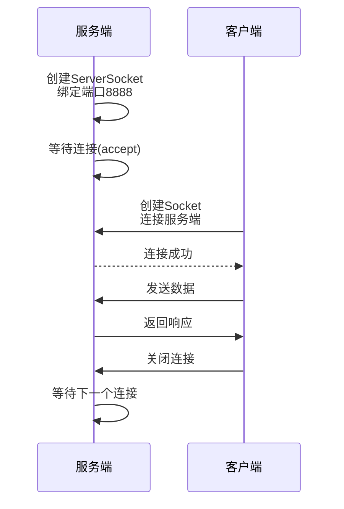
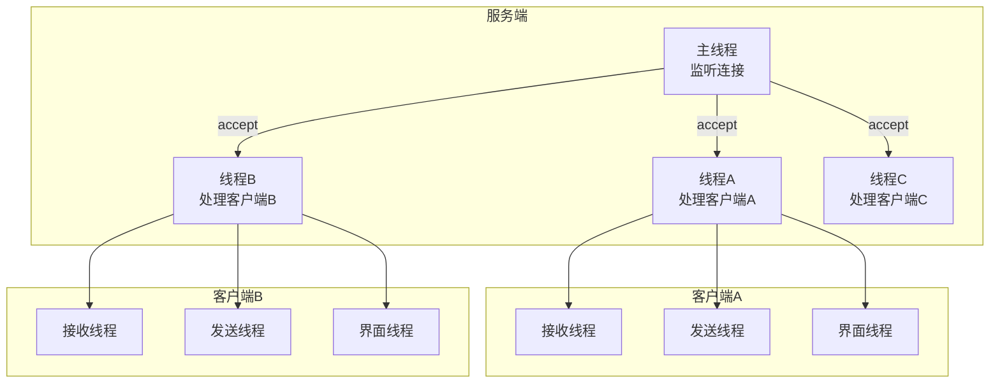
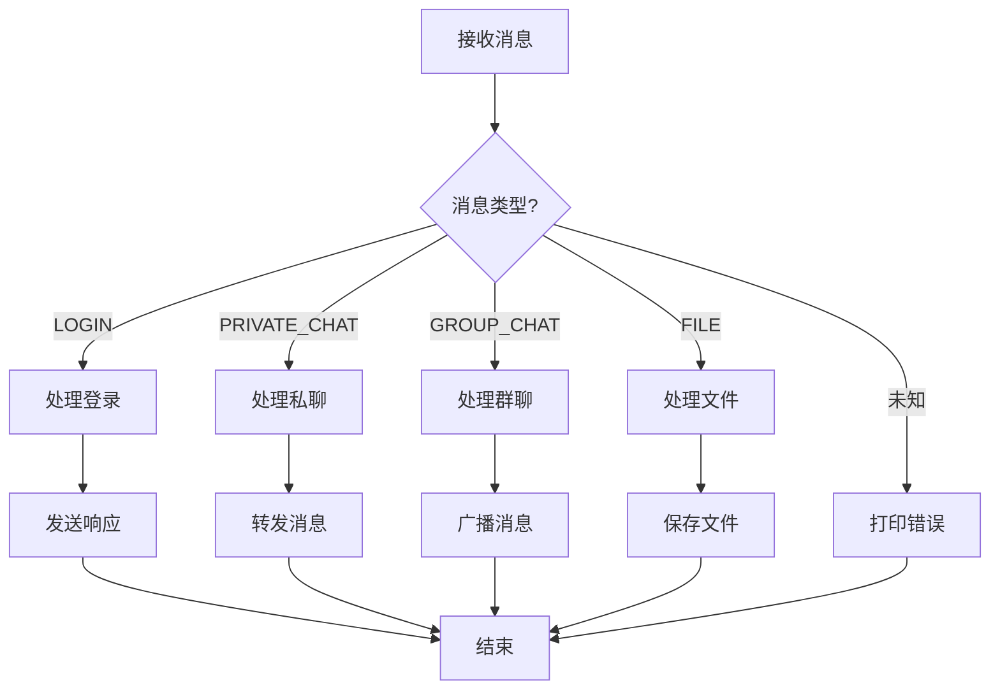

# 16💬 Java16 Socket 聊天室 - 零基础手把手教程

> 💡 **核心提示**：本教程面向零基础学习者，从最基础的概念开始，一步步带你完成一个完整的聊天室项目。

**GitHub地址**：https://github.com/RONGX563647/NewChatRoom

## 目录

1. [准备工作](https://file+.vscode-resource.vscode-cdn.net/Users/rongx/Desktop/Code/java/NewChatRoom/learn.md#一准备工作)
2. [基础知识](https://file+.vscode-resource.vscode-cdn.net/Users/rongx/Desktop/Code/java/NewChatRoom/learn.md#二基础知识)
3. [第一阶段：创建项目](https://file+.vscode-resource.vscode-cdn.net/Users/rongx/Desktop/Code/java/NewChatRoom/learn.md#三第一阶段创建项目)
4. [第二阶段：公共类](https://file+.vscode-resource.vscode-cdn.net/Users/rongx/Desktop/Code/java/NewChatRoom/learn.md#四第二阶段公共类)
5. [第三阶段：服务端](https://file+.vscode-resource.vscode-cdn.net/Users/rongx/Desktop/Code/java/NewChatRoom/learn.md#五第三阶段服务端)
6. [第四阶段：客户端](https://file+.vscode-resource.vscode-cdn.net/Users/rongx/Desktop/Code/java/NewChatRoom/learn.md#六第四阶段客户端)
7. [第五阶段：功能完善](https://file+.vscode-resource.vscode-cdn.net/Users/rongx/Desktop/Code/java/NewChatRoom/learn.md#七第五阶段功能完善)
8. [运行测试](https://file+.vscode-resource.vscode-cdn.net/Users/rongx/Desktop/Code/java/NewChatRoom/learn.md#八运行测试)
9. [常见问题](https://file+.vscode-resource.vscode-cdn.net/Users/rongx/Desktop/Code/java/NewChatRoom/learn.md#九常见问题)

------

## 一、准备工作

### 1.1 你需要准备什么？

1. **JDK（Java开发工具包）**
   - 下载地址：https://www.oracle.com/java/technologies/downloads/
   - 建议版本：JDK 8 或更高
   - 安装后配置环境变量
2. **IDE（集成开发环境）**
   - 推荐：IntelliJ IDEA Community Edition（免费）
   - 下载地址：https://www.jetbrains.com/idea/download/
   - 备选：Eclipse、VS Code
3. **基础知识**
   - Java基础语法（类、方法、变量）
   - 面向对象概念
   - 基本的网络概念（IP、端口）

### 1.2 检查Java环境

打开命令行（Windows: CMD/PowerShell，Mac: Terminal），输入：

```
java -version
```


如果显示版本信息，说明安装成功：

```
java version "17.0.1" 2021-10-19 LTS
Java(TM) SE Runtime Environment (build 17.0.1+12-39)
```


------

## 二、基础知识

### 2.1 什么是Socket？

**简单理解：**

- Socket（套接字）就像电话机
- 服务端Socket = 总机（等待来电）
- 客户端Socket = 普通电话（主动拨打）
- IP地址 = 电话号码
- 端口号 = 分机号

**工作流程：**



**文字流程：**

```
服务端：创建ServerSocket → 等待连接 → 接受连接 → 收发数据
客户端：创建Socket → 连接服务端 → 收发数据
```

**Socket连接示意图：**

```
┌─────────────────┐         ┌─────────────────┐
│   服务端         │         │   客户端         │
│                 │         │                 │
│  ServerSocket    │◄──────►│    Socket       │
│  (端口: 8888)   │  TCP    │  (连接到8888)   │
│                 │  连接    │                 │
└─────────────────┘         └─────────────────┘
```


### 2.2 什么是C/S架构？

**C/S = Client（客户端）/ Server（服务端）**

就像微信：

- **服务端**：腾讯的服务器（处理消息转发、存储数据）
- **客户端**：你手机上的微信APP（显示界面、发送消息）

**C/S架构示意图：**

```
                    ┌─────────────────────────┐
                    │      互联网/网络        │
                    └──────────┬──────────────┘
                               │
        ┌──────────────────────┼──────────────────────┐
        │                      │                      │
        ▼                      ▼                      ▼
┌───────────────┐    ┌───────────────┐    ┌───────────────┐
│   客户端A     │    │   客户端B     │    │   客户端C     │
│  (手机/电脑)  │    │  (手机/电脑)  │    │  (手机/电脑)  │
│               │    │               │    │               │
│  - 显示界面   │    │  - 显示界面   │    │  - 显示界面   │
│  - 发送消息   │    │  - 发送消息   │    │  - 发送消息   │
│  - 接收消息   │    │  - 接收消息   │    │  - 接收消息   │
└───────┬───────┘    └───────┬───────┘    └───────┬───────┘
        │                     │                     │
        └─────────────────────┼─────────────────────┘
                              │
                              ▼
                    ┌─────────────────────┐
                    │     服务端         │
                    │   (服务器)        │
                    │                   │
                    │  - 接收连接       │
                    │  - 转发消息       │
                    │  - 存储数据       │
                    │  - 管理用户       │
                    └─────────────────────┘
```

**C/S架构特点：**

| 特点 | 说明 |
|------|------|
| **分布式** | 客户端和服务端可以部署在不同机器上 |
| **可扩展** | 可以随时增加新的客户端 |
| **集中管理** | 数据和逻辑集中在服务端，便于维护 |
| **实时性** | 客户端和服务端实时通信 |

### 2.3 什么是多线程？

**比喻：**

- 单线程 = 一个人同时只能做一件事
- 多线程 = 多个人同时做不同的事

**为什么需要多线程？**

- 服务端要同时处理多个客户端的连接
- 客户端要同时：发消息 + 收消息 + 更新界面

**单线程 vs 多线程对比：**

```
【单线程模式】
┌─────────────────────────────────────┐
│        服务端（主线程）            │
│                                 │
│  客户端A连接 ──► 处理A ──► 完成  │
│                                 │
│  客户端B连接 ──► 等待...       │
│  客户端C连接 ──► 等待...       │
│                                 │
│  问题：同一时间只能处理一个客户端    │
└─────────────────────────────────────┘

【多线程模式】
┌─────────────────────────────────────┐
│        服务端（主线程）            │
│                                 │
│  客户端A连接 ──► 启动线程A ──► 处理中 │
│  客户端B连接 ──► 启动线程B ──► 处理中 │
│  客户端C连接 ──► 启动线程C ──► 处理中 │
│                                 │
│  优势：同时处理多个客户端          │
└─────────────────────────────────────┘
```

**多线程工作原理：**

```
┌─────────────────────────────────────────────────┐
│              CPU（处理器）                     │
│  ┌─────┐  ┌─────┐  ┌─────┐  ┌─────┐  │
│  │线程1 │  │线程2 │  │线程3 │  │线程4 │  │
│  └──┬──┘  └──┬──┘  └──┬──┘  └──┬──┘  │
│     │         │         │         │         │
│     ▼         ▼         ▼         ▼         │
│  ┌─────┐  ┌─────┐  ┌─────┐  ┌─────┐  │
│  │任务A │  │任务B │  │任务C │  │任务D │  │
│  └─────┘  └─────┘  └─────┘  └─────┘  │
│                                          │
│  CPU快速切换，看起来像同时执行               │
└─────────────────────────────────────────────────┘
```

**聊天室中的多线程应用：**



------

## 三、第一阶段：创建项目

### 3.1 在IntelliJ IDEA中创建项目

**步骤1：新建项目**

1. 打开IntelliJ IDEA
2. 点击 "New Project"
3. 选择 "Java"
4. 项目名输入：`NewChatRoom`
5. 点击 "Create"

**步骤2：创建目录结构**

在 `src` 文件夹上右键 → New → Package，依次创建：

```
src/
├── common/      （存放客户端和服务端共用的类）
├── server/      （存放服务端代码）
└── client/      （存放客户端代码）
```

**项目完整结构图：**

```
NewChatRoom/
│
├── src/                          # 源代码目录
│   ├── common/                    # 公共类（客户端和服务端共用）
│   │   ├── Message.java          # 消息类（定义消息格式）
│   │   └── Group.java           # 群组类（管理群组信息）
│   │
│   ├── server/                    # 服务端代码
│   │   ├── ChatServer.java       # 服务端主程序
│   │   └── ClientHandler.java   # 客户端处理线程
│   │
│   └── client/                    # 客户端代码
│       ├── ChatClient.java       # 客户端主程序
│       ├── LoginFrame.java       # 登录窗口
│       ├── ChatFrame.java        # 聊天窗口
│       └── ReceiveThread.java   # 接收消息线程
│
├── out/                          # 编译输出目录（自动生成）
├── .idea/                        # IDEA配置文件（自动生成）
└── README.md                     # 项目说明文档
```

**模块关系图：**

```
┌─────────────────────────────────────────────────────┐
│              NewChatRoom 项目                    │
│                                                 │
│  ┌──────────────┐      ┌──────────────┐      │
│  │   common     │      │   server     │      │
│  │  (公共模块)   │◄────►│  (服务端)    │      │
│  │              │      │              │      │
│  │  • Message   │      │  • 监听连接  │      │
│  │  • Group    │      │  • 转发消息  │      │
│  └──────┬───────┘      └──────┬───────┘      │
│         │                     │                │
│         │                     │                │
│         │                     │                │
│         │              ┌──────▼───────┐      │
│         │              │   client     │      │
│         │              │  (客户端)    │      │
│         │              │              │      │
│         └─────────────►│  • 连接服务端│      │
│                        │  • 发送消息  │      │
│                        │  • 显示界面  │      │
│                        └──────────────┘      │
└─────────────────────────────────────────────────────┘
```

**为什么要这样分？**

- `common`：两边都要用的类（如消息格式）
- `server`：只在服务端运行的代码
- `client`：只在客户端运行的代码

------

## 四、第二阶段：公共类

### 4.1 什么是Message类？

**作用：** 定义消息的格式，让客户端和服务端能"说同一种语言"

**想象一下：** 两个人打电话，需要约定：

- 怎么打招呼（消息类型）
- 谁打来的（发送者）
- 打给谁（接收者）
- 说什么内容（消息内容）

### 4.2 创建Message类

**步骤：**

1. 在 `common` 包上右键 → New → Java Class
2. 类名输入：`Message`
3. 复制以下代码：

```
package common;

import java.io.Serializable;

/**
 * 消息类 - 用于客户端和服务端之间传递数据
 * 
 * 实现Serializable接口，表示这个类的对象可以被网络传输
 * 就像把信件装进信封，可以邮寄出去
 */
public class Message implements Serializable {
    
    // serialVersionUID 是版本号，用于验证序列化兼容性
    // 如果不加，编译器会自动生成，但建议手动指定
    private static final long serialVersionUID = 1L;
    
    /**
     * 消息类型枚举
     * 枚举就像单选题，只能选其中一个
     */
    public enum Type {
        LOGIN,              // 登录
        PRIVATE_CHAT,       // 私聊
        GROUP_CHAT,         // 群聊
        ONLINE_NOTIFY,      // 上线通知
        OFFLINE_NOTIFY,     // 下线通知
        FILE_PRIVATE,       // 私聊文件
        FILE_GROUP,         // 群聊文件
        SHAKE,              // 窗口抖动
        CREATE_GROUP,       // 创建群组
        JOIN_GROUP,         // 加入群组
        GROUP_LIST,         // 群组列表
        REGISTER,           // 注册
        REGISTER_RESPONSE   // 注册响应
    }
    
    // ========== 成员变量 ==========
    private Type type;        // 消息类型（必填）
    private String sender;    // 发送者（谁发的）
    private String receiver;  // 接收者（发给谁）
    private String content;   // 消息内容（文字内容）
    
    // 文件传输相关
    private String fileName;  // 文件名
    private long fileSize;    // 文件大小
    private byte[] fileData;  // 文件内容（字节数组）
    
    // 群聊相关
    private String groupId;   // 群组ID
    private String groupName; // 群组名称
    
    // ========== 构造方法 ==========
    
    /**
     * 构造方法1：用于普通文字消息
     * 
     * @param type     消息类型
     * @param sender   发送者
     * @param receiver 接收者
     * @param content  消息内容
     */
    public Message(Type type, String sender, String receiver, String content) {
        this.type = type;
        this.sender = sender;
        this.receiver = receiver;
        this.content = content;
    }
    
    /**
     * 构造方法2：用于简单的通知类消息
     * 
     * @param type   消息类型
     * @param sender 发送者
     */
    public Message(Type type, String sender) {
        this.type = type;
        this.sender = sender;
        this.content = "";
    }
    
    /**
     * 构造方法3：用于文件传输
     * 
     * @param type     消息类型
     * @param sender   发送者
     * @param receiver 接收者
     * @param fileName 文件名
     * @param fileSize 文件大小
     * @param fileData 文件数据
     */
    public Message(Type type, String sender, String receiver, 
                   String fileName, long fileSize, byte[] fileData) {
        this.type = type;
        this.sender = sender;
        this.receiver = receiver;
        this.fileName = fileName;
        this.fileSize = fileSize;
        this.fileData = fileData;
    }
    
    // ========== Getter和Setter方法 ==========
    // 用于获取和设置成员变量的值
    
    public Type getType() {
        return type;
    }
    
    public void setType(Type type) {
        this.type = type;
    }
    
    public String getSender() {
        return sender;
    }
    
    public void setSender(String sender) {
        this.sender = sender;
    }
    
    public String getReceiver() {
        return receiver;
    }
    
    public void setReceiver(String receiver) {
        this.receiver = receiver;
    }
    
    public String getContent() {
        return content;
    }
    
    public void setContent(String content) {
        this.content = content;
    }
    
    public String getFileName() {
        return fileName;
    }
    
    public void setFileName(String fileName) {
        this.fileName = fileName;
    }
    
    public long getFileSize() {
        return fileSize;
    }
    
    public void setFileSize(long fileSize) {
        this.fileSize = fileSize;
    }
    
    public byte[] getFileData() {
        return fileData;
    }
    
    public void setFileData(byte[] fileData) {
        this.fileData = fileData;
    }
    
    public String getGroupId() {
        return groupId;
    }
    
    public void setGroupId(String groupId) {
        this.groupId = groupId;
    }
    
    public String getGroupName() {
        return groupName;
    }
    
    public void setGroupName(String groupName) {
        this.groupName = groupName;
    }
}
```


**代码解释：**

1. **`implements Serializable`**
   - 表示这个类的对象可以被序列化（转换成字节流）
   - 只有序列化的对象才能通过网络传输
   - 就像把物品打包才能快递
2. **`enum Type`**
   - 枚举类型，定义所有可能的消息类型
   - 使用枚举而不是字符串，可以避免拼写错误
   - 编译器会检查类型是否正确
3. **构造方法**
   - 构造方法是创建对象时自动调用的方法
   - 提供多个构造方法，适应不同场景
   - 这就是"方法重载"的概念
4. **Getter/Setter**
   - 获取和设置私有变量的标准方法
   - 遵循封装原则，保护数据安全
   - IDEA可以自动生成：右键 → Generate → Getter and Setter

### 4.3 创建Group类

**步骤：**

1. 在 `common` 包上右键 → New → Java Class
2. 类名输入：`Group`
3. 复制以下代码：

```
package common;

import java.io.Serializable;
import java.util.ArrayList;
import java.util.List;

/**
 * 群组类 - 表示一个聊天群组
 */
public class Group implements Serializable {
    
    private static final long serialVersionUID = 1L;
    
    private String groupId;           // 群组唯一ID
    private String groupName;         // 群组名称
    private List<String> members;     // 成员列表（存用户名）
    
    /**
     * 构造方法
     * @param groupId   群组ID
     * @param groupName 群组名称
     */
    public Group(String groupId, String groupName) {
        this.groupId = groupId;
        this.groupName = groupName;
        this.members = new ArrayList<>();  // 初始化空列表
    }
    
    /**
     * 添加成员
     * @param username 用户名
     */
    public void addMember(String username) {
        // 检查是否已存在，避免重复添加
        if (!members.contains(username)) {
            members.add(username);
        }
    }
    
    /**
     * 移除成员
     * @param username 用户名
     */
    public void removeMember(String username) {
        members.remove(username);
    }
    
    // ========== Getter和Setter ==========
    
    public String getGroupId() {
        return groupId;
    }
    
    public void setGroupId(String groupId) {
        this.groupId = groupId;
    }
    
    public String getGroupName() {
        return groupName;
    }
    
    public void setGroupName(String groupName) {
        this.groupName = groupName;
    }
    
    public List<String> getMembers() {
        return members;
    }
    
    public void setMembers(List<String> members) {
        this.members = members;
    }
    
    /**
     * 获取成员数量
     */
    public int getMemberCount() {
        return members.size();
    }
}
```


------

## 五、第三阶段：服务端

### 5.1 服务端的作用

**比喻：** 服务端就像邮局

- 接收所有信件（客户端连接）
- 根据地址转发信件（消息转发）
- 管理用户信息（在线列表）

### 5.2 最简服务端

**步骤：**

1. 在 `server` 包上右键 → New → Java Class
2. 类名输入：`ChatServer`
3. 复制以下代码：

```
package server;

import common.Message;

import java.io.*;
import java.net.*;

/**
 * 聊天室服务端 - 最简版本
 */
public class ChatServer {
    
    // 服务端监听的端口号
    // 端口号范围：0-65535，建议使用1024以上的
    private static final int PORT = 8888;
    
    public static void main(String[] args) {
        System.out.println("=== 聊天室服务端启动 ===");
        
        try {
            // 1. 创建ServerSocket（总机）
            // 参数是端口号，客户端需要通过这个端口连接
            ServerSocket serverSocket = new ServerSocket(PORT);
            System.out.println("服务端已启动，监听端口：" + PORT);
            
            // 2. 无限循环，等待客户端连接
            while (true) {
                System.out.println("等待客户端连接...");
                
                // accept() 是阻塞方法，会一直等待直到有客户端连接
                // 返回的Socket代表与这个客户端的连接
                Socket clientSocket = serverSocket.accept();
                
                System.out.println("客户端已连接：" + clientSocket.getInetAddress());
                
                // 3. 为每个客户端创建处理线程
                // 为什么要用线程？因为accept()会阻塞，不用线程就只能处理一个客户端
                ClientHandler handler = new ClientHandler(clientSocket);
                handler.start();  // 启动线程
            }
            
        } catch (IOException e) {
            System.err.println("服务端错误：" + e.getMessage());
            e.printStackTrace();
        }
    }
    
    /**
     * 客户端处理线程类
     * 继承Thread类，重写run()方法
     */
    static class ClientHandler extends Thread {
        
        private Socket socket;              // 与客户端的连接
        private ObjectInputStream ois;      // 输入流（接收消息）
        private ObjectOutputStream oos;     // 输出流（发送消息）
        private String username;            // 用户名
        
        public ClientHandler(Socket socket) {
            this.socket = socket;
        }
        
        /**
         * 线程的入口方法
         * 当调用start()时，会自动执行run()
         */
        @Override
        public void run() {
            try {
                // 1. 初始化流
                // 注意顺序：必须先创建输出流，再创建输入流
                // 否则会阻塞
                oos = new ObjectOutputStream(socket.getOutputStream());
                ois = new ObjectInputStream(socket.getInputStream());
                
                System.out.println("与客户端建立通信通道");
                
                // 2. 循环接收消息
                Message message;
                while ((message = (Message) ois.readObject()) != null) {
                    System.out.println("收到消息：" + message.getType() + 
                                     " 来自：" + message.getSender());
                    
                    // 处理消息
                    handleMessage(message);
                }
                
            } catch (IOException | ClassNotFoundException e) {
                System.out.println("客户端断开连接：" + username);
            } finally {
                // 3. 清理资源
                closeConnection();
            }
        }
        
        /**
         * 处理收到的消息
         */
        private void handleMessage(Message message) throws IOException {
            switch (message.getType()) {
                case LOGIN:
                    handleLogin(message);
                    break;
                case PRIVATE_CHAT:
                    handlePrivateChat(message);
                    break;
                default:
                    System.out.println("未知消息类型：" + message.getType());
            }
        }
```

**消息处理流程图：**



**消息流转示意图：**

```
┌──────────────┐         ┌──────────────┐         ┌──────────────┐
│   客户端A    │         │   服务端     │         │   客户端B    │
│              │         │              │         │              │
│  1. 发送消息  │────────►│  2. 接收消息  │────────►│  3. 转发消息  │
│              │  Socket  │              │  Socket  │              │
│              │◄────────│  4. 返回响应  │◄────────│  5. 显示消息  │
│  6. 显示响应  │         │              │         │              │
└──────────────┘         └──────────────┘         └──────────────┘
```

**Message对象结构：**

```
┌─────────────────────────────────────────────┐
│           Message（消息对象）              │
├─────────────────────────────────────────────┤
│  type: Type (枚举)                      │
│    - LOGIN (登录)                        │
│    - PRIVATE_CHAT (私聊)                  │
│    - GROUP_CHAT (群聊)                  │
│    - FILE (文件传输)                     │
│    - SHAKE (窗口抖动)                    │
├─────────────────────────────────────────────┤
│  sender: String (发送者用户名)            │
├─────────────────────────────────────────────┤
│  receiver: String (接收者用户名)           │
├─────────────────────────────────────────────┤
│  content: String (消息内容)               │
├─────────────────────────────────────────────┤
│  fileName: String (文件名，可选)          │
├─────────────────────────────────────────────┤
│  fileSize: long (文件大小，可选)          │
├─────────────────────────────────────────────┤
│  fileData: byte[] (文件数据，可选)       │
└─────────────────────────────────────────────┘
```
        
        /**
         * 处理登录
         */
        private void handleLogin(Message message) throws IOException {
            this.username = message.getSender();
            System.out.println("用户登录：" + username);
            
            // 发送登录成功响应
            Message response = new Message(
                Message.Type.LOGIN,
                "服务器",
                username,
                "登录成功，欢迎！"
            );
            oos.writeObject(response);
            oos.flush();  // 立即发送，不要缓存
        }
        
        /**
         * 处理私聊
         */
        private void handlePrivateChat(Message message) {
            System.out.println("私聊消息：" + message.getSender() + 
                             " → " + message.getReceiver() + 
                             " 内容：" + message.getContent());
            // 暂时只打印，后面会实现转发
        }
        
        /**
         * 关闭连接
         */
        private void closeConnection() {
            try {
                if (ois != null) ois.close();
                if (oos != null) oos.close();
                if (socket != null) socket.close();
            } catch (IOException e) {
                e.printStackTrace();
            }
        }
    }
}
```


### 5.3 代码详解

**1. ServerSocket 的创建**

```
ServerSocket serverSocket = new ServerSocket(PORT);
```


- 绑定到指定端口
- 开始监听客户端连接请求
- 一个端口只能被一个程序占用

**2. accept() 方法**

```
Socket clientSocket = serverSocket.accept();
```


- 阻塞方法，直到有客户端连接才返回
- 返回的Socket代表与客户端的连接
- 每个客户端有独立的Socket

**3. 为什么要用多线程？**

```
不用线程的情况：
客户端A连接 → 处理A → A断开 → 客户端B连接 → 处理B
（同一时间只能处理一个客户端）

用线程的情况：
客户端A连接 → 启动线程处理A
客户端B连接 → 启动线程处理B
（同时处理多个客户端）
```


**4. 流的顺序很重要**

```
// 正确顺序
oos = new ObjectOutputStream(socket.getOutputStream());
ois = new ObjectInputStream(socket.getInputStream());

// 错误顺序（会阻塞）
ois = new ObjectInputStream(socket.getInputStream());
oos = new ObjectOutputStream(socket.getOutputStream());
```


原因：`ObjectOutputStream` 构造时会发送头信息，`ObjectInputStream` 构造时会等待头信息。如果两边顺序不一致，就会互相等待，导致死锁。

------

## 六、第四阶段：客户端

### 6.1 客户端的作用

**比喻：** 客户端就像你的手机微信APP

- 显示界面（聊天窗口）
- 发送消息（输入文字点击发送）
- 接收消息（显示新消息提醒）

### 6.2 最简客户端

**步骤：**

1. 在 `client` 包上右键 → New → Java Class
2. 类名输入：`ChatClient`
3. 复制以下代码：

```
package client;

import common.Message;

import javax.swing.*;  // GUI组件
import java.awt.*;      // 布局和事件
import java.awt.event.*;
import java.io.*;
import java.net.*;

/**
 * 聊天室客户端 - 最简版本（命令行界面）
 */
public class ChatClient {
    
    private static final String SERVER_IP = "127.0.0.1";  // 服务器IP
    private static final int SERVER_PORT = 8888;          // 服务器端口
    
    private Socket socket;              // 与服务器的连接
    private ObjectOutputStream oos;     // 输出流（发消息）
    private ObjectInputStream ois;      // 输入流（收消息）
    private String username;            // 用户名
    
    public static void main(String[] args) {
        // 从命令行读取用户名
        String username = JOptionPane.showInputDialog("请输入用户名：");
        if (username == null || username.trim().isEmpty()) {
            System.out.println("用户名不能为空");
            return;
        }
        
        ChatClient client = new ChatClient();
        client.start(username);
    }
    
    /**
     * 启动客户端
     */
    public void start(String username) {
        this.username = username;
        
        try {
            // 1. 连接服务器
            System.out.println("正在连接服务器...");
            socket = new Socket(SERVER_IP, SERVER_PORT);
            System.out.println("连接成功！");
            
            // 2. 初始化流
            oos = new ObjectOutputStream(socket.getOutputStream());
            ois = new ObjectInputStream(socket.getInputStream());
            
            // 3. 发送登录消息
            Message loginMsg = new Message(
                Message.Type.LOGIN,
                username,
                "",
                ""
            );
            oos.writeObject(loginMsg);
            oos.flush();
            
            // 4. 接收登录响应
            Message response = (Message) ois.readObject();
            System.out.println("服务器回复：" + response.getContent());
            
            // 5. 启动消息接收线程
            new Thread(new ReceiveThread()).start();
            
            // 6. 开始发送消息（命令行输入）
            BufferedReader reader = new BufferedReader(
                new InputStreamReader(System.in)
            );
            
            System.out.println("\n可以开始聊天了！输入 'exit' 退出");
            System.out.println("格式：接收者:消息内容\n");
            
            String input;
            while ((input = reader.readLine()) != null) {
                if ("exit".equalsIgnoreCase(input)) {
                    break;
                }
                
                // 解析输入：接收者:内容
                String[] parts = input.split(":", 2);
                if (parts.length == 2) {
                    String receiver = parts[0].trim();
                    String content = parts[1].trim();
                    
                    Message msg = new Message(
                        Message.Type.PRIVATE_CHAT,
                        username,
                        receiver,
                        content
                    );
                    
                    oos.writeObject(msg);
                    oos.flush();
                    
                    System.out.println("我 → " + receiver + ": " + content);
                } else {
                    System.out.println("格式错误，请使用：接收者:消息内容");
                }
            }
            
        } catch (Exception e) {
            System.err.println("客户端错误：" + e.getMessage());
            e.printStackTrace();
        } finally {
            closeConnection();
        }
    }
    
    /**
     * 消息接收线程
     */
    class ReceiveThread implements Runnable {
        @Override
        public void run() {
            try {
                Message message;
                while ((message = (Message) ois.readObject()) != null) {
                    // 显示收到的消息
                    System.out.println("\n【" + message.getSender() + "】" + 
                                     message.getContent());
                    System.out.print("> ");  // 提示符
                }
            } catch (IOException | ClassNotFoundException e) {
                System.out.println("\n与服务器的连接已断开");
            }
        }
    }
    
    /**
     * 关闭连接
     */
    private void closeConnection() {
        try {
            if (ois != null) ois.close();
            if (oos != null) oos.close();
            if (socket != null) socket.close();
        } catch (IOException e) {
            e.printStackTrace();
        }
    }
}
```


### 6.3 测试运行

**步骤：**

1. **编译代码**
   - 在IntelliJ IDEA中，点击菜单 Build → Build Project
2. **启动服务端**
   - 找到 `ChatServer.java`
   - 右键 → Run 'ChatServer.main()'
   - 应该看到输出：`服务端已启动，监听端口：8888`
3. **启动第一个客户端**
   - 找到 `ChatClient.java`
   - 右键 → Run 'ChatClient.main()'
   - 输入用户名，如：`张三`
   - 应该看到：`服务器回复：登录成功，欢迎！`
4. **启动第二个客户端**
   - 再次右键 → Run 'ChatClient.main()'
   - 输入另一个用户名，如：`李四`
   - 现在有两个客户端在线了
5. **发送消息测试**
   - 在张三的客户端输入：`李四:你好啊`
   - 查看李四的客户端是否收到消息

### 6.4 代码详解

**1. Socket 连接**

```
socket = new Socket(SERVER_IP, SERVER_PORT);
```


- 参数1：服务器IP地址
- 参数2：服务器端口号
- `127.0.0.1` 表示本机（用于测试）

**2. 为什么需要接收线程？**

```
主线程：发送消息（等待用户输入）
接收线程：接收消息（等待服务器推送）

如果只有一个线程：
- 等待输入时，无法接收消息
- 等待消息时，无法输入
```


**3. 输入格式解析**

```
String[] parts = input.split(":", 2);
```


- `split(":", 2)` 按冒号分割，最多分成2份
- `"李四:你好啊"` → `["李四", "你好啊"]`
- 这样消息内容中可以有冒号

------

## 七、第五阶段：功能完善

### 7.1 添加在线用户列表

**目标：** 服务端维护在线用户列表，登录时广播给所有客户端

**修改 ChatServer：**

在 `ChatServer` 类中添加：

```
// 存储在线用户：用户名 -> 输出流
private static Map<String, ObjectOutputStream> onlineUsers = new ConcurrentHashMap<>();

/**
 * 广播在线用户列表
 */
private static void broadcastOnlineUsers() {
    // 获取所有用户名
    List<String> userList = new ArrayList<>(onlineUsers.keySet());
    
    // 创建消息
    Message message = new Message(Message.Type.ONLINE_USERS, "服务器");
    message.setOnlineUsers(userList);
    
    // 发送给所有在线用户
    for (ObjectOutputStream oos : onlineUsers.values()) {
        try {
            oos.writeObject(message);
            oos.flush();
        } catch (IOException e) {
            e.printStackTrace();
        }
    }
}
```


在 `handleLogin` 方法中添加：

```
private void handleLogin(Message message) throws IOException {
    this.username = message.getSender();
    
    // 添加到在线列表
    onlineUsers.put(username, oos);
    
    System.out.println("用户登录：" + username + "，当前在线：" + onlineUsers.size());
    
    // 发送登录成功响应
    Message response = new Message(
        Message.Type.LOGIN,
        "服务器",
        username,
        "登录成功，欢迎！"
    );
    oos.writeObject(response);
    oos.flush();
    
    // 广播在线用户列表
    broadcastOnlineUsers();
}
```


在 `closeConnection` 之前添加：

```
// 从在线列表移除
if (username != null) {
    onlineUsers.remove(username);
    broadcastOnlineUsers();
    System.out.println("用户离线：" + username + "，当前在线：" + onlineUsers.size());
}
```


**注意：** 需要在文件顶部添加导入：

```
import java.util.*;
import java.util.concurrent.ConcurrentHashMap;
```


### 7.2 实现私聊转发

修改 `handlePrivateChat` 方法：

```
private void handlePrivateChat(Message message) throws IOException {
    String receiver = message.getReceiver();
    ObjectOutputStream targetOos = onlineUsers.get(receiver);
    
    if (targetOos != null) {
        // 转发消息
        targetOos.writeObject(message);
        targetOos.flush();
        System.out.println("转发消息：" + message.getSender() + " → " + receiver);
    } else {
        // 用户不在线，发送提示
        Message tip = new Message(
            Message.Type.PRIVATE_CHAT,
            "服务器",
            message.getSender(),
            "用户 " + receiver + " 不在线"
        );
        oos.writeObject(tip);
        oos.flush();
    }
}
```


### 7.3 添加图形界面

现在我们为客户端添加GUI界面，让聊天室更好看。

**创建 ChatClientGUI 类：**

```
package client;

import common.Message;

import javax.swing.*;
import java.awt.*;
import java.awt.event.*;
import java.io.*;
import java.net.*;
import java.util.List;

/**
 * 聊天室客户端 - 图形界面版本
 */
public class ChatClientGUI extends JFrame {
    
    private static final String SERVER_IP = "127.0.0.1";
    private static final int SERVER_PORT = 8888;
    
    // 网络相关
    private Socket socket;
    private ObjectOutputStream oos;
    private ObjectInputStream ois;
    private String username;
    
    // 界面组件
    private JTextArea chatArea;           // 聊天显示区
    private JTextField inputField;        // 输入框
    private JList<String> userList;       // 用户列表
    private DefaultListModel<String> userListModel;  // 用户列表数据模型
    private JComboBox<String> targetBox;  // 发送目标选择
    
    public static void main(String[] args) {
        // 设置外观
        try {
            UIManager.setLookAndFeel(UIManager.getSystemLookAndFeelClassName());
        } catch (Exception e) {
            e.printStackTrace();
        }
        
        // 获取用户名
        String username = JOptionPane.showInputDialog("请输入用户名：");
        if (username == null || username.trim().isEmpty()) {
            return;
        }
        
        // 启动客户端
        SwingUtilities.invokeLater(() -> {
            new ChatClientGUI(username).setVisible(true);
        });
    }
    
    public ChatClientGUI(String username) {
        this.username = username;
        
        // 初始化界面
        initUI();
        
        // 连接服务器
        connectToServer();
    }
    
    /**
     * 初始化界面
     */
    private void initUI() {
        // 窗口设置
        setTitle("聊天室 - " + username);
        setSize(800, 600);
        setLocationRelativeTo(null);  // 居中
        setDefaultCloseOperation(JFrame.EXIT_ON_CLOSE);
        
        // 主面板
        JPanel mainPanel = new JPanel(new BorderLayout(10, 10));
        mainPanel.setBorder(BorderFactory.createEmptyBorder(10, 10, 10, 10));
        
        // ===== 左侧：用户列表 =====
        JPanel leftPanel = new JPanel(new BorderLayout());
        leftPanel.setPreferredSize(new Dimension(150, 0));
        leftPanel.setBorder(BorderFactory.createTitledBorder("在线用户"));
        
        userListModel = new DefaultListModel<>();
        userList = new JList<>(userListModel);
        userList.setFont(new Font("微软雅黑", Font.PLAIN, 14));
        leftPanel.add(new JScrollPane(userList), BorderLayout.CENTER);
        
        // ===== 中间：聊天区域 =====
        JPanel centerPanel = new JPanel(new BorderLayout(5, 5));
        
        // 聊天记录显示区
        chatArea = new JTextArea();
        chatArea.setFont(new Font("微软雅黑", Font.PLAIN, 14));
        chatArea.setEditable(false);  // 只读
        chatArea.setLineWrap(true);   // 自动换行
        centerPanel.add(new JScrollPane(chatArea), BorderLayout.CENTER);
        
        // 底部输入区域
        JPanel inputPanel = new JPanel(new BorderLayout(5, 0));
        
        // 目标选择
        targetBox = new JComboBox<>();
        targetBox.setFont(new Font("微软雅黑", Font.PLAIN, 14));
        targetBox.setPreferredSize(new Dimension(120, 30));
        inputPanel.add(targetBox, BorderLayout.WEST);
        
        // 输入框
        inputField = new JTextField();
        inputField.setFont(new Font("微软雅黑", Font.PLAIN, 14));
        inputPanel.add(inputField, BorderLayout.CENTER);
        
        // 发送按钮
        JButton sendBtn = new JButton("发送");
        sendBtn.setFont(new Font("微软雅黑", Font.PLAIN, 14));
        sendBtn.addActionListener(e -> sendMessage());
        inputPanel.add(sendBtn, BorderLayout.EAST);
        
        // 回车发送
        inputField.addActionListener(e -> sendMessage());
        
        centerPanel.add(inputPanel, BorderLayout.SOUTH);
        
        // 组装界面
        mainPanel.add(leftPanel, BorderLayout.WEST);
        mainPanel.add(centerPanel, BorderLayout.CENTER);
        
        add(mainPanel);
    }
    
    /**
     * 连接服务器
     */
    private void connectToServer() {
        try {
            socket = new Socket(SERVER_IP, SERVER_PORT);
            oos = new ObjectOutputStream(socket.getOutputStream());
            ois = new ObjectInputStream(socket.getInputStream());
            
            // 发送登录消息
            Message loginMsg = new Message(Message.Type.LOGIN, username, "", "");
            oos.writeObject(loginMsg);
            oos.flush();
            
            // 启动接收线程
            new Thread(new ReceiveThread()).start();
            
            appendMessage("系统", "已连接到服务器");
            
        } catch (IOException e) {
            JOptionPane.showMessageDialog(this, 
                "连接服务器失败：" + e.getMessage());
            System.exit(1);
        }
    }
    
    /**
     * 发送消息
     */
    private void sendMessage() {
        String content = inputField.getText().trim();
        if (content.isEmpty()) {
            return;
        }
        
        String target = (String) targetBox.getSelectedItem();
        if (target == null) {
            JOptionPane.showMessageDialog(this, "请选择发送对象");
            return;
        }
        
        try {
            Message message = new Message(
                Message.Type.PRIVATE_CHAT,
                username,
                target,
                content
            );
            
            oos.writeObject(message);
            oos.flush();
            
            appendMessage("我 → " + target, content);
            inputField.setText("");  // 清空输入框
            
        } catch (IOException e) {
            appendMessage("系统", "发送失败：" + e.getMessage());
        }
    }
    
    /**
     * 添加消息到显示区
     */
    private void appendMessage(String sender, String content) {
        SwingUtilities.invokeLater(() -> {
            chatArea.append("【" + sender + "】\n" + content + "\n\n");
            // 自动滚动到底部
            chatArea.setCaretPosition(chatArea.getDocument().getLength());
        });
    }
    
    /**
     * 更新在线用户列表
     */
    private void updateUserList(List<String> users) {
        SwingUtilities.invokeLater(() -> {
            userListModel.clear();
            targetBox.removeAllItems();
            
            for (String user : users) {
                if (!user.equals(username)) {  // 不显示自己
                    userListModel.addElement(user);
                    targetBox.addItem(user);
                }
            }
        });
    }
    
    /**
     * 消息接收线程
     */
    class ReceiveThread implements Runnable {
        @Override
        public void run() {
            try {
                Message message;
                while ((message = (Message) ois.readObject()) != null) {
                    switch (message.getType()) {
                        case PRIVATE_CHAT:
                            appendMessage(message.getSender(), message.getContent());
                            break;
                        case ONLINE_USERS:
                            updateUserList(message.getOnlineUsers());
                            break;
                        default:
                            appendMessage(message.getSender(), message.getContent());
                    }
                }
            } catch (Exception e) {
                SwingUtilities.invokeLater(() -> {
                    appendMessage("系统", "与服务器的连接已断开");
                });
            }
        }
    }
}
```


**注意：** 需要在 `Message` 类中添加 `onlineUsers` 字段和对应的getter/setter：

```
private List<String> onlineUsers;

public List<String> getOnlineUsers() {
    return onlineUsers;
}

public void setOnlineUsers(List<String> onlineUsers) {
    this.onlineUsers = onlineUsers;
}
```


------

## 八、运行测试

### 8.1 完整测试流程

1. **启动服务端**
   - 运行 `ChatServer`
   - 看到：`服务端已启动，监听端口：8888`
2. **启动客户端1**
   - 运行 `ChatClientGUI`
   - 输入用户名：`张三`
   - 看到界面和"已连接到服务器"
3. **启动客户端2**
   - 运行 `ChatClientGUI`
   - 输入用户名：`李四`
   - 张三的界面应该更新在线用户列表
4. **发送消息测试**
   - 张三选择"李四"，输入消息，点击发送
   - 李四应该收到消息
   - 李四回复，张三应该收到

### 8.2 常见问题排查

**问题1：连接被拒绝**

```
原因：服务端没启动，或端口被占用
解决：
1. 确认服务端已启动
2. 检查端口8888是否被其他程序占用
3. 检查防火墙设置
```


**问题2：序列化异常**

```
原因：Message类没有实现Serializable，或类版本不一致
解决：
1. 确认实现了Serializable
2. 确认serialVersionUID一致
3. 重新编译所有代码
```


**问题3：消息发不出去**

```
原因：流没有flush()
解决：每次writeObject后都要调用flush()
```


**问题4：界面卡死**

```
原因：在事件调度线程执行耗时操作
解决：网络操作放在后台线程
```


------

## 九、进阶功能

### 9.1 添加群聊功能

**思路：**

1. 服务端维护群组列表
2. 创建群组时生成唯一ID
3. 群聊消息转发给所有群成员

### 9.2 添加文件传输

**思路：**

1. 读取文件为字节数组
2. 通过Message的fileData字段传输
3. 接收方保存到本地

### 9.3 添加用户认证

**思路：**

1. 服务端存储用户名和密码
2. 登录时验证密码
3. 注册时添加新用户

------

## 十、总结

### 10.1 学到的知识点

1. **Socket网络编程**
   - ServerSocket和Socket的使用
   - 输入输出流的操作
   - 对象序列化传输
2. **多线程编程**
   - Thread类的使用
   - 线程安全问题
   - Swing的线程规则
3. **Swing GUI编程**
   - 常用组件（JFrame、JPanel、JButton等）
   - 布局管理器（BorderLayout等）
   - 事件处理机制
4. **面向对象设计**
   - 类的封装
   - 枚举的使用
   - 代码分层（common/server/client）

### 10.2 后续学习方向

1. **数据库** - 使用MySQL存储用户和消息
2. **加密传输** - 使用SSL/TLS保护通信
3. **Android开发** - 制作手机客户端
4. **Web开发** - 使用WebSocket开发网页版

------

## 附录：完整代码下载

所有代码已包含在项目中的 `src` 目录下：

- `common/Message.java` - 消息类
- `common/Group.java` - 群组类
- `server/ChatServer.java` - 服务端
- `client/ChatClient.java` - 命令行客户端
- `client/ChatClientGUI.java` - 图形界面客户端

祝你学习愉快！🎉