# Java Swing 银行管理系统开发教程

## 1. 系统概述

### 1.1 项目简介

Java Swing银行管理系统是一个基于Java 8、JDBC、Swing和MySQL技术栈开发的桌面应用程序，旨在提供完整的银行业务处理功能。本系统采用传统的桌面应用架构，支持存款、取款、查询余额、交易历史记录、账户管理、转账等核心功能，同时实现了基于角色的访问控制（RBAC）机制，确保系统安全性和权限管理的有效性。

### 1.2 技术栈选择

| 类别       | 技术  | 版本  | 选型理由                                      |
| ---------- | ----- | ----- | --------------------------------------------- |
| 开发语言   | Java  | 8     | 成熟稳定、跨平台、生态完善、无需额外安装      |
| 数据库连接 | JDBC  | 4.x   | Java标准数据库连接API、无需额外依赖、原生支持 |
| 图形界面   | Swing | 内置  | Java内置GUI框架、无需额外安装、跨平台支持     |
| 数据库     | MySQL | 8.0+  | 可靠性高、性能稳定、适合金融系统              |
| 构建工具   | Maven | 3.8.x | 依赖管理、项目构建标准化                      |

### 1.3 系统架构概览

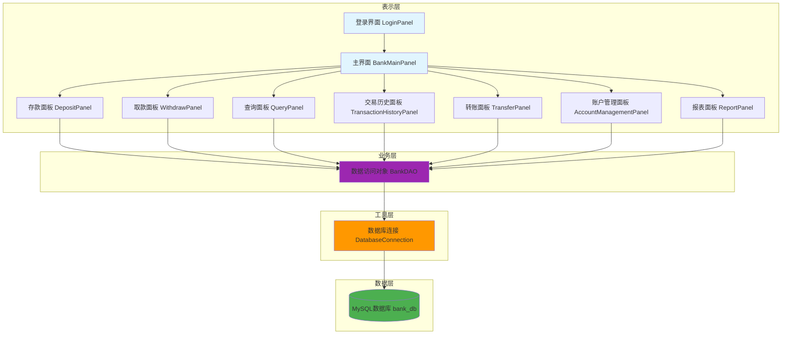

## 2. 数据库设计

### 2.1 数据库模型设计

#### 2.1.1 实体关系图

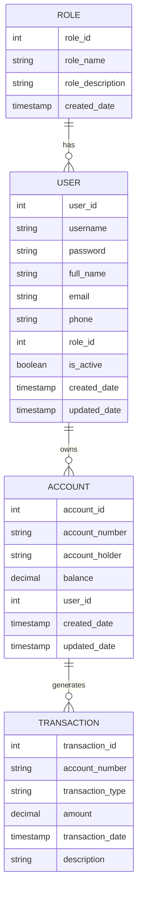

#### 2.1.2 数据字典

| 表名         | 字段名           | 数据类型      | 约束                                                  | 描述                  |
| ------------ | ---------------- | ------------- | ----------------------------------------------------- | --------------------- |
| roles        | role_id          | INT           | PRIMARY KEY, AUTO_INCREMENT                           | 角色ID                |
| roles        | role_name        | VARCHAR(50)   | UNIQUE, NOT NULL                                      | 角色名称              |
| roles        | role_description | VARCHAR(255)  |                                                       | 角色描述              |
| roles        | created_date     | TIMESTAMP     | DEFAULT CURRENT_TIMESTAMP                             | 创建时间              |
| users        | user_id          | INT           | PRIMARY KEY, AUTO_INCREMENT                           | 用户ID                |
| users        | username         | VARCHAR(50)   | UNIQUE, NOT NULL                                      | 用户名                |
| users        | password         | VARCHAR(255)  | NOT NULL                                              | 密码（BCrypt加密）    |
| users        | full_name        | VARCHAR(100)  | NOT NULL                                              | 用户全名              |
| users        | email            | VARCHAR(100)  |                                                       | 邮箱                  |
| users        | phone            | VARCHAR(20)   |                                                       | 电话                  |
| users        | role_id          | INT           | FOREIGN KEY, NOT NULL                                 | 关联角色ID            |
| users        | is_active        | BOOLEAN       | DEFAULT TRUE                                          | 是否激活              |
| users        | created_date     | TIMESTAMP     | DEFAULT CURRENT_TIMESTAMP                             | 创建时间              |
| users        | updated_date     | TIMESTAMP     | DEFAULT CURRENT_TIMESTAMP ON UPDATE CURRENT_TIMESTAMP | 更新时间              |
| accounts     | account_id       | INT           | PRIMARY KEY, AUTO_INCREMENT                           | 账户ID                |
| accounts     | account_number   | VARCHAR(20)   | UNIQUE, NOT NULL                                      | 账号                  |
| accounts     | account_holder   | VARCHAR(100)  | NOT NULL                                              | 账户持有人            |
| accounts     | balance          | DECIMAL(10,2) | DEFAULT 0.00                                          | 账户余额              |
| accounts     | user_id          | INT           | FOREIGN KEY                                           | 关联用户ID            |
| accounts     | created_date     | TIMESTAMP     | DEFAULT CURRENT_TIMESTAMP                             | 创建时间              |
| accounts     | updated_date     | TIMESTAMP     | DEFAULT CURRENT_TIMESTAMP ON UPDATE CURRENT_TIMESTAMP | 更新时间              |
| transactions | transaction_id   | INT           | PRIMARY KEY, AUTO_INCREMENT                           | 交易ID                |
| transactions | account_number   | VARCHAR(20)   | FOREIGN KEY, NOT NULL                                 | 关联账号              |
| transactions | transaction_type | ENUM          | NOT NULL                                              | 交易类型（存款/取款） |
| transactions | amount           | DECIMAL(10,2) | NOT NULL                                              | 交易金额              |
| transactions | transaction_date | TIMESTAMP     | DEFAULT CURRENT_TIMESTAMP                             | 交易时间              |
| transactions | description      | VARCHAR(255)  |                                                       | 交易描述              |

### 2.2 数据库初始化脚本

```sql
-- 银行管理系统数据库初始化脚本
-- 创建数据库和相关表

-- 创建数据库
CREATE DATABASE IF NOT EXISTS bank_db CHARACTER SET utf8mb4 COLLATE utf8mb4_unicode_ci;

-- 使用数据库
USE bank_db;

-- 创建角色表
CREATE TABLE IF NOT EXISTS roles (
    role_id INT AUTO_INCREMENT PRIMARY KEY,
    role_name VARCHAR(50) UNIQUE NOT NULL,
    role_description VARCHAR(255),
    created_date TIMESTAMP DEFAULT CURRENT_TIMESTAMP
);

-- 创建用户表
CREATE TABLE IF NOT EXISTS users (
    user_id INT AUTO_INCREMENT PRIMARY KEY,
    username VARCHAR(50) UNIQUE NOT NULL,
    password VARCHAR(255) NOT NULL,
    full_name VARCHAR(100) NOT NULL,
    email VARCHAR(100),
    phone VARCHAR(20),
    role_id INT NOT NULL,
    is_active BOOLEAN DEFAULT TRUE,
    created_date TIMESTAMP DEFAULT CURRENT_TIMESTAMP,
    updated_date TIMESTAMP DEFAULT CURRENT_TIMESTAMP ON UPDATE CURRENT_TIMESTAMP,
    FOREIGN KEY (role_id) REFERENCES roles(role_id)
);

-- 创建账户表
CREATE TABLE IF NOT EXISTS accounts (
    account_id INT AUTO_INCREMENT PRIMARY KEY,
    account_number VARCHAR(20) UNIQUE NOT NULL,
    account_holder VARCHAR(100) NOT NULL,
    balance DECIMAL(10,2) DEFAULT 0.00,
    user_id INT NULL,
    created_date TIMESTAMP DEFAULT CURRENT_TIMESTAMP,
    updated_date TIMESTAMP DEFAULT CURRENT_TIMESTAMP ON UPDATE CURRENT_TIMESTAMP,
    FOREIGN KEY (user_id) REFERENCES users(user_id)
);

-- 创建交易记录表
CREATE TABLE IF NOT EXISTS transactions (
    transaction_id INT AUTO_INCREMENT PRIMARY KEY,
    account_number VARCHAR(20) NOT NULL,
    transaction_type ENUM('存款', '取款') NOT NULL,
    amount DECIMAL(10,2) NOT NULL,
    transaction_date TIMESTAMP DEFAULT CURRENT_TIMESTAMP,
    description VARCHAR(255),
    FOREIGN KEY (account_number) REFERENCES accounts(account_number)
);

-- 插入角色数据
INSERT INTO roles (role_name, role_description) VALUES
('ADMIN', '系统管理员'),
('USER', '普通用户');

-- 插入用户数据（密码：admin123, user123）
INSERT INTO users (username, password, full_name, email, phone, role_id) VALUES
('admin', '$2a$10$92IXUNpkjO0rOQ5byMi.Ye4oKoEa3Ro9llC/.og/at2.uheWG/igi', '系统管理员', 'admin@bank.com', '13800138000', 1),
('user1', '$2a$10$92IXUNpkjO0rOQ5byMi.Ye4oKoEa3Ro9llC/.og/at2.uheWG/igi', '张三', 'zhangsan@bank.com', '13800138001', 2),
('user2', '$2a$10$92IXUNpkjO0rOQ5byMi.Ye4oKoEa3Ro9llC/.og/at2.uheWG/igi', '李四', 'lisi@bank.com', '13800138002', 2);

-- 插入示例账户数据
INSERT INTO accounts (account_number, account_holder, balance, user_id) VALUES
('6222000000001', '张三', 1000.00, 2),
('6222000000002', '李四', 2500.50, 3),
('6222000000003', '王五', 500.00, NULL);

-- 创建索引以提高查询性能
CREATE INDEX idx_username ON users(username);
CREATE INDEX idx_account_number ON accounts(account_number);
CREATE INDEX idx_transaction_date ON transactions(transaction_date);
CREATE INDEX idx_transaction_account ON transactions(account_number);
CREATE INDEX idx_user_role ON users(role_id);
```

## 3. 系统架构设计

### 3.1 分层架构设计

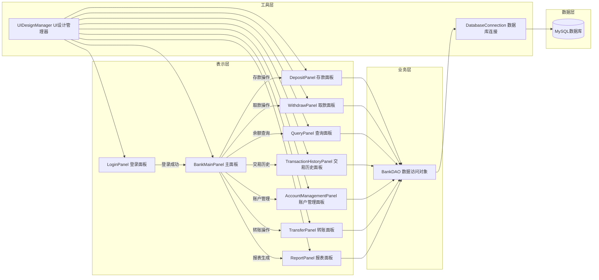

### 3.2 组件交互关系图

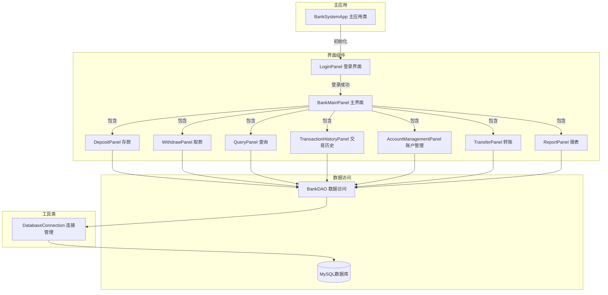

## 4. 核心类详解

### 4.1 BankSystemApp - 主应用程序类

#### 4.1.1 类功能

`BankSystemApp`是整个银行管理系统的入口类，负责应用程序的初始化、界面切换和窗口管理。它使用`CardLayout`实现登录界面和主界面之间的切换，是整个应用程序的容器。

#### 4.1.2 核心属性

| 属性名     | 类型          | 描述                         |
| ---------- | ------------- | ---------------------------- |
| cardLayout | CardLayout    | 卡片布局管理器，用于界面切换 |
| mainPanel  | JPanel        | 主面板容器，包含所有子面板   |
| loginPanel | LoginPanel    | 登录面板实例                 |
| mainFrame  | BankMainPanel | 主面板实例（登录成功后创建） |

#### 4.1.3 核心方法

| 方法名                   | 参数       | 返回类型 | 描述                     |
| ------------------------ | ---------- | -------- | ------------------------ |
| BankSystemApp()          | 无         | void     | 构造函数，初始化所有组件 |
| initializeComponents()   | 无         | void     | 初始化界面组件           |
| setupLayout()            | 无         | void     | 设置界面布局             |
| setupWindow()            | 无         | void     | 设置窗口属性             |
| showMainFrame(User user) | User对象   | void     | 显示主界面               |
| showLoginPanel()         | 无         | void     | 显示登录界面             |
| createIcon()             | 无         | Image    | 创建应用图标             |
| main(String[] args)      | String数组 | void     | 应用程序入口             |

#### 4.1.4 使用场景

- **应用启动**：程序启动时创建`BankSystemApp`实例，初始化登录界面
- **界面切换**：用户登录成功后，调用`showMainFrame()`方法切换到主界面
- **退出登录**：用户退出时，调用`showLoginPanel()`方法返回登录界面
- **窗口管理**：设置窗口标题、大小、图标等属性

#### 4.1.5 代码示例

```java
package com.bank.ui;

import com.bank.model.User;
import javax.swing.*;
import java.awt.*;
import java.awt.image.BufferedImage;

public class BankSystemApp extends JFrame {
    
    private CardLayout cardLayout;
    private JPanel mainPanel;
    private LoginPanel loginPanel;
    private BankMainPanel mainFrame;
    
    public BankSystemApp() {
        initializeComponents();
        setupLayout();
        setupWindow();
    }
    
    private void initializeComponents() {
        cardLayout = new CardLayout();
        mainPanel = new JPanel(cardLayout);
        
        loginPanel = new LoginPanel();
        loginPanel.setLoginSuccessListener(new LoginPanel.LoginSuccessListener() {
            @Override
            public void onLoginSuccess(User user) {
                showMainFrame(user);
            }
        });
        
        mainFrame = null;
    }
    
    private void setupLayout() {
        setLayout(new BorderLayout());
        mainPanel.add(loginPanel, "LOGIN");
        add(mainPanel, BorderLayout.CENTER);
    }
    
    private void setupWindow() {
        setTitle("银行管理系统 - 登录");
        setDefaultCloseOperation(JFrame.EXIT_ON_CLOSE);
        setSize(900, 700);
        setLocationRelativeTo(null);
        setResizable(true);
        setIconImage(createIcon());
    }
    
    private void showMainFrame(User user) {
        if (mainFrame == null) {
            mainFrame = new BankMainPanel(user);
        }
        mainPanel.add(mainFrame, "MAIN");
        cardLayout.show(mainPanel, "MAIN");
        setTitle("银行管理系统 - 欢迎，" + user.getFullName() + " (" + user.getRoleName() + ")");
    }
    
    private void showLoginPanel() {
        cardLayout.show(mainPanel, "LOGIN");
        loginPanel.setInitialFocus();
        setTitle("银行管理系统 - 登录");
    }
    
    private Image createIcon() {
        try {
            BufferedImage icon = new BufferedImage(32, 32, BufferedImage.TYPE_INT_RGB);
            Graphics2D g2d = icon.createGraphics();
            g2d.setColor(new Color(0, 82, 163));
            g2d.fillRect(0, 0, 32, 32);
            g2d.setColor(new Color(255, 215, 0));
            g2d.fillRect(8, 8, 16, 16);
            g2d.setColor(Color.WHITE);
            g2d.fillRect(12, 12, 8, 8);
            g2d.setColor(new Color(139, 69, 19));
            g2d.drawRect(11, 11, 10, 10);
            g2d.dispose();
            return icon;
        } catch (Exception e) {
            return null;
        }
    }
    
    public static void main(String[] args) {
        try {
            UIManager.setLookAndFeel("javax.swing.plaf.metal.MetalLookAndFeel");
        } catch (Exception e) {
            System.err.println("无法设置系统外观，使用默认外观: " + e.getMessage());
        }
        
        SwingUtilities.invokeLater(() -> {
            try {
                BankSystemApp app = new BankSystemApp();
                app.setVisible(true);
                SwingUtilities.invokeLater(() -> {
                    app.loginPanel.setInitialFocus();
                });
            } catch (Exception e) {
                System.err.println("启动应用程序时发生错误: " + e.getMessage());
                e.printStackTrace();
            }
        });
    }
}
```

### 4.2 BankDAO - 数据访问对象类

#### 4.2.1 类功能

`BankDAO`是数据访问层（DAO）的核心类，负责处理所有与数据库相关的操作。它封装了JDBC操作，提供账户查询、余额更新、存款、取款、转账、交易记录等功能，确保数据操作的安全性和一致性。

#### 4.2.2 核心方法

| 方法名                                                       | 参数                     | 返回类型          | 描述               |
| ------------------------------------------------------------ | ------------------------ | ----------------- | ------------------ |
| findAccountByNumber(String accountNumber)                    | 账号                     | BankAccount       | 根据账号查找账户   |
| updateAccountBalance(String accountNumber, double newBalance) | 账号、新余额             | boolean           | 更新账户余额       |
| deposit(String accountNumber, double amount, String description) | 账号、金额、描述         | boolean           | 存款操作（含事务） |
| withdraw(String accountNumber, double amount, String description) | 账号、金额、描述         | boolean           | 取款操作（含事务） |
| recordTransaction(String accountNumber, String transactionType, double amount, String description) | 账号、类型、金额、描述   | boolean           | 记录交易           |
| getTransactionHistory(String accountNumber)                  | 账号                     | List<Transaction> | 获取交易历史       |
| createAccount(String accountNumber, String accountHolder, Integer userId) | 账号、持有人、用户ID     | boolean           | 创建新账户         |
| findAccountsByUserId(int userId)                             | 用户ID                   | List<BankAccount> | 根据用户ID查找账户 |
| updateAccountUser(String accountNumber, Integer userId)      | 账号、用户ID             | boolean           | 更新账户关联用户   |
| transferMoney(String fromAccount, String toAccount, double amount) | 转出账号、转入账号、金额 | boolean           | 转账操作（含事务） |

#### 4.2.3 使用场景

- **存款操作**：用户存款时，先查询账户，计算新余额，更新余额，记录交易，提交事务
- **取款操作**：用户取款时，先查询账户，检查余额是否足够，计算新余额，更新余额，记录交易，提交事务
- **转账操作**：用户转账时，检查两个账户是否存在，检查转出账户余额是否足够，更新两个账户余额，记录两笔交易，提交事务
- **查询余额**：根据账号查询账户信息，获取当前余额
- **交易历史**：根据账号查询所有交易记录，按时间倒序排列

#### 4.2.4 事务管理

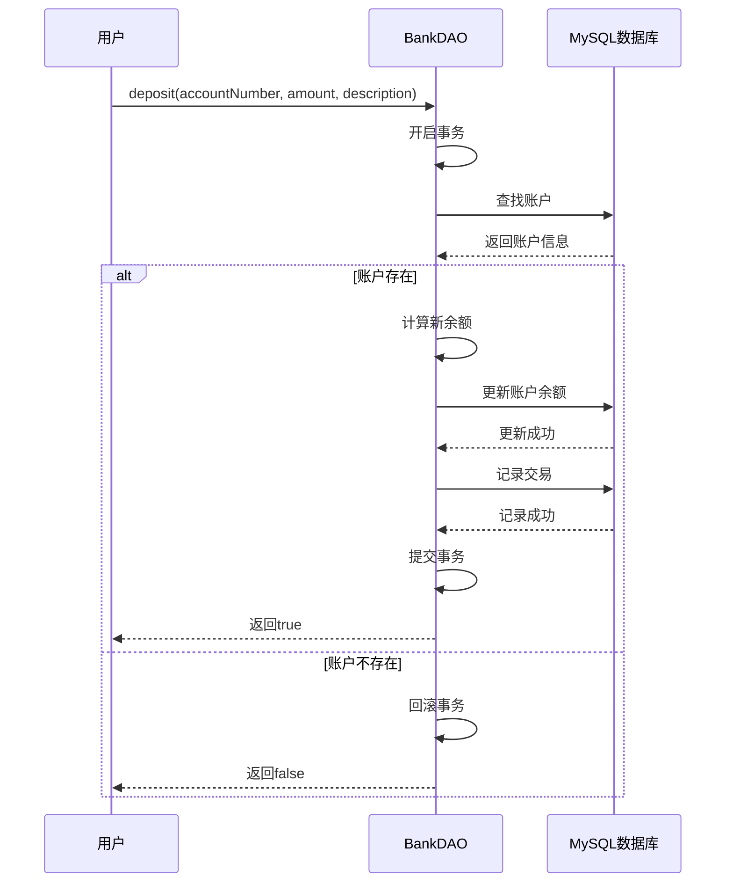

### 4.3 DatabaseConnection - 数据库连接管理类

#### 4.3.1 类功能

`DatabaseConnection`是数据库连接的工具类，负责管理与MySQL数据库的连接。它使用单例模式确保连接参数的一致性，提供获取连接和关闭连接的方法，封装了JDBC驱动的加载和连接管理。

#### 4.3.2 核心属性

| 属性名   | 类型                   | 描述          |
| -------- | ---------------------- | ------------- |
| URL      | String（static final） | 数据库连接URL |
| USERNAME | String（static final） | 数据库用户名  |
| PASSWORD | String（static final） | 数据库密码    |

#### 4.3.3 核心方法

| 方法名                                 | 参数           | 返回类型   | 描述           |
| -------------------------------------- | -------------- | ---------- | -------------- |
| getConnection()                        | 无             | Connection | 获取数据库连接 |
| closeConnection(Connection connection) | Connection对象 | void       | 关闭数据库连接 |

#### 4.3.4 使用场景

- **获取连接**：所有需要访问数据库的操作都通过`getConnection()`方法获取连接
- **关闭连接**：操作完成后，通过`closeConnection()`方法关闭连接，释放资源
- **异常处理**：连接失败时抛出SQLException，由调用方处理

#### 4.3.5 数据库连接流程图

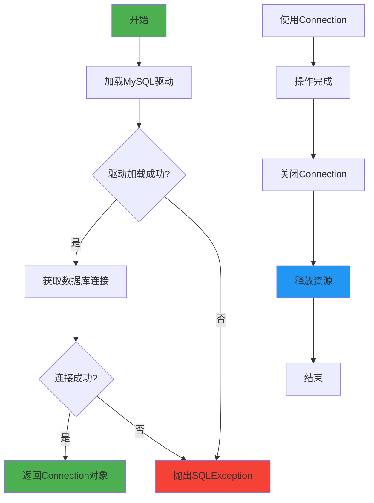

### 4.4 BankAccount - 账户实体类

#### 4.4.1 类功能

`BankAccount`是账户的实体类，用于表示银行账户的数据模型。它封装了账户的基本信息，包括账户ID、账号、持有人姓名和余额，提供了标准的getter和setter方法。

#### 4.4.2 核心属性

| 属性名        | 类型   | 描述           |
| ------------- | ------ | -------------- |
| accountId     | int    | 账户ID（主键） |
| accountNumber | String | 账号           |
| accountHolder | String | 账户持有人姓名 |
| balance       | double | 账户余额       |

#### 4.4.3 核心方法

| 方法名                                                       | 参数                       | 返回类型 | 描述               |
| ------------------------------------------------------------ | -------------------------- | -------- | ------------------ |
| BankAccount()                                                | 无                         | void     | 默认构造函数       |
| BankAccount(int accountId, String accountNumber, String accountHolder, double balance) | 账户ID、账号、持有人、余额 | void     | 完整构造函数       |
| getAccountId()                                               | 无                         | int      | 获取账户ID         |
| setAccountId(int accountId)                                  | 账户ID                     | void     | 设置账户ID         |
| getAccountNumber()                                           | 无                         | String   | 获取账号           |
| setAccountNumber(String accountNumber)                       | 账号                       | void     | 设置账号           |
| getAccountHolder()                                           | 无                         | String   | 获取持有人姓名     |
| setAccountHolder(String accountHolder)                       | 持有人姓名                 | void     | 设置持有人姓名     |
| getBalance()                                                 | 无                         | double   | 获取余额           |
| setBalance(double balance)                                   | 余额                       | void     | 设置余额           |
| toString()                                                   | 无                         | String   | 返回账户信息字符串 |

#### 4.4.4 使用场景

- **数据传输**：在数据库操作和界面显示之间传输账户数据
- **数据封装**：封装账户的所有属性，提供统一的访问接口
- **数据验证**：可以在setter方法中添加数据验证逻辑

#### 4.4.5 类图

```mermaid
classDiagram
    class BankAccount {
        -int accountId
        -String accountNumber
        -String accountHolder
        -double balance
        +BankAccount()
        +BankAccount(int, String, String, double)
        +getAccountId() int
        +setAccountId(int) void
        +getAccountNumber() String
        +setAccountNumber(String) void
        +getAccountHolder() String
        +setAccountHolder(String) void
        +getBalance() double
        +setBalance(double) void
        +toString() String
    }
    
    class Transaction {
        -int transactionId
        -String accountNumber
        -String transactionType
        -double amount
        -LocalDateTime transactionDate
        -String description
        +getTransactionId() int
        +setTransactionId(int) void
        +getAccountNumber() String
        +setAccountNumber(String) void
        +getTransactionType() String
        +setTransactionType(String) void
        +getAmount() double
        +setAmount(double) void
        +getTransactionDate() LocalDateTime
        +setTransactionDate(LocalDateTime) void
        +getDescription() String
        +setDescription(String) void
    }
    
    class User {
        -int userId
        -String username
        -String password
        -String fullName
        -String email
        -String phone
        -int roleId
        -boolean isActive
        +getUserId() int
        +setUserId(int) void
        +getUsername() String
        +setUsername(String) void
        +getPassword() String
        +setPassword(String) void
        +getFullName() String
        +setFullName(String) void
        +getEmail() String
        +setEmail(String) void
        +getPhone() String
        +setPhone(String) void
        +getRoleId() int
        +setRoleId(int) void
        +getIsActive() boolean
        +setIsActive(boolean) void
        +getRoleName() String
    }
    
    class Role {
        -int roleId
        -String roleName
        -String roleDescription
        +getRoleId() int
        +setRoleId(int) void
        +getRoleName() String
        +setRoleName(String) void
        +getRoleDescription() String
        +setRoleDescription(String) void
    }
    
    BankAccount "1" --> "*" Transaction : generates
    User "1..*" --> BankAccount : owns
    Role "1" --> User : has
```

## 5. 业务流程设计

### 5.1 登录流程

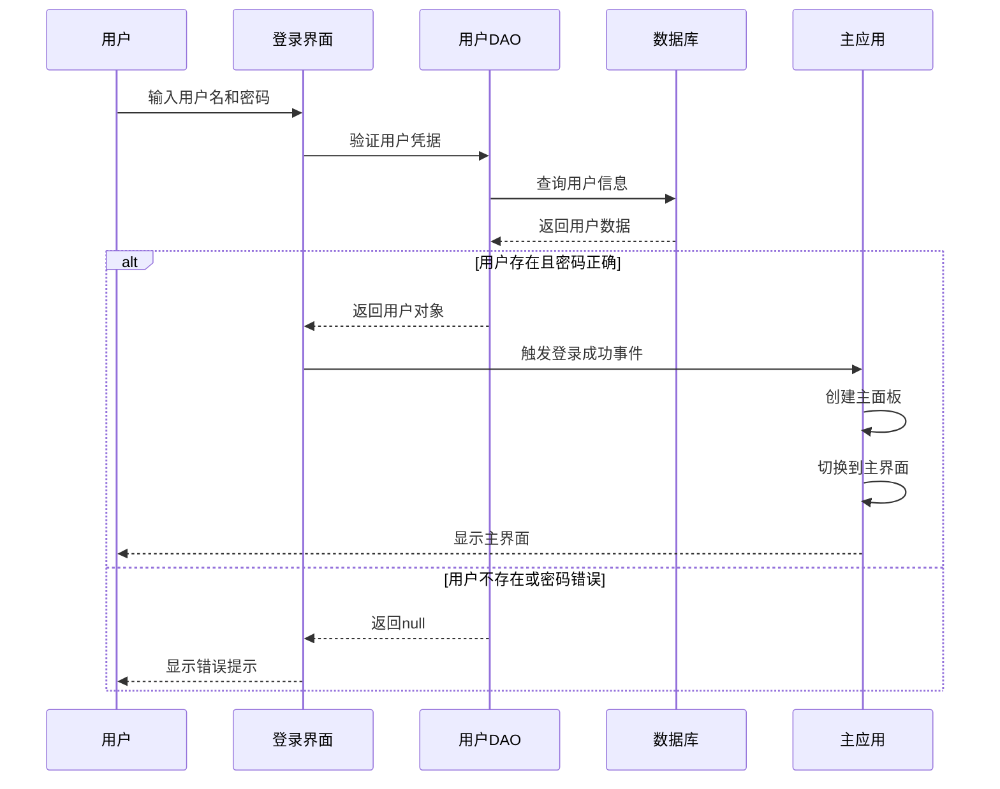

### 5.2 存款流程

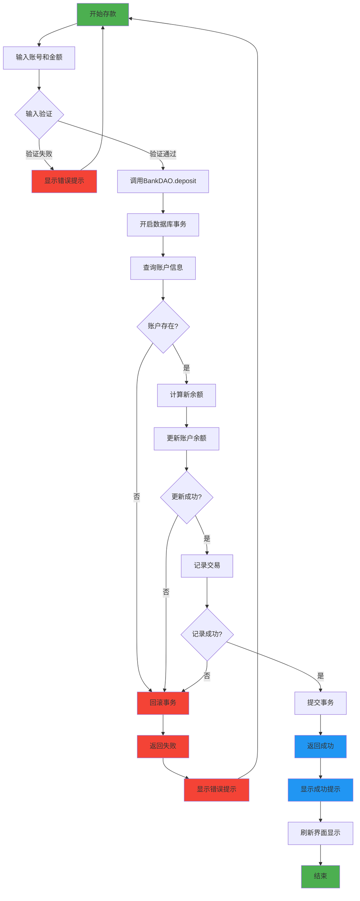

### 5.3 取款流程

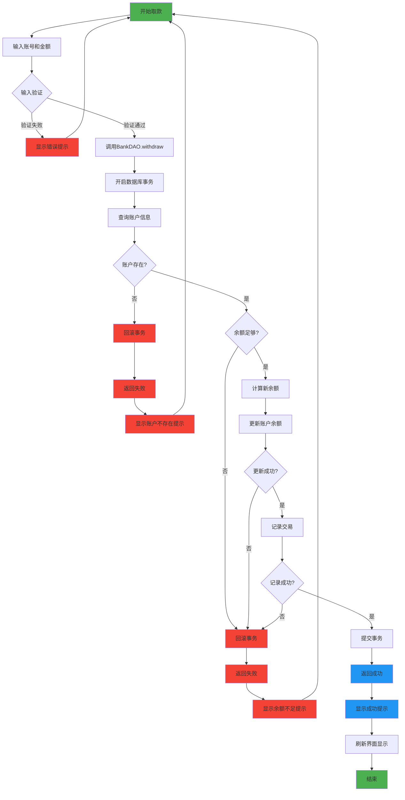

### 5.4 转账流程

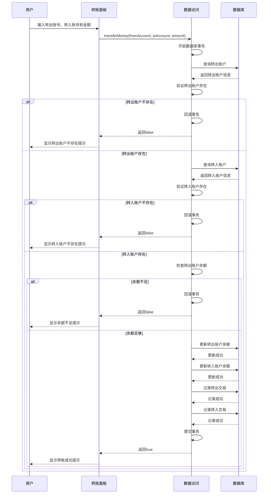

## 6. 开发环境搭建

### 6.1 前置条件

- JDK 8或更高版本
- MySQL 8.0或更高版本
- Maven 3.8或更高版本
- IDE（推荐IntelliJ IDEA或Eclipse）

### 6.2 项目结构

```
bank/
├── src/
│   ├── main/
│   │   ├── java/
│   │   │   └── com/
│   │   │       └── bank/
│   │   │           ├── dao/          # 数据访问对象
│   │   │           │   ├── BankDAO.java
│   │   │           │   └── UserDAO.java
│   │   │           ├── model/        # 实体类
│   │   │           │   ├── BankAccount.java
│   │   │           │   ├── Transaction.java
│   │   │           │   ├── User.java
│   │   │           │   └── Role.java
│   │   │           ├── ui/           # 用户界面
│   │   │           │   ├── BankSystemApp.java
│   │   │           │   ├── BankMainFrame.java
│   │   │           │   ├── BankMainPanel.java
│   │   │           │   ├── LoginPanel.java
│   │   │           │   ├── DepositPanel.java
│   │   │           │   ├── WithdrawPanel.java
│   │   │           │   ├── QueryPanel.java
│   │   │           │   ├── TransactionHistoryPanel.java
│   │   │           │   ├── AccountManagementPanel.java
│   │   │           │   ├── TransferPanel.java
│   │   │           │   ├── ReportPanel.java
│   │   │           │   └── UIDesignManager.java
│   │   │           └── util/         # 工具类
│   │   │               └── DatabaseConnection.java
│   │   └── resources/
│   │       └── database_init_simple.sql
│   └── test/
│       └── java/
│           └── com/
│               └── bank/
├── pom.xml
├── run.sh
└── README.md
```

### 6.3 环境配置步骤

#### 6.3.1 JDK安装与配置

1. 下载JDK 8+安装包并安装
2. 配置环境变量：

```bash
# macOS/Linux
export JAVA_HOME=/path/to/jdk
export PATH=$JAVA_HOME/bin:$PATH

# Windows
set JAVA_HOME=C:\path\to\jdk
set PATH=%JAVA_HOME%\bin;%PATH%
```

3. 验证安装：

```bash
java -version
javac -version
```

#### 6.3.2 MySQL安装与配置

1. 下载并安装MySQL 8.0+
2. 启动MySQL服务
3. 创建数据库：

```sql
CREATE DATABASE bank_db CHARACTER SET utf8mb4 COLLATE utf8mb4_unicode_ci;
```

4. 执行初始化脚本：

```bash
mysql -u root -p < src/main/resources/database_init_simple.sql
```

#### 6.3.3 Maven配置

1. 下载Maven 3.8+并解压
2. 配置环境变量：

```bash
# macOS/Linux
export MAVEN_HOME=/path/to/maven
export PATH=$MAVEN_HOME/bin:$PATH

# Windows
set MAVEN_HOME=C:\path\to\maven
set PATH=%MAVEN_HOME%\bin;%PATH%
```

3. 验证安装：

```bash
mvn -version
```

### 6.4 项目构建

```bash
# 进入项目目录
cd /path/to/bank

# 编译项目
mvn clean compile

# 打包项目
mvn package
```

### 6.5 运行程序

方式一：使用Maven直接运行

```bash
mvn exec:java -Dexec.mainClass="com.bank.ui.BankSystemApp"
```

方式二：使用启动脚本

```bash
./run.sh
```

## 7. 系统功能模块

### 7.1 用户认证模块

#### 7.1.1 功能描述

用户认证模块负责验证用户身份，确保只有授权用户才能访问系统。系统支持两种角色：管理员和普通用户，不同角色拥有不同的功能权限。

#### 7.1.2 认证流程图

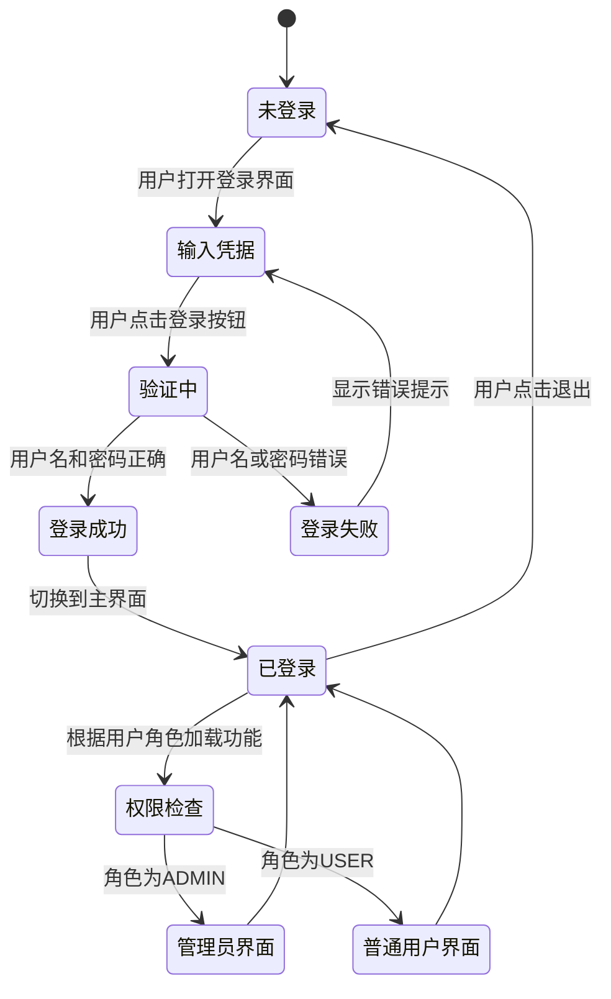

#### 7.1.3 示例账户

| 用户类型 | 用户名 | 密码     | 角色               | 姓名 |
| -------- | ------ | -------- | ------------------ | ---- |
| 管理员   | admin  | admin123 | ADMIN - 系统管理员 |      |
| 普通用户 | user1  | user123  | USER - 张三        |      |
| 普通用户 | user2  | user123  | USER - 李四        |      |

### 7.2 存款模块

#### 7.2.1 功能描述

存款模块允许用户向指定账户存入资金，系统会自动更新账户余额并记录交易历史。

#### 7.2.2 存款状态图

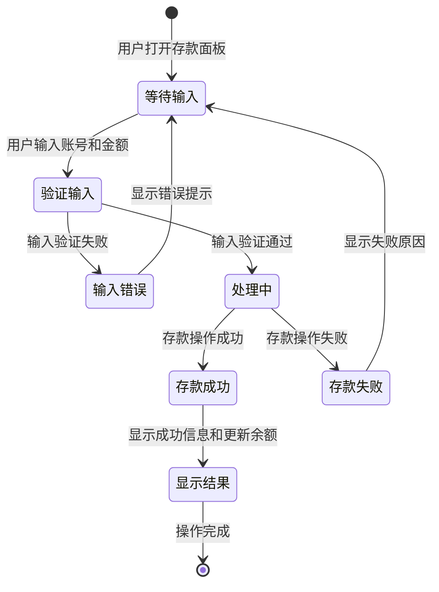

### 7.3 取款模块

#### 7.3.1 功能描述

取款模块允许用户从指定账户提取资金，系统会检查账户余额是否足够，更新账户余额并记录交易历史。

#### 7.3.2 取款状态图

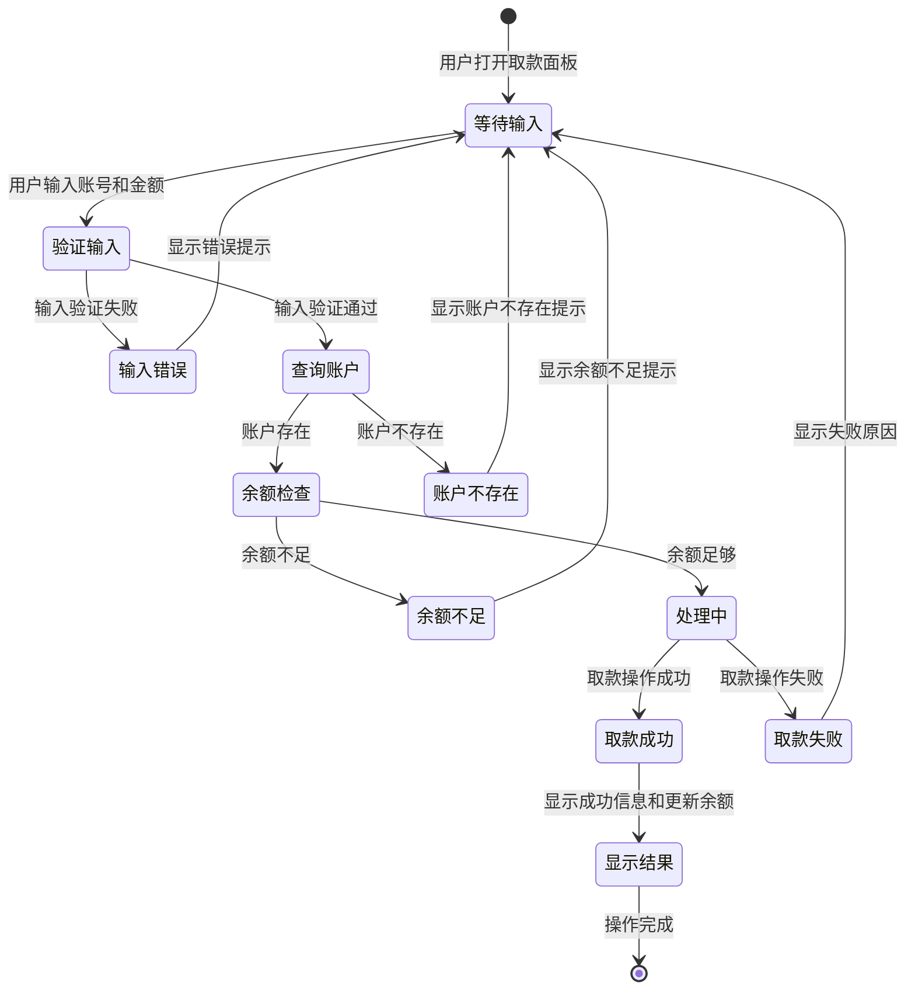

### 7.4 交易历史模块

#### 7.4.1 功能描述

交易历史模块允许用户查看指定账户的所有交易记录，包括存款、取款、转账等操作，按时间倒序显示。

#### 7.4.2 交易历史流程图


### 7.5 账户管理模块

#### 7.5.1 功能描述

账户管理模块允许管理员创建新账户、查看账户列表、修改账户信息、关联用户等操作。

#### 7.5.2 账户管理流程图

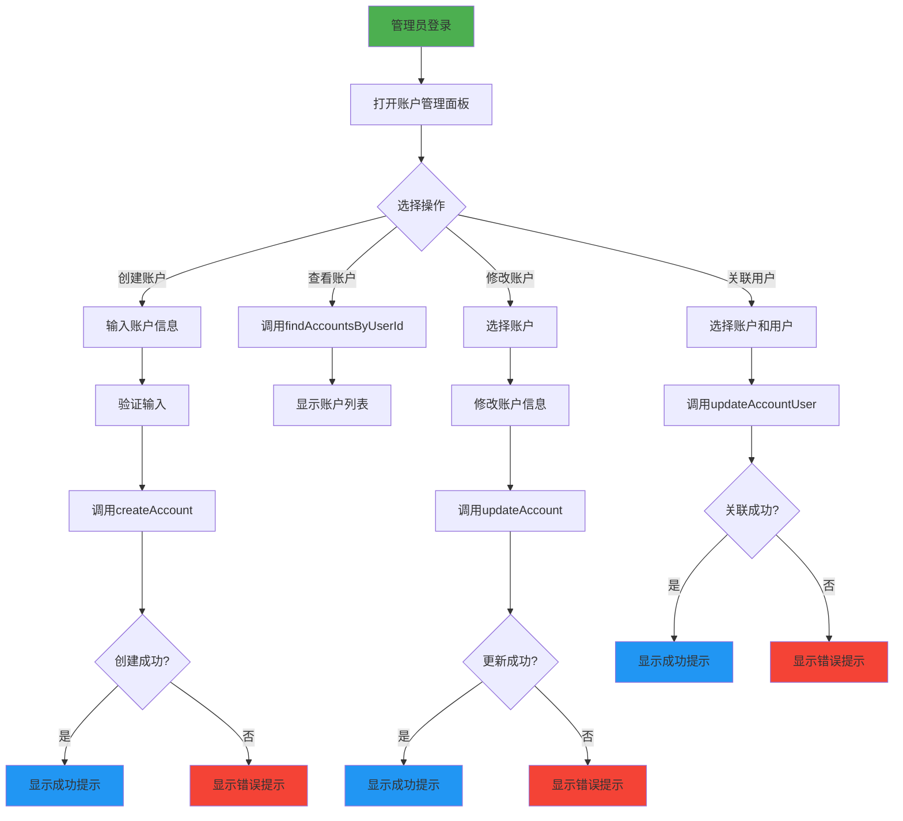

## 8. 安全特性

### 8.1 安全机制

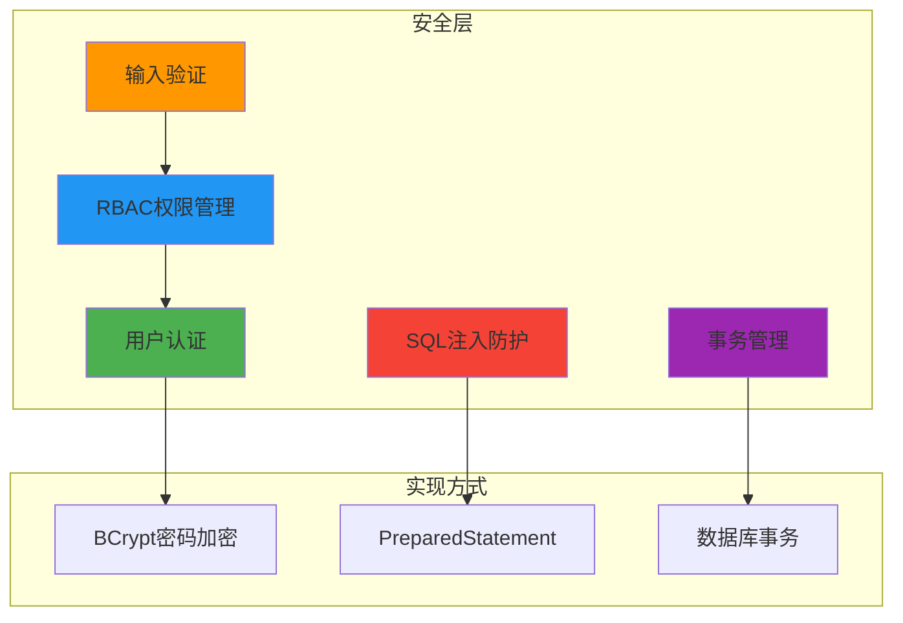

### 8.2 安全特性说明

| 安全特性     | 实现方式          | 描述                                   |
| ------------ | ----------------- | -------------------------------------- |
| 用户认证     | 数据库验证        | 用户名和密码存储在数据库中，登录时验证 |
| RBAC权限管理 | 角色控制          | 不同角色拥有不同的功能权限             |
| 密码加密     | BCrypt            | 使用BCrypt算法加密用户密码             |
| 输入验证     | 前端验证          | 防止无效数据输入                       |
| SQL注入防护  | PreparedStatement | 使用参数化查询防止SQL注入              |
| 事务管理     | JDBC事务          | 确保存款和取款操作的数据一致性         |

## 9. 故障排除

### 9.1 常见问题与解决方案

| 问题             | 可能原因                       | 解决方案                        |
| ---------------- | ------------------------------ | ------------------------------- |
| 数据库连接失败   | 数据库服务未启动，连接参数错误 | 检查MySQL服务状态，验证连接参数 |
| 账户余额不足     | 取款或转账金额超过账户余额     | 检查账户余额，调整操作金额      |
| 用户名或密码错误 | 输入错误或用户不存在           | 检查输入内容，确认用户存在      |
| 中文乱码         | 数据库字符集设置不当           | 确认MySQL字符集设置为utf8mb4    |
| 界面显示异常     | Swing组件初始化失败            | 检查代码逻辑，查看异常堆栈      |

### 9.2 调试流程图

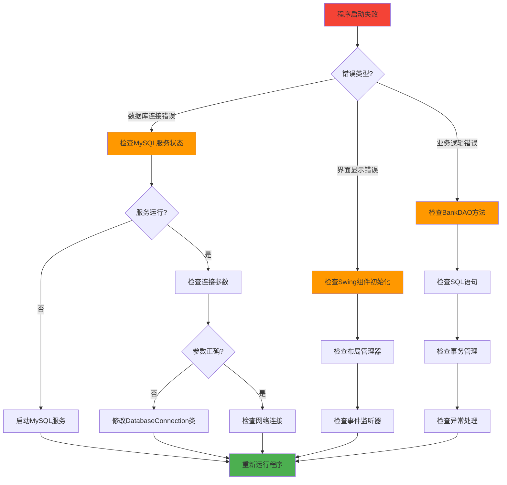

## 10. 项目总结

### 10.1 系统功能

- ✅ 用户认证：基于数据库的用户登录验证，支持管理员和普通用户角色
- ✅ RBAC权限管理：基于角色的访问控制，不同角色拥有不同功能权限
- ✅ 存款功能：向指定账户存入资金
- ✅ 取款功能：从指定账户提取资金
- ✅ 余额查询：查看账户当前余额
- ✅ 交易历史：查看账户的交易记录
- ✅ 账户管理：管理员可创建和管理账户
- ✅ 转账功能：账户之间资金转账

### 10.2 技术亮点

1. **桌面应用架构**：采用Swing构建跨平台桌面应用
2. **分层架构**：清晰的表示层、业务层、数据层分离
3. **JDBC数据访问**：使用JDBC原生API访问MySQL数据库
4. **事务管理**：确保存款、取款、转账操作的数据一致性
5. **RBAC权限控制**：基于角色的访问控制，确保系统安全
6. **密码加密**：使用BCrypt算法加密用户密码

### 10.3 后续优化方向

1. **性能优化**：优化数据库查询，添加连接池管理
2. **界面优化**：改进UI设计，提升用户体验
3. **功能扩展**：添加更多银行业务功能，如贷款、理财等
4. **日志管理**：添加详细的操作日志记录
5. **数据备份**：实现数据库定期备份功能

## 11. 附录

### 11.1 参考文档

- [Java官方文档](https://docs.oracle.com/javase/8/)
- [JDBC教程](https://docs.oracle.com/javase/tutorial/jdbc/)
- [Swing教程](https://docs.oracle.com/javase/tutorial/uiswing/)
- [MySQL官方文档](https://dev.mysql.com/doc/)

### 11.2 开发工具推荐

| 工具            | 用途           | 推荐版本 |
| --------------- | -------------- | -------- |
| IntelliJ IDEA   | Java开发IDE    | 2023.1+  |
| Eclipse         | Java开发IDE    | 2023-03+ |
| MySQL Workbench | 数据库管理工具 | 8.0+     |
| Navicat Premium | 数据库管理工具 | 16.0+    |
| Maven           | 项目构建工具   | 3.8+     |