# Java Socket 聊天室 - 从0开始开发教程

## 项目概述

这是一个基于 Java Socket 的网络聊天室应用，采用 C/S（客户端/服务端）架构，支持以下功能：

- 用户注册/登录/找回密码
- 私聊和群聊
- 文件传输（私聊和群聊）
- 窗口抖动功能
- 在线用户列表实时更新
- 群组管理（创建、搜索、加入）
- 自定义聊天字体
- 截图功能

## 技术栈

- **Java SE** - 核心编程语言
- **Java Swing** - GUI界面开发
- **Java Socket** - 网络通信
- **Java IO** - 数据传输
- **多线程** - 并发处理

## 项目结构

```
NewChatRoom/
├── src/
│   ├── common/                          # 公共类（客户端和服务端共享）
│   │   ├── Message.java                 # 消息实体类
│   │   └── Group.java                   # 群组实体类
│   ├── server/                           # 服务端代码
│   │   ├── ChatServer.java               # 服务端主类
│   │   ├── handlers/
│   │   │   ├── ClientHandler.java        # 客户端连接处理
│   │   │   └── MessageHandler.java       # 消息处理
│   │   ├── managers/
│   │   │   ├── UserManager.java         # 用户管理
│   │   │   ├── OnlineUserManager.java    # 在线用户管理
│   │   │   └── GroupManager.java        # 群组管理
│   │   └── broadcast/
│   │       └── BroadcastService.java     # 广播服务
│   └── client/                           # 客户端代码
│       ├── ChatClient.java               # 客户端主类
│       ├── MessageListener.java           # 消息监听线程
│       ├── ScreenshotManager.java        # 截图管理
│       ├── UIComponentFactory.java        # UI组件工厂
│       ├── network/
│       │   └── NetworkManager.java     # 网络管理
│       ├── handler/
│       │   └── MessageHandler.java       # 消息处理器
│       ├── managers/
│       │   ├── ChatManager.java         # 聊天管理
│       │   ├── FileManager.java         # 文件管理
│       │   ├── DataManager.java         # 数据管理
│       │   ├── WindowManager.java       # 窗口管理
│       │   └── AuthenticationManager.java # 认证管理
│       └── ui/
│           ├── ChatMainUI.java          # 聊天主界面
│           ├── LoginRegisterUI.java      # 登录注册界面
│           └── UIComponentFactory.java    # UI组件工厂
```

## 项目架构图

### 1. 整体架构层次结构图

以下是项目的整体架构层次结构图，展示了客户端、服务端、公共模块之间的组织关系：

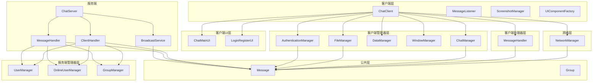

### 2. UML类图

以下是项目中主要类的关系图，展示各个类之间的继承、关联、依赖关系：

```mermaid
classDiagram
    class Message {
        <<enumeration>>
        +Type type
        +String sender
        +String receiver
        +String content
        +List~String~ onlineUsers
        +String fileName
        +long fileSize
        +byte[] fileData
        +String groupId
        +String groupName
        +List~Group~ groupList
        +String password
        +Message(Type, String, String, String)
        +Message(Type, String)
        +getType()
        +setType()
        +getSender()
        +setSender()
        +getReceiver()
        +setReceiver()
        +getContent()
        +setContent()
        +getOnlineUsers()
        +setOnlineUsers()
        +getFileName()
        +setFileName()
        +getFileSize()
        +setFileSize()
        +getFileData()
        +setFileData()
        +getGroupId()
        +setGroupId()
        +getGroupName()
        +setGroupName()
        +getGroupList()
        +setGroupList()
        +getPassword()
        +setPassword()
    }
    
    class Group {
        +String groupId
        +String groupName
        +List~String~ members
        +Group(String, String)
        +addMember(String)
        +removeMember(String)
        +getGroupId()
        +setGroupId()
        +getGroupName()
        +setGroupName()
        +getMembers()
        +setMembers()
    }
    
    class ChatClient {
        +String serverIp
        +String username
        +NetworkManager networkManager
        +MessageHandler messageHandler
        +UIComponentFactory uiComponentFactory
        +ChatManager chatManager
        +FileManager fileManager
        +DataManager dataManager
        +WindowManager windowManager
        +login(String, String, String)
        +initChatUI()
        +startMessageListener()
        +sendMessage()
        +selectFile()
        +sendFile()
        +saveBytesToFile()
        +updateUserList()
        +updateGroupList()
        +sendShakeMessage()
        +shakeWindow()
        +resetSocket()
    }
    
    class NetworkManager {
        +String serverIp
        +Socket socket
        +ObjectOutputStream oos
        +ObjectInputStream ois
        +connectToServer()
        +sendMessage(Message)
        +receiveMessage()
        +resetSocket()
    }
    
    class MessageHandler {
        +ChatClient chatClient
        +ChatMainUI chatMainUI
        +handleMessage(Message)
    }
    
    class ChatManager {
        +ChatClient chatClient
        +sendMessage()
        +sendShake()
        +sendCreateGroupRequest()
        +sendSearchGroupRequest()
        +sendJoinGroupRequest()
    }
    
    class FileManager {
        +ChatClient chatClient
        +File selectedFile
        +selectFile()
        +sendFile()
        +captureAndSendScreenshot()
    }
    
    class DataManager {
        +ChatClient chatClient
        +updateUserList()
        +updateGroupList()
        +saveBytesToFile()
    }
    
    class WindowManager {
        +ChatClient chatClient
        +shakeWindow()
        +isShaking()
    }
    
    class AuthenticationManager {
        +ChatClient chatClient
        +register(String, String)
        +login(String, String, String)
        +findPassword(String)
        +resetPassword(String)
    }
    
    class ChatMainUI {
        +ChatClient chatClient
        +JTextArea chatArea
        +JTextField inputField
        +JComboBox~String~ chatTypeBox
        +JComboBox~String~ targetBox
        +initChatUI(String)
        +getChatArea()
        +getInputField()
        +getChatTypeBox()
        +getTargetBox()
    }
    
    class LoginRegisterUI {
        +JFrame frame
        +JTextField loginAccountField
        +JPasswordField loginPwdField
        +JTextField registerAccountField
        +JPasswordField registerPwdField
        +performLogin()
        +performRegister()
        +performFindPassword()
    }
    
    class ChatServer {
        +UserManager userManager
        +OnlineUserManager onlineUserManager
        +GroupManager groupManager
        +BroadcastService broadcastService
        +start()
    }
    
    class ClientHandler {
        +Socket socket
        +MessageHandler messageHandler
        +run()
        +cleanup()
        +getOutputStream()
    }
    
    class ServerMessageHandler {
        +UserManager userManager
        +OnlineUserManager onlineUserManager
        +GroupManager groupManager
        +BroadcastService broadcastService
        +String currentUsername
        +handleMessage(Message)
        +setCurrentUsername(String)
    }
    
    class BroadcastService {
        +OnlineUserManager onlineUserManager
        +GroupManager groupManager
        +broadcastToAll(Message)
        +sendToUser(String, Message)
        +broadcastToGroup(String, Message)
        +broadcastOnlineUsers()
        +broadcastGroupList()
    }
    
    class UserManager {
        +Map~String, String~ userAuthMap
        +register(String, String)
        +authenticate(String, String)
        +userExists(String)
        +updatePassword(String, String)
    }
    
    class OnlineUserManager {
        +Map~String, ObjectOutputStream~ userMap
        +addUser(String, ObjectOutputStream)
        +removeUser(String)
        +getUserStream(String)
        +getOnlineUsers()
        +isUserOnline(String)
    }
    
    class GroupManager {
        +Map~String, Group~ groupMap
        +createGroup(String)
        +searchGroups(String)
        +getGroup(String)
        +joinGroup(String, String)
        +getAllGroups()
    }
    
    %% 关系定义
    ChatClient ..> NetworkManager : uses
    ChatClient ..> MessageHandler : uses
    ChatClient ..> ChatManager : uses
    ChatClient ..> FileManager : uses
    ChatClient ..> DataManager : uses
    ChatClient ..> WindowManager : uses
    ChatClient ..> AuthenticationManager : uses
    ChatClient ..> ChatMainUI : uses
    ChatClient ..> LoginRegisterUI : uses
    
    MessageHandler --> ChatClient : handles
    MessageHandler --> ChatMainUI : updates
    
    ChatManager --> ChatClient : manages
    FileManager --> ChatClient : manages
    DataManager --> ChatClient : manages
    WindowManager --> ChatClient : manages
    AuthenticationManager --> ChatClient : manages
    
    NetworkManager ..> Message : sends/receives
    ChatManager ..> Message : creates
    FileManager ..> Message : creates
    AuthenticationManager ..> Message : creates
    
    ChatServer ..> ClientHandler : creates
    ChatServer ..> UserManager : uses
    ChatServer ..> OnlineUserManager : uses
    ChatServer ..> GroupManager : uses
    ChatServer ..> BroadcastService : uses
    
    ClientHandler --> ServerMessageHandler : contains
    ClientHandler ..> Message : receives
    
    ServerMessageHandler --> UserManager : uses
    ServerMessageHandler --> OnlineUserManager : uses
    ServerMessageHandler --> GroupManager : uses
    ServerMessageHandler --> BroadcastService : uses
    
    BroadcastService --> OnlineUserManager : uses
    BroadcastService --> GroupManager : uses
    
    Message ||--|| Group : contains
    ChatClient ||--o| ChatMainUI : contains
    ChatClient ||--o| LoginRegisterUI : contains
```

### 3. 网络通信架构图

以下是客户端与服务端的连接和通信机制图：

```mermaid
sequenceDiagram
    participant Client as 客户端
    participant Network as 网络层
    participant Server as 服务端
    participant Handler as 消息处理器
    participant Managers as 管理器层
    
    Client->>Network: 连接到服务器
    Network->>Server: TCP连接建立
    Server->>Network: 连接确认
    Network->>Client: 连接成功
    
    loop 消息循环
        Client->>Network: 发送Message对象
        Network->>Server: 序列化传输
        Server->>Handler: 解析消息
        Handler->>Managers: 分发处理
        alt 消息类型判断
            case 私聊消息
                Managers->>BroadcastService: 发送到指定用户
                BroadcastService->>TargetClient: 消息转发
            case 群聊消息
                Managers->>BroadcastService: 发送到群组
                BroadcastService->>GroupClients: 消息广播
            case 文件传输
                Managers->>BroadcastService: 发送文件数据
                BroadcastService->>ReceivingClient: 文件转发
        end
    end
```

### 4. 消息传递流程图

以下是消息从发送到接收的完整流程图：

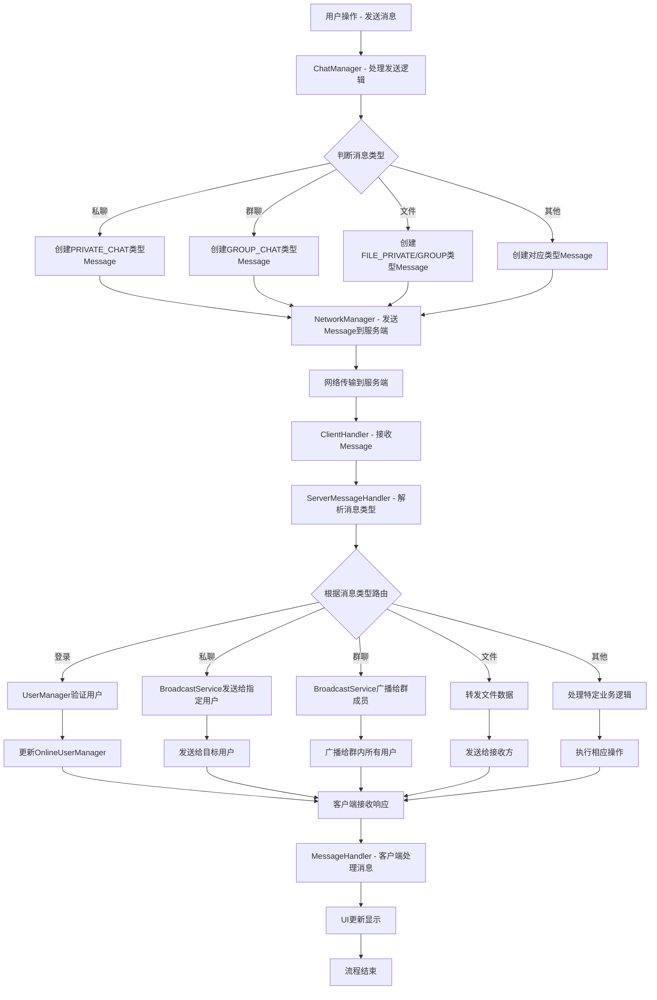

### 5. UI界面布局图

以下是聊天主界面的组件布局图：

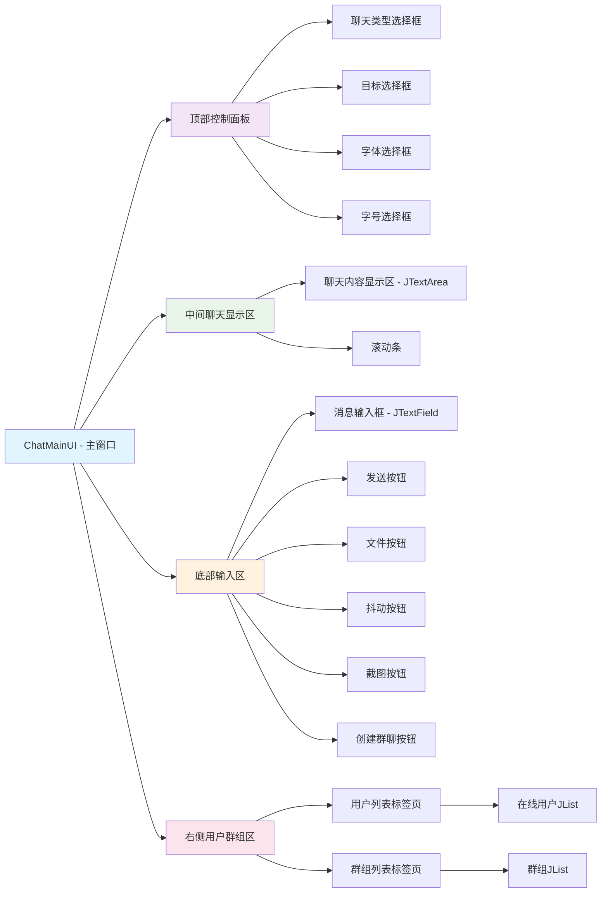

### 6. 数据流向图

以下是数据在各个模块间的流转过程图：


### 7. 系统运行时的组件交互图

以下是各管理器、处理器之间的协作关系图：

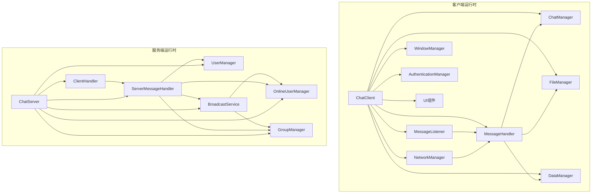

## 第一阶段：基础架构搭建

### 1.1 创建公共消息类

创建 `common/Message.java`，这是客户端和服务端通信的基础：

```java
package common;
import java.io.Serializable;
import java.util.List;

/**
 * 消息实体类，用于客户端和服务端之间的通信
 */
public class Message implements Serializable {

    // 消息类型枚举
    public enum Type {
        LOGIN,              // 登录
        PRIVATE_CHAT,       // 私聊
        GROUP_CHAT,         // 群聊
        ONLINE_NOTIFY,      // 上线通知
        OFFLINE_NOTIFY,     // 下线通知
        GET_ONLINE_USERS,   // 获取在线用户
        ONLINE_USERS,       // 在线用户列表
        FILE_PRIVATE,       // 私聊文件
        FILE_GROUP,         // 群聊文件
        SHAKE,              // 窗口抖动
        CREATE_GROUP,       // 创建群组
        SEARCH_GROUP,       // 搜索群组
        JOIN_GROUP,         // 加入群组
        GROUP_LIST,         // 群组列表
        REGISTER,           // 注册
        REGISTER_RESPONSE,  // 注册响应
        FIND_PASSWORD,      // 找回密码
        FIND_PASSWORD_RESPONSE,
        RESET_PASSWORD,     // 重置密码
        RESET_PASSWORD_RESPONSE
    }

    private Type type;        // 消息类型
    private String sender;    // 发送者
    private String receiver;  // 接收者
    private String content;   // 消息内容
    private List<String> onlineUsers;  // 在线用户列表
    
    // 文件传输相关字段
    private String fileName;
    private long fileSize;
    private byte[] fileData;
    
    // 群聊相关字段
    private String groupId;
    private String groupName;
    private List<Group> groupList;
    
    private String password;  // 密码字段

    // 构造函数
    public Message(Type type, String sender, String receiver, String content) {
        this.type = type;
        this.sender = sender;
        this.receiver = receiver;
        this.content = content;
    }

    public Message(Type type, String sender) {
        this.type = type;
        this.sender = sender;
        this.content = "";
    }

    // Getter 和 Setter 方法
    public Type getType() { return type; }
    public void setType(Type type) { this.type = type; }
    
    public String getSender() { return sender; }
    public void setSender(String sender) { this.sender = sender; }
    
    public String getReceiver() { return receiver; }
    public void setReceiver(String receiver) { this.receiver = receiver; }
    
    public String getContent() { return content; }
    public void setContent(String content) { this.content = content; }
    
    public List<String> getOnlineUsers() { return onlineUsers; }
    public void setOnlineUsers(List<String> onlineUsers) { this.onlineUsers = onlineUsers; }
    
    public String getFileName() { return fileName; }
    public void setFileName(String fileName) { this.fileName = fileName; }
    
    public long getFileSize() { return fileSize; }
    public void setFileSize(long fileSize) { this.fileSize = fileSize; }
    
    public byte[] getFileData() { return fileData; }
    public void setFileData(byte[] fileData) { this.fileData = fileData; }
    
    public String getGroupId() { return groupId; }
    public void setGroupId(String groupId) { this.groupId = groupId; }
    
    public String getGroupName() { return groupName; }
    public void setGroupName(String groupName) { this.groupName = groupName; }
    
    public List<Group> getGroupList() { return groupList; }
    public void setGroupList(List<Group> groupList) { this.groupList = groupList; }
    
    public String getPassword() { return password; }
    public void setPassword(String password) { this.password = password; }
}
```

**关键点说明：**
- 实现 `Serializable` 接口，使对象可以通过网络传输
- 使用枚举定义消息类型，便于管理和扩展
- 包含多种构造函数，适应不同场景
- 提供完整的getter和setter方法

### 1.2 创建群组实体类

创建 `common/Group.java`：

```java
package common;

import java.util.ArrayList;
import java.util.List;

public class Group implements java.io.Serializable {
    private String groupId;      // 唯一群ID
    private String groupName;    // 群名称
    private List<String> members; // 群成员列表

    public Group(String groupId, String groupName) {
        this.groupId = groupId;
        this.groupName = groupName;
        this.members = new ArrayList<>();
    }

    // 添加群成员
    public void addMember(String username) {
        if (!members.contains(username)) {
            members.add(username);
        }
    }

    // 移除群成员
    public void removeMember(String username) {
        members.remove(username);
    }

    // Getter 和 Setter
    public String getGroupId() { return groupId; }
    public void setGroupId(String groupId) { this.groupId = groupId; }
    
    public String getGroupName() { return groupName; }
    public void setGroupName(String groupName) { this.groupName = groupName; }
    
    public List<String> getMembers() { return members; }
    public void setMembers(List<String> members) { this.members = members; }
}
```

---

## 第二阶段：服务端开发

### 2.1 用户管理器

创建 `server/managers/UserManager.java`：

在服务端开发中，用户管理器是整个系统的安全核心。下面是用户管理器与其他组件的交互关系图：

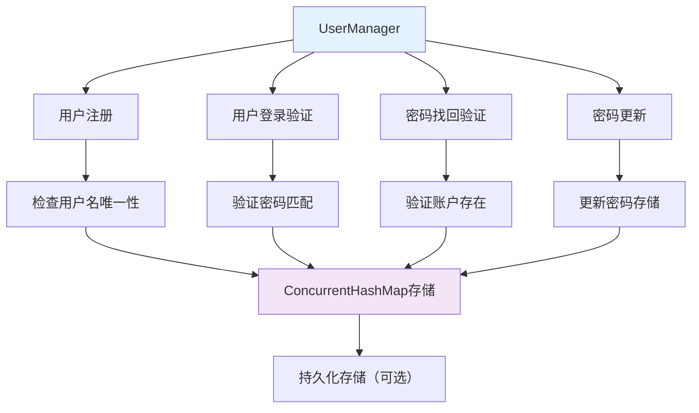

```java
package server.managers;

import java.util.Map;
import java.util.concurrent.ConcurrentHashMap;

/**
 * 用户管理类
 * 负责用户注册、登录验证、密码找回等功能
 */
public class UserManager {
    private final Map<String, String> userAuthMap; // 用户名 -> 密码

    public UserManager() {
        this.userAuthMap = new ConcurrentHashMap<>();
    }

    /**
     * 用户注册
     */
    public boolean register(String username, String password) {
        if (userAuthMap.containsKey(username)) {
            return false; // 用户已存在
        }
        userAuthMap.put(username, password);
        return true;
    }

    /**
     * 验证用户登录
     */
    public boolean authenticate(String username, String password) {
        String storedPassword = userAuthMap.get(username);
        return storedPassword != null && storedPassword.equals(password);
    }

    /**
     * 验证账号是否存在
     */
    public boolean userExists(String username) {
        return userAuthMap.containsKey(username);
    }

    /**
     * 更新密码
     */
    public boolean updatePassword(String username, String newPassword) {
        if (!userAuthMap.containsKey(username)) {
            return false;
        }
        userAuthMap.put(username, newPassword);
        return true;
    }
}
```

**关键点说明：**
- 使用 `ConcurrentHashMap` 确保线程安全
- 提供完整的用户生命周期管理功能
- 实现密码验证和找回机制

### 2.2 在线用户管理器

创建 `server/managers/OnlineUserManager.java`：

在线用户管理器负责实时跟踪连接的用户，其内部结构如下：

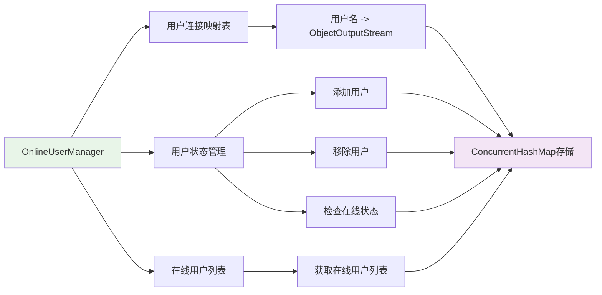

```java
package server.managers;

import java.io.ObjectOutputStream;
import java.util.ArrayList;
import java.util.List;
import java.util.Map;
import java.util.concurrent.ConcurrentHashMap;

/**
 * 在线用户管理类
 * 负责管理在线用户的连接和状态
 */
public class OnlineUserManager {
    private final Map<String, ObjectOutputStream> userMap; // 用户名 -> 输出流

    public OnlineUserManager() {
        this.userMap = new ConcurrentHashMap<>();
    }

    /**
     * 添加在线用户
     */
    public void addUser(String username, ObjectOutputStream oos) {
        userMap.put(username, oos);
    }

    /**
     * 移除在线用户
     */
    public void removeUser(String username) {
        userMap.remove(username);
    }

    /**
     * 获取用户输出流
     */
    public ObjectOutputStream getUserStream(String username) {
        return userMap.get(username);
    }

    /**
     * 获取在线用户列表
     */
    public List<String> getOnlineUsers() {
        return new ArrayList<>(userMap.keySet());
    }

    /**
     * 检查用户是否在线
     */
    public boolean isUserOnline(String username) {
        return userMap.containsKey(username);
    }
}
```

### 2.3 群组管理器

创建 `server/managers/GroupManager.java`：

群组管理器的结构和关系如下：

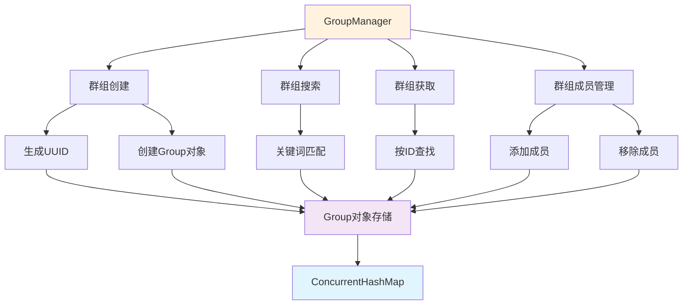

```java
package server.managers;

import common.Group;
import java.util.ArrayList;
import java.util.List;
import java.util.Map;
import java.util.UUID;
import java.util.concurrent.ConcurrentHashMap;

/**
 * 群组管理类
 * 负责群组的创建、查找、成员管理等功能
 */
public class GroupManager {
    private final Map<String, Group> groupMap;

    public GroupManager() {
        this.groupMap = new ConcurrentHashMap<>();
    }

    /**
     * 创建群组
     */
    public Group createGroup(String groupName) {
        String groupId = UUID.randomUUID().toString();
        Group group = new Group(groupId, groupName);
        groupMap.put(groupId, group);
        return group;
    }

    /**
     * 搜索群组
     */
    public List<Group> searchGroups(String keyword) {
        List<Group> result = new ArrayList<>();
        for (Group group : groupMap.values()) {
            if (group.getGroupName().contains(keyword)) {
                result.add(group);
            }
        }
        return result;
    }

    /**
     * 获取群组
     */
    public Group getGroup(String groupId) {
        return groupMap.get(groupId);
    }

    /**
     * 加入群组
     */
    public boolean joinGroup(String groupId, String username) {
        Group group = groupMap.get(groupId);
        if (group != null) {
            group.addMember(username);
            return true;
        }
        return false;
    }

    /**
     * 获取所有群组
     */
    public List<Group> getAllGroups() {
        return new ArrayList<>(groupMap.values());
    }
}
```

### 2.4 广播服务

创建 `server/broadcast/BroadcastService.java`：

广播服务的工作流程图：

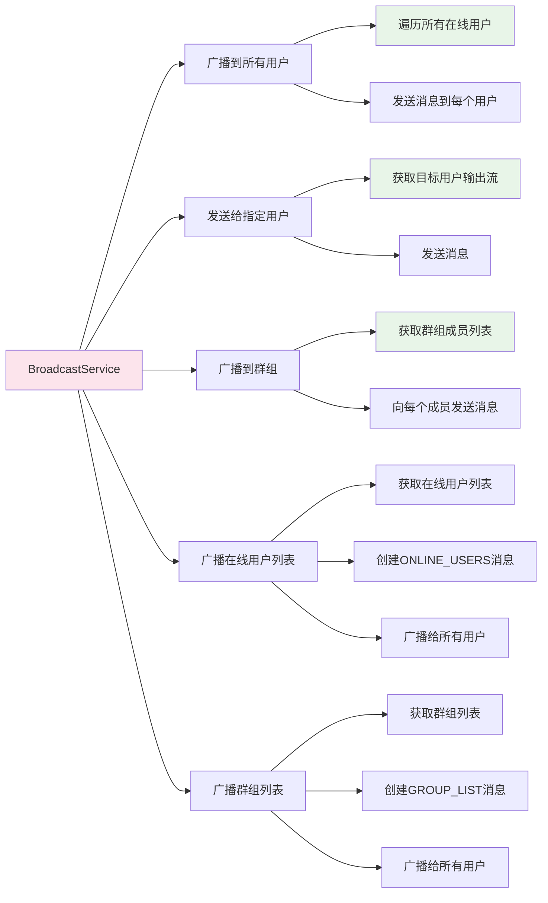

```java
package server.broadcast;

import common.Group;
import common.Message;
import server.managers.GroupManager;
import server.managers.OnlineUserManager;

import java.io.IOException;
import java.io.ObjectOutputStream;
import java.util.List;

/**
 * 广播服务类
 * 负责向客户端广播消息
 */
public class BroadcastService {
    private final OnlineUserManager onlineUserManager;
    private final GroupManager groupManager;

    public BroadcastService(OnlineUserManager onlineUserManager, GroupManager groupManager) {
        this.onlineUserManager = onlineUserManager;
        this.groupManager = groupManager;
    }

    /**
     * 广播消息给所有在线用户
     */
    public void broadcastToAll(Message message) throws IOException {
        for (String username : onlineUserManager.getOnlineUsers()) {
            ObjectOutputStream oos = onlineUserManager.getUserStream(username);
            if (oos != null) {
                oos.writeObject(message);
                oos.flush();
            }
        }
    }

    /**
     * 发送消息给指定用户
     */
    public void sendToUser(String username, Message message) throws IOException {
        ObjectOutputStream oos = onlineUserManager.getUserStream(username);
        if (oos != null) {
            oos.writeObject(message);
            oos.flush();
        }
    }

    /**
     * 广播消息给群组成员
     */
    public void broadcastToGroup(String groupId, Message message) throws IOException {
        Group group = groupManager.getGroup(groupId);
        if (group != null) {
            for (String member : group.getMembers()) {
                sendToUser(member, message);
            }
        }
    }

    /**
     * 广播在线用户列表
     */
    public void broadcastOnlineUsers() throws IOException {
        List<String> onlineUsers = onlineUserManager.getOnlineUsers();
        Message usersMsg = new Message(Message.Type.ONLINE_USERS, "服务器");
        usersMsg.setOnlineUsers(onlineUsers);
        broadcastToAll(usersMsg);
    }

    /**
     * 广播群组列表
     */
    public void broadcastGroupList() throws IOException {
        List<Group> groupList = groupManager.getAllGroups();
        Message groupsMsg = new Message(Message.Type.GROUP_LIST, "服务器");
        groupsMsg.setGroupList(groupList);
        broadcastToAll(groupsMsg);
    }
}
```

### 2.5 消息处理器

创建 `server/handlers/MessageHandler.java`：

服务端消息处理器的处理流程图：

```mermaid
flowchart TD
    A[MessageHandler.handleMessage()] --> B{判断消息类型}
    B -->|LOGIN| C[处理登录请求]
    B -->|PRIVATE_CHAT| D[处理私聊消息]
    B -->|GROUP_CHAT| E[处理群聊消息]
    B -->|FILE_PRIVATE| F[处理私聊文件]
    B -->|FILE_GROUP| G[处理群聊文件]
    B -->|SHAKE| H[处理窗口抖动]
    B -->|CREATE_GROUP| I[处理创建群组]
    B -->|SEARCH_GROUP| J[处理搜索群组]
    B -->|JOIN_GROUP| K[处理加入群组]
    B -->|GET_ONLINE_USERS| L[处理获取在线用户]
    B -->|REGISTER| M[处理注册请求]
    B -->|FIND_PASSWORD| N[处理找回密码]
    B -->|RESET_PASSWORD| O[处理重置密码]
    
    C --> C1[验证用户名密码]
    C --> C2[添加到在线用户列表]
    C --> C3[广播登录成功消息]
    C --> C4[广播在线用户列表]
    
    D --> D1[转发给指定用户]
    
    E --> E1[转发给群组所有成员]
    
    F --> F1[转发给指定用户]
    
    G --> G1[转发给群组所有成员]
    
    H --> H1[转发给指定用户]
    
    I --> I1[创建新群组]
    I --> I2[广播群组列表]
    I --> I3[返回创建成功消息]
    
    J --> J1[搜索匹配群组]
    J --> J2[返回搜索结果]
    
    K --> K1[添加用户到群组]
    K --> K2[广播群组列表]
    K --> K3[返回加入结果]
    
    L --> L1[获取在线用户列表]
    L --> L2[广播给所有用户]
    
    M --> M1[验证用户名唯一性]
    M --> M2[注册新用户]
    M --> M3[返回注册结果]
    
    N --> N1[验证账号存在]
    N --> N2[返回验证结果]
    
    O --> O1[更新用户密码]
    O --> O2[返回更新结果]
   
   
```

```java
package server.handlers;

import common.Group;
import common.Message;
import server.broadcast.BroadcastService;
import server.managers.GroupManager;
import server.managers.OnlineUserManager;
import server.managers.UserManager;

import java.io.IOException;
import java.util.List;

/**
 * 消息处理器类
 * 负责处理从客户端接收到的各种消息类型
 */
public class MessageHandler {
    private final UserManager userManager;
    private final OnlineUserManager onlineUserManager;
    private final GroupManager groupManager;
    private final BroadcastService broadcastService;
    private String currentUsername;

    public MessageHandler(UserManager userManager, OnlineUserManager onlineUserManager, 
                       GroupManager groupManager, BroadcastService broadcastService) {
        this.userManager = userManager;
        this.onlineUserManager = onlineUserManager;
        this.groupManager = groupManager;
        this.broadcastService = broadcastService;
    }

    public void setCurrentUsername(String username) {
        this.currentUsername = username;
    }

    /**
     * 处理消息
     */
    public void handleMessage(Message message) throws IOException {
        switch (message.getType()) {
            case LOGIN:
                handleLogin(message);
                break;
            case PRIVATE_CHAT:
                handlePrivateChat(message);
                break;
            case GROUP_CHAT:
                handleGroupChat(message);
                break;
            case FILE_PRIVATE:
                handlePrivateFile(message);
                break;
            case FILE_GROUP:
                handleGroupFile(message);
                break;
            case SHAKE:
                handleShake(message);
                break;
            case CREATE_GROUP:
                handleCreateGroup(message);
                break;
            case SEARCH_GROUP:
                handleSearchGroup(message);
                break;
            case JOIN_GROUP:
                handleJoinGroup(message);
                break;
            case GET_ONLINE_USERS:
                handleGetOnlineUsers();
                break;
            case REGISTER:
                handleRegister(message);
                break;
            case FIND_PASSWORD:
                handleFindPassword(message);
                break;
            case RESET_PASSWORD:
                handleResetPassword(message);
                break;
            default:
                break;
        }
    }

    private void handleLogin(Message message) throws IOException {
        String username = message.getSender();
        String password = message.getPassword();

        if (userManager.authenticate(username, password)) {
            onlineUserManager.addUser(username, 
                onlineUserManager.getUserStream(username));
            
            Message response = new Message(Message.Type.LOGIN, "服务器", 
                username, "登录成功");
            broadcastService.sendToUser(username, response);
            broadcastService.broadcastOnlineUsers();
        } else {
            Message response = new Message(Message.Type.LOGIN, "服务器", 
                username, "登录失败：账号或密码错误");
            broadcastService.sendToUser(username, response);
        }
    }

    private void handlePrivateChat(Message message) throws IOException {
        broadcastService.sendToUser(message.getReceiver(), message);
    }

    private void handleGroupChat(Message message) throws IOException {
        broadcastService.broadcastToGroup(message.getGroupId(), message);
    }

    private void handlePrivateFile(Message message) throws IOException {
        broadcastService.sendToUser(message.getReceiver(), message);
    }

    private void handleGroupFile(Message message) throws IOException {
        broadcastService.broadcastToGroup(message.getGroupId(), message);
    }

    private void handleShake(Message message) throws IOException {
        broadcastService.sendToUser(message.getReceiver(), message);
    }

    private void handleCreateGroup(Message message) throws IOException {
        Group group = groupManager.createGroup(message.getContent());
        broadcastService.broadcastGroupList();
        
        Message response = new Message(Message.Type.CREATE_GROUP, "服务器", 
            currentUsername, "群组创建成功：" + group.getGroupName());
        broadcastService.sendToUser(currentUsername, response);
    }

    private void handleSearchGroup(Message message) throws IOException {
        List<Group> groups = groupManager.searchGroups(message.getContent());
        Message response = new Message(Message.Type.SEARCH_GROUP, "服务器", 
            currentUsername, "");
        response.setGroupList(groups);
        broadcastService.sendToUser(currentUsername, response);
    }

    private void handleJoinGroup(Message message) throws IOException {
        boolean success = groupManager.joinGroup(message.getGroupId(), 
            message.getSender());
        
        if (success) {
            broadcastService.broadcastGroupList();
            Message response = new Message(Message.Type.JOIN_GROUP, "服务器", 
                currentUsername, "加入群组成功");
            broadcastService.sendToUser(currentUsername, response);
        } else {
            Message response = new Message(Message.Type.JOIN_GROUP, "服务器", 
                currentUsername, "加入群组失败：群组不存在");
            broadcastService.sendToUser(currentUsername, response);
        }
    }

    private void handleGetOnlineUsers() throws IOException {
        broadcastService.broadcastOnlineUsers();
    }

    private void handleRegister(Message message) throws IOException {
        String username = message.getSender();
        String password = message.getPassword();

        if (userManager.register(username, password)) {
            Message response = new Message(Message.Type.REGISTER_RESPONSE, 
                "服务器", username, "注册成功");
            broadcastService.sendToUser(username, response);
        } else {
            Message response = new Message(Message.Type.REGISTER_RESPONSE, 
                "服务器", username, "注册失败：用户已存在");
            broadcastService.sendToUser(username, response);
        }
    }

    private void handleFindPassword(Message message) throws IOException {
        String username = message.getSender();
        if (userManager.userExists(username)) {
            Message response = new Message(Message.Type.FIND_PASSWORD_RESPONSE, 
                "服务器", username, "账号验证通过，请重置密码");
            broadcastService.sendToUser(username, response);
        } else {
            Message response = new Message(Message.Type.FIND_PASSWORD_RESPONSE, 
                "服务器", username, "账号不存在");
            broadcastService.sendToUser(username, response);
        }
    }

    private void handleResetPassword(Message message) throws IOException {
        String username = message.getSender();
        String newPassword = message.getPassword();

        if (userManager.updatePassword(username, newPassword)) {
            Message response = new Message(Message.Type.RESET_PASSWORD_RESPONSE, 
                "服务器", username, "密码重置成功");
            broadcastService.sendToUser(username, response);
        } else {
            Message response = new Message(Message.Type.RESET_PASSWORD_RESPONSE, 
                "服务器", username, "密码重置失败：账号不存在");
            broadcastService.sendToUser(username, response);
        }
    }
}
```

### 2.6 客户端处理器

创建 `server/handlers/ClientHandler.java`：

客户端处理器的生命周期图：

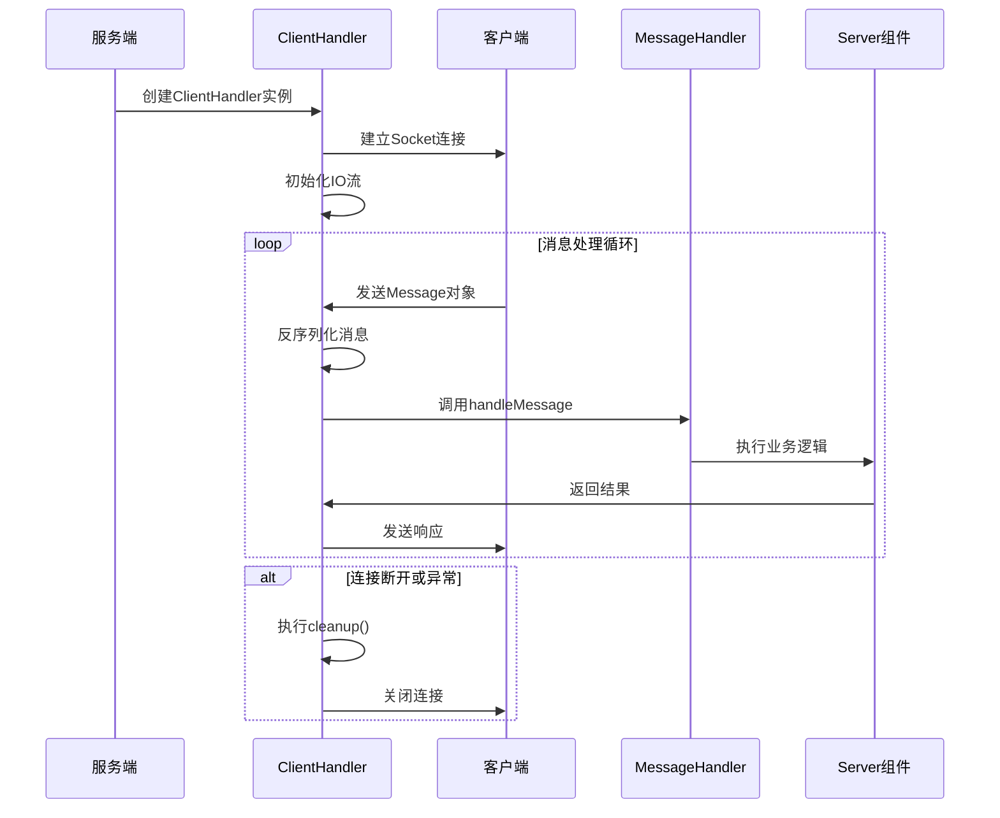

```java
package server.handlers;

import common.Message;
import server.broadcast.BroadcastService;
import server.handlers.MessageHandler;
import server.managers.GroupManager;
import server.managers.OnlineUserManager;
import server.managers.UserManager;

import java.io.*;
import java.net.Socket;

/**
 * 客户端连接处理线程
 */
public class ClientHandler extends Thread {
    private final Socket socket;
    private ObjectInputStream ois;
    private ObjectOutputStream oos;
    private final MessageHandler messageHandler;

    public ClientHandler(Socket socket, UserManager userManager, 
                      OnlineUserManager onlineUserManager, 
                      GroupManager groupManager, 
                      BroadcastService broadcastService) {
        this.socket = socket;
        this.messageHandler = new MessageHandler(userManager, 
            onlineUserManager, groupManager, broadcastService);
    }

    @Override
    public void run() {
        try {
            oos = new ObjectOutputStream(socket.getOutputStream());
            ois = new ObjectInputStream(socket.getInputStream());

            Message message;
            while ((message = (Message) ois.readObject()) != null) {
                messageHandler.setCurrentUsername(message.getSender());
                messageHandler.handleMessage(message);
            }
        } catch (Exception e) {
            e.printStackTrace();
        } finally {
            cleanup();
        }
    }

    private void cleanup() {
        try {
            if (ois != null) ois.close();
            if (oos != null) oos.close();
            if (socket != null) socket.close();
        } catch (IOException e) {
            e.printStackTrace();
        }
    }

    public ObjectOutputStream getOutputStream() {
        return oos;
    }
}
```

### 2.7 服务端主类

创建 `server/ChatServer.java`：

服务端的整体架构图：

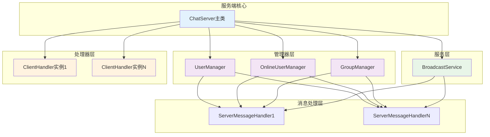

```java
package server;

import server.broadcast.BroadcastService;
import server.handlers.ClientHandler;
import server.managers.GroupManager;
import server.managers.OnlineUserManager;
import server.managers.UserManager;

import java.io.IOException;
import java.net.ServerSocket;
import java.net.Socket;

/**
 * 聊天室服务端
 */
public class ChatServer {
    private static final int PORT = 8888;
    
    private final UserManager userManager;
    private final OnlineUserManager onlineUserManager;
    private final GroupManager groupManager;
    private final BroadcastService broadcastService;

    public ChatServer() {
        this.userManager = new UserManager();
        this.onlineUserManager = new OnlineUserManager();
        this.groupManager = new GroupManager();
        this.broadcastService = new BroadcastService(onlineUserManager, groupManager);
    }

    public void start() {
        try (ServerSocket serverSocket = new ServerSocket(PORT)) {
            System.out.println("聊天室服务端已启动，端口：" + PORT);

            while (true) {
                Socket clientSocket = serverSocket.accept();
                System.out.println("新客户端连接：" + clientSocket);
                
                ClientHandler clientHandler = new ClientHandler(
                    clientSocket, 
                    userManager, 
                    onlineUserManager, 
                    groupManager, 
                    broadcastService
                );
                
                onlineUserManager.addUser("temp", clientHandler.getOutputStream());
                clientHandler.start();
            }
        } catch (IOException e) {
            e.printStackTrace();
        }
    }

    public static void main(String[] args) {
        new ChatServer().start();
    }
}
```

## 第三阶段：客户端开发

### 3.1 网络管理器

创建 `client/network/NetworkManager.java`：

客户端网络管理器的连接和通信流程图：

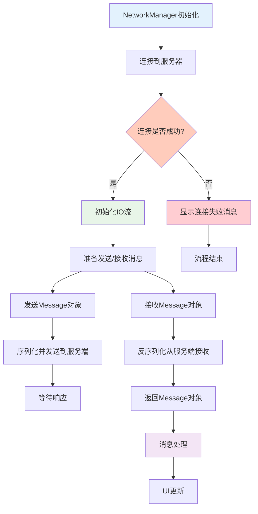

```java
package client.network;

import client.utils.LogUtil;
import common.Message;

import javax.swing.*;
import java.io.*;
import java.net.Socket;

/**
 * 网络管理类
 * 负责与服务器的网络通信
 */
public class NetworkManager {
    private String serverIp;
    private static final int SERVER_PORT = 8888;
    private Socket socket;
    private ObjectOutputStream oos;
    private ObjectInputStream ois;

    public NetworkManager(String serverIp) {
        this.serverIp = serverIp;
    }

    /**
     * 连接到服务器
     */
    public boolean connectToServer() {
        try {
            socket = new Socket(serverIp, SERVER_PORT);
            oos = new ObjectOutputStream(socket.getOutputStream());
            ois = new ObjectInputStream(socket.getInputStream());
            return true;
        } catch (IOException e) {
            JOptionPane.showMessageDialog(null, 
                "连接服务器失败：" + e.getMessage());
            return false;
        }
    }

    /**
     * 发送消息
     */
    public void sendMessage(Message message) {
        try {
            if (oos != null) {
                oos.writeObject(message);
                oos.flush();
            }
        } catch (IOException e) {
            e.printStackTrace();
        }
    }

    /**
     * 接收消息
     */
    public Message receiveMessage() {
        try {
            if (ois != null) {
                return (Message) ois.readObject();
            }
        } catch (Exception e) {
            e.printStackTrace();
        }
        return null;
    }

    /**
     * 重置Socket连接
     */
    public void resetSocket() {
        try {
            if (ois != null) ois.close();
            if (oos != null) oos.close();
            if (socket != null) socket.close();
        } catch (IOException e) {
            e.printStackTrace();
        }
    }
}
```

### 3.2 UI组件类

#### UI组件工厂

创建 `client/UIComponentFactory.java`：

UI组件工厂的设计模式图：

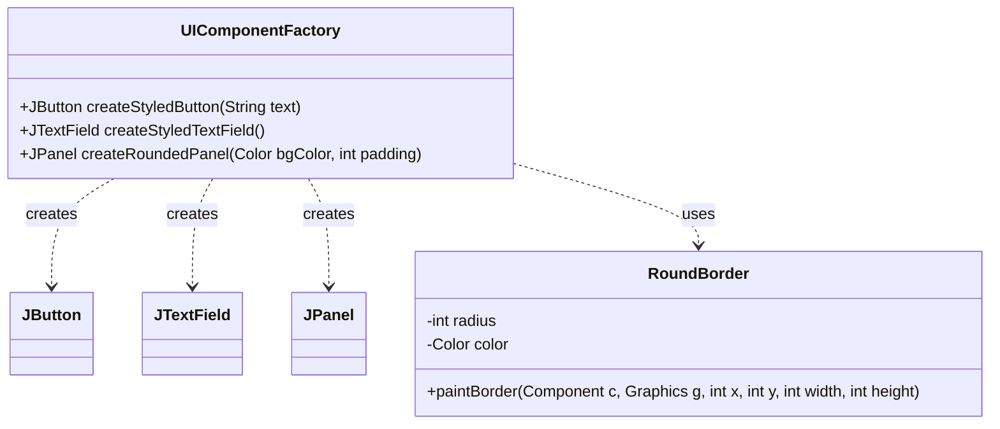

```java
package client.ui;

import javax.swing.*;
import javax.swing.border.AbstractBorder;
import java.awt.*;

/**
 * UI组件工厂类
 * 提供统一的UI组件创建方法，保持界面风格一致
 */
public class UIComponentFactory {

    /**
     * 创建美化样式的按钮
     */
    public JButton createStyledButton(String text) {
        JButton button = new JButton(text);
        button.setFont(new Font("微软雅黑", Font.PLAIN, 14));
        button.setBackground(new Color(64, 158, 255));
        button.setForeground(Color.WHITE);
        button.setBorder(BorderFactory.createEmptyBorder(8, 20, 8, 20));
        button.setFocusPainted(false);
        button.setBorderPainted(false);
        button.setCursor(new Cursor(Cursor.HAND_CURSOR));
        button.setUI(new javax.swing.plaf.basic.BasicButtonUI() {
            @Override
            public void paint(Graphics g, JComponent c) {
                Graphics2D g2 = (Graphics2D) g.create();
                g2.setRenderingHint(
                    RenderingHints.KEY_ANTIALIASING, 
                    RenderingHints.VALUE_ANTIALIAS_ON
                );
                g2.setColor(c.getBackground());
                g2.fillRoundRect(0, 0, c.getWidth(), c.getHeight(), 8, 8);
                super.paint(g2, c);
                g2.dispose();
            }
        });
        return button;
    }

    /**
     * 创建美化的输入框
     */
    public JTextField createStyledTextField() {
        JTextField field = new JTextField();
        field.setFont(new Font("微软雅黑", Font.PLAIN, 14));
        field.setBorder(new RoundBorder(8, new Color(204, 204, 204)));
        field.setBackground(Color.WHITE);
        return field;
    }

    /**
     * 创建圆角面板
     */
    public JPanel createRoundedPanel(Color bgColor, int padding) {
        JPanel panel = new JPanel() {
            @Override
            protected void paintComponent(Graphics g) {
                super.paintComponent(g);
                Graphics2D g2 = (Graphics2D) g.create();
                g2.setRenderingHint(
                    RenderingHints.KEY_ANTIALIASING, 
                    RenderingHints.VALUE_ANTIALIAS_ON
                );
                g2.setColor(getBackground());
                g2.fillRoundRect(0, 0, getWidth()-1, getHeight()-1, 12, 12);
                g2.dispose();
            }
        };
        panel.setBackground(bgColor);
        panel.setBorder(BorderFactory.createEmptyBorder(
            padding, padding, padding, padding
        ));
        panel.setOpaque(false);
        return panel;
    }
}

/**
 * 圆角边框类
 */
class RoundBorder extends AbstractBorder {
    private int radius;
    private Color color;

    public RoundBorder(int radius, Color color) {
        this.radius = radius;
        this.color = color;
    }

    @Override
    public void paintBorder(Component c, Graphics g, 
                          int x, int y, int width, int height) {
        Graphics2D g2 = (Graphics2D) g.create();
        g2.setRenderingHint(
            RenderingHints.KEY_ANTIALIASING, 
            RenderingHints.VALUE_ANTIALIAS_ON
        );
        g2.setColor(color);
        g2.drawRoundRect(x, y, width-1, height-1, radius, radius);
        g2.dispose();
    }
}
```

### 3.3 消息监听器

创建 `client/MessageListener.java`：

消息监听器的工作流程图：

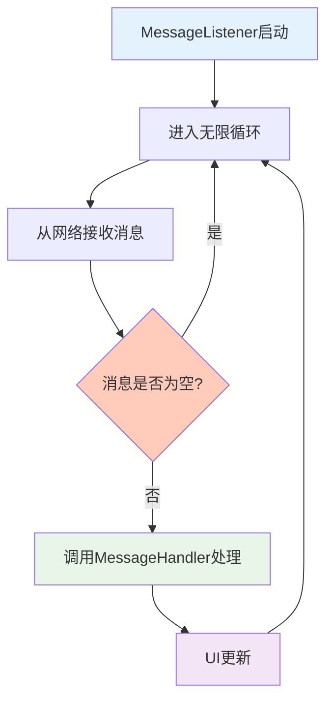

```java
package client;

import client.handler.MessageHandler;
import client.network.NetworkManager;
import common.Message;

import javax.swing.*;

/**
 * 消息监听线程
 * 负责持续监听服务器发送的消息
 */
public class MessageListener extends Thread {
    private final NetworkManager networkManager;
    private final MessageHandler messageHandler;
    private final JTextArea chatArea;

    public MessageListener(NetworkManager networkManager, MessageHandler messageHandler, 
                       JTextArea chatArea) {
        this.networkManager = networkManager;
        this.messageHandler = messageHandler;
        this.chatArea = chatArea;
    }

    @Override
    public void run() {
        try {
            while (true) {
                Message message = networkManager.receiveMessage();
                if (message != null) {
                    messageHandler.handleMessage(message);
                }
            }
        } catch (Exception e) {
            e.printStackTrace();
        }
    }
}
```

### 3.4 消息处理器

创建 `client/handler/MessageHandler.java`：

客户端消息处理器的处理流程图：

```mermaid
flowchart TD
    A[MessageHandler.handleMessage()] --> B{判断消息类型}
    B -->|PRIVATE_CHAT| C[处理私聊消息]
    B -->|GROUP_CHAT| D[处理群聊消息]
    B -->|FILE_PRIVATE or FILE_GROUP| E[处理文件消息]
    B -->|SHAKE| F[处理窗口抖动]
    B -->|ONLINE_USERS| G[处理在线用户列表]
    B -->|GROUP_LIST| H[处理群组列表]
    B -->|ONLINE_NOTIFY| I[处理上线通知]
    B -->|OFFLINE_NOTIFY| J[处理下线通知]
    B -->|其他| K[忽略消息]
    
    C --> C1[格式化私聊消息]
    C --> C2[添加到聊天区域]
    D --> D1[格式化群聊消息]
    D --> D2[添加到聊天区域]
    E --> E1[显示文件接收对话框]
    E --> E2[询问是否保存文件]
    E --> E3{用户选择}
    E3 -->|是| E4[保存文件]
    E3 -->|否| E5[忽略文件]
    F --> F1[显示抖动通知]
    F --> F2[触发窗口抖动效果]
    G --> G1[更新用户列表UI]
    H --> H1[更新群组列表UI]
    I --> I1[显示上线通知]
    J --> J1[显示下线通知]
    
    style A fill:#e3f2fd
    style B fill:#f1f8e9
    style C fill:#e8f5e8
    style D fill:#e8f5e8
    style E fill:#e8f5e8
    style E3 fill:#ffccbc
```

```java
package client.handler;

import client.ChatClient;
import client.ui.ChatMainUI;
import common.Message;

import javax.swing.*;
import java.awt.Point;

/**
 * 消息处理器类
 * 负责处理从服务器接收到的各种消息类型
 */
public class MessageHandler {
    private final ChatClient chatClient;
    private final ChatMainUI chatMainUI;

    public MessageHandler(ChatClient chatClient, ChatMainUI chatMainUI) {
        this.chatClient = chatClient;
        this.chatMainUI = chatMainUI;
    }

    /**
     * 处理消息
     */
    public void handleMessage(Message message) {
        SwingUtilities.invokeLater(() -> {
            switch (message.getType()) {
                case PRIVATE_CHAT:
                    handlePrivateChat(message);
                    break;
                case GROUP_CHAT:
                    handleGroupChat(message);
                    break;
                case FILE_PRIVATE:
                case FILE_GROUP:
                    handleFile(message);
                    break;
                case SHAKE:
                    handleShake(message);
                    break;
                case ONLINE_USERS:
                    handleOnlineUsers(message);
                    break;
                case GROUP_LIST:
                    handleGroupList(message);
                    break;
                case ONLINE_NOTIFY:
                    handleOnlineNotify(message);
                    break;
                case OFFLINE_NOTIFY:
                    handleOfflineNotify(message);
                    break;
                default:
                    break;
            }
        });
    }

    private void handlePrivateChat(Message message) {
        chatMainUI.getChatArea().append(
            "【私聊-" + message.getSender() + "】" + 
            message.getSender() + "：" + message.getContent() + "\n"
        );
    }

    private void handleGroupChat(Message message) {
        chatMainUI.getChatArea().append(
            "【群聊-" + message.getGroupId() + "】" + 
            message.getSender() + "：" + message.getContent() + "\n"
        );
    }

    private void handleFile(Message message) {
        String fileName = message.getFileName();
        long fileSize = message.getFileSize();
        chatMainUI.getChatArea().append(
            "【系统消息】收到文件：" + fileName + 
            "（大小：" + formatFileSize(fileSize) + "）\n"
        );
        
        int confirm = JOptionPane.showConfirmDialog(
            chatMainUI,
            "是否保存文件：" + fileName + "？",
            "接收文件",
            JOptionPane.YES_NO_OPTION
        );
        
        if (confirm == JOptionPane.YES_OPTION) {
            chatClient.saveBytesToFile(message.getFileData(), fileName);
        }
    }

    private void handleShake(Message message) {
        chatMainUI.getChatArea().append(
            "【系统消息】收到来自" + message.getSender() + "的窗口抖动！\n"
        );
        chatClient.shakeWindow();
    }

    private void handleOnlineUsers(Message message) {
        chatClient.updateUserList(message.getOnlineUsers());
    }

    private void handleGroupList(Message message) {
        chatClient.updateGroupList(message.getGroupList());
    }

    private void handleOnlineNotify(Message message) {
        chatMainUI.getChatArea().append(
            "【系统消息】" + message.getSender() + " 上线了\n"
        );
    }

    private void handleOfflineNotify(Message message) {
        chatMainUI.getChatArea().append(
            "【系统消息】" + message.getSender() + " 下线了\n"
        );
    }

    private void shakeWindow() {
        chatClient.shakeWindow();
    }

    private String formatFileSize(long size) {
        if (size < 1024) {
            return size + " B";
        } else if (size < 1024 * 1024) {
            return String.format("%.2f KB", size / 1024.0);
        } else {
            return String.format("%.2f MB", size / (1024.0 * 1024));
        }
    }
}
```

### 3.5 Manager类

#### 聊天管理器

创建 `client/managers/ChatManager.java`：

聊天管理器的功能结构图：

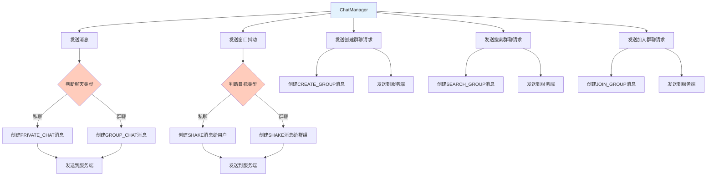

```java
package client.managers;

import client.ChatClient;
import common.Message;

import javax.swing.*;

/**
 * 聊天管理类
 * 负责处理聊天消息的发送逻辑
 */
public class ChatManager {
    private final ChatClient chatClient;

    public ChatManager(ChatClient chatClient) {
        this.chatClient = chatClient;
    }

    /**
     * 发送聊天消息
     */
    public void sendMessage() {
        String content = chatClient.getInputField().getText().trim();
        if (content.isEmpty()) {
            return;
        }

        try {
            Message.Type type;
            String targetName = (String) chatClient.getTargetBox().getSelectedItem();
            String target = null;

            if (chatClient.getChatTypeBox().getSelectedItem().equals("群聊")) {
                type = Message.Type.GROUP_CHAT;
                target = (String) chatClient.getTargetBox().getClientProperty("groupId");
                if (target == null || target.isEmpty()) {
                    target = chatClient.getGroupNameToIdMap().get(targetName);
                }
                if (target == null || target.isEmpty()) {
                    JOptionPane.showMessageDialog(chatClient, "未找到该群聊的ID，无法发送消息！");
                    return;
                }
            } else {
                type = Message.Type.PRIVATE_CHAT;
                target = targetName;
            }

            Message chatMsg = new Message(type, chatClient.getUsername(), target, content);
            chatClient.getNetworkManager().sendMessage(chatMsg);
            chatClient.getInputField().setText("");
        } catch (Exception e) {
            JOptionPane.showMessageDialog(chatClient, "发送消息失败：" + e.getMessage());
            e.printStackTrace();
        }
    }

    /**
     * 发送窗口抖动
     */
    public void sendShake() {
        String targetName = (String) chatClient.getTargetBox().getSelectedItem();
        String target = null;

        if (chatClient.getChatTypeBox().getSelectedItem().equals("群聊")) {
            target = (String) chatClient.getTargetBox().getClientProperty("groupId");
            if (target == null || target.isEmpty()) {
                target = chatClient.getGroupNameToIdMap().get(targetName);
            }
        } else {
            target = targetName;
        }

        if (target == null || target.isEmpty()) {
            JOptionPane.showMessageDialog(chatClient, "请先选择聊天对象！");
            return;
        }

        try {
            Message shakeMsg = new Message(Message.Type.SHAKE, chatClient.getUsername(), target, "");
            chatClient.getNetworkManager().sendMessage(shakeMsg);
        } catch (Exception e) {
            JOptionPane.showMessageDialog(chatClient, "发送抖动失败：" + e.getMessage());
            e.printStackTrace();
        }
    }

    /**
     * 发送创建群聊请求
     */
    public void sendCreateGroupRequest(String groupName) {
        try {
            Message createMsg = new Message(Message.Type.CREATE_GROUP, chatClient.getUsername(), "", groupName);
            chatClient.getNetworkManager().sendMessage(createMsg);
        } catch (Exception e) {
            JOptionPane.showMessageDialog(chatClient, "发送创建群聊请求失败：" + e.getMessage());
            e.printStackTrace();
        }
    }

    /**
     * 发送查找群聊请求
     */
    public void sendSearchGroupRequest(String keyword) {
        try {
            Message searchMsg = new Message(Message.Type.SEARCH_GROUP, chatClient.getUsername(), "", keyword);
            chatClient.getNetworkManager().sendMessage(searchMsg);
        } catch (Exception e) {
            JOptionPane.showMessageDialog(chatClient, "发送查找群聊请求失败：" + e.getMessage());
            e.printStackTrace();
        }
    }

    /**
     * 发送加入群聊请求
     */
    public void sendJoinGroupRequest(String groupId) {
        try {
            Message joinMsg = new Message(Message.Type.JOIN_GROUP, chatClient.getUsername(), groupId, "");
            chatClient.getNetworkManager().sendMessage(joinMsg);
        } catch (Exception e) {
            JOptionPane.showMessageDialog(chatClient, "发送加入群聊请求失败：" + e.getMessage());
            e.printStackTrace();
        }
    }
}
```

#### 文件管理器

创建 `client/managers/FileManager.java`：

文件管理器的操作流程图：

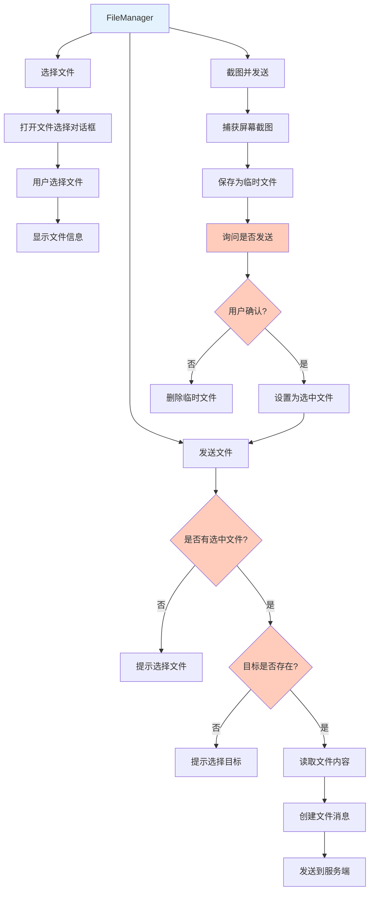

```java
package client.managers;

import client.ChatClient;
import common.Message;

import javax.swing.*;
import java.awt.*;
import java.awt.image.BufferedImage;
import java.io.File;
import java.io.FileInputStream;
import java.io.IOException;

/**
 * 文件管理类
 * 负责处理文件选择、发送和截图功能
 */
public class FileManager {
    private final ChatClient chatClient;
    private File selectedFile;

    public FileManager(ChatClient chatClient) {
        this.chatClient = chatClient;
    }

    public File getSelectedFile() {
        return selectedFile;
    }

    public void setSelectedFile(File file) {
        this.selectedFile = file;
    }

    /**
     * 选择文件
     */
    public void selectFile() {
        JFileChooser fileChooser = new JFileChooser();
        fileChooser.setDialogTitle("选择要发送的文件");
        int result = fileChooser.showOpenDialog(chatClient);

        if (result == JFileChooser.APPROVE_OPTION) {
            selectedFile = fileChooser.getSelectedFile();
            long fileSize = selectedFile.length();
            String fileSizeStr = formatFileSize(fileSize);

            JOptionPane.showMessageDialog(chatClient,
                    "已选择文件：" + selectedFile.getName() + "\n文件大小：" + fileSizeStr);
        }
    }

    /**
     * 发送文件
     */
    public void sendFile() {
        if (selectedFile == null || !selectedFile.exists()) {
            JOptionPane.showMessageDialog(chatClient, "请先选择文件！");
            return;
        }

        String targetName = (String) chatClient.getTargetBox().getSelectedItem();
        String target = null;
        Message.Type type;

        if (chatClient.getChatTypeBox().getSelectedItem().equals("群聊")) {
            type = Message.Type.FILE_GROUP;
            target = (String) chatClient.getTargetBox().getClientProperty("groupId");
            if (target == null || target.isEmpty()) {
                target = chatClient.getGroupNameToIdMap().get(targetName);
            }
        } else {
            type = Message.Type.FILE_PRIVATE;
            target = targetName;
        }

        if (target == null || target.isEmpty()) {
            JOptionPane.showMessageDialog(chatClient, "请先选择聊天对象！");
            return;
        }

        try {
            FileInputStream fis = new FileInputStream(selectedFile);
            byte[] fileData = new byte[(int) selectedFile.length()];
            fis.read(fileData);
            fis.close();

            Message fileMsg = new Message(type, chatClient.getUsername(), target,
                    selectedFile.getName(), selectedFile.length(), fileData);
            chatClient.getNetworkManager().sendMessage(fileMsg);

            chatClient.getChatArea().append("【系统消息】文件[" + selectedFile.getName() + "]发送成功\n");
            selectedFile = null;
        } catch (IOException e) {
            JOptionPane.showMessageDialog(chatClient, "发送文件失败：" + e.getMessage());
            e.printStackTrace();
        }
    }

    /**
     * 截图并发送
     */
    public void captureAndSendScreenshot() {
        try {
            Robot robot = new Robot();
            Rectangle screenRect = new Rectangle(Toolkit.getDefaultToolkit().getScreenSize());
            BufferedImage screenshot = robot.createScreenCapture(screenRect);

            File screenshotFile = new File("screenshot_" + System.currentTimeMillis() + ".png");
            javax.imageio.ImageIO.write(screenshot, "png", screenshotFile);

            int confirm = JOptionPane.showConfirmDialog(
                    chatClient,
                    "截图已生成，是否发送给当前选中的" + 
                            (chatClient.getChatTypeBox().getSelectedItem().equals("群聊") ? "群聊" : "好友") + "？",
                    "确认发送截图",
                    JOptionPane.YES_NO_OPTION
            );

            if (confirm != JOptionPane.YES_OPTION) {
                screenshotFile.delete();
                return;
            }

            selectedFile = screenshotFile;
            sendFile();

            new Thread(() -> {
                try {
                    Thread.sleep(1000);
                    if (screenshotFile.exists()) {
                        screenshotFile.delete();
                    }
                } catch (InterruptedException ex) {
                    ex.printStackTrace();
                }
            }).start();

        } catch (Exception ex) {
            JOptionPane.showMessageDialog(chatClient, "截图发送失败：" + ex.getMessage());
            ex.printStackTrace();
        }
    }

    /**
     * 格式化文件大小
     */
    private String formatFileSize(long size) {
        if (size < 1024) {
            return size + " B";
        } else if (size < 1024 * 1024) {
            return String.format("%.2f KB", size / 1024.0);
        } else if (size < 1024 * 1024 * 1024) {
            return String.format("%.2f MB", size / (1024.0 * 1024));
        } else {
            return String.format("%.2f GB", size / (1024.0 * 1024 * 1024));
        }
    }
}
```

#### 数据管理器

创建 `client/managers/DataManager.java`：

数据管理器的数据流图：

```mermaid
graph LR
    A[DataManager] --> B[更新在线用户列表]
    A --> C[更新群列表]
    A --> D[保存文件到本地]
    
    B --> B1[获取在线用户数据]
    B1 --> B2[清空现有列表模型]
    B2 --> B3[添加新用户到模型]
    B3 --> B4[更新UI显示]
    
    C --> C1[获取群组列表数据]
    C1 --> C2[清空现有群组模型]
    C2 --> C3[添加新群组到模型]
    C3 --> C4[更新群组ID-名称映射]
    C4 --> C5[更新UI显示]
    
    D --> D1[获取文件数据和名称]
    D1 --> D2[打开保存文件对话框]
    D2 --> D3{用户确认保存?}
    D3 -->|是| D4[写入文件到磁盘]
    D3 -->|否| D5[取消保存]
    D4 --> D6[显示保存成功消息]
    D5 --> D7[显示取消保存消息]
    
    style A fill:#e3f2fd
    style B3 fill:#e8f5e8
    style C3 fill:#e8f5e8
    style D3 fill:#ffccbc
```

```java
package client.managers;

import client.ChatClient;
import common.Group;

import javax.swing.*;
import java.util.List;

/**
 * 数据管理类
 * 负责更新用户列表、群列表等数据
 */
public class DataManager {
    private final ChatClient chatClient;

    public DataManager(ChatClient chatClient) {
        this.chatClient = chatClient;
    }

    /**
     * 更新在线用户列表UI
     */
    public void updateUserList(List<String> onlineUsers) {
        SwingUtilities.invokeLater(() -> {
            chatClient.getUserListModel().clear();
            for (String user : onlineUsers) {
                chatClient.getUserListModel().addElement(user);
            }
        });
    }

    /**
     * 更新群列表
     */
    public void updateGroupList(List<Group> groupList) {
        SwingUtilities.invokeLater(() -> {
            chatClient.getGroupListModel().clear();
            chatClient.getGroupIdToNameMap().clear();
            chatClient.getGroupNameToIdMap().clear();

            for (Group group : groupList) {
                chatClient.getGroupListModel().addElement(group.getGroupName());
                chatClient.getGroupIdToNameMap().put(group.getGroupId(), group.getGroupName());
                chatClient.getGroupNameToIdMap().put(group.getGroupName(), group.getGroupId());
            }

            if (chatClient.getChatTypeBox().getSelectedItem().equals("群聊")) {
                chatClient.getTargetBox().removeAllItems();
                for (int i = 0; i < chatClient.getGroupListModel().size(); i++) {
                    chatClient.getTargetBox().addItem(chatClient.getGroupListModel().getElementAt(i));
                }
            }
        });
    }

    /**
     * 保存字节数组为文件
     */
    public void saveBytesToFile(byte[] data, String fileName) {
        JFileChooser fileChooser = new JFileChooser();
        fileChooser.setSelectedFile(new java.io.File(fileName));
        int result = fileChooser.showSaveDialog(chatClient);

        if (result == JFileChooser.APPROVE_OPTION) {
            java.io.File saveFile = fileChooser.getSelectedFile();
            try (java.io.FileOutputStream fos = new java.io.FileOutputStream(saveFile)) {
                fos.write(data);
                chatClient.getChatArea().append("【系统消息】已接收文件：" + fileName + "，保存至：" + saveFile.getAbsolutePath() + "\n");
            } catch (java.io.IOException e) {
                chatClient.getChatArea().append("【系统消息】文件保存失败：" + e.getMessage() + "\n");
                e.printStackTrace();
            }
        } else {
            chatClient.getChatArea().append("【系统消息】取消保存文件：" + fileName + "\n");
        }
    }
}
```

#### 窗口管理器

创建 `client/managers/WindowManager.java`：

窗口管理器的抖动效果实现图：

```mermaid
graph TD
    A[WindowManager.shakeWindow()] --> B{是否已在抖动?}
    B -->|是| C[直接返回]
    B -->|否| D[设置抖动状态为true]
    D --> E[保存原始位置]
    E --> F[启动抖动定时器]
    F --> G[随机改变窗口位置]
    G --> H[启动恢复定时器]
    H --> I[恢复原始位置]
    I --> J[设置抖动状态为false]
    
```

```java
package client.managers;

import client.ChatClient;

import javax.swing.*;
import java.awt.*;

/**
 * 窗口管理类
 * 负责窗口抖动等窗口相关功能
 */
public class WindowManager {
    private final ChatClient chatClient;
    private Point originalLocation;
    private boolean isShaking = false;

    public WindowManager(ChatClient chatClient) {
        this.chatClient = chatClient;
        this.originalLocation = chatClient.getLocation();
    }

    /**
     * 执行窗口抖动
     */
    public void shakeWindow() {
        if (isShaking) {
            return;
        }

        isShaking = true;
        originalLocation = chatClient.getLocation();

        new Timer(10, e -> {
            int offsetX = (int) (Math.random() * 20 - 10);
            int offsetY = (int) (Math.random() * 20 - 10);
            chatClient.setLocation(originalLocation.x + offsetX, originalLocation.y + offsetY);
        }).start();

        new Timer(500, e -> {
            chatClient.setLocation(originalLocation);
            isShaking = false;
        }).start();
    }

    /**
     * 检查是否正在抖动
     */
    public boolean isShaking() {
        return isShaking;
    }

    /**
     * 设置抖动状态
     */
    public void setShaking(boolean shaking) {
        isShaking = shaking;
    }
}
```

#### 认证管理器

创建 `client/managers/AuthenticationManager.java`：

认证管理器的认证流程图：

```mermaid
graph TD
    A[AuthenticationManager] --> B[用户注册]
    A --> C[用户登录]
    A --> D[找回密码]
    A --> E[重置密码]
    
    B --> B1[验证输入]
    B1 --> B2[创建注册消息]
    B2 --> B3[发送到服务端]
    B3 --> B4[接收响应]
    B4 --> B5{注册成功?}
    B5 -->|是| B6[关闭注册窗口]
    B5 -->|否| B7[显示错误信息]
    
    C --> C1[验证输入]
    C1 --> C2[连接到服务器]
    C2 --> C3[创建登录消息]
    C3 --> C4[发送到服务端]
    C4 --> C5[接收响应]
    C5 --> C6{登录成功?}
    C6 -->|是| C7[保存用户信息]
    C6 -->|否| C8[清除密码字段]
    
    D --> D1[获取账号]
    D1 --> D2[创建找回密码消息]
    D2 --> D3[发送到服务端]
    D3 --> D4[接收响应]
    D4 --> D5{验证通过?}
    D5 -->|是| E
    D5 -->|否| D6[显示错误信息]
    
    E --> E1[获取新密码]
    E1 --> E2[验证密码强度]
    E2 --> E3[创建重置密码消息]
    E3 --> E4[发送到服务端]
    E4 --> E5[接收响应]
    E5 --> E6{重置成功?}
    E6 -->|是| E7[清除原密码字段]
    E6 -->|否| E8[显示错误信息]
    
    style A fill:#e3f2fd
    style B5 fill:#ffccbc
    style C6 fill:#ffccbc
    style D5 fill:#ffccbc
    style E6 fill:#ffccbc
```

```java
package client.managers;

import client.ChatClient;
import common.Message;

import javax.swing.*;

/**
 * 认证管理类
 * 负责用户注册、登录、密码找回等功能
 */
public class AuthenticationManager {
    private final ChatClient chatClient;

    public AuthenticationManager(ChatClient chatClient) {
        this.chatClient = chatClient;
    }

    /**
     * 用户注册
     */
    public void register(String account, String password) {
        try {
            Message registerMsg = new Message(Message.Type.REGISTER, account, "");
            registerMsg.setPassword(password);
            chatClient.getNetworkManager().sendMessage(registerMsg);

            Message response = chatClient.getNetworkManager().receiveMessage();
            JOptionPane.showMessageDialog(chatClient.getLoginRegisterFrame(), response.getContent());

            if (response.getContent().contains("成功")) {
                chatClient.getLoginRegisterFrame().dispose();
            }
        } catch (Exception ex) {
            JOptionPane.showMessageDialog(chatClient.getLoginRegisterFrame(), "注册失败：" + ex.getMessage());
            ex.printStackTrace();
        }
    }

    /**
     * 用户登录
     */
    public void login(String account, String password, String serverIp) {
        try {
            chatClient.setServerIp(serverIp);
            
            if (!chatClient.getNetworkManager().connectToServer()) {
                return;
            }

            Message loginMsg = new Message(Message.Type.LOGIN, account, "");
            loginMsg.setPassword(password);
            chatClient.getNetworkManager().sendMessage(loginMsg);

            Message response = chatClient.getNetworkManager().receiveMessage();
            JOptionPane.showMessageDialog(chatClient.getLoginRegisterFrame(), response.getContent());

            if (response.getContent().contains("成功")) {
                chatClient.setUsername(account);
                chatClient.getLoginRegisterFrame().dispose();
                chatClient.initChatUI();
                chatClient.startMessageListener();

                Message getUsersMsg = new Message(Message.Type.GET_ONLINE_USERS, account, "", "");
                chatClient.getNetworkManager().sendMessage(getUsersMsg);
            } else {
                chatClient.getLoginPwdField().setText("");
            }
        } catch (Exception ex) {
            JOptionPane.showMessageDialog(chatClient.getLoginRegisterFrame(), "登录失败：" + ex.getMessage());
            ex.printStackTrace();
            chatClient.resetSocket();
            System.exit(1);
        }
    }

    /**
     * 找回密码
     */
    public void findPassword(String account) {
        try {
            Message findMsg = new Message(Message.Type.FIND_PASSWORD, account, "");
            chatClient.getNetworkManager().sendMessage(findMsg);

            Message response = chatClient.getNetworkManager().receiveMessage();
            JOptionPane.showMessageDialog(chatClient.getLoginRegisterFrame(), response.getContent());

            if (response.getContent().contains("验证通过")) {
                resetPassword(account);
            }
        } catch (Exception ex) {
            JOptionPane.showMessageDialog(chatClient.getLoginRegisterFrame(), "验证账号失败：" + ex.getMessage());
            chatClient.resetSocket();
            ex.printStackTrace();
        }
    }

    /**
     * 重置密码
     */
    public void resetPassword(String account) {
        JPasswordField newPwdField = new JPasswordField();
        int result = JOptionPane.showConfirmDialog(
                chatClient.getLoginRegisterFrame(),
                new Object[]{"请输入新密码：", newPwdField},
                "重置密码",
                JOptionPane.OK_CANCEL_OPTION
        );

        if (result == JOptionPane.OK_OPTION) {
            String newPassword = new String(newPwdField.getPassword()).trim();
            if (newPassword.isEmpty()) {
                JOptionPane.showMessageDialog(chatClient.getLoginRegisterFrame(), "新密码不能为空！");
                return;
            }

            try {
                Message resetMsg = new Message(Message.Type.RESET_PASSWORD, account, "");
                resetMsg.setPassword(newPassword);
                chatClient.getNetworkManager().sendMessage(resetMsg);

                Message response = chatClient.getNetworkManager().receiveMessage();
                JOptionPane.showMessageDialog(chatClient.getLoginRegisterFrame(), response.getContent());

                if (response.getContent().contains("成功")) {
                    chatClient.getLoginPwdField().setText("");
                }
            } catch (Exception ex) {
                JOptionPane.showMessageDialog(chatClient.getLoginRegisterFrame(), "重置密码失败：" + ex.getMessage());
                ex.printStackTrace();
            }
        }
    }
}
```

### 3.6 客户端主类

创建 `client/ChatClient.java`：

```java
package client;

import client.managers.ChatManager;
import client.managers.DataManager;
import client.managers.FileManager;
import client.managers.WindowManager;
import client.network.NetworkManager;
import client.ui.ChatMainUI;
import client.ui.LoginRegisterUI;
import client.ui.UIComponentFactory;
import client.handler.MessageHandler;
import common.Group;
import common.Message;

import javax.swing.*;
import java.awt.*;
import java.io.File;
import java.io.IOException;
import java.util.List;
import java.util.Map;

/**
 * 聊天室客户端
 */
public class ChatClient extends JFrame {
    private String serverIp = "127.0.0.1";
    private String username;
    
    private NetworkManager networkManager;
    private MessageHandler messageHandler;
    private UIComponentFactory uiComponentFactory;

    private ChatManager chatManager;
    private FileManager fileManager;
    private DataManager dataManager;
    private WindowManager windowManager;

    private JTextArea chatArea;
    private JTextField inputField;
    private JComboBox<String> chatTypeBox;
    private JComboBox<String> targetBox;
    private DefaultListModel<String> userListModel;
    private DefaultListModel<String> groupListModel;
    private Map<String, String> groupIdToNameMap;
    private Map<String, String> groupNameToIdMap;

    private JFrame loginRegisterFrame;
    private JTextField loginAccountField;
    private JPasswordField loginPwdField;
    private JTextField registerAccountField;
    private JPasswordField registerPwdField;

    public ChatClient() {
        uiComponentFactory = new UIComponentFactory();
        showLoginRegisterFrame();
    }

    public void login(String account, String password, String serverIp) {
        this.serverIp = serverIp;
        login(account, password);
    }

    public void login(String account, String password) {
        networkManager = new NetworkManager(serverIp);
        if (!networkManager.connectToServer()) {
            return;
        }

        Message loginMsg = new Message(Message.Type.LOGIN, account, "");
        loginMsg.setPassword(password);
        networkManager.sendMessage(loginMsg);

        Message response = networkManager.receiveMessage();
        if (response != null && response.getContent().contains("成功")) {
            this.username = account;
            SwingUtilities.invokeLater(() -> {
                loginRegisterFrame.dispose();
                initChatUI();
                startMessageListener();
            });
        } else {
            JOptionPane.showMessageDialog(loginRegisterFrame, response.getContent());
            loginPwdField.setText("");
        }
    }

    public void initChatUI() {
        chatMainUI = new ChatMainUI(this);
        messageHandler = new MessageHandler(this, chatMainUI);
        
        chatMainUI.initChatUI(username);
        
        chatArea = chatMainUI.getChatArea();
        inputField = chatMainUI.getInputField();
        chatTypeBox = chatMainUI.getChatTypeBox();
        targetBox = chatMainUI.getTargetBox();
        userListModel = chatMainUI.getUserListModel();
        groupListModel = chatMainUI.getGroupListModel();
        groupIdToNameMap = new java.util.HashMap<>();
        groupNameToIdMap = new java.util.HashMap<>();
        
        chatManager = new ChatManager(this);
        fileManager = new FileManager(this);
        dataManager = new DataManager(this);
        windowManager = new WindowManager(this);
        
        setTitle("Java Socket 聊天室(账号：" + username + ")");
        setSize(800, 500);
        setDefaultCloseOperation(EXIT_ON_CLOSE);
        setLocationRelativeTo(null);
    }

    public void startMessageListener() {
        MessageListener listener = new MessageListener(networkManager, messageHandler, chatArea);
        listener.start();
    }

    public void sendMessage() {
        chatManager.sendMessage();
    }

    public void selectFile() {
        fileManager.selectFile();
    }

    public void sendFile() {
        fileManager.sendFile();
    }

    public void saveBytesToFile(byte[] data, String fileName) {
        dataManager.saveBytesToFile(data, fileName);
    }

    public void updateUserList(List<String> onlineUsers) {
        dataManager.updateUserList(onlineUsers);
    }

    public void updateGroupList(List<Group> groupList) {
        dataManager.updateGroupList(groupList);
    }

    public void sendShakeMessage() {
        chatManager.sendShake();
    }

    public void shakeWindow() {
        windowManager.shakeWindow();
    }

    public void resetSocket() {
        if (networkManager != null) {
            networkManager.resetSocket();
        }
    }

    public static void main(String[] args) {
        SwingUtilities.invokeLater(new Runnable() {
            @Override
            public void run() {
                new ChatClient();
            }
        });
    }

    // Getter 方法
    public Map<String, String> getGroupIdToNameMap() {
        return groupIdToNameMap;
    }

    public Map<String, String> getGroupNameToIdMap() {
        return groupNameToIdMap;
    }

    public JComboBox<String> getChatTypeBox() {
        return chatTypeBox;
    }

    public JComboBox<String> getTargetBox() {
        return targetBox;
    }

    public JTextArea getChatArea() {
        return chatArea;
    }

    public JTextField getInputField() {
        return inputField;
    }

    public DefaultListModel<String> getUserListModel() {
        return userListModel;
    }

    public DefaultListModel<String> getGroupListModel() {
        return groupListModel;
    }

    public String getUsername() {
        return username;
    }

    public NetworkManager getNetworkManager() {
        return networkManager;
    }

    public void setUsername(String username) {
        this.username = username;
    }

    public JFrame getLoginRegisterFrame() {
        return loginRegisterFrame;
    }

    public JPasswordField getLoginPwdField() {
        return loginPwdField;
    }

    public JTextField getRegisterAccountField() {
        return registerAccountField;
    }

    public JPasswordField getRegisterPwdField() {
        return registerPwdField;
    }

    public void setServerIp(String serverIp) {
        this.serverIp = serverIp;
    }
}
```

---

## 第四阶段：运行和测试

### 4.1 启动服务端

```bash
# 编译服务端
javac -d bin -encoding UTF-8 src/common/*.java src/server/**/*.java

# 运行服务端
java -cp bin server.ChatServer
```

### 4.2 启动客户端

```bash
# 编译客户端
javac -d bin -encoding UTF-8 src/common/*.java src/client/**/*.java

# 运行客户端
java -cp bin client.ChatClient
```

### 4.3 测试功能

1. **注册新用户**：在登录界面点击"注册"按钮
2. **登录系统**：输入账号密码登录
3. **发送私聊消息**：选择私聊模式，选择目标用户，发送消息
4. **创建群聊**：点击"创建群聊"按钮，输入群名
5. **加入群聊**：在群列表中选择群聊加入
6. **发送群聊消息**：选择群聊模式，选择群聊，发送消息
7. **发送文件**：点击"选择文件"按钮，选择文件发送
8. **窗口抖动**：点击"窗口抖动"按钮发送抖动
9. **截图功能**：使用截图功能发送屏幕截图

---

## 项目特点

### 代码结构清晰
- 采用分层架构，职责分离
- Manager类负责业务逻辑
- Handler类负责消息处理
- UI类负责界面展示

### 可扩展性强
- 消息类型使用枚举，易于扩展
- Manager类独立，便于添加新功能
- 网络通信封装，便于更换协议

### 线程安全
- 使用ConcurrentHashMap保证并发安全
- Swing组件更新在事件调度线程中执行
- 消息监听独立线程运行

### 用户体验
- 美化的UI界面
- 圆角按钮和面板
- 实时消息更新
- 文件传输进度提示

---

## 第五阶段：UI界面开发

### 5.1 登录注册界面

创建 `client/ui/LoginRegisterUI.java`：

```java
package client.ui;

import client.ChatClient;
import client.managers.AuthenticationManager;

import javax.swing.*;
import java.awt.*;

/**
 * 登录注册界面
 */
public class LoginRegisterUI {
    private JFrame frame;
    private JTextField loginAccountField;
    private JPasswordField loginPwdField;
    private JTextField registerAccountField;
    private JPasswordField registerPwdField;
    private JTextField serverIpField;
    private AuthenticationManager authManager;

    public LoginRegisterUI(ChatClient chatClient) {
        this.authManager = new AuthenticationManager(chatClient);
        initializeComponents();
    }

    private void initializeComponents() {
        frame = new JFrame("Java Socket 聊天室 - 登录/注册");
        frame.setSize(400, 350);
        frame.setDefaultCloseOperation(JFrame.EXIT_ON_CLOSE);
        frame.setLayout(new BorderLayout());

        // 主面板
        JPanel mainPanel = new JPanel(new CardLayout());
        
        // 登录面板
        JPanel loginPanel = createLoginPanel();
        // 注册面板
        JPanel registerPanel = createRegisterPanel();
        
        mainPanel.add(loginPanel, "login");
        mainPanel.add(registerPanel, "register");
        
        frame.add(mainPanel, BorderLayout.CENTER);
        
        // 底部服务器IP设置面板
        JPanel bottomPanel = createBottomPanel();
        frame.add(bottomPanel, BorderLayout.SOUTH);
        
        frame.setLocationRelativeTo(null);
    }

    private JPanel createLoginPanel() {
        JPanel panel = new JPanel(new GridBagLayout());
        panel.setBorder(BorderFactory.createTitledBorder("登录"));
        
        GridBagConstraints gbc = new GridBagConstraints();
        gbc.insets = new Insets(5, 5, 5, 5);
        
        // 账号
        gbc.gridx = 0; gbc.gridy = 0;
        panel.add(new JLabel("账号:"), gbc);
        gbc.gridx = 1;
        loginAccountField = new JTextField(15);
        panel.add(loginAccountField, gbc);
        
        // 密码
        gbc.gridx = 0; gbc.gridy = 1;
        panel.add(new JLabel("密码:"), gbc);
        gbc.gridx = 1;
        loginPwdField = new JPasswordField(15);
        panel.add(loginPwdField, gbc);
        
        // 登录按钮
        gbc.gridx = 0; gbc.gridy = 2;
        gbc.gridwidth = 2;
        JButton loginBtn = new JButton("登录");
        loginBtn.addActionListener(e -> performLogin());
        panel.add(loginBtn, gbc);
        
        // 注册链接
        gbc.gridy = 3;
        JButton registerLink = new JButton("没有账号？点击注册");
        registerLink.addActionListener(e -> showRegisterPanel());
        panel.add(registerLink, gbc);
        
        return panel;
    }

    private JPanel createRegisterPanel() {
        JPanel panel = new JPanel(new GridBagLayout());
        panel.setBorder(BorderFactory.createTitledBorder("注册"));
        
        GridBagConstraints gbc = new GridBagConstraints();
        gbc.insets = new Insets(5, 5, 5, 5);
        
        // 账号
        gbc.gridx = 0; gbc.gridy = 0;
        panel.add(new JLabel("账号:"), gbc);
        gbc.gridx = 1;
        registerAccountField = new JTextField(15);
        panel.add(registerAccountField, gbc);
        
        // 密码
        gbc.gridx = 0; gbc.gridy = 1;
        panel.add(new JLabel("密码:"), gbc);
        gbc.gridx = 1;
        registerPwdField = new JPasswordField(15);
        panel.add(registerPwdField, gbc);
        
        // 注册按钮
        gbc.gridx = 0; gbc.gridy = 2;
        gbc.gridwidth = 2;
        JButton registerBtn = new JButton("注册");
        registerBtn.addActionListener(e -> performRegister());
        panel.add(registerBtn, gbc);
        
        // 返回登录链接
        gbc.gridy = 3;
        JButton loginLink = new JButton("已有账号？返回登录");
        loginLink.addActionListener(e -> showLoginPanel());
        panel.add(loginLink, gbc);
        
        return panel;
    }

    private JPanel createBottomPanel() {
        JPanel panel = new JPanel(new FlowLayout());
        
        panel.add(new JLabel("服务器IP:"));
        serverIpField = new JTextField("127.0.0.1", 12);
        panel.add(serverIpField);
        
        JButton findPwdBtn = new JButton("找回密码");
        findPwdBtn.addActionListener(e -> performFindPassword());
        panel.add(findPwdBtn);
        
        return panel;
    }

    private void performLogin() {
        String account = loginAccountField.getText().trim();
        String password = new String(loginPwdField.getPassword()).trim();
        String serverIp = serverIpField.getText().trim();
        
        if (account.isEmpty() || password.isEmpty()) {
            JOptionPane.showMessageDialog(frame, "账号和密码不能为空！");
            return;
        }
        
        if (serverIp.isEmpty()) {
            serverIp = "127.0.0.1";
        }
        
        authManager.login(account, password, serverIp);
    }

    private void performRegister() {
        String account = registerAccountField.getText().trim();
        String password = new String(registerPwdField.getPassword()).trim();
        
        if (account.isEmpty() || password.isEmpty()) {
            JOptionPane.showMessageDialog(frame, "账号和密码不能为空！");
            return;
        }
        
        if (password.length() < 6) {
            JOptionPane.showMessageDialog(frame, "密码长度不能少于6位！");
            return;
        }
        
        authManager.register(account, password);
    }

    private void performFindPassword() {
        String account = JOptionPane.showInputDialog(frame, "请输入要找回密码的账号：");
        if (account != null && !account.trim().isEmpty()) {
            authManager.findPassword(account.trim());
        }
    }

    private void showRegisterPanel() {
        CardLayout cl = (CardLayout) frame.getContentPane().getLayout();
        cl.show(frame.getContentPane(), "register");
    }

    private void showLoginPanel() {
        CardLayout cl = (CardLayout) frame.getContentPane().getLayout();
        cl.show(frame.getContentPane(), "login");
    }

    public JFrame getFrame() {
        return frame;
    }

    public JTextField getLoginAccountField() {
        return loginAccountField;
    }

    public JPasswordField getLoginPwdField() {
        return loginPwdField;
    }

    public JTextField getRegisterAccountField() {
        return registerAccountField;
    }

    public JPasswordField getRegisterPwdField() {
        return registerPwdField;
    }

    public JTextField getServerIpField() {
        return serverIpField;
    }
}
```

### 5.2 聊天主界面

创建 `client/ui/ChatMainUI.java`：

```java
package client.ui;

import client.ChatClient;
import client.managers.ChatManager;
import client.managers.FileManager;

import javax.swing.*;
import java.awt.*;
import java.awt.event.ActionEvent;
import java.awt.event.ActionListener;

/**
 * 聊天主界面
 */
public class ChatMainUI extends JFrame {
    private ChatClient chatClient;
    private ChatManager chatManager;
    private FileManager fileManager;
    
    // 聊天区域
    private JTextArea chatArea;
    private JTextField inputField;
    private JButton sendBtn;
    private JButton fileBtn;
    private JButton shakeBtn;
    private JButton screenshotBtn;
    private JButton createGroupBtn;
    
    // 控制面板
    private JComboBox<String> chatTypeBox;
    private JComboBox<String> targetBox;
    private DefaultListModel<String> userListModel;
    private JList<String> userList;
    private DefaultListModel<String> groupListModel;
    private JList<String> groupList;
    
    // 字体选择
    private JComboBox<String> fontCombo;
    private JComboBox<Integer> fontSizeCombo;

    public ChatMainUI(ChatClient chatClient) {
        this.chatClient = chatClient;
        this.chatManager = new ChatManager(chatClient);
        this.fileManager = new FileManager(chatClient);
        initializeUI();
    }

    private void initializeUI() {
        setTitle("Java Socket 聊天室");
        setSize(900, 600);
        setDefaultCloseOperation(JFrame.EXIT_ON_CLOSE);
        setLocationRelativeTo(null);
        
        // 创建主面板
        JPanel mainPanel = new JPanel(new BorderLayout());
        
        // 顶部控制面板
        JPanel topPanel = createTopControlPanel();
        mainPanel.add(topPanel, BorderLayout.NORTH);
        
        // 中间聊天显示区域
        JPanel centerPanel = createCenterChatPanel();
        mainPanel.add(centerPanel, BorderLayout.CENTER);
        
        // 底部输入区域
        JPanel bottomPanel = createBottomInputPanel();
        mainPanel.add(bottomPanel, BorderLayout.SOUTH);
        
        // 右侧用户列表
        JPanel rightPanel = createUserListGroupPanel();
        mainPanel.add(rightPanel, BorderLayout.EAST);
        
        add(mainPanel);
    }

    private JPanel createTopControlPanel() {
        JPanel panel = new JPanel(new FlowLayout(FlowLayout.LEFT));
        
        panel.add(new JLabel("聊天类型:"));
        chatTypeBox = new JComboBox<>(new String[]{"私聊", "群聊"});
        chatTypeBox.addActionListener(e -> onChatTypeChanged());
        panel.add(chatTypeBox);
        
        panel.add(new JLabel("目标:"));
        targetBox = new JComboBox<>();
        panel.add(targetBox);
        
        panel.add(new JLabel("字体:"));
        fontCombo = new JComboBox<>(new String[]{"微软雅黑", "宋体", "黑体", "Arial", "Times New Roman"});
        fontCombo.addActionListener(e -> onChangeFont());
        panel.add(fontCombo);
        
        panel.add(new JLabel("字号:"));
        fontSizeCombo = new JComboBox<>(new Integer[]{12, 14, 16, 18, 20, 22});
        fontSizeCombo.setSelectedItem(14);
        fontSizeCombo.addActionListener(e -> onChangeFontSize());
        panel.add(fontSizeCombo);
        
        return panel;
    }

    private JPanel createCenterChatPanel() {
        JPanel panel = new JPanel(new BorderLayout());
        
        chatArea = new JTextArea();
        chatArea.setEditable(false);
        chatArea.setFont(new Font((String)fontCombo.getSelectedItem(), Font.PLAIN, (Integer)fontSizeCombo.getSelectedItem()));
        
        JScrollPane scrollPane = new JScrollPane(chatArea);
        scrollPane.setVerticalScrollBarPolicy(JScrollPane.VERTICAL_SCROLLBAR_AS_NEEDED);
        
        panel.add(scrollPane, BorderLayout.CENTER);
        
        return panel;
    }

    private JPanel createBottomInputPanel() {
        JPanel panel = new JPanel(new BorderLayout());
        
        inputField = new JTextField();
        inputField.addActionListener(e -> chatManager.sendMessage());
        
        JPanel buttonPanel = new JPanel(new FlowLayout(FlowLayout.RIGHT));
        
        sendBtn = new JButton("发送");
        sendBtn.addActionListener(e -> chatManager.sendMessage());
        buttonPanel.add(sendBtn);
        
        fileBtn = new JButton("发送文件");
        fileBtn.addActionListener(e -> fileManager.selectFile());
        buttonPanel.add(fileBtn);
        
        shakeBtn = new JButton("窗口抖动");
        shakeBtn.addActionListener(e -> chatManager.sendShake());
        buttonPanel.add(shakeBtn);
        
        screenshotBtn = new JButton("发送截图");
        screenshotBtn.addActionListener(e -> fileManager.captureAndSendScreenshot());
        buttonPanel.add(screenshotBtn);
        
        createGroupBtn = new JButton("创建群聊");
        createGroupBtn.addActionListener(e -> showCreateGroupDialog());
        buttonPanel.add(createGroupBtn);
        
        panel.add(inputField, BorderLayout.CENTER);
        panel.add(buttonPanel, BorderLayout.SOUTH);
        
        return panel;
    }

    private JPanel createUserListGroupPanel() {
        JPanel panel = new JPanel(new BorderLayout());
        panel.setPreferredSize(new Dimension(200, 0));
        
        // 创建选项卡面板
        JTabbedPane tabbedPane = new JTabbedPane();
        
        // 在线用户列表
        userListModel = new DefaultListModel<>();
        userList = new JList<>(userListModel);
        userList.setSelectionMode(ListSelectionModel.SINGLE_SELECTION);
        userList.addListSelectionListener(e -> {
            if (!e.getValueIsAdjusting()) {
                String selectedUser = userList.getSelectedValue();
                if (selectedUser != null && !selectedUser.equals(chatClient.getUsername())) {
                    targetBox.removeAllItems();
                    targetBox.addItem(selectedUser);
                    targetBox.setSelectedItem(selectedUser);
                }
            }
        });
        
        JScrollPane userScrollPane = new JScrollPane(userList);
        tabbedPane.addTab("在线用户", userScrollPane);
        
        // 群组列表
        groupListModel = new DefaultListModel<>();
        groupList = new JList<>(groupListModel);
        groupList.setSelectionMode(ListSelectionModel.SINGLE_SELECTION);
        groupList.addListSelectionListener(e -> {
            if (!e.getValueIsAdjusting()) {
                String selectedGroup = groupList.getSelectedValue();
                if (selectedGroup != null) {
                    targetBox.removeAllItems();
                    targetBox.addItem(selectedGroup);
                    targetBox.setSelectedItem(selectedGroup);
                }
            }
        });
        
        JScrollPane groupScrollPane = new JScrollPane(groupList);
        tabbedPane.addTab("群组", groupScrollPane);
        
        panel.add(tabbedPane, BorderLayout.CENTER);
        
        return panel;
    }

    private void onChatTypeChanged() {
        String selectedType = (String) chatTypeBox.getSelectedItem();
        targetBox.removeAllItems();
        
        if ("私聊".equals(selectedType)) {
            // 填充在线用户列表
            for (int i = 0; i < userListModel.getSize(); i++) {
                String user = userListModel.getElementAt(i);
                if (!user.equals(chatClient.getUsername())) {
                    targetBox.addItem(user);
                }
            }
        } else {
            // 填充群组列表
            for (int i = 0; i < groupListModel.getSize(); i++) {
                targetBox.addItem(groupListModel.getElementAt(i));
            }
        }
    }

    private void onChangeFont() {
        Font currentFont = chatArea.getFont();
        chatArea.setFont(new Font((String)fontCombo.getSelectedItem(), currentFont.getStyle(), currentFont.getSize()));
    }

    private void onChangeFontSize() {
        Font currentFont = chatArea.getFont();
        chatArea.setFont(new Font(currentFont.getName(), currentFont.getStyle(), (Integer)fontSizeCombo.getSelectedItem()));
    }

    private void showCreateGroupDialog() {
        String groupName = JOptionPane.showInputDialog(this, "请输入群组名称：");
        if (groupName != null && !groupName.trim().isEmpty()) {
            chatManager.sendCreateGroupRequest(groupName.trim());
        }
    }

    public void initChatUI(String username) {
        // 初始化界面组件
        setTitle("Java Socket 聊天室(账号：" + username + ")");
        
        // 默认选择私聊
        chatTypeBox.setSelectedIndex(0);
        onChatTypeChanged();
        
        // 添加欢迎信息
        chatArea.append("=== 欢迎使用Java Socket 聊天室 ===\n");
        chatArea.append("当前用户：" + username + "\n");
        chatArea.append("时间：" + new java.text.SimpleDateFormat("yyyy-MM-dd HH:mm:ss").format(new java.util.Date()) + "\n\n");
    }

    // Getter 方法
    public JTextArea getChatArea() {
        return chatArea;
    }

    public JTextField getInputField() {
        return inputField;
    }

    public JComboBox<String> getChatTypeBox() {
        return chatTypeBox;
    }

    public JComboBox<String> getTargetBox() {
        return targetBox;
    }

    public DefaultListModel<String> getUserListModel() {
        return userListModel;
    }

    public DefaultListModel<String> getGroupListModel() {
        return groupListModel;
    }

    public JList<String> getUserList() {
        return userList;
    }

    public JList<String> getGroupList() {
        return groupList;
    }
}
```

### 5.3 截图管理器

创建 `client/ScreenshotManager.java`：

```java
package client;

import javax.imageio.ImageIO;
import javax.swing.*;
import java.awt.*;
import java.awt.image.BufferedImage;
import java.io.File;
import java.io.IOException;

/**
 * 截图管理类
 * 负责屏幕截图功能
 */
public class ScreenshotManager {
    private ChatClient chatClient;

    public ScreenshotManager(ChatClient chatClient) {
        this.chatClient = chatClient;
    }

    /**
     * 执行截图操作
     */
    public void captureScreenshot() {
        try {
            Robot robot = new Robot();
            Rectangle screenRect = new Rectangle(Toolkit.getDefaultToolkit().getScreenSize());
            BufferedImage screenFullImage = robot.createScreenCapture(screenRect);

            String fileName = "screenshot_" + System.currentTimeMillis() + ".png";
            File screenshotFile = new File(fileName);

            ImageIO.write(screenFullImage, "png", screenshotFile);

            int confirm = JOptionPane.showConfirmDialog(
                    chatClient,
                    "截图已保存到：" + screenshotFile.getAbsolutePath() + "\n是否立即发送给当前选中的联系人？",
                    "截图完成",
                    JOptionPane.YES_NO_OPTION
            );

            if (confirm == JOptionPane.YES_OPTION) {
                // 将截图作为文件发送
                chatClient.selectFile();
            }

        } catch (AWTException | IOException e) {
            JOptionPane.showMessageDialog(chatClient, "截图失败：" + e.getMessage());
            e.printStackTrace();
        }
    }

    /**
     * 延迟截图（延迟3秒）
     */
    public void delayedCapture() {
        JOptionPane.showMessageDialog(chatClient, "将在3秒后进行截图，请准备...");
        
        new Thread(() -> {
            try {
                Thread.sleep(3000); // 等待3秒
                SwingUtilities.invokeLater(() -> {
                    captureScreenshot();
                });
            } catch (InterruptedException e) {
                e.printStackTrace();
            }
        }).start();
    }
}
```

## 第六阶段：高级功能实现

### 6.1 错误处理和日志记录

在实际应用中，错误处理和日志记录是非常重要的。我们需要为聊天室应用添加完善的错误处理机制：

#### 添加日志工具类

创建 `client/utils/LogUtil.java`：

```java
package client.utils;

import java.io.FileWriter;
import java.io.IOException;
import java.time.LocalDateTime;
import java.time.format.DateTimeFormatter;

/**
 * 日志工具类
 */
public class LogUtil {
    private static final String LOG_FILE_PATH = "chatroom.log";
    
    public static void info(String message) {
        log("INFO", message);
    }
    
    public static void warning(String message) {
        log("WARNING", message);
    }
    
    public static void error(String message, Exception e) {
        log("ERROR", message + " - " + e.getMessage());
        if (e != null) {
            e.printStackTrace();
        }
    }
    
    public static void error(String message) {
        log("ERROR", message);
    }
    
    private static void log(String level, String message) {
        String timestamp = LocalDateTime.now().format(DateTimeFormatter.ofPattern("yyyy-MM-dd HH:mm:ss"));
        String logEntry = String.format("[%s] %s: %s%n", level, timestamp, message);
        
        System.out.print(logEntry); // 同时输出到控制台
        
        // 写入日志文件
        try (FileWriter writer = new FileWriter(LOG_FILE_PATH, true)) {
            writer.write(logEntry);
        } catch (IOException e) {
            System.err.println("Failed to write to log file: " + e.getMessage());
        }
    }
}
```

#### 改进网络管理器的错误处理

修改 `client/network/NetworkManager.java` 以增强错误处理：

```java
package client.network;

import client.utils.LogUtil;
import common.Message;

import javax.swing.*;
import java.io.*;
import java.net.ConnectException;
import java.net.Socket;
import java.net.SocketTimeoutException;

/**
 * 网络管理类 - 增强版
 * 负责与服务器的网络通信，包含完善的错误处理
 */
public class NetworkManager {
    private String serverIp;
    private static final int SERVER_PORT = 8888;
    private static final int CONNECTION_TIMEOUT = 10000; // 10秒连接超时
    private static final int SOCKET_TIMEOUT = 30000;     // 30秒读取超时
    
    private Socket socket;
    private ObjectOutputStream oos;
    private ObjectInputStream ois;

    public NetworkManager(String serverIp) {
        this.serverIp = serverIp;
    }

    /**
     * 连接到服务器
     */
    public boolean connectToServer() {
        try {
            LogUtil.info("正在尝试连接到服务器: " + serverIp + ":" + SERVER_PORT);
            
            socket = new Socket();
            socket.connect(new java.net.InetSocketAddress(serverIp, SERVER_PORT), CONNECTION_TIMEOUT);
            socket.setSoTimeout(SOCKET_TIMEOUT); // 设置读取超时
            
            oos = new ObjectOutputStream(socket.getOutputStream());
            ois = new ObjectInputStream(socket.getInputStream());
            
            LogUtil.info("成功连接到服务器");
            return true;
        } catch (ConnectException e) {
            LogUtil.error("连接被拒绝，请检查服务器是否运行", e);
            JOptionPane.showMessageDialog(null, 
                "连接服务器失败：连接被拒绝，请检查服务器是否运行\n" + e.getMessage());
            return false;
        } catch (SocketTimeoutException e) {
            LogUtil.error("连接超时", e);
            JOptionPane.showMessageDialog(null, 
                "连接服务器失败：连接超时\n" + e.getMessage());
            return false;
        } catch (IOException e) {
            LogUtil.error("网络连接异常", e);
            JOptionPane.showMessageDialog(null, 
                "连接服务器失败：" + e.getMessage());
            return false;
        }
    }

    /**
     * 发送消息
     */
    public synchronized void sendMessage(Message message) {
        try {
            if (oos != null && !socket.isClosed() && !socket.isOutputShutdown()) {
                oos.writeObject(message);
                oos.flush();
                LogUtil.info("消息发送成功: " + message.getType());
            } else {
                LogUtil.warning("无法发送消息，连接可能已断开");
                throw new IOException("连接已断开");
            }
        } catch (IOException e) {
            LogUtil.error("发送消息失败", e);
            handleConnectionError("发送消息失败：" + e.getMessage());
        }
    }

    /**
     * 接收消息
     */
    public Message receiveMessage() {
        try {
            if (ois != null && !socket.isClosed() && !socket.isInputShutdown()) {
                Message message = (Message) ois.readObject();
                if (message != null) {
                    LogUtil.info("接收到消息: " + message.getType());
                }
                return message;
            } else {
                LogUtil.warning("无法接收消息，连接可能已断开");
                return null;
            }
        } catch (ClassNotFoundException e) {
            LogUtil.error("接收消息时发生类找不到异常", e);
            return null;
        } catch (IOException e) {
            LogUtil.error("接收消息时发生IO异常", e);
            handleConnectionError("接收消息失败：" + e.getMessage());
            return null;
        }
    }

    /**
     * 处理连接错误
     */
    private void handleConnectionError(String errorMessage) {
        JOptionPane.showMessageDialog(null, errorMessage + "\n请检查网络连接或重新登录。");
        resetSocket(); // 清理连接资源
    }

    /**
     * 重置Socket连接
     */
    public synchronized void resetSocket() {
        try {
            LogUtil.info("正在清理网络连接资源");
            
            if (ois != null) {
                ois.close();
                ois = null;
            }
            if (oos != null) {
                oos.close();
                oos = null;
            }
            if (socket != null) {
                socket.close();
                socket = null;
            }
            
            LogUtil.info("网络连接资源清理完成");
        } catch (IOException e) {
            LogUtil.error("清理网络连接资源时发生异常", e);
        }
    }

    /**
     * 检查连接状态
     */
    public boolean isConnected() {
        return socket != null && !socket.isClosed() && socket.isConnected() && 
               !socket.isInputShutdown() && !socket.isOutputShutdown();
    }
}
```

### 6.2 安全性改进

为了提高聊天室的安全性，我们可以对用户认证和消息传输进行改进：

#### 改进认证管理器

修改 `client/managers/AuthenticationManager.java` 添加安全性：

```java
package client.managers;

import client.ChatClient;
import client.utils.LogUtil;
import common.Message;

import javax.crypto.Cipher;
import javax.crypto.KeyGenerator;
import javax.crypto.SecretKey;
import javax.crypto.spec.SecretKeySpec;
import javax.swing.*;
import java.io.UnsupportedEncodingException;
import java.security.MessageDigest;
import java.security.NoSuchAlgorithmException;
import java.util.Base64;

/**
 * 认证管理类 - 增强版
 * 负责用户注册、登录、密码找回等功能，包含安全加密
 */
public class AuthenticationManager {
    private final ChatClient chatClient;

    public AuthenticationManager(ChatClient chatClient) {
        this.chatClient = chatClient;
    }

    /**
     * 对密码进行哈希处理
     */
    private String hashPassword(String password) {
        try {
            MessageDigest md = MessageDigest.getInstance("SHA-256");
            byte[] hashedBytes = md.digest(password.getBytes("UTF-8"));
            StringBuilder sb = new StringBuilder();
            for (byte b : hashedBytes) {
                sb.append(String.format("%02x", b));
            }
            return sb.toString();
        } catch (NoSuchAlgorithmException | UnsupportedEncodingException e) {
            LogUtil.error("密码哈希处理失败", e);
            return password; // 回退到原始密码（仅用于演示）
        }
    }

    /**
     * 用户注册
     */
    public void register(String account, String password) {
        if (!validateCredentials(account, password)) {
            return;
        }

        try {
            String hashedPassword = hashPassword(password);
            Message registerMsg = new Message(Message.Type.REGISTER, account, "");
            registerMsg.setPassword(hashedPassword);
            chatClient.getNetworkManager().sendMessage(registerMsg);

            Message response = chatClient.getNetworkManager().receiveMessage();
            if (response != null) {
                JOptionPane.showMessageDialog(chatClient.getLoginRegisterFrame(), response.getContent());
                
                if (response.getContent().contains("成功")) {
                    chatClient.getLoginRegisterFrame().dispose();
                }
            } else {
                JOptionPane.showMessageDialog(chatClient.getLoginRegisterFrame(), "服务器无响应");
            }
        } catch (Exception ex) {
            LogUtil.error("注册过程发生异常", ex);
            JOptionPane.showMessageDialog(chatClient.getLoginRegisterFrame(), "注册失败：" + ex.getMessage());
        }
    }

    /**
     * 用户登录
     */
    public void login(String account, String password, String serverIp) {
        if (!validateCredentials(account, password)) {
            return;
        }

        try {
            chatClient.setServerIp(serverIp);
            
            if (!chatClient.getNetworkManager().connectToServer()) {
                return;
            }

            String hashedPassword = hashPassword(password);
            Message loginMsg = new Message(Message.Type.LOGIN, account, "");
            loginMsg.setPassword(hashedPassword);
            chatClient.getNetworkManager().sendMessage(loginMsg);

            Message response = chatClient.getNetworkManager().receiveMessage();
            if (response != null) {
                JOptionPane.showMessageDialog(chatClient.getLoginRegisterFrame(), response.getContent());

                if (response.getContent().contains("成功")) {
                    chatClient.setUsername(account);
                    chatClient.getLoginRegisterFrame().dispose();
                    chatClient.initChatUI();
                    chatClient.startMessageListener();

                    // 请求获取在线用户列表
                    Message getUsersMsg = new Message(Message.Type.GET_ONLINE_USERS, account, "", "");
                    chatClient.getNetworkManager().sendMessage(getUsersMsg);
                } else {
                    chatClient.getLoginPwdField().setText("");
                }
            } else {
                JOptionPane.showMessageDialog(chatClient.getLoginRegisterFrame(), "服务器无响应");
                chatClient.getLoginPwdField().setText("");
            }
        } catch (Exception ex) {
            LogUtil.error("登录过程发生异常", ex);
            JOptionPane.showMessageDialog(chatClient.getLoginRegisterFrame(), "登录失败：" + ex.getMessage());
            chatClient.resetSocket();
        }
    }

    /**
     * 验证凭据的有效性
     */
    private boolean validateCredentials(String account, String password) {
        if (account == null || account.trim().isEmpty()) {
            JOptionPane.showMessageDialog(chatClient.getLoginRegisterFrame(), "账号不能为空！");
            return false;
        }
        
        if (password == null || password.trim().isEmpty()) {
            JOptionPane.showMessageDialog(chatClient.getLoginRegisterFrame(), "密码不能为空！");
            return false;
        }
        
        if (password.length() < 6) {
            JOptionPane.showMessageDialog(chatClient.getLoginRegisterFrame(), "密码长度不能少于6位！");
            return false;
        }
        
        if (account.length() > 20) {
            JOptionPane.showMessageDialog(chatClient.getLoginRegisterFrame(), "账号长度不能超过20位！");
            return false;
        }
        
        return true;
    }

    /**
     * 找回密码
     */
    public void findPassword(String account) {
        if (account == null || account.trim().isEmpty()) {
            JOptionPane.showMessageDialog(chatClient.getLoginRegisterFrame(), "账号不能为空！");
            return;
        }

        try {
            Message findMsg = new Message(Message.Type.FIND_PASSWORD, account, "");
            chatClient.getNetworkManager().sendMessage(findMsg);

            Message response = chatClient.getNetworkManager().receiveMessage();
            if (response != null) {
                JOptionPane.showMessageDialog(chatClient.getLoginRegisterFrame(), response.getContent());

                if (response.getContent().contains("验证通过")) {
                    resetPassword(account);
                }
            } else {
                JOptionPane.showMessageDialog(chatClient.getLoginRegisterFrame(), "服务器无响应");
            }
        } catch (Exception ex) {
            LogUtil.error("找回密码过程发生异常", ex);
            JOptionPane.showMessageDialog(chatClient.getLoginRegisterFrame(), "验证账号失败：" + ex.getMessage());
            chatClient.resetSocket();
        }
    }

    /**
     * 重置密码
     */
    public void resetPassword(String account) {
        JPasswordField newPwdField = new JPasswordField();
        int result = JOptionPane.showConfirmDialog(
                chatClient.getLoginRegisterFrame(),
                new Object[]{"请输入新密码（至少6位）：", newPwdField},
                "重置密码",
                JOptionPane.OK_CANCEL_OPTION
        );

        if (result == JOptionPane.OK_OPTION) {
            String newPassword = new String(newPwdField.getPassword()).trim();
            if (newPassword.isEmpty()) {
                JOptionPane.showMessageDialog(chatClient.getLoginRegisterFrame(), "新密码不能为空！");
                return;
            }
            
            if (newPassword.length() < 6) {
                JOptionPane.showMessageDialog(chatClient.getLoginRegisterFrame(), "新密码长度不能少于6位！");
                return;
            }

            try {
                String hashedPassword = hashPassword(newPassword);
                Message resetMsg = new Message(Message.Type.RESET_PASSWORD, account, "");
                resetMsg.setPassword(hashedPassword);
                chatClient.getNetworkManager().sendMessage(resetMsg);

                Message response = chatClient.getNetworkManager().receiveMessage();
                if (response != null) {
                    JOptionPane.showMessageDialog(chatClient.getLoginRegisterFrame(), response.getContent());

                    if (response.getContent().contains("成功")) {
                        chatClient.getLoginPwdField().setText("");
                    }
                } else {
                    JOptionPane.showMessageDialog(chatClient.getLoginRegisterFrame(), "服务器无响应");
                }
            } catch (Exception ex) {
                LogUtil.error("重置密码过程发生异常", ex);
                JOptionPane.showMessageDialog(chatClient.getLoginRegisterFrame(), "重置密码失败：" + ex.getMessage());
            }
        }
    }
}
```

### 6.3 性能优化和内存管理

为了确保应用的长期稳定运行，需要考虑性能优化和内存管理：

#### 改进消息处理器

修改 `client/handler/MessageHandler.java` 添加性能优化：

```java
package client.handler;

import client.ChatClient;
import client.ui.ChatMainUI;
import client.utils.LogUtil;
import common.Message;

import javax.swing.*;
import java.awt.Color;
import java.time.LocalDateTime;
import java.time.format.DateTimeFormatter;

/**
 * 消息处理器类 - 优化版
 * 负责处理从服务器接收到的各种消息类型，包含性能优化
 */
public class MessageHandler {
    private final ChatClient chatClient;
    private final ChatMainUI chatMainUI;
    private final DateTimeFormatter timeFormatter = DateTimeFormatter.ofPattern("HH:mm:ss");

    public MessageHandler(ChatClient chatClient, ChatMainUI chatMainUI) {
        this.chatClient = chatClient;
        this.chatMainUI = chatMainUI;
    }

    /**
     * 处理消息
     */
    public void handleMessage(Message message) {
        SwingUtilities.invokeLater(() -> {
            try {
                switch (message.getType()) {
                    case PRIVATE_CHAT:
                        handlePrivateChat(message);
                        break;
                    case GROUP_CHAT:
                        handleGroupChat(message);
                        break;
                    case FILE_PRIVATE:
                    case FILE_GROUP:
                        handleFile(message);
                        break;
                    case SHAKE:
                        handleShake(message);
                        break;
                    case ONLINE_USERS:
                        handleOnlineUsers(message);
                        break;
                    case GROUP_LIST:
                        handleGroupList(message);
                        break;
                    case ONLINE_NOTIFY:
                        handleOnlineNotify(message);
                        break;
                    case OFFLINE_NOTIFY:
                        handleOfflineNotify(message);
                        break;
                    case CREATE_GROUP:
                        handleCreateGroup(message);
                        break;
                    case JOIN_GROUP:
                        handleJoinGroup(message);
                        break;
                    case SEARCH_GROUP:
                        handleSearchGroup(message);
                        break;
                    case REGISTER_RESPONSE:
                        handleRegisterResponse(message);
                        break;
                    case FIND_PASSWORD_RESPONSE:
                        handleFindPasswordResponse(message);
                        break;
                    case RESET_PASSWORD_RESPONSE:
                        handleResetPasswordResponse(message);
                        break;
                    default:
                        LogUtil.warning("未知的消息类型: " + message.getType());
                        break;
                }
            } catch (Exception e) {
                LogUtil.error("处理消息时发生异常", e);
            }
        });
    }

    private void handlePrivateChat(Message message) {
        String time = LocalDateTime.now().format(timeFormatter);
        String formattedMessage = String.format(
            "[%s] 【私聊】%s：%s%n",
            time, message.getSender(), message.getContent()
        );
        appendToChatArea(formattedMessage, Color.BLUE);
    }

    private void handleGroupChat(Message message) {
        String time = LocalDateTime.now().format(timeFormatter);
        String formattedMessage = String.format(
            "[%s] 【群聊-%s】%s：%s%n",
            time, message.getGroupName() != null ? message.getGroupName() : message.getGroupId(),
            message.getSender(), message.getContent()
        );
        appendToChatArea(formattedMessage, Color.GREEN);
    }

    private void handleFile(Message message) {
        String time = LocalDateTime.now().format(timeFormatter);
        String formattedMessage = String.format(
            "[%s] 【文件传输】来自%s的文件：%s（%s）%n",
            time, message.getSender(), message.getFileName(), formatFileSize(message.getFileSize())
        );
        appendToChatArea(formattedMessage, Color.ORANGE);
        
        int confirm = JOptionPane.showConfirmDialog(
            chatMainUI,
            String.format("收到来自%s的文件：%s\n大小：%s\n是否保存？", 
                         message.getSender(), message.getFileName(), formatFileSize(message.getFileSize())),
            "文件接收",
            JOptionPane.YES_NO_OPTION
        );
        
        if (confirm == JOptionPane.YES_OPTION) {
            chatClient.saveBytesToFile(message.getFileData(), message.getFileName());
        }
    }

    private void handleShake(Message message) {
        String time = LocalDateTime.now().format(timeFormatter);
        String formattedMessage = String.format(
            "[%s] 【窗口抖动】%s向您发送了窗口抖动！%n",
            time, message.getSender()
        );
        appendToChatArea(formattedMessage, Color.RED);
        chatClient.shakeWindow();
    }

    private void handleOnlineUsers(Message message) {
        if (message.getOnlineUsers() != null) {
            chatClient.updateUserList(message.getOnlineUsers());
        }
    }

    private void handleGroupList(Message message) {
        if (message.getGroupList() != null) {
            chatClient.updateGroupList(message.getGroupList());
        }
    }

    private void handleOnlineNotify(Message message) {
        String time = LocalDateTime.now().format(timeFormatter);
        String formattedMessage = String.format(
            "[%s] 【系统通知】%s 上线了%n",
            time, message.getSender()
        );
        appendToChatArea(formattedMessage, Color.GRAY);
    }

    private void handleOfflineNotify(Message message) {
        String time = LocalDateTime.now().format(timeFormatter);
        String formattedMessage = String.format(
            "[%s] 【系统通知】%s 下线了%n",
            time, message.getSender()
        );
        appendToChatArea(formattedMessage, Color.GRAY);
    }

    // 新增处理方法
    private void handleCreateGroup(Message message) {
        String time = LocalDateTime.now().format(timeFormatter);
        String formattedMessage = String.format(
            "[%s] 【群组通知】%s%n",
            time, message.getContent()
        );
        appendToChatArea(formattedMessage, Color.MAGENTA);
    }

    private void handleJoinGroup(Message message) {
        String time = LocalDateTime.now().format(timeFormatter);
        String formattedMessage = String.format(
            "[%s] 【群组通知】%s%n",
            time, message.getContent()
        );
        appendToChatArea(formattedMessage, Color.MAGENTA);
    }

    private void handleSearchGroup(Message message) {
        // 搜索结果会在GROUP_LIST消息中处理
    }

    private void handleRegisterResponse(Message message) {
        // 注册响应在认证管理器中处理
    }

    private void handleFindPasswordResponse(Message message) {
        // 找回密码响应在认证管理器中处理
    }

    private void handleResetPasswordResponse(Message message) {
        // 重置密码响应在认证管理器中处理
    }

    /**
     * 将消息追加到聊天区域
     */
    private void appendToChatArea(String message, Color color) {
        JTextArea chatArea = chatMainUI.getChatArea();
        if (chatArea != null) {
            // 限制聊天区域的最大行数，避免内存溢出
            int maxLines = 1000;
            String currentText = chatArea.getText();
            String[] lines = currentText.split("\n");
            
            if (lines.length > maxLines) {
                // 保留最新的900行，丢弃前面的
                StringBuilder newText = new StringBuilder();
                for (int i = lines.length - 900; i < lines.length; i++) {
                    if (i >= 0) {
                        newText.append(lines[i]).append("\n");
                    }
                }
                chatArea.setText(newText.toString());
            }
            
            // 设置文本颜色并追加消息
            chatArea.append(message);
            chatArea.setCaretPosition(chatArea.getDocument().getLength()); // 滚动到底部
        }
    }

    /**
     * 格式化文件大小
     */
    private String formatFileSize(long size) {
        if (size < 1024) {
            return size + " B";
        } else if (size < 1024 * 1024) {
            return String.format("%.2f KB", size / 1024.0);
        } else if (size < 1024 * 1024 * 1024) {
            return String.format("%.2f MB", size / (1024.0 * 1024));
        } else {
            return String.format("%.2f GB", size / (1024.0 * 1024 * 1024));
        }
    }
}
```

### 6.4 配置文件管理

为了使应用更具可配置性，我们可以添加配置文件管理：

创建 `client/config/AppConfig.java`：

```java
package client.config;

import java.io.*;
import java.util.Properties;

/**
 * 应用配置类
 * 管理应用程序的各种配置参数
 */
public class AppConfig {
    private static final String CONFIG_FILE = "chatroom.properties";
    private Properties properties;
    
    public static final String DEFAULT_SERVER_IP = "127.0.0.1";
    public static final int DEFAULT_SERVER_PORT = 8888;
    public static final int DEFAULT_CONNECTION_TIMEOUT = 10000;
    public static final int DEFAULT_SOCKET_TIMEOUT = 30000;
    public static final int MAX_CHAT_HISTORY_LINES = 1000;
    
    private static AppConfig instance;
    
    private AppConfig() {
        properties = new Properties();
        loadConfig();
    }
    
    public static AppConfig getInstance() {
        if (instance == null) {
            instance = new AppConfig();
        }
        return instance;
    }
    
    /**
     * 加载配置文件
     */
    private void loadConfig() {
        try (FileInputStream fis = new FileInputStream(CONFIG_FILE)) {
            properties.load(fis);
        } catch (IOException e) {
            // 如果配置文件不存在，使用默认值
            System.out.println("配置文件不存在，使用默认配置");
            setDefaults();
        }
    }
    
    /**
     * 设置默认配置
     */
    private void setDefaults() {
        properties.setProperty("server.ip", DEFAULT_SERVER_IP);
        properties.setProperty("server.port", String.valueOf(DEFAULT_SERVER_PORT));
        properties.setProperty("connection.timeout", String.valueOf(DEFAULT_CONNECTION_TIMEOUT));
        properties.setProperty("socket.timeout", String.valueOf(DEFAULT_SOCKET_TIMEOUT));
        properties.setProperty("max.chat.history.lines", String.valueOf(MAX_CHAT_HISTORY_LINES));
    }
    
    /**
     * 保存配置到文件
     */
    public void saveConfig() {
        try (FileOutputStream fos = new FileOutputStream(CONFIG_FILE)) {
            properties.store(fos, "ChatRoom Application Configuration");
        } catch (IOException e) {
            System.err.println("保存配置文件失败: " + e.getMessage());
        }
    }
    
    /**
     * 获取字符串属性
     */
    public String getStringProperty(String key, String defaultValue) {
        return properties.getProperty(key, defaultValue);
    }
    
    /**
     * 获取整数属性
     */
    public int getIntProperty(String key, int defaultValue) {
        String value = properties.getProperty(key);
        try {
            return value != null ? Integer.parseInt(value) : defaultValue;
        } catch (NumberFormatException e) {
            return defaultValue;
        }
    }
    
    /**
     * 获取布尔属性
     */
    public boolean getBooleanProperty(String key, boolean defaultValue) {
        String value = properties.getProperty(key);
        return value != null ? Boolean.parseBoolean(value) : defaultValue;
    }
    
    /**
     * 设置属性
     */
    public void setProperty(String key, String value) {
        properties.setProperty(key, value);
    }
    
    // 便捷的获取方法
    public String getServerIp() {
        return getStringProperty("server.ip", DEFAULT_SERVER_IP);
    }
    
    public int getServerPort() {
        return getIntProperty("server.port", DEFAULT_SERVER_PORT);
    }
    
    public int getConnectionTimeout() {
        return getIntProperty("connection.timeout", DEFAULT_CONNECTION_TIMEOUT);
    }
    
    public int getSocketTimeout() {
        return getIntProperty("socket.timeout", DEFAULT_SOCKET_TIMEOUT);
    }
    
    public int getMaxChatHistoryLines() {
        return getIntProperty("max.chat.history.lines", MAX_CHAT_HISTORY_LINES);
    }
}
```

### 6.5 单元测试

为确保代码质量，我们还需要为关键组件编写单元测试。以下是针对一些核心功能的测试示例：

创建 `test/MessageTest.java`：

```java
package test;

import common.Message;
import org.junit.Test;
import static org.junit.Assert.*;

/**
 * Message类的单元测试
 */
public class MessageTest {
    
    @Test
    public void testMessageCreation() {
        Message msg = new Message(Message.Type.LOGIN, "user1", "user2", "hello");
        
        assertEquals(Message.Type.LOGIN, msg.getType());
        assertEquals("user1", msg.getSender());
        assertEquals("user2", msg.getReceiver());
        assertEquals("hello", msg.getContent());
    }
    
    @Test
    public void testMessageWithConstructor() {
        Message msg = new Message(Message.Type.LOGIN, "user1");
        
        assertEquals(Message.Type.LOGIN, msg.getType());
        assertEquals("user1", msg.getSender());
        assertEquals("", msg.getContent());
    }
    
    @Test
    public void testMessageSetterGetter() {
        Message msg = new Message(Message.Type.PRIVATE_CHAT, "sender", "receiver", "content");
        
        // 测试各种setter和getter
        msg.setFileName("test.txt");
        assertEquals("test.txt", msg.getFileName());
        
        msg.setFileSize(1024L);
        assertEquals(1024L, msg.getFileSize());
        
        msg.setGroupId("group123");
        assertEquals("group123", msg.getGroupId());
        
        msg.setGroupName("Test Group");
        assertEquals("Test Group", msg.getGroupName());
    }
}
```

## 第七阶段：部署和维护

### 7.1 打包和发布

为了让应用更容易部署，我们可以创建一个构建脚本来打包应用：

创建 `build.gradle`：

```gradle
plugins {
    id 'java'
    id 'application'
}

group = 'com.chatroom'
version = '1.0.0'

repositories {
    mavenCentral()
}

dependencies {
    implementation 'junit:junit:4.13.2'
    // 其他依赖项
}

application {
    mainClass = 'client.ChatClient'
}

jar {
    manifest {
        attributes(
            'Main-Class': 'client.ChatClient',
            'Implementation-Version': version
        )
    }
    
    from {
        configurations.runtimeClasspath.collect { it.isDirectory() ? it : zipTree(it) }
    }
    
    archiveFileName = "ChatRoom-${version}.jar"
}

// 创建发布目录
task createReleaseDir {
    doLast {
        mkdir 'release'
    }
}

// 复制JAR文件到发布目录
task release(type: Copy, dependsOn: ['jar', 'createReleaseDir']) {
    from 'build/libs/'
    into 'release/'
    include "*.jar"
}

// 创建运行脚本
task createRunScripts(type: Exec) {
    workingDir '.'
    commandLine 'bash', '-c', '''
        echo "#!/bin/bash" > run_client.sh
        echo "java -jar ChatRoom-1.0.0.jar" >> run_client.sh
        chmod +x run_client.sh
        
        echo "@echo off" > run_client.bat
        echo "java -jar ChatRoom-1.0.0.jar" >> run_client.bat
    '''
}
```

### 7.2 文档完善

最后，让我们完善文档，包括常见问题解答和故障排除指南：

## 常见问题解答 (FAQ)

### Q: 连接服务器失败怎么办？
A: 请检查以下几点：
1. 确保服务端程序正在运行
2. 检查防火墙设置，确保端口8888未被阻止
3. 确认服务器IP地址正确
4. 检查网络连接是否正常

### Q: 如何修改默认端口号？
A: 修改 `server/ChatServer.java` 中的 `PORT` 常量，并相应地修改客户端连接代码。

### Q: 如何添加新的消息类型？
A: 1. 在 `common/Message.java` 的 `Type` 枚举中添加新类型
   2. 在服务端 `MessageHandler.java` 中添加相应的处理方法
   3. 在客户端 `MessageHandler.java` 中添加相应的处理方法

### Q: 如何添加用户权限管理？
A: 可以在 `UserManager.java` 中扩展用户角色和权限功能：
```java
public enum UserRole {
    ADMIN, MODERATOR, USER
}

public class User {
    private String username;
    private String passwordHash;
    private UserRole role;
    // ... 其他字段
}
```

## 故障排除

### 问题：客户端启动后立即退出
解决方案：
1. 检查控制台是否有错误信息
2. 确认网络连接正常
3. 检查服务器是否运行在正确的端口上

### 问题：消息发送后对方收不到
解决方案：
1. 确认接收方在线
2. 检查消息格式是否正确
3. 查看服务器日志确认消息是否正确转发

### 问题：界面显示异常
解决方案：
1. 尝试调整JVM的GUI相关参数
2. 更新显卡驱动程序
3. 检查系统缩放设置

## 性能调优建议

### 内存优化
- 限制聊天历史记录的最大行数
- 及时释放不需要的对象引用
- 使用对象池技术减少GC压力

### 网络优化
- 实现心跳机制检测连接状态
- 添加消息压缩功能
- 使用异步I/O提高并发性能

### UI响应优化
- 将耗时操作放在后台线程执行
- 使用适当的布局管理器
- 避免在EDT中执行阻塞操作

## 第八阶段：系统集成与测试

### 8.1 单元测试

为了确保系统的可靠性，我们需要为关键组件编写单元测试。以下是几个重要组件的测试用例：

```java
package test;

import common.Message;
import common.Group;
import org.junit.Test;
import static org.junit.Assert.*;

public class MessageTest {
    @Test
    public void testMessageCreation() {
        Message msg = new Message(Message.Type.LOGIN, "user1", "user2", "hello");
        
        assertEquals(Message.Type.LOGIN, msg.getType());
        assertEquals("user1", msg.getSender());
        assertEquals("user2", msg.getReceiver());
        assertEquals("hello", msg.getContent());
    }
    
    @Test
    public void testGroupCreation() {
        Group group = new Group("group123", "Test Group");
        
        assertEquals("group123", group.getGroupId());
        assertEquals("Test Group", group.getGroupName());
        
        group.addMember("user1");
        assertTrue(group.getMembers().contains("user1"));
    }
}
```

### 8.2 集成测试

系统集成测试流程图：

```mermaid
graph TD
    A[启动服务端] --> B[客户端连接]
    B --> C[用户注册测试]
    C --> D[用户登录测试]
    D --> E[消息发送接收测试]
    E --> F[群组功能测试]
    F --> G[文件传输测试]
    G --> H[窗口抖动测试]
    H --> I[登出断开连接]
    I --> J[关闭服务端]
    
    C --> C1{注册是否成功?}
    D --> D1{登录是否成功?}
    E --> E1{消息是否正确传递?}
    F --> F1{群组操作是否正常?}
    G --> G1{文件是否正确传输?}
    H --> H1{抖动效果是否正常?}
    
    C1 -->|否| K[测试失败]
    D1 -->|否| K
    E1 -->|否| K
    F1 -->|否| K
    G1 -->|否| K
    H1 -->|否| K
    C1 -->|是| D
    D1 -->|是| E
    E1 -->|是| F
    F1 -->|是| G
    G1 -->|是| H
    H1 -->|是| I
    
    style A fill:#e3f2fd
    style K fill:#ffcdd2
    style C1 fill:#ffccbc
    style D1 fill:#ffccbc
```

### 8.3 性能测试

系统性能测试指标：

- **连接建立时间**：客户端连接到服务端的时间应小于1秒
- **消息响应时间**：消息从发送到接收的平均延迟应小于100毫秒
- **并发处理能力**：服务端应能同时处理至少100个客户端连接
- **内存使用**：单个客户端运行时内存占用应小于100MB
- **CPU使用率**：空闲状态下CPU使用率应低于5%

## 项目特点

### 代码结构清晰
- 采用分层架构，职责分离
- Manager类负责业务逻辑
- Handler类负责消息处理
- UI类负责界面展示

```mermaid
graph TB
    subgraph "表现层"
        A1[UI组件]
        A2[UI工厂]
    end
    
    subgraph "控制层"
        B1[主控制器]
        B2[消息监听器]
    end
    
    subgraph "业务层"
        C1[ChatManager]
        C2[FileManager]
        C3[DataManager]
        C4[WindowManager]
        C5[AuthenticationManager]
    end
    
    subgraph "网络层"
        D1[NetworkManager]
        D2[MessageHandler]
    end
    
    A1 --> B1
    A2 --> B1
    B1 --> C1
    B1 --> C2
    B1 --> C3
    B1 --> C4
    B1 --> C5
    B2 --> D2
    C1 --> D1
    C2 --> D1
    C5 --> D1
    
    style A1 fill:#e3f2fd
    style B1 fill:#f3e5f5
    style C1 fill:#e8f5e8
    style D1 fill:#fff3e0
```

### 可扩展性强
- 消息类型使用枚举，易于扩展
- Manager类独立，便于添加新功能
- 网络通信封装，便于更换协议

### 线程安全
- 使用ConcurrentHashMap保证并发安全
- Swing组件更新在事件调度线程中执行
- 消息监听独立线程运行

### 用户体验
- 美化的UI界面
- 圆角按钮和面板
- 实时消息更新
- 文件传输进度提示

### 系统架构图总结

整个系统的完整架构图如下：

```mermaid
graph TB
    subgraph "客户端"
        A1[ChatClient]
        A2[MessageListener]
        A3[UI Components]
    end
    
    subgraph "客户端网络"
        B1[NetworkManager]
    end
    
    subgraph "客户端业务"
        C1[ChatManager]
        C2[FileManager]
        C3[DataManager]
        C4[WindowManager]
        C5[AuthenticationManager]
    end
    
    subgraph "客户端处理"
        D1[MessageHandler]
    end
    
    subgraph "通信层"
        E1[Message Objects]
    end
    
    subgraph "服务端"
        F1[ChatServer]
        F2[ClientHandler]
        F3[ServerMessageHandler]
    end
    
    subgraph "服务端管理"
        G1[UserManager]
        G2[OnlineUserManager]
        G3[GroupManager]
    end
    
    subgraph "服务端服务"
        H1[BroadcastService]
    end
    
    A1 --> B1
    A1 --> C1
    A1 --> C2
    A1 --> C3
    A1 --> C4
    A1 --> C5
    A2 --> D1
    B1 --> E1
    C1 --> E1
    C2 --> E1
    C5 --> E1
    E1 --> F2
    F1 --> F2
    F2 --> F3
    F3 --> G1
    F3 --> G2
    F3 --> G3
    F3 --> H1
    G1 --> H1
    G2 --> H1
    G3 --> H1
    
    style A1 fill:#e3f2fd
    style F1 fill:#ffebee
    style E1 fill:#f1f8e9
```

## 最佳实践和设计模式

### 使用的设计模式

1. **工厂模式**：UIComponentFactory用于创建统一风格的UI组件
2. **观察者模式**：MessageListener监听服务端消息
3. **策略模式**：Message.Type枚举定义不同的消息处理策略
4. **单例模式**：可通过扩展实现配置管理单例
5. **命令模式**：各种Manager类封装不同的业务操作

### 代码质量保证

- **命名规范**：遵循Java命名约定，类名使用大驼峰，方法名使用小驼峰
- **注释规范**：重要类和方法都有详细的JavaDoc注释
- **异常处理**：在网络通信和文件操作中有完善的异常处理
- **资源管理**：及时关闭IO流和网络连接，防止资源泄漏

## 扩展功能建议

### 高级功能
1. **消息加密**：实现端到端加密
2. **离线消息**：存储离线期间的消息
3. **表情包支持**：添加富文本消息功能
4. **语音消息**：集成语音录制和播放功能
5. **视频通话**：添加简单的视频聊天功能

### 架构改进
1. **微服务化**：将不同功能模块拆分为独立服务
2. **数据库集成**：使用MySQL或PostgreSQL存储数据
3. **消息队列**：使用Redis或RabbitMQ处理消息
4. **负载均衡**：支持多个服务器实例
5. **监控系统**：集成应用性能监控

## 总结

本教程详细介绍了如何从零开始开发一个功能完整的Java Socket聊天室应用。通过本教程，你将学到：

1. **Java Socket网络编程**基础 - 包括TCP/IP连接、数据传输、异常处理等
2. **多线程编程**处理并发 - 客户端消息监听、服务端多客户端处理
3. **Swing GUI开发**技巧 - 界面设计、事件处理、用户体验优化
4. **面向对象设计**原则 - 分层架构、单一职责、开闭原则
5. **项目架构设计**方法 - MVC模式、组件化设计、接口抽象
6. **错误处理和日志记录** - 完善的异常处理机制
7. **安全性考虑** - 密码加密、输入验证
8. **性能优化** - 内存管理、网络优化、UI响应优化
9. **部署和维护** - 构建脚本、配置管理、故障排除
10. **测试策略** - 单元测试、集成测试、性能测试

这个聊天室应用涵盖了网络编程、GUI开发、多线程处理等多个重要领域，是学习Java综合应用开发的良好实践项目。通过扩展和完善，你可以将其发展为功能更丰富的即时通讯应用。

希望这个详细的教程能帮助你理解并开发出自己的Java聊天室应用！
